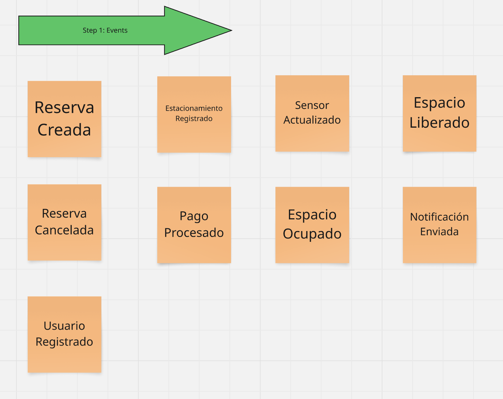
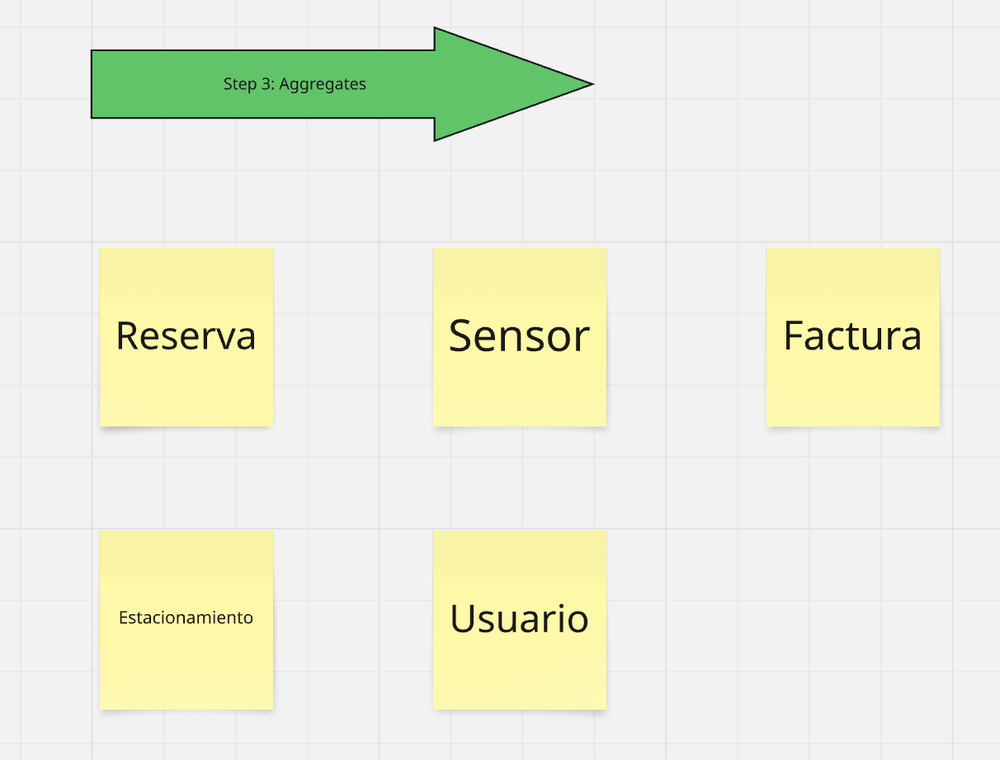

## Capítulo IV: Solution Software Design

### 4.1. Strategic-Level Domain-Driven Design

#### 4.1.1. EventStorming

#### 4.1.2. Context Mapping
#### 4.1.3. Software Architecture

### 4.2. Tactical-Level Domain-Driven Design
Desglose de los Bounded Contexts y la definición de sus componentes a nivel táctico según los principios de Domain-Driven Design.

#### 4.2.1. Bounded Context: Parking Space Management Context

En esta sección, el equipo presenta las clases identificadas y las detalla a manera de diccionario, explicando para cada una su nombre, propósito y la documentación de atributos y métodos considerados, junto con las relaciones entre ellas.

#### 4.2.1.1. Domain Layer
El núcleo de este Bounded Context (BC) gira en torno al Aggregate Espacio.

- **Aggregates:** 
  - `espacioId` (identidad)      
  - `sensorId`, `localId` (referencias)
    
  - `descripcion`, `ubicacion` (detalles)
        
  - `estadoEspacio` (estado actual)
        
- **Métodos:**  
    `ocupar()`, `liberar()`, `marcarReservado()`, `marcarDisponible()`, `ponerEnMantenimiento()`, `actualizarEstadoPorSensor()`

- **Value Objects:** 
- `EspacioId`, `SensorId`, `LocalId`
    
- `EstadoEspacio`: Disponible, Ocupado, Reservado, EnMantenimiento
    
- `UbicacionEspacio`: Detalles de ubicación
    
- **Domain Services:** `VerificacionEstadoActualService` contiene la lógica para consultar el estado consolidado de uno o más espacios, útil para capas superiores o read models.

- **Repositories:** `IEspacioRepository` (interfaz) define cómo se guardan y recuperan los Aggregates `Espacio`.

#### 4.2.1.2. Interface Layer

Esta capa permite la interacción externa con el Bounded Context.
- **Controller:**  
    `EspacioController` expone endpoints REST (ej. `GET /espacios/{id}`, `PUT /espacios/{id}/ocupar`)
    
- **Event Consumers:**  
    Escuchan eventos externos como actualizaciones desde sensores o cancelaciones de reserva.
    
- **Event Producers:**  
    Publican eventos cuando el estado de un espacio cambia (ej. `EspacioOcupadoEvent`).

#### 4.2.1.3. Application Layer

- Esta capa coordina las operaciones de negocio definidas.

- **Command Handlers:**
    
    - `OcuparEspacioCommandHandler`, `MarcarReservadoCommandHandler`, etc.
        
    - Ejecutan reglas del dominio y publican eventos.
        
- **Event Handlers:**  
    Reaccionan a eventos del dominio y de otros BCs, actualizando el estado de los espacios.
    
- **Query Services:**
    
    - `ConsultaEspaciosQueryService`
        
    - Proveen lecturas eficientes (DTOs), generalmente sin cargar el Aggregate completo.

#### 4.2.1.4. Infrastructure Layer

- **Repositories:**  
    Implementaciones concretas como `EspacioJpaRepository`, que traduce entre entidades de dominio y la base de datos.
    
- **Messaging:**  
    Adaptadores a message brokers (ej. RabbitMQ, Kafka) para envío/recepción de eventos.
    
- **External Adapters:**
    
    - `SensorIntegrationService`: Comunicación con sensores.
        
    - Adaptadores para otros contextos como notificaciones.

#### 4.2.1.5. Bounded Context Software Architecture Component Level Diagrams

#### 4.2.1.6. Bounded Context Software Architecture Code Level Diagrams

#### 4.2.1.6.1. Bounded Context Domain Layer Class Diagrams

#### 4.2.1.6.2. Bounded Context Database Design Diagram

#### 4.2.2. Bounded Context: Reservation Management Context

En esta sección se describen las clases clave que conforman la lógica del contexto de Reservas, su propósito, atributos, métodos y relaciones.

#### 4.2.2.1. Domain Layer

Esta capa contiene los elementos principales del dominio:

- **Aggregate Root:** `Reserva`, gestiona las reglas del negocio en torno al flujo de estados de la reserva y coordina entidades hijas.
    
- **Entities:** `RegistroTiempo`, se utiliza para registrar los hitos temporales relevantes.
    
- **Value Objects:** `ReservaId`, `PeriodoReserva`, `EstadoReserva`, `EspacioId`, `VehiculoId`, `UsuarioId`, `MultaExceso`.
    
- **Domain Services:** `ValidacionDisponibilidadPeriodoService` (verifica disponibilidad de espacios); `CalculoTiempoUsoService` y `DeterminacionMultaService` (manejan lógica temporal y penalidades).
    
- **Repository Interfaces:** `IReservaRepository`, contrato para persistencia y recuperación de `Reserva`.

#### 4.2.2.2. Interface Layer

- **REST Controller:** `ReservaController`, expone endpoints para manejar reservas (crear, consultar, cancelar, check-in/out).
    
- **Event Listeners:** Responden a eventos como `EspacioDisponibleEvent`, `PagoCompletadoEvent`, etc.
    
- **Event Publishers:** Publican eventos del dominio como `ReservaConfirmadaEvent`, `CheckOutRegistradoEvent`.

#### 4.2.2.3. Application Layer

- **Command Services:** `GestionReservaCommandService`, orquesta flujos a partir de comandos como `CrearReservaCommand`.
    
- **Query Services:** `ConsultaReservasQueryService`, consultas optimizadas sobre historial o estado actual.

#### 4.2.2.4. Infrastructure Layer

- **Repository Implementations:** `ReservaJpaRepository`, implementación concreta para `IReservaRepository`, mapeando tablas como `Reservas` y `RegistroTiempo`.
    
- **Messaging:** Brokers para emitir y consumir eventos.
    
- **Adapters (ACL):** Capas de adaptación hacia otros BCs como `ParkingSpaceServiceAdapter`, `PaymentServiceAdapter`, etc., garantizando acoplamiento bajo y comunicación limpia.

#### 4.2.2.5. Bounded Context Software Architecture Component Level Diagrams

#### 4.2.2.6. Bounded Context Software Architecture Code Level Diagrams

#### 4.2.2.6.1. Bounded Context Domain Layer Class Diagrams

#### 4.2.2.6.2. Bounded Context Database Design Diagram

#### 4.2.3. Bounded Context: User Context

En esta sección se describen las clases clave que conforman la lógica del contexto de Usuarios, su propósito, atributos, métodos y relaciones.

#### 4.2.3.1. Domain Layer

Esta capa contiene los elementos principales del dominio:

- **Aggregate Root:** `Usuario`, representa la identidad del usuario, su cuenta, roles, credenciales y vehículos asociados.
    
- **Entities:** `Perfil`, `Credenciales`, `Vehiculo`, asociadas a `Usuario` como entidades hijas.
    
- **Value Objects:** `UsuarioId`, `RolUsuario`, junto con los objetos de valor para encapsular los datos de `Perfil`, `Credenciales`, y `Vehiculo`.
    
- **Domain Services:** `AutenticacionDomainService`, `AutorizacionDomainService`, encapsulan la lógica de autenticación y permisos.
    
- **Repository Interfaces:** `IUsuarioRepository`, contrato para persistencia y recuperación del aggregate `Usuario`.
    

#### 4.2.3.2. Interface Layer

- **REST Controller:** `UsuarioController`, gestiona endpoints para registro, login, perfil y asociación de vehículos.
    
- **Event Listeners:** Escuchan eventos relevantes como `LocalRegistradoEvent`.
    
- **Event Publishers:** Emiten eventos del dominio como `UsuarioRegistradoEvent`, `VehiculoAsociadoEvent`.
    

#### 4.2.3.3. Application Layer

- **Command Services:** `GestionUsuarioCommandService`, orquesta flujos como creación, autenticación y modificación de usuario.
    
- **Query Services:** `ConsultaUsuarioQueryService`, realiza consultas sobre datos de usuarios, perfiles y vehículos.
    

#### 4.2.3.4. Infrastructure Layer

- **Repository Implementations:** `UsuarioJpaRepository`, implementación de `IUsuarioRepository`, mapea tablas como `Usuario`, `Persona`, `Vehículo`, `Conductores`, `Duenos_de_playas` y relaciones asociadas.
    
- **Messaging:** Brokers para emisión y consumo de eventos.
    
- **Adapters (ACL):** Servicios como `HashingService`, `TokenService`, permiten interacción técnica con otros BCs o sistemas externos.
    

#### 4.2.3.5. Bounded Context Software Architecture Component Level Diagrams

#### 4.2.3.6. Bounded Context Software Architecture Code Level Diagrams

#### 4.2.3.6.1. Bounded Context Domain Layer Class Diagrams

#### 4.2.3.6.2. Bounded Context Database Design Diagram

#### 4.2.4. Bounded Context: Local Context

En esta sección se describen las clases clave que conforman la lógica del contexto de Locales, su propósito, atributos, métodos y relaciones.

#### 4.2.4.1. Domain Layer

- **Aggregate Root:** `Local`, gestiona la información y reglas de negocio del estacionamiento y sus asociados (tarifas, promociones, opiniones).
    
- **Entities:** `Tarifa`, `Promocion`, `Opinion`, asociadas al `Local`.
    
- **Value Objects:** `LocalId`, `UbicacionFisica`, objetos de valor para encapsular detalles de tarifas, promociones y opiniones.
    
- **Domain Services:** `CalculoTarifaAplicableService`, `CalculoCalificacionPromedioService`.
    
- **Repository Interfaces:** `ILocalRepository`, contrato para persistencia y recuperación de `Local`.
    

#### 4.2.4.2. Interface Layer

- **REST Controller:** `LocalController`, gestiona endpoints para crear y consultar locales, tarifas, promociones y opiniones.
    
- **Event Listeners:** Escuchan eventos como `UsuarioRegistradoEvent`.
    
- **Event Publishers:** Emite eventos del dominio como `LocalRegistradoEvent`, `PromocionActivaEvent`.
    

#### 4.2.4.3. Application Layer

- **Command Services:** `GestionLocalCommandService`, orquesta flujos de gestión de locales.
    
- **Query Services:** `ConsultaLocalQueryService`, realiza consultas de locales y sus detalles.
    

#### 4.2.4.4. Infrastructure Layer

- **Repository Implementations:** `LocalJpaRepository`, implementa `ILocalRepository`, mapea las tablas relacionadas con locales, tarifas, promociones y opiniones.
    
- **Messaging:** Brokers para emisión y consumo de eventos.
    
- **Adapters (ACL):** Servicios como `GeoServiceAdapter`, `UserServiceAdapter` para interacción técnica con otros BCs o sistemas externos.

#### 4.2.4.5. Bounded Context Software Architecture Component Level Diagrams

#### 4.2.4.6. Bounded Context Software Architecture Code Level Diagrams

#### 4.2.4.6.1. Bounded Context Domain Layer Class Diagrams

#### 4.2.4.6.2. Bounded Context Database Design Diagram

#### 4.2.5. Bounded Context: Security Context

En esta sección se describen las clases clave que conforman la lógica del contexto de seguridad, su propósito, atributos, métodos y relaciones.

#### 4.2.5.1. Domain Layer

- **Aggregate Root:** `Seguridad`, gestiona la información y reglas de negocio relacionadas con los tipos y niveles de seguridad.
    
- **Entities:** `RegistroSeguridad`, registra eventos de seguridad relevantes.
    
- **Value Objects:** `SecurityType`, `SecurityLevel`, `DatosAuditoria`, encapsulan detalles de seguridad, niveles y auditoría.
    
- **Domain Services:** `AuthorizationService`, verifica permisos de acceso; `AuditingService`, registra eventos de seguridad.
    
- **Repository Interfaces:** `ISecurityPolicyRepository`, `ISecurityLogRepository`, contratos para persistencia y recuperación de políticas de seguridad y registros de auditoría.

#### 4.2.5.2. Interface Layer

- **REST Controller:** APIs para configurar políticas de seguridad o consultar registros de seguridad y auditoría.
    
- **Event Listeners:** Escuchan eventos como `AccessDeniedEvent` o `SecurityEventLoggedEvent` para aplicar auditoría.
    
- **Event Publishers:** Emite eventos del dominio como `SecurityEventLoggedEvent` o `AccessDeniedEvent`.

#### 4.2.5.3. Application Layer

- **Command Services:** `SecurityPolicyCommandService`, procesa comandos de configuración de políticas de seguridad.
    
- **Query Services:** `SecurityLogQueryService`, realiza consultas sobre registros de seguridad y auditoría.

#### 4.2.5.4. Infrastructure Layer

- **Repository Implementations:** Implementaciones JPA para `Seguridad`, registros de seguridad y políticas de acceso.
    
- **Messaging:** Implementación de brokers para emisión y consumo de eventos relacionados con seguridad y auditoría.
    
- **Adapters (ACL):** Servicios de integración con sistemas externos, como servicios de logging y monitoreo.

#### 4.2.5.5. Bounded Context Software Architecture Component Level Diagrams

#### 4.2.5.6. Bounded Context Software Architecture Code Level Diagrams

#### 4.2.5.6.1. Bounded Context Domain Layer Class Diagrams

#### 4.2.5.6.2. Bounded Context Database Design Diagram

#### 4.2.6. Bounded Context: Support Context

En esta sección se describen las clases clave relacionadas con el servicio de soporte al cliente y asesorías.

#### 4.2.6.1. Domain Layer

- **Aggregate Root:** `Asesoria`, gestiona el ciclo de vida de una solicitud de soporte y sus reglas de negocio.
    
- **Entities:** `Asesor`, si se gestiona aquí, representa un agente de soporte.
    
- **Value Objects:** `AsesoriaId`, `RazonAsesoria`, `PeriodoAsesoria`, `EstadoAsesoria`, `AsesorId`, `UsuarioId`, encapsulan información relevante para las asesorías.
    
- **Domain Services:** `AsignacionAsesorService`, contiene la lógica para asignar asesores.
    
- **Repository Interfaces:** `IAsesoriaRepository`, `IAsesorRepository`, contratos para persistencia de `Asesoria` y `Asesor`.

#### 4.2.6.2. Interface Layer

- **REST Controller:** `AsesoriaController`, gestiona APIs para solicitud, consulta y gestión de asesorías.
    
- **Event Listeners:** Escuchan eventos que pueden generar nuevas solicitudes de soporte.
    
- **Event Publishers:** Emite eventos de soporte como `AsesoriaSolicitadaEvent`.

#### 4.2.6.3. Application Layer

- **Command Services:** `GestionAsesoriaCommandService`, procesa comandos relacionados con la gestión de asesorías.
    
- **Query Services:** `ConsultaAsesoriaQueryService`, maneja consultas sobre el estado de los casos de soporte.

#### 4.2.6.4. Infrastructure Layer

- **Repository Implementations:** `AsesoriaJpaRepository`, `AsesorJpaRepository`, implementan las interfaces de repositorio para persistir asesorías y asesores.
    
- **Messaging:** Brokers para emisión y consumo de eventos de soporte.
    
- **Adapters (ACL):** Servicios de integración con otros BCs como `UserServiceAdapter` o `NotificationServiceAdapter`.

#### 4.2.6.5. Bounded Context Software Architecture Component Level Diagrams

#### 4.2.6.6. Bounded Context Software Architecture Code Level Diagrams

#### 4.2.6.6.1. Bounded Context Domain Layer Class Diagrams

#### 4.2.6.6.2. Bounded Context Database Design Diagram

#### 4.2.7. Bounded Context: Notification Context

En esta sección se describen las clases clave relacionadas con la gestión de notificaciones y alertas en tiempo real.

#### 4.2.7.1. Domain Layer

- **Aggregates:** `Notificacion` (Aggregate Root) y `Alerta` (Aggregate Root), gestionan las reglas y estados de las notificaciones y alertas.
    
- **Entities:** `DestinatarioNotificacion`, una entidad hija dentro del `Notificacion` Aggregate.
    
- **Value Objects:** `NotificacionId`, `ContenidoNotificacion`, `FechaHoraNotificacion`, `PrioridadNotificacion`, `AlertaId`, `EstadoAlerta`, encapsulan detalles de la notificación y la alerta.
    
- **Domain Services:** `DistribucionNotificacionesService`, gestiona la lógica de envío de notificaciones; `GestorAlertasService`, gestiona la lógica de alertas.
    
- **Repository Interfaces:** `INotificacionRepository`, `IAlertaRepository`, contratos para la persistencia de `Notificacion` y `Alerta`.

#### 4.2.7.2. Interface Layer

- **REST Controller:** `NotificacionController`, gestiona APIs para la solicitud y consulta de notificaciones y alertas.
    
- **Event Listeners (Consumers):** Suscriben a eventos de otros BCs para generar notificaciones o alertas.
    
- **Event Publishers:** Emite eventos de dominio como `NotificacionEnviadaEvent`, `AlertaActivadaEvent`.

#### 4.2.7.3. Application Layer

- **Command Services:** `GestionNotificacionCommandService`, `GestionAlertaCommandService`, procesan comandos relacionados con la gestión de notificaciones y alertas.
    
- **Query Services:** `ConsultaNotificacionQueryService`, `ConsultaAlertaQueryService`, manejan consultas sobre notificaciones y alertas.

#### 4.2.7.4. Infrastructure Layer

- **Repository Implementations:** Implementaciones JPA para `Notificacion`, `Alertas`, y sus relaciones con otros elementos.
    
- **Messaging:** Implementación de mensajería para escuchar múltiples eventos entrantes y emitir notificaciones.
    
- **Adapters (ACL):** Integración con servicios externos como `EmailGateway`, `PushNotificationGateway`, y `UserServiceAdapter` para los destinatarios.

#### 4.2.7.5. Bounded Context Software Architecture Component Level Diagrams

#### 4.2.7.6. Bounded Context Software Architecture Code Level Diagrams

#### 4.2.7.6.1. Bounded Context Domain Layer Class Diagrams

#### 4.2.7.6.2. Bounded Context Database Design Diagram
