## Capítulo IV: Solution Software Design

### 4.1. Strategic-Level Domain-Driven Design

#### 4.1.1. EventStorming

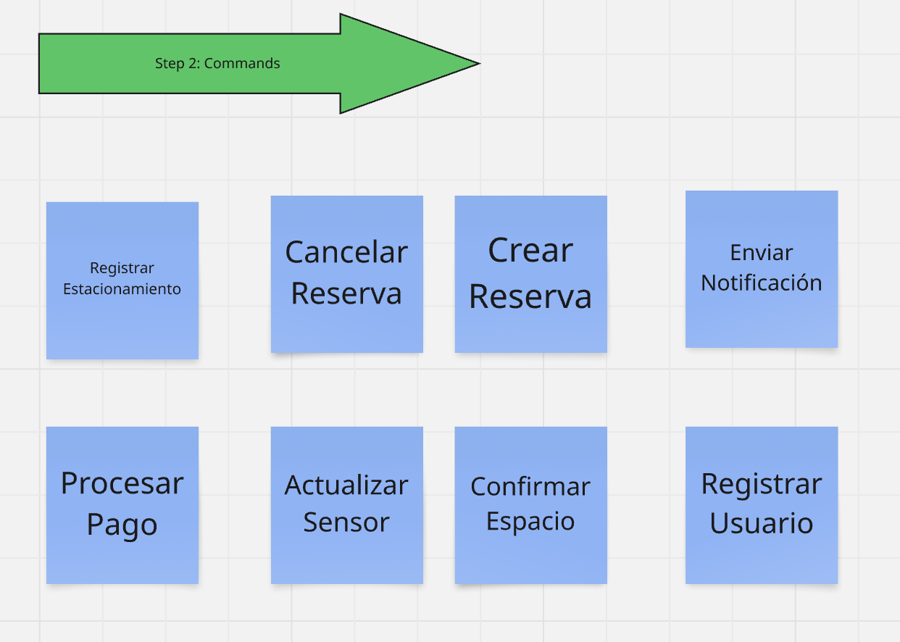

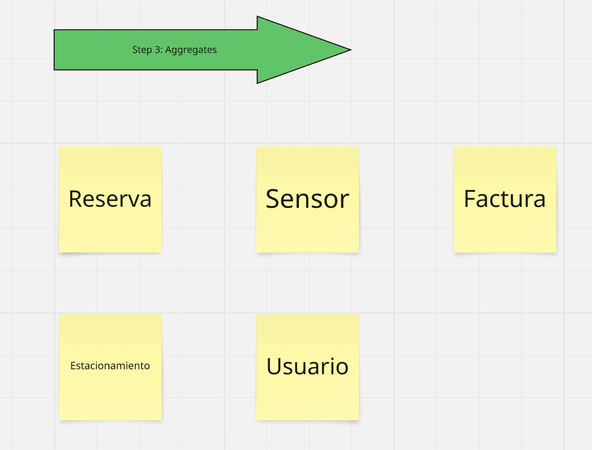

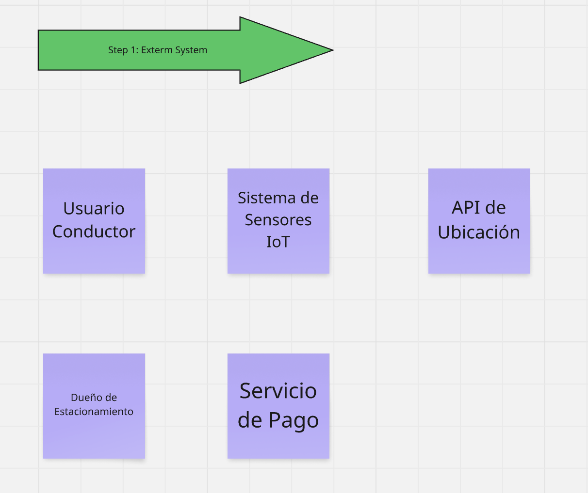

#### 4.1.1.3 Bounded context canvas

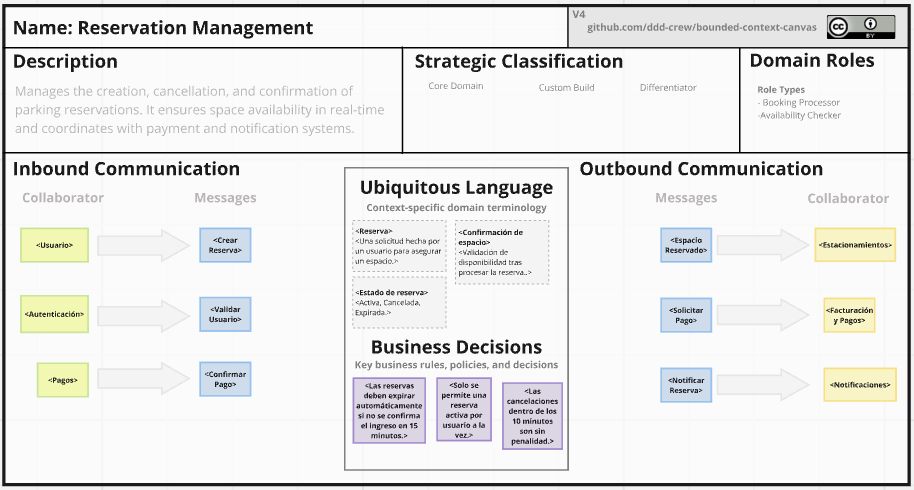

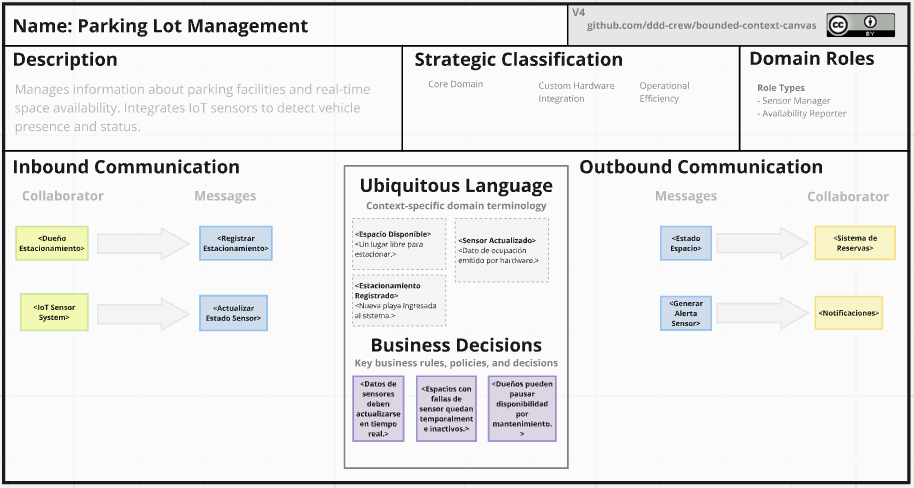

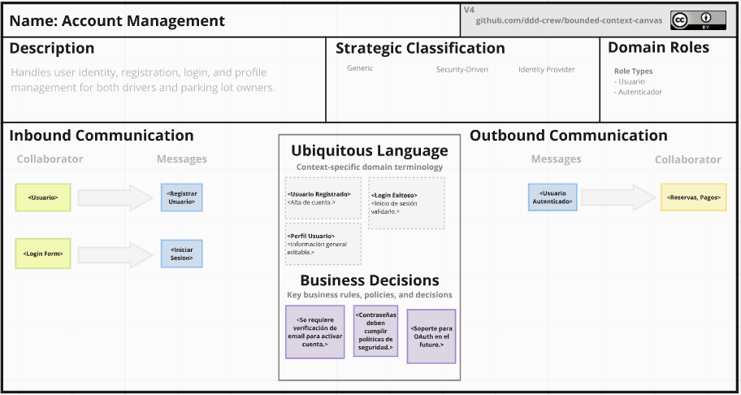

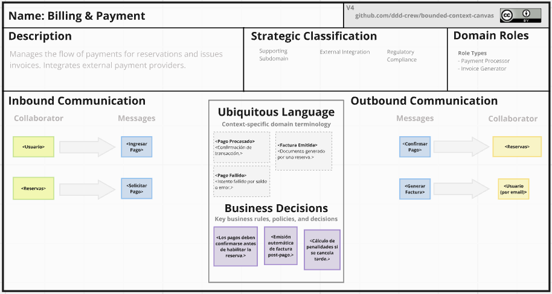

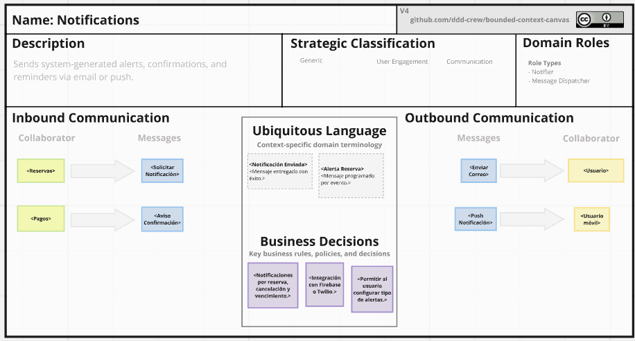

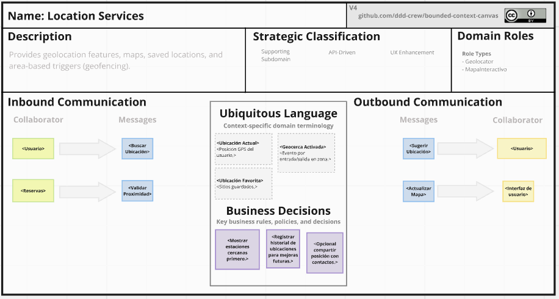

#### 4.1.2. Context Mapping

#### 4.1.3. Software Architecture

### 4.2. Tactical-Level Domain-Driven Design
Desglose de los Bounded Contexts y la definición de sus componentes a nivel táctico según los principios de Domain-Driven Design.

#### 4.2.1. Bounded Context: Parking Space Management Context

En esta sección, el equipo presenta las clases identificadas y las detalla a manera de diccionario, explicando para cada una su nombre, propósito y la documentación de atributos y métodos considerados, junto con las relaciones entre ellas.

#### 4.2.1.1. Domain Layer
El núcleo de este Bounded Context (BC) gira en torno al Aggregate Espacio.

- **Aggregates:** 
  - `espacioId` (identidad)      
  - `sensorId`, `localId` (referencias)
    
  - `descripcion`, `ubicacion` (detalles)
        
  - `estadoEspacio` (estado actual)
        
- **Métodos:**  
    `ocupar()`, `liberar()`, `marcarReservado()`, `marcarDisponible()`, `ponerEnMantenimiento()`, `actualizarEstadoPorSensor()`

- **Value Objects:** 
- `EspacioId`, `SensorId`, `LocalId`
    
- `EstadoEspacio`: Disponible, Ocupado, Reservado, EnMantenimiento
    
- `UbicacionEspacio`: Detalles de ubicación
    
- **Domain Services:** `VerificacionEstadoActualService` contiene la lógica para consultar el estado consolidado de uno o más espacios, útil para capas superiores o read models.

- **Repositories:** `IEspacioRepository` (interfaz) define cómo se guardan y recuperan los Aggregates `Espacio`.

#### 4.2.1.2. Interface Layer

Esta capa permite la interacción externa con el Bounded Context.
- **Controller:**  
    `EspacioController` expone endpoints REST (ej. `GET /espacios/{id}`, `PUT /espacios/{id}/ocupar`)
    
- **Event Consumers:**  
    Escuchan eventos externos como actualizaciones desde sensores o cancelaciones de reserva.
    
- **Event Producers:**  
    Publican eventos cuando el estado de un espacio cambia (ej. `EspacioOcupadoEvent`).

#### 4.2.1.3. Application Layer

- Esta capa coordina las operaciones de negocio definidas.

- **Command Handlers:**
    
    - `OcuparEspacioCommandHandler`, `MarcarReservadoCommandHandler`, etc.
        
    - Ejecutan reglas del dominio y publican eventos.
        
- **Event Handlers:**  
    Reaccionan a eventos del dominio y de otros BCs, actualizando el estado de los espacios.
    
- **Query Services:**
    
    - `ConsultaEspaciosQueryService`
        
    - Proveen lecturas eficientes (DTOs), generalmente sin cargar el Aggregate completo.

#### 4.2.1.4. Infrastructure Layer

- **Repositories:**  
    Implementaciones concretas como `EspacioJpaRepository`, que traduce entre entidades de dominio y la base de datos.
    
- **Messaging:**  
    Adaptadores a message brokers (ej. RabbitMQ, Kafka) para envío/recepción de eventos.
    
- **External Adapters:**
    
    - `SensorIntegrationService`: Comunicación con sensores.
        
    - Adaptadores para otros contextos como notificaciones.

#### 4.2.1.5. Bounded Context Software Architecture Component Level Diagrams

Este diagrama representa **cómo está compuesto internamente un container**, en este caso el container `Parking Space Management Context`.

- Los **components principales** (capas: interfaz, aplicación, dominio, infraestructura).
    
- Las **interacciones entre ellos**.
    
- Las **responsabilidades** de cada uno.

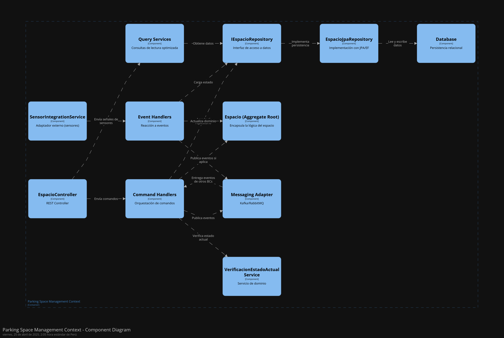

#### 4.2.1.6. Bounded Context Software Architecture Code Level Diagrams

Esta seccion se presenta las implementaciones de componentes y explica las secciones internas del Bounded Context `Parking Space Management`

#### 4.2.1.6.1. Bounded Context Domain Layer Class Diagrams

Aquí se muestra el diseño de clases del Domain Layer, centrado en el agregado Espacio, sus Value Objects, servicios de dominio y repositorio.

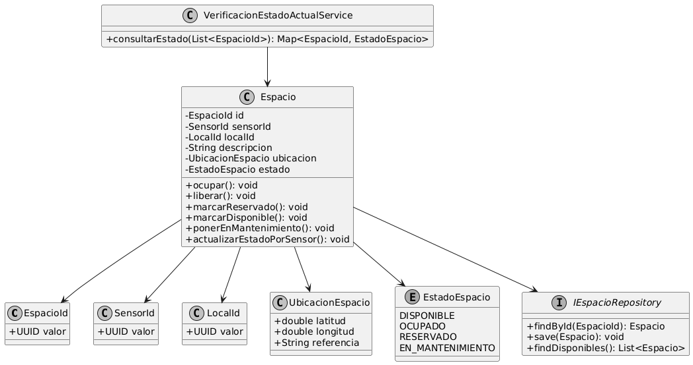

#### 4.2.1.6.2. Bounded Context Database Design Diagram

Representación del modelo relacional para la persistencia del agregado Espacio.

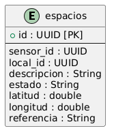

#### 4.2.2. Bounded Context: Reservation Management Context

En esta sección se describen las clases clave que conforman la lógica del contexto de Reservas, su propósito, atributos, métodos y relaciones.

#### 4.2.2.1. Domain Layer

Esta capa contiene los elementos principales del dominio:

- **Aggregate Root:** `Reserva`, gestiona las reglas del negocio en torno al flujo de estados de la reserva y coordina entidades hijas.
    
- **Entities:** `RegistroTiempo`, se utiliza para registrar los hitos temporales relevantes.
    
- **Value Objects:** `ReservaId`, `PeriodoReserva`, `EstadoReserva`, `EspacioId`, `VehiculoId`, `UsuarioId`, `MultaExceso`.
    
- **Domain Services:** `ValidacionDisponibilidadPeriodoService` (verifica disponibilidad de espacios); `CalculoTiempoUsoService` y `DeterminacionMultaService` (manejan lógica temporal y penalidades).
    
- **Repository Interfaces:** `IReservaRepository`, contrato para persistencia y recuperación de `Reserva`.

#### 4.2.2.2. Interface Layer

- **REST Controller:** `ReservaController`, expone endpoints para manejar reservas (crear, consultar, cancelar, check-in/out).
    
- **Event Listeners:** Responden a eventos como `EspacioDisponibleEvent`, `PagoCompletadoEvent`, etc.
    
- **Event Publishers:** Publican eventos del dominio como `ReservaConfirmadaEvent`, `CheckOutRegistradoEvent`.

#### 4.2.2.3. Application Layer

- **Command Services:** `GestionReservaCommandService`, orquesta flujos a partir de comandos como `CrearReservaCommand`.
    
- **Query Services:** `ConsultaReservasQueryService`, consultas optimizadas sobre historial o estado actual.

#### 4.2.2.4. Infrastructure Layer

- **Repository Implementations:** `ReservaJpaRepository`, implementación concreta para `IReservaRepository`, mapeando tablas como `Reservas` y `RegistroTiempo`.
    
- **Messaging:** Brokers para emitir y consumir eventos.
    
- **Adapters (ACL):** Capas de adaptación hacia otros BCs como `ParkingSpaceServiceAdapter`, `PaymentServiceAdapter`, etc., garantizando acoplamiento bajo y comunicación limpia.

#### 4.2.2.5. Bounded Context Software Architecture Component Level Diagrams

El presente diagrama representa la descomposición a nivel de componentes del Reservation Management Context, respetando los principios de Domain-Driven Design. Cada container ha sido dividido en componentes con responsabilidades claras y cohesionadas, permitiendo identificar cómo interactúan entre sí dentro de la arquitectura hexagonal. Este enfoque permite separar los flujos de comando, consulta y eventos, facilitando el mantenimiento, evolución e integración del sistema con otros bounded contexts como ParkingSpace y Payment.

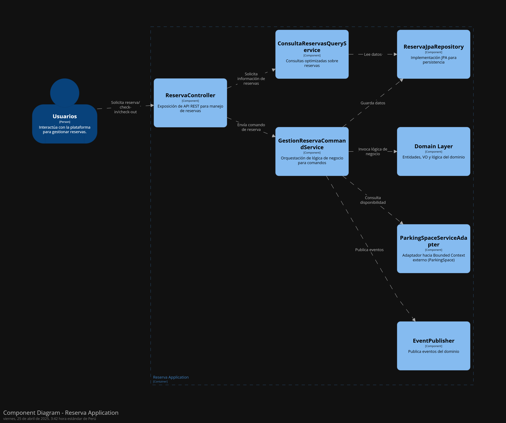

#### 4.2.2.6. Bounded Context Software Architecture Code Level Diagrams

En esta sección se presentan los diagramas detallados a nivel de implementación del contexto de gestión de reservas. Se incluye tanto el diagrama de clases del Domain Layer como el diagrama de base de datos que soporta la persistencia del modelo.

#### 4.2.2.6.1. Bounded Context Domain Layer Class Diagrams

A continuación, se describe el diagrama de clases UML para el Domain Layer del contexto de gestión de reservas:

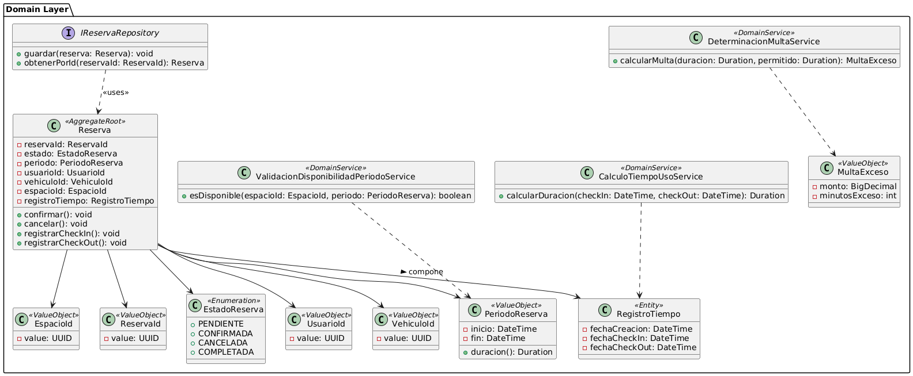

#### 4.2.2.6.2. Bounded Context Database Design Diagram

El siguiente diagrama representa el modelo relacional utilizado para la persistencia de información del contexto de reservas.

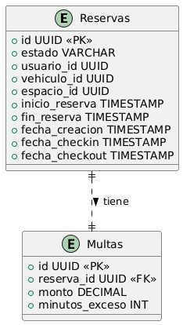

### 4.2.3. Bounded Context: User Management Context

En esta sección se describe la estructura del User Management Context del sistema ParkingNow, centrado en la gestión de los usuarios: Conductores y Dueños del Estacionamiento. Se detallan las clases principales, servicios, eventos y capas de arquitectura involucradas.

### 4.2.3.1. Domain Layer

Esta capa contiene los conceptos esenciales del dominio de usuarios:

- **Aggregate Root:**
    
    - `Usuario`: Representa a un usuario del sistema, ya sea conductor o dueño del estacionamiento. Gestiona su identidad, credenciales, rol, perfil y relaciones con recursos como vehículos o estacionamientos.
        
- **Entities:**
    
    - `Perfil`: Contiene los datos personales del usuario como nombre, correo, teléfono y dirección.
        
    - `Credenciales`: Agrupa la información de inicio de sesión (email y contraseña), incluyendo mecanismos de autenticación.
        
    - `Vehiculo`: Asociado exclusivamente a los conductores. Incluye información como marca, modelo, tipo y placa.
        
    - `Estacionamiento`: Asociado exclusivamente a los dueños del estacionamiento. Contiene ubicación, capacidad y disponibilidad.
        
    - `Rol`: Define el tipo de usuario (Conductor o Dueño del Estacionamiento).
        
- **Value Objects:**
    
    - `UsuarioId`: Identificador único del usuario.
        
    - `Email`, `Password`, `NombreCompleto`, `Telefono`, `Direccion`: Objetos de valor con validaciones específicas.
        
    - `RolUsuario`: Enum o clase de valor que representa si el usuario es **Conductor** o **Dueño del Estacionamiento**.
        
- **Domain Services:**
    
    - `AutenticacionDomainService`: Encapsula la lógica de autenticación, incluyendo validación de credenciales y generación de tokens.
        
    - `AutorizacionDomainService`: Determina si un usuario tiene permiso para realizar ciertas acciones según su rol.
        
- **Repository Interfaces:**
    
    - `IUsuarioRepository`: Contrato que define las operaciones para la persistencia del aggregate `Usuario`.
        

### 4.2.3.2. Interface Layer

- **REST Controller:**
    
    - `UsuarioController`: Expone los endpoints para registro, inicio de sesión, modificación de perfil, gestión de roles y asociación de vehículos o estacionamientos.
        
- **Event Listeners:**
    
    - `EstacionamientoRegistradoEventListener`: Escucha eventos generados cuando se registra un nuevo estacionamiento, para asociarlo con el dueño correspondiente.
        
    - `VehiculoRegistradoEventListener`: Reacciona a eventos cuando se registra un nuevo vehículo, para asociarlo con el conductor.
        
- **Event Publishers:**
    
    - `UsuarioRegistradoEvent`: Emitido cuando un nuevo usuario se crea exitosamente.
        
    - `VehiculoAsociadoEvent`: Indica que un vehículo ha sido vinculado a un conductor.
        
    - `EstacionamientoAsociadoEvent`: Indica que un estacionamiento ha sido vinculado a un dueño del estacionamiento.
        
### 4.2.3.3. Application Layer

- **Command Services:**
    
    - `GestionUsuarioCommandService`: Orquesta casos de uso de modificación de estado como:
        
        - `RegistrarUsuarioCommand`
            
        - `AsociarVehiculoCommand`
            
        - `AsociarEstacionamientoCommand`
            
        - `CambiarRolCommand`
            
- **Query Services:**
    
    - `ConsultaUsuarioQueryService`: Provee operaciones de lectura optimizada para obtener información del perfil, vehículos o estacionamientos asociados.
        
- **Event Handlers:**
    
    - `UsuarioEventHandler`: Gestiona eventos como `UsuarioRegistradoEvent` para la coordinación con otros contextos y persistencia de datos.
        
### 4.2.3.4. Infrastructure Layer

- **Repository Implementations:**
    
    - `UsuarioJpaRepository`: Implementación de `IUsuarioRepository` usando tecnologías ORM como JPA o Entity Framework. Mapea entidades como `Usuario`, `Perfil`, `Credenciales`, `Vehiculo`, `Estacionamiento`, y `Rol`.
        
- **Messaging:**
    
    - Uso de sistemas de mensajería como Kafka o RabbitMQ para la emisión y recepción de eventos entre bounded contexts.
        
        - Ejemplos: Publicar `UsuarioBloqueadoEvent` o escuchar `ReservaConfirmadaEvent`.
            
- **Adapters (ACL):**
    
    - `TokenService`: Responsable de generar y validar tokens JWT.
        
    - `HashingService`: Aplica algoritmos seguros para cifrado de contraseñas.
        
    - `ParkingServiceAdapter`: Adaptador que comunica con el contexto de estacionamientos.
        
    - `VehicleServiceAdapter`: Adaptador que comunica con el contexto de vehículos.

#### 4.2.3.5. Bounded Context Software Architecture Component Level Diagrams

En esta sección se presentan los Component Diagrams del Modelo C4 para el Container User Management API, el cual forma parte del Bounded Context User Management Context. Este Container es responsable de manejar las operaciones relacionadas con la autenticación, registro, gestión de roles, perfiles de usuario y asociación de vehículos o estacionamientos.

#### 4.2.3.6. Bounded Context Software Architecture Code Level Diagrams

Esta sección detalla la implementación de los componentes principales del User Management Context, incluyendo el Domain Layer Class Diagram (UML) y el Database Diagram con sus entidades y relaciones de persistencia.

#### 4.2.3.6.1. Bounded Context Domain Layer Class Diagrams

Este diagrama representa la estructura del Domain Layer, mostrando las entidades, objetos de valor, agregados, servicios de dominio, interfaces de repositorio, y otras clases relevantes con sus atributos, métodos, visibilidades y relaciones.

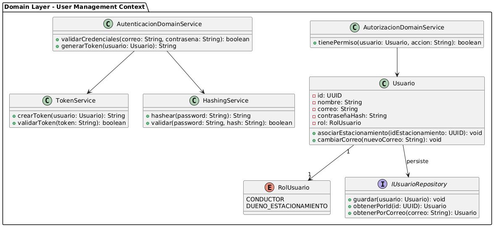

#### 4.2.3.6.2. Bounded Context Database Design Diagram

Este diagrama representa la estructura de la base de datos relacional para este contexto. Se definen las tablas, columnas, tipos de datos, claves primarias/foráneas y relaciones.

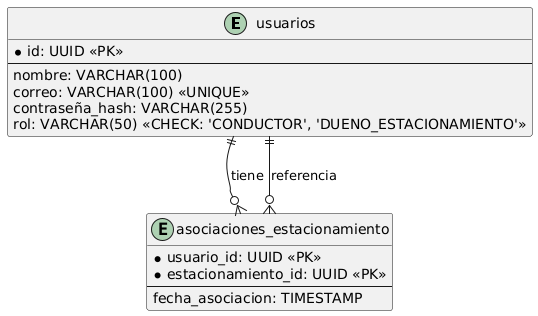

#### 4.2.4. Bounded Context: Local Context

En esta sección se describen las clases clave que conforman la lógica del contexto de Locales, su propósito, atributos, métodos y relaciones.

#### 4.2.4.1. Domain Layer

- **Aggregate Root:** `Local`, gestiona la información y reglas de negocio del estacionamiento y sus asociados (tarifas, promociones, opiniones).
    
- **Entities:** `Tarifa`, `Promocion`, `Opinion`, asociadas al `Local`.
    
- **Value Objects:** `LocalId`, `UbicacionFisica`, objetos de valor para encapsular detalles de tarifas, promociones y opiniones.
    
- **Domain Services:** `CalculoTarifaAplicableService`, `CalculoCalificacionPromedioService`.
    
- **Repository Interfaces:** `ILocalRepository`, contrato para persistencia y recuperación de `Local`.
    

#### 4.2.4.2. Interface Layer

- **REST Controller:** `LocalController`, gestiona endpoints para crear y consultar locales, tarifas, promociones y opiniones.
    
- **Event Listeners:** Escuchan eventos como `UsuarioRegistradoEvent`.
    
- **Event Publishers:** Emite eventos del dominio como `LocalRegistradoEvent`, `PromocionActivaEvent`.
    

#### 4.2.4.3. Application Layer

- **Command Services:** `GestionLocalCommandService`, orquesta flujos de gestión de locales.
    
- **Query Services:** `ConsultaLocalQueryService`, realiza consultas de locales y sus detalles.
    

#### 4.2.4.4. Infrastructure Layer

- **Repository Implementations:** `LocalJpaRepository`, implementa `ILocalRepository`, mapea las tablas relacionadas con locales, tarifas, promociones y opiniones.
    
- **Messaging:** Brokers para emisión y consumo de eventos.
    
- **Adapters (ACL):** Servicios como `GeoServiceAdapter`, `UserServiceAdapter` para interacción técnica con otros BCs o sistemas externos.

#### 4.2.4.5. Bounded Context Software Architecture Component Level Diagrams

En esta sección se presenta el Component Diagram para el Bounded Context: Local Context, utilizando el C4 Model. Este diagrama muestra la descomposición del Container de gestión de locales en componentes clave, sus responsabilidades y las interacciones entre ellos. El diagrama refleja cómo los diferentes componentes trabajan juntos dentro del contexto de locales, incluyendo el manejo de tarifas, promociones, opiniones y más.

#### 4.2.4.6. Bounded Context Software Architecture Code Level Diagrams

En esta sección, se presentan y explican los diagramas que muestran un mayor nivel de detalle sobre la implementación de los componentes dentro del Bounded Context: Local Context. Estos diagramas proporcionan una visión más técnica y detallada de cómo se implementan los componentes en el código, con énfasis en las clases del Domain Layer y la estructura de la base de datos.

#### 4.2.4.6.1. Bounded Context Domain Layer Class Diagrams

En esta sección se presenta el Class Diagram en UML para las clases del Domain Layer dentro del Bounded Context: Local Context. El diagrama incluirá las clases clave, interfaces, enumeraciones, atributos, métodos y sus relaciones, detallando también el scope de cada miembro (public, private, protected) y la multiplicidad de las relaciones. Este diagrama describe con precisión la estructura de las entidades y objetos de valor que componen el modelo de dominio, así como los servicios de dominio involucrados.

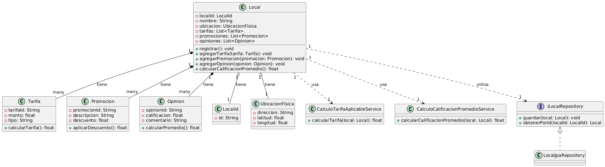

#### 4.2.4.6.2. Bounded Context Database Design Diagram

En esta sección, se presenta el Database Diagram que detalla los objetos de base de datos para la persistencia de la información en el contexto de locales. El diagrama incluirá las tablas y columnas relevantes, así como las constraints (como claves primarias y foráneas), y mostrará las relaciones entre las tablas que permiten almacenar los datos de los Local, Tarifa, Promocion, Opinion, entre otros.

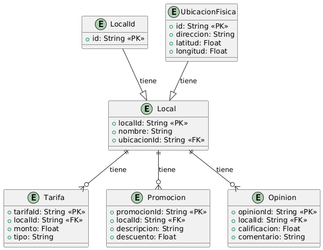

#### 4.2.5. Bounded Context: Security Context

En esta sección se describen las clases clave que conforman la lógica del contexto de seguridad, su propósito, atributos, métodos y relaciones.

#### 4.2.5.1. Domain Layer

- **Aggregate Root:** `Seguridad`, gestiona la información y reglas de negocio relacionadas con los tipos y niveles de seguridad.
    
- **Entities:** `RegistroSeguridad`, registra eventos de seguridad relevantes.
    
- **Value Objects:** `SecurityType`, `SecurityLevel`, `DatosAuditoria`, encapsulan detalles de seguridad, niveles y auditoría.
    
- **Domain Services:** `AuthorizationService`, verifica permisos de acceso; `AuditingService`, registra eventos de seguridad.
    
- **Repository Interfaces:** `ISecurityPolicyRepository`, `ISecurityLogRepository`, contratos para persistencia y recuperación de políticas de seguridad y registros de auditoría.

#### 4.2.5.2. Interface Layer

- **REST Controller:** APIs para configurar políticas de seguridad o consultar registros de seguridad y auditoría.
    
- **Event Listeners:** Escuchan eventos como `AccessDeniedEvent` o `SecurityEventLoggedEvent` para aplicar auditoría.
    
- **Event Publishers:** Emite eventos del dominio como `SecurityEventLoggedEvent` o `AccessDeniedEvent`.

#### 4.2.5.3. Application Layer

- **Command Services:** `SecurityPolicyCommandService`, procesa comandos de configuración de políticas de seguridad.
    
- **Query Services:** `SecurityLogQueryService`, realiza consultas sobre registros de seguridad y auditoría.

#### 4.2.5.4. Infrastructure Layer

- **Repository Implementations:** Implementaciones JPA para `Seguridad`, registros de seguridad y políticas de acceso.
    
- **Messaging:** Implementación de brokers para emisión y consumo de eventos relacionados con seguridad y auditoría.
    
- **Adapters (ACL):** Servicios de integración con sistemas externos, como servicios de logging y monitoreo.

#### 4.2.5.5. Bounded Context Software Architecture Component Level Diagrams

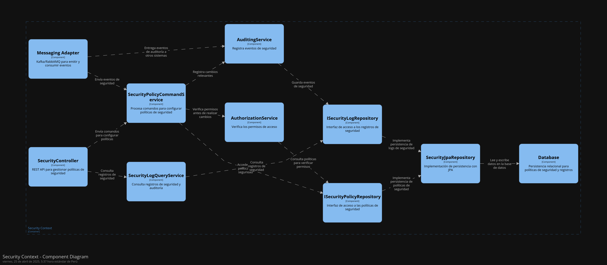

#### 4.2.5.6. Bounded Context Software Architecture Code Level Diagrams

En esta sección, se presentan y explican los diagramas que muestran un mayor nivel de detalle sobre la implementación de los componentes dentro del Bounded Context: Security Context. Estos diagramas proporcionan una visión más técnica y detallada de cómo se implementan los componentes en el código, con énfasis en las clases del Domain Layer y la estructura de la base de datos.

#### 4.2.5.6.1. Bounded Context Domain Layer Class Diagrams

Este diagrama representa las principales clases del Domain Layer del Security Context. Incluye entidades, objetos de valor, servicios de dominio e interfaces de repositorio, y muestra sus relaciones, métodos y atributos clave. Este nivel de modelado facilita entender cómo se organiza la lógica del negocio centrada en la gestión de políticas de seguridad, eventos de auditoría y control de acceso.

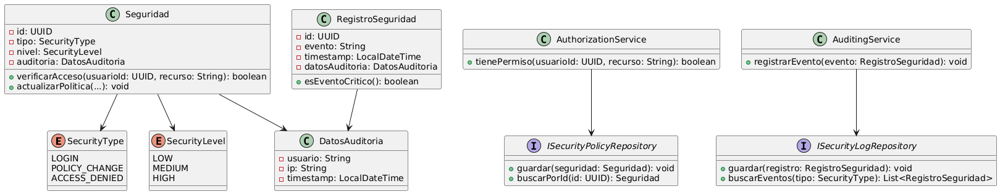

#### 4.2.5.6.2. Bounded Context Database Design Diagram

El siguiente diagrama describe el esquema de base de datos relacional para el Security Context. Se enfoca en las tablas que almacenan políticas de seguridad y registros de eventos de auditoría, con detalles como claves primarias, tipos de datos, y relaciones entre las entidades. Este modelo garantiza una estructura persistente coherente con las necesidades del dominio.

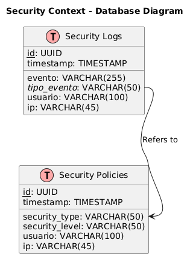

#### 4.2.6. Bounded Context: Support Context

En esta sección se describen las clases clave relacionadas con el servicio de soporte al cliente y asesorías.

#### 4.2.6.1. Domain Layer

- **Aggregate Root:** `Asesoria`, gestiona el ciclo de vida de una solicitud de soporte y sus reglas de negocio.
    
- **Entities:** `Asesor`, si se gestiona aquí, representa un agente de soporte.
    
- **Value Objects:** `AsesoriaId`, `RazonAsesoria`, `PeriodoAsesoria`, `EstadoAsesoria`, `AsesorId`, `UsuarioId`, encapsulan información relevante para las asesorías.
    
- **Domain Services:** `AsignacionAsesorService`, contiene la lógica para asignar asesores.
    
- **Repository Interfaces:** `IAsesoriaRepository`, `IAsesorRepository`, contratos para persistencia de `Asesoria` y `Asesor`.

#### 4.2.6.2. Interface Layer

- **REST Controller:** `AsesoriaController`, gestiona APIs para solicitud, consulta y gestión de asesorías.
    
- **Event Listeners:** Escuchan eventos que pueden generar nuevas solicitudes de soporte.
    
- **Event Publishers:** Emite eventos de soporte como `AsesoriaSolicitadaEvent`.

#### 4.2.6.3. Application Layer

- **Command Services:** `GestionAsesoriaCommandService`, procesa comandos relacionados con la gestión de asesorías.
    
- **Query Services:** `ConsultaAsesoriaQueryService`, maneja consultas sobre el estado de los casos de soporte.

#### 4.2.6.4. Infrastructure Layer

- **Repository Implementations:** `AsesoriaJpaRepository`, `AsesorJpaRepository`, implementan las interfaces de repositorio para persistir asesorías y asesores.
    
- **Messaging:** Brokers para emisión y consumo de eventos de soporte.
    
- **Adapters (ACL):** Servicios de integración con otros BCs como `UserServiceAdapter` o `NotificationServiceAdapter`.

#### 4.2.6.5. Bounded Context Software Architecture Component Level Diagrams

El diagrama de componentes del Support Context muestra cómo está estructurado internamente el contenedor encargado de gestionar las asesorías y solicitudes de soporte. Se identifican componentes de entrada (como controladores REST), servicios de aplicación para gestión y consulta de asesorías, lógica de dominio como la asignación de asesores, e integración con infraestructura (repositorios, adaptadores y eventos). Este desglose facilita la comprensión de responsabilidades, dependencias y puntos de integración con otros bounded contexts o sistemas externos.

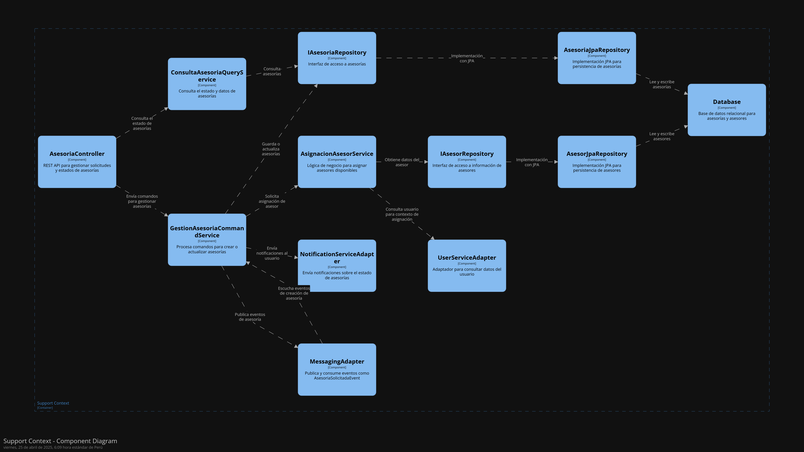

#### 4.2.6.6. Bounded Context Software Architecture Code Level Diagrams

Esta sección presenta una descripción detallada de la implementación interna del Support Context a nivel de código. Se estructura en dos partes: el Domain Layer Class Diagram, que representa las clases, interfaces, objetos de valor y sus relaciones dentro del dominio, y el Database Diagram, que refleja cómo se modela la persistencia de los datos en una base de datos relacional. Estos diagramas permiten comprender cómo se implementan los conceptos del dominio y cómo se mantienen consistentes con la arquitectura general del sistema.

#### 4.2.6.6.1. Bounded Context Domain Layer Class Diagrams

El siguiente diagrama de clases representa la estructura del Domain Layer del Support Context. Aquí se modelan las clases, interfaces y objetos de valor que encapsulan la lógica de negocio, así como sus relaciones, atributos y métodos. Esta capa es fundamental para mantener la lógica independiente de frameworks o tecnologías externas.

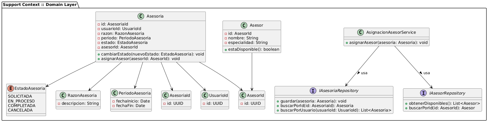

#### 4.2.6.6.2. Bounded Context Database Design Diagram

Este diagrama muestra la representación de las entidades persistidas en base de datos para el Support Context. Define las tablas, columnas, claves primarias, claves foráneas y relaciones, modelando la estructura relacional necesaria para almacenar asesorías y datos de asesores.

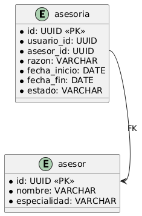

#### 4.2.7. Bounded Context: Notification Context

En esta sección se describen las clases clave relacionadas con la gestión de notificaciones y alertas en tiempo real.

#### 4.2.7.1. Domain Layer

- **Aggregates:** `Notificacion` (Aggregate Root) y `Alerta` (Aggregate Root), gestionan las reglas y estados de las notificaciones y alertas.
    
- **Entities:** `DestinatarioNotificacion`, una entidad hija dentro del `Notificacion` Aggregate.
    
- **Value Objects:** `NotificacionId`, `ContenidoNotificacion`, `FechaHoraNotificacion`, `PrioridadNotificacion`, `AlertaId`, `EstadoAlerta`, encapsulan detalles de la notificación y la alerta.
    
- **Domain Services:** `DistribucionNotificacionesService`, gestiona la lógica de envío de notificaciones; `GestorAlertasService`, gestiona la lógica de alertas.
    
- **Repository Interfaces:** `INotificacionRepository`, `IAlertaRepository`, contratos para la persistencia de `Notificacion` y `Alerta`.

#### 4.2.7.2. Interface Layer

- **REST Controller:** `NotificacionController`, gestiona APIs para la solicitud y consulta de notificaciones y alertas.
    
- **Event Listeners (Consumers):** Suscriben a eventos de otros BCs para generar notificaciones o alertas.
    
- **Event Publishers:** Emite eventos de dominio como `NotificacionEnviadaEvent`, `AlertaActivadaEvent`.

#### 4.2.7.3. Application Layer

- **Command Services:** `GestionNotificacionCommandService`, `GestionAlertaCommandService`, procesan comandos relacionados con la gestión de notificaciones y alertas.
    
- **Query Services:** `ConsultaNotificacionQueryService`, `ConsultaAlertaQueryService`, manejan consultas sobre notificaciones y alertas.

#### 4.2.7.4. Infrastructure Layer

- **Repository Implementations:** Implementaciones JPA para `Notificacion`, `Alertas`, y sus relaciones con otros elementos.
    
- **Messaging:** Implementación de mensajería para escuchar múltiples eventos entrantes y emitir notificaciones.
    
- **Adapters (ACL):** Integración con servicios externos como `EmailGateway`, `PushNotificationGateway`, y `UserServiceAdapter` para los destinatarios.

#### 4.2.7.5. Bounded Context Software Architecture Component Level Diagrams

El siguiente diagrama muestra la descomposición del container Notification Context, que es responsable de gestionar el envío de notificaciones y alertas en el sistema. Este contexto incluye componentes de control, servicios de aplicación, servicios de dominio y adaptadores de infraestructura. El diagrama refleja cómo interactúan estos componentes para procesar solicitudes, generar eventos y distribuir notificaciones en tiempo real a través de diferentes canales como email o notificaciones push.

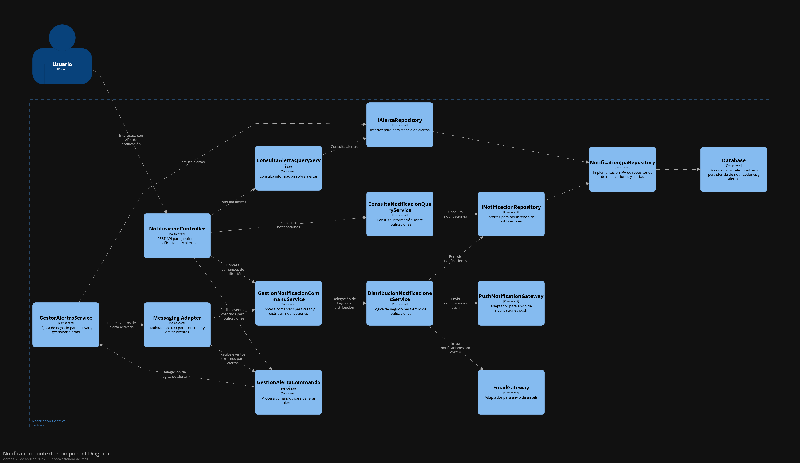

#### 4.2.7.6. Bounded Context Software Architecture Code Level Diagrams

#### 4.2.7.6.1. Bounded Context Domain Layer Class Diagrams

Este diagrama representa las clases, interfaces, value objects y servicios del Domain Layer del Notification Context. El objetivo es mostrar cómo se organiza el modelo de dominio alrededor de los aggregate roots Notificacion y Alerta, los servicios de dominio asociados, y cómo se estructuran las entidades e interfaces de repositorio. Se incluyen atributos, métodos, relaciones, visibilidad, y multiplicidades conforme al estándar de UML.

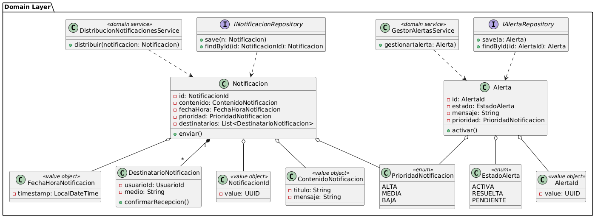

#### 4.2.7.6.2. Bounded Context Database Design Diagram

El siguiente diagrama de base de datos representa las tablas que sustentan la persistencia del Notification Context. Cada entidad del modelo de dominio tiene una tabla asociada, con claves primarias y foráneas que mantienen la integridad referencial entre notificaciones, alertas y destinatarios. Se describe la estructura de columnas y constraints principales de la base de datos relacional utilizada.

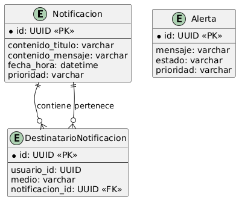
