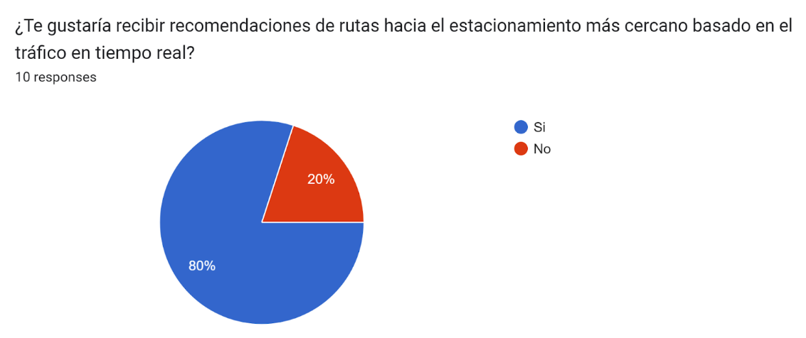

# **COURSE PROJECT** 

  

<strong>Universidad Peruana de Ciencias Aplicadas</strong>

<strong>Ingeniería de Software</strong> 
Desarrollo de Aplicaciones Móviles - NRC: 346  
Ciclo: 6to  
<strong>Profesor:</strong> Jorge Luis Mayta Guillermo

<h2 align="center">INFORME</h2>

<h3 align="center">Startup: Code Mondoguito</h3>

<strong>Producto: ParkingNow</strong>

<h3 align="center">Team Members:</h3>

| **Member**              | **Code** |
| ----------------------------- | -------------- |
| Calisaya Sánchez Juan Jesús  | u202121935    |
| Hidalgo Lopez, Mathias Adriano     | U202213222    |
| Samuel Elias Molina Asencios  | U20191A456     |
| Frezzia Eldaa Isabel Espinoza Paredes | u200815121     |
| Diego Ulises Soto Quispe      | U2022144778    |

<strong>Abril 2025</strong>

# Registro de Versiones del Informe
| Versión | Fecha      | Autor(es)                                                                                                                                                                                                                   | Descripción de la modificación                                                                                                                                                                                                                                                                                                                                                                                                                               |
|---------|------------|------------------------------------------------------------------------------------------------------------------------------------------------------------------------------------------------------------------------------|--------------------------------------------------------------------------------------------------------------------------------------------------------------------------------------------------------------------------------------------------------------------------------------------------------------------------------------------------------------------------------------------------------------------------------------------------------------|
| TB1     | 07/09/2024 | Calisaya Sánchez Juan Jesús    Hidalgo Lopez Mathias Adriano    Samuel Elias Molina Asencios    Frezzia Eldaa Isabel Espinoza Paredes    Diego Ulises Soto Quispe                                   | Se agregó el contenido del capítulo 1 (apartados 1.1, 1.1.1, 1.1.2, 1.2, 1.2.1, 1.2.2, 1.2.2.1, 1.2.2.2, 1.2.2.3, 1.2.2.4, 1.3); el contenido del capítulo 2 (apartados 2.1, 2.1.1, 2.1.2, 2.2, 2.2.1, 2.2.2, 2.2.3, 2.3, 2.3.1, 2.3.2, 2.3.3, 2.3.4, 2.3.5, 2.4); el contenido del capítulo 3 (apartados 3.1, 3.2, 3.3 y 3.4); y el contenido del capítulo 4 (apartados 4.1, 4.1.1, 4.1.1.1, 4.1.1.2, 4.1.1.3, 4.1.2, 4.1.3, 4.1.3.1, 4.1.3.2, 4.1.3.3, 4.2, 4.2.X, 4.2.X.1, 4.2.X.2, 4.2.X.3, 4.2.X.4, 4.2.X.5, 4.2.X.6, 4.2.X.6.1, 4.2.X.6.2). |
| TP1     | --         | --                                                                                                                                                                                                                           | --                                                                                                                                                                                                                                                                                                                                                                                                                                                           |
| TB2     | --         | --                                                                                                                                                                                                                           | --                                                                                                                                                                                                                                                                                                                                                                                                                                                           |
| TF1     | --         | --                                                                                                                                                                                                                           | --                                                                                                                                                                                                                                                                                                                                                                                                                                                           |

## Project Report Collaboration Insights

TB1: Las tareas asignadas para la entrega TB1 han sido completadas y están documentadas en el siguiente repositorio de GitHub perteneciente a la organización del equipo:

**Repositorio:** G3-UPC-CC238-346-ParkingNow/Report  
🔗 [https://github.com/G3-UPC-CC238-346-ParkingNow/Report](https://github.com/G3-UPC-CC238-346-ParkingNow/Report)

Durante la preparación del informe, se llevaron a cabo las siguientes actividades:

- Se escribieron y diagramaron los contenidos asignados a cada miembro en formato Markdown, seguidos de commits para asegurar el progreso en el repositorio.
- Se desarrollaron los capítulos I, II, III y IV del informe, abarcando desde la presentación del proyecto hasta el diseño de software, aplicando las técnicas revisadas en clase como Lean UX, entrevistas, análisis de usuarios y Domain-Driven Design.
- Los artefactos necesarios (diagramas, mapas, matrices) fueron elaborados con herramientas recomendadas y almacenados en la carpeta `Assets` dentro de la rama `develop`, permitiendo su referencia desde el informe.
- Se organizaron reuniones virtuales para coordinar los avances y distribuir las secciones, priorizando el desarrollo del contenido teórico-práctico del informe técnico.

 Esta entrega representa una evidencia del trabajo colaborativo del equipo, permitiendo cumplir con el Student Outcome 7 (ABET – EAC), demostrando la capacidad para adquirir conocimientos, aplicar metodologías y documentar procesos en un entorno ágil.

 TP1: Project Report Collaboration Insights

_(Contenido en preparación)_

---

TB2: Project Report Collaboration Insights

_(Contenido en preparación)_

---

TF: Project Report Collaboration Insights

_(Contenido en preparación)_

# Contenido

- [Registro de Versiones del Informe](#registro-de-versiones-del-informe)  
- [Project Report Collaboration Insights](#project-report-collaboration-insights)  
- [Student Outcome](#student-outcome)  

## Capítulo I: Presentación

- [1.1. Startup Profile](#11-startup-profile)  
  - [1.1.1. Descripción de la Startup](#111-descripción-de-la-startup)  
  - [1.1.2. Perfiles de integrantes del equipo](#112-perfiles-de-integrantes-del-equipo)  
- [1.2. Solution Profile](#12-solution-profile)  
  - [1.2.1. Antecedentes y problemática](#121-antecedentes-y-problemática)  
  - [1.2.2. Lean UX Process](#122-lean-ux-process)  
    - [1.2.2.1. Lean UX Problem Statements](#1221-lean-ux-problem-statements)  
    - [1.2.2.2. Lean UX Assumptions](#1222-lean-ux-assumptions)  
    - [1.2.2.3. Lean UX Hypothesis Statements](#1223-lean-ux-hypothesis-statements)  
    - [1.2.2.4. Lean UX Canvas](#1224-lean-ux-canvas)  
- [1.3. Segmentos objetivo](#13-segmentos-objetivo)  

## Capítulo II: Requirements Elicitation & Analysis

- [2.1. Competidores](#21-competidores)  
  - [2.1.1. Análisis competitivo](#211-análisis-competitivo)  
  - [2.1.2. Estrategias y tácticas frente a competidores](#212-estrategias-y-tácticas-frente-a-competidores)  
- [2.2. Entrevistas](#22-entrevistas)  
  - [2.2.1. Diseño de entrevistas](#221-diseño-de-entrevistas)  
  - [2.2.2. Registro de entrevistas](#222-registro-de-entrevistas)  
  - [2.2.3. Análisis de entrevistas](#223-análisis-de-entrevistas)  
- [2.3. Needfinding](#23-needfinding)  
  - [2.3.1. User Personas](#231-user-personas)  
  - [2.3.2. User Task Matrix](#232-user-task-matrix)  
  - [2.3.3. User Journey Mapping](#233-user-journey-mapping)  
  - [2.3.4. Empathy Mapping](#234-empathy-mapping)  
  - [2.3.5. As-is Scenario Mapping](#235-as-is-scenario-mapping)  
- [2.4. Ubiquitous Language](#24-ubiquitous-language)  

## Capítulo III: Requirements Specification

- [3.1. To-Be Scenario Mapping](#31-to-be-scenario-mapping)  
- [3.2. User Stories](#32-user-stories)  
- [3.3. Impact Mapping](#33-impact-mapping)  
- [3.4. Product Backlog](#34-product-backlog)  

## Capítulo IV: Solution Software Design

- [4.1. Strategic-Level Domain-Driven Design](#41-strategic-level-domain-driven-design)  
  - [4.1.1. EventStorming](#411-eventstorming)  
    - [4.1.1.1. Candidate Context Discovery](#4111-candidate-context-discovery)  
    - [4.1.1.2. Domain Message Flows Modeling](#4112-domain-message-flows-modeling)  
    - [4.1.1.3. Bounded Context Canvases](#4113-bounded-context-canvases)  
  - [4.1.2. Context Mapping](#412-context-mapping)  
  - [4.1.3. Software Architecture](#413-software-architecture)  
    - [4.1.3.1. Software Architecture Context Level Diagrams](#4131-software-architecture-context-level-diagrams)  
    - [4.1.3.2. Software Architecture Container Level Diagrams](#4132-software-architecture-container-level-diagrams)  
    - [4.1.3.3. Software Architecture Deployment Diagrams](#4133-software-architecture-deployment-diagrams)  
- [4.2. Tactical-Level Domain-Driven Design](#42-tactical-level-domain-driven-design)  
  - [4.2.X. Bounded Context: <Bounded Context Name>](#42x-bounded-context-bounded-context-name)  
    - [4.2.X.1. Domain Layer](#42x1-domain-layer)  
    - [4.2.X.2. Interface Layer](#42x2-interface-layer)  
    - [4.2.X.3. Application Layer](#42x3-application-layer)  
    - [4.2.X.4. Infrastructure Layer](#42x4-infrastructure-layer)  
    - [4.2.X.5. Bounded Context Software Architecture Component Level Diagrams](#42x5-bounded-context-software-architecture-component-level-diagrams)  
    - [4.2.X.6. Bounded Context Software Architecture Code Level Diagrams](#42x6-bounded-context-software-architecture-code-level-diagrams)  
    - [4.2.X.6.1. Bounded Context Domain Layer Class Diagrams](#42x61-bounded-context-domain-layer-class-diagrams)  
    - [4.2.X.6.2. Bounded Context Database Design Diagram](#42x62-bounded-context-database-design-diagram)  

## Capítulo V: Solution UI/UX Design

- [5.1. Product Design](#51-product-design)  
  - [5.1.1. Style Guidelines](#511-style-guidelines)  
    - [5.1.1.1. General Style Guidelines](#5111-general-style-guidelines)  
  - [5.1.2. Information Architecture](#512-information-architecture)  
    - [5.1.2.1. Organization Systems](#5121-organization-systems)  
    - [5.1.2.2. Labelling Systems](#5122-labelling-systems)  
    - [5.1.2.3. SEO Tags and Meta Tags](#5123-seo-tags-and-meta-tags)  
    - [5.1.2.4. Searching Systems](#5124-searching-systems)  
    - [5.1.2.5. Navigation Systems](#5125-navigation-systems)  
  - [5.1.3. Landing Page UI Design](#513-landing-page-ui-design)  
    - [5.1.3.1. Landing Page Wireframe](#5131-landing-page-wireframe)  
    - [5.1.3.2. Landing Page Mock-up](#5132-landing-page-mock-up)  
  - [5.1.4. Mobile Applications UX/UI Design](#514-mobile-applications-uxui-design)  
    - [5.1.4.1. Mobile Applications Wireframes](#5141-mobile-applications-wireframes)  
    - [5.1.4.2. Mobile Applications Wireflow Diagrams](#5142-mobile-applications-wireflow-diagrams)  
    - [5.1.4.3. Mobile Applications Mock-ups](#5143-mobile-applications-mock-ups)  
    - [5.1.4.4. Mobile Applications User Flow Diagrams](#5144-mobile-applications-user-flow-diagrams)  
    - [5.1.4.5. Mobile Applications Prototyping](#5145-mobile-applications-prototyping)  

## Capítulo VI: Product Implementation, Validation & Deployment

- [6.1. Software Configuration Management](#61-software-configuration-management)  
  - [6.1.1. Software Development Environment Configuration](#611-software-development-environment-configuration)  
  - [6.1.2. Source Code Management](#612-source-code-management)  
  - [6.1.3. Source Code Style Guide & Conventions](#613-source-code-style-guide--conventions)  
  - [6.1.4. Software Deployment Configuration](#614-software-deployment-configuration)  
- [6.2. Landing Page & Mobile Application Implementation](#62-landing-page--mobile-application-implementation)  
  - [6.2.X. Sprint n](#62x-sprint-n)  
    - [6.2.X.1. Sprint Planning n](#62x1-sprint-planning-n)  
    - [6.2.X.2. Sprint Backlog n](#62x2-sprint-backlog-n)  
    - [6.2.X.3. Development Evidence for Sprint Review](#62x3-development-evidence-for-sprint-review)  
    - [6.2.X.4. Testing Suite Evidence for Sprint Review](#62x4-testing-suite-evidence-for-sprint-review)  
    - [6.2.X.5. Execution Evidence for Sprint Review](#62x5-execution-evidence-for-sprint-review)  
    - [6.2.X.6. Services Documentation Evidence for Sprint Review](#62x6-services-documentation-evidence-for-sprint-review)  
    - [6.2.X.7. Software Deployment Evidence for Sprint Review](#62x7-software-deployment-evidence-for-sprint-review)  
    - [6.2.X.8. Team Collaboration Insights during Sprint](#62x8-team-collaboration-insights-during-sprint)  
- [6.3. Validation Interviews](#63-validation-interviews)  
  - [6.3.1. Diseño de Entrevistas](#631-diseño-de-entrevistas)  
  - [6.3.2. Registro de Entrevistas](#632-registro-de-entrevistas)  
  - [6.3.3. Evaluaciones según heurísticas](#633-evaluaciones-según-heurísticas)  
- [6.4. Video About-the-Product](#64-video-about-the-product)  

## Secciones Finales

- [Conclusiones](#conclusiones)  
  - [Conclusiones y recomendaciones](#conclusiones-y-recomendaciones)  
  - [Video About-the-Team](#video-about-the-team)  
- [Bibliografía](#bibliografía)  
- [Anexos](#anexos)

# ABET – EAC - Student Outcome 7

**Criterio:** *La capacidad de adquirir y aplicar nuevos conocimientos según sea necesario, utilizando estrategias de aprendizaje apropiadas.*

En el siguiente cuadro se describen las acciones realizadas y enunciados de conclusiones por parte del grupo, que permiten sustentar el haber alcanzado el logro del ABET – EAC - Student Outcome 7.

### ABET – EAC - Resultado del Estudiante 7

| Criterio específico | Acciones realizadas | Conclusiones |
| ------------------- | ------------------- | ------------ |
| **Actualiza conceptos y conocimientos necesarios para su desarrollo profesional y en especial para su proyecto en soluciones de software.** | **TB1:**  - *Calisaya Sánchez Juan Jesús:* Redactó el capítulo 1 del informe aplicando conceptos de presentación de startups y problemática.  - *Hidalgo Lopez Mathias Adriano:* Aplicó Lean UX Problem Statements y desarrolló el Canvas a partir de investigaciones propias.  - *Samuel Elias Molina Asencios:* Implementó el Empathy Mapping y el User Journey Mapping tras investigar su aplicación en UX.  - *Frezzia Eldaa Isabel Espinoza Paredes:* Aportó en entrevistas y definición de requerimientos investigando metodologías efectivas.  - *Diego Ulises Soto Quispe:* Lideró la estructura del informe y aplicó documentación técnica basada en buenas prácticas.  **TP:**  **TB2:**  **TF:** | **TB1:**  El equipo demostró una apropiada adquisición y aplicación de nuevos conocimientos tanto vistos en clase como aprendidos de forma autónoma. Se evidenció la capacidad de trasladar herramientas teóricas (Lean UX, entrevistas, mapeos, documentación técnica) a productos concretos dentro del proyecto *ParkingNow*.  **TP:**  **TB2:**  **TF:** |
| **Reconoce la necesidad del aprendizaje permanente para el desempeño profesional y el desarrollo de proyectos en soluciones de software.** | **TB1:**  - *Calisaya Sánchez Juan Jesús:* Estudió técnicas de presentación y redacción para aplicarlas al informe.  - *Hidalgo Lopez Mathias Adriano:* Investigó metodologías centradas en el usuario y cómo estructurar entrevistas.  - *Samuel Elias Molina Asencios:* Aprendió por cuenta propia sobre diseño de experiencias y tareas del usuario.  - *Frezzia Eldaa Isabel Espinoza Paredes:* Reforzó su comprensión del levantamiento de información a través de entrevistas.  - *Diego Ulises Soto Quispe:* Investigó estructuras y patrones de informes técnicos para liderar la coherencia documental.  **TP:**  **TB2:**  **TF:** | **TB1:**  Se reflejó un compromiso claro con el aprendizaje autónomo al profundizar de forma individual en metodologías y herramientas útiles para el proyecto. El equipo se adaptó activamente al reto, demostrando crecimiento profesional y técnico en cada etapa de TB1.  **TP:**  **TB2:**  **TF:** |

# Objetivos SMART

A continuación, cada miembro del equipo formula dos objetivos SMART que reflejan su plan de desarrollo profesional continuo una vez finalizada su carrera. Estos objetivos son **específicos, medibles, alcanzables, relevantes y con un tiempo definido**, lo que permite guiar su crecimiento profesional tras la graduación.

| **Integrante**                         | **Objetivo SMART 1**                                                                                           | **Objetivo SMART 2**                                                                                          |
|---------------------------------------|---------------------------------------------------------------------------------------------------------------|---------------------------------------------------------------------------------------------------------------|
| **Calisaya Sánchez Juan Jesús**       | Obtener una certificación profesional en desarrollo frontend (Google, Microsoft, etc.) en los primeros 6 meses tras egresar. | Ingresar como frontend developer en una startup de salud digital antes de cumplir 1 año de egresado.         |
| **Hidalgo Lopez Mathias Adriano**     | Publicar una aplicación móvil funcional en Google Play en los primeros 12 meses tras egresar.                 | Participar en al menos dos eventos tecnológicos (hackathons o ferias) antes de los 12 meses de egresado.     |
| **Samuel Elias Molina Asencios**      | Finalizar un diplomado en UX/UI o diseño centrado en el usuario dentro de los 8 meses posteriores a la carrera. | Diseñar un portafolio profesional digital con al menos 5 casos reales antes de cumplir 1 año.                |
| **Frezzia Eldaa Isabel Espinoza Paredes** | Obtener una posición en una empresa tecnológica del sector salud o educación en el primer año como egresada. | Completar una certificación Scrum Master o en gestión ágil en los primeros 10 meses tras terminar la carrera.|
| **Diego Ulises Soto Quispe**          | Iniciar una maestría en ciberseguridad o arquitectura de software dentro de los primeros 18 meses de egresado. | Liderar un proyecto tecnológico completo en una empresa o startup dentro de los primeros 2 años post-egreso. |

## Capítulo I: Introducción

### 1.1. StartUp Profile

### 1.1.1. Descripción de la Startup

#### 1.1.2. Perfiles de integrantes del equipo
| **Integrantes**                                                      | **Descripción**                                                                                                                                                                                                                                                                                                                                                                                                                                                     | **Conocimientos**                                                                              |
| -------------------------------------------------------------------- | --------------------------------------------------------------------------------------------------------------------------------------------------------------------------------------------------------------------------------------------------------------------------------------------------------------------------------------------------------------------------------------------------------------------------------------------------------------------- | ---------------------------------------------------------------------------------------------------- |
|   Diego Ulises Soto Quispe  | Soy estudiante de 5to ciclo en la carrera de Ingeniería de Software. Soy responsable en las labores que se asignan y puntual con los trabajos por entregar, fuera del mundo de programación, me gusta jugar basquet, salir a pasear, jugar videojuegos y manejar en bicicleta.                                                                                                                                                 | HTML, Base de datos en SQL Server, C++, Python, NoSQL, JSON                                          |
|                                                                      |                                                                                                                                                                                                                                                                                                                                                                                                                                                                     |                                                                                                      |
|                                                                      |                                                                                                                                                                                                                                                                                                                                                                                                                                                                     |                                                                                                      |
|                                                                      |                                                                                                                                                                                                                                                                                                                                                                                                                                                                     |                                                                                                      |
|                                                                      |                                                                                                                                                                                                                                                                                                                                                                                                                                                                     |                                                                                                      |

### 1.2. Solution Profile

### 1.2.1. Antecedentes y problemática

### 1.2.2. Lean UX Process

#### 1.2.2.1. Lean UX Problem Statements

#### 1.2.2.2. Lean UX Assumptions

**Users:**

#### 1.2.2.3. Lean UX Hypothesis Statements

##### 1.2.2.4. Lean UX Canvas

### 1.3. Segmentos objetivo

## Capítulo II: Requirements Elicitation & Analysis

### 2.1. Competidores

**Parkimeter**

Parkimeter es una solución digital enfocada en la gestión y reserva de espacios de estacionamiento. Su plataforma facilita a los usuarios la búsqueda, comparación y reserva de plazas en distintas ubicaciones. También ofrece funcionalidades como visualización de tarifas, disponibilidad en tiempo real y otros servicios útiles que simplifican el proceso de estacionamiento para los conductores.

**ElParking**

ElParking brinda a los usuarios la posibilidad de localizar, reservar y pagar por estacionamientos desde una misma plataforma. Su sistema incorpora datos actualizados sobre espacios disponibles, además de permitir el pago de parquímetros, seguimiento de sanciones de tránsito y otros servicios complementarios que optimizan la experiencia del conductor.

**Aparcados**

Aparcados es una aplicación enfocada en simplificar la búsqueda de estacionamientos urbanos según las necesidades del usuario. Aunque cuenta con versión web, su versión móvil es la más utilizada debido a su interfaz amigable y diseño visual atractivo, lo que la convierte en una herramienta práctica para conductores en movimiento.

---

#### 2.1.1. Análisis competitivo

A continuación, se presenta una tabla comparativa de los principales competidores a nivel internacional. Este análisis nos permitirá identificar patrones clave de funcionalidad y experiencia de usuario, con el objetivo de alinear nuestra propuesta a las preferencias reales del público objetivo.

| **Competitive Analysis Landscape**                              |                                                                                                                              |
|-----------------------------------------------------------------|------------------------------------------------------------------------------------------------------------------------------|
| **¿Por qué llevar a cabo este análisis?**                       | **Escriba en el recuadro la pregunta que busca responder o el objetivo de este análisis.**                                    |
|                                                                 | **Identificar cómo PARKINGNOW se posiciona frente a sus competidores en términos de servicios ofrecidos, ventajas competitivas y estrategias de mercado para mejorar nuestra propuesta de valor y captar más clientes.** |

| ***Competidor***          || ParkingNow| Parkimeter| ElParking| Aparcados|
| ------------------- | ----------------------------------------------------- | ------------------------------------------------------------------------------------------------------------------------------------------------------------------------------------------------------------------------------------------------------------------------------------------------------- |--------------------------------------------------------------------------------------------------------------------------------------------------------------------------------------------------------------------------------|-----------------------------------------------------------------------------------------------------------------------------------------------------------------------------------------------------------------------------------------------------------------------------------------------------------------------------|------------------------------------------------------------------------------------------------------------------------------------------------------------------------------------------------------------------------------------------|
| ***Logo***| | | ||
| ***Perfil***| Overview| Es una aplicacion web que brinda la posibilidad de reservar espacios de estacionamiento en múltiples ciudades ademas que brinda la conexion entre los consumidores y dueños de estacionamientos| Es una aplicacion web y movil que ofrece servicios de reserva de plazas de aparcamiento en  diversas ciudades de Europa y América Latina| Es una aplicacion web y movil que ofrece servicios de reserva de plazas de aparcamiento en  diversas ciudades de Europa y América Latina| Es una aplicacion web y movil que ofrece servicios de reserva de plazas de aparcamiento en diversas ciudades de España principalmente, pero expandiéndose alrededor del mundo|
|| ***Ventaja competitiva ¿Qué valor ofrece a los clientes?*** | Cancelación gratuita hasta con 24 horas de antelación de la reserva, inclusion de un sensor para el automovil y ser el puente entre los consumidores y dueños de playas de estacionamientos en zonas urbanas| Ofrece descuentos de hasta el 70% y no cobra gastos de gestión | Permite más que solo pagar estacionamientos, sino gestionar multas y pagar parquímetros| La app incluye geolocalización y ofrece notificaciones a tiempo real|
| ***Perfil de Marketing*** | ***Mercado objetivo***| Personas que buscaban soluciones de estacionamiento en áreas urbanas congestionadas y personas dueñas de estacionamientos de playas.| Personas que buscaban soluciones de estacionamiento en áreas urbanas congestionadas| Personas que buscaban soluciones de estacionamiento en áreas urbanas congestionadas| Personas que buscaban soluciones de estacionamiento en áreas urbanas congestionadas|
|| ***Estrategias de marketing***| Utiliza publicidad en línea a través de plataformas y redes sociales| Utiliza publicidad en línea a través de plataformas y redes sociales |Utiliza publicidad en línea, redes sociales y reciben promociones de influencers| Utiliza publicidad en línea a través de plataformas y redes sociales  |
| ***Perfil de Producto*** | ***Productos & Servicios***| Ofrece una serie de servicios relacionados con la reserva de plazas de aparcamiento en áreas urbanas y otros destinos. |Realizar servicios de parking en todo el territorio español y otras grandes ciudades del mundo | Ofrece una serie de servicios relacionados con la reserva de plazas de aparcamiento en ciudades concurridas, seguimiento de multas y pagos sencillos. | Ofrece una serie de servicios relacionados con la reserva de plazas de aparcamiento en áreas urbanas y otros destinos |
|| ***Precios & Costos***| La plataforma es gratuita, pero se debe pagar las tarifas de estacionamiento correspondientes |La plataforma es gratuita, pero se debe pagar las tarifas de estacionamiento correspondientes y las suscripciones VIP. | La plataforma es gratuita pero se debe pagar las tarifas de estacionamiento, además de la existencia de tarifas especiales o descuentos | La plataforma es gratuita, pero se debe pagar las tarifas de estacionamiento correspondientes. |
|| ***Canales de distribución (Web y/o Móvil)***| Web| Web/Móvil| Web/Móvil| Web/Movil|
| ***Análisis SWOT***       | ***Fortalezas***| Implementa sensores de estacionamiento en los estacionamientos asociados, un objetivo más amplio que otras aplicaciones y soporte en tiempo real para los consumidores| Parkimeter opera en múltiples ciudades de Europa y América Latina |ElParking implementa seguimiento de multas y pagos a parte de los estacionamientos | Aparcados opera en múltiples ciudades de Europa y Asia|
|| ***Debilidades***| La industria de reserva de estacionamientos en línea es muy competitiva . | Varias empresas que proporcionan servicios similares | La industria de reserva de estacionamientos en línea es muy competitiva. | Varias empresas que proporcionan servicios similares. |
|| ***Oportunidades***| A medida que las ciudades sigan creciendo, la demanda de servicios de reserva podría aumentar |La congestión del tráfico se vuelve más común, eso provocaría una alta demanda en la reserva de estacionamientos | En su país de origen, España, las personas en zonas urbanas van a tener que aprender más acerca de la app para poder vivir en comodidad. | Tiene grandes posibilidades de expandir su mercado aun enfocándose en la reserva de estacionamientos en América Latina |
|| ***Amenazas***| Cambios en las políticas de movilidad urbana.|Nuevas startups compitiendo por la misma base de usuarios.|Nuevas startups compitiendo por la misma base de usuarios. | Nuevas startups compitiendo por la misma base de usuarios. |

#### 2.1.2. Estrategias y tácticas frente a competidores

A continuación, encontraremos la tabla de Matriz de FODA y C.A.M.E para poder analizar nuestras estrategias a futuro para competir contra los competidores anteriormente mencionados.

| ***MATRIZ FODA y C.A.M.E*** | **Oportunidades: La demanda de este servicio aumenta bastante con los años** | **Amenazas: Cambios en la política de movilidad urbana** |
|-----------------------------|------------------------------------------------------------------------------|-------------------------------------------------------------|
| **Fortalezas: Innovación, público objetivo más amplio y soporte en tiempo real para los consumidores** | Ofrecer soporte eficiente a través de la app para fidelizar usuarios, destacando el valor diferenciador de los sensores inteligentes como una funcionalidad poco común y atractiva para el mercado. | Realizar un monitoreo constante de las políticas de movilidad urbana para adaptar nuestra propuesta a los cambios y mantenernos siempre alineados con la normativa. |
| **Debilidades: Mercado competitivo y nuevo** | Fortalecer las campañas de difusión y visibilidad digital, resaltando las características innovadoras de la app como su enfoque en tiempo real y personalización para lograr una mejor recepción en el mercado. | Desarrollar mensajes de marketing enfocados en cómo nuestra solución contribuye a una mejor gestión urbana, mostrando que no se opone a las políticas sino que las complementa. |

### 2.2. Entrevistas

Esta sección se centra en la recopilación de información mediante entrevistas a representantes de los segmentos objetivo, con el fin de entender sus necesidades y expectativas en relación al servicio.
#### 2.2.1. Diseño de entrevistas

Incluye la elaboración de preguntas principales y complementarias dirigidas a cada segmento, considerando aspectos demográficos, características de personalidad y preferencias tecnológicas para construir perfiles precisos de los usuarios.

**Segmento objetivo #1: Conductores Urbanos Frecuentes**

**Preguntas demográficas:**

- ¿Cuál es tu nombre?  
- ¿Cuál es tu edad?  
- ¿Dónde vives?  
- ¿A qué te dedicas?  
- ¿Cuáles consideras que son tus principales habilidades?  

**Preguntas principales:**

- ¿Con qué frecuencia necesitas estacionamiento en la ciudad?  
- ¿Cuánto tiempo dedicas normalmente a buscar estacionamiento?  
- ¿Utilizas actualmente alguna aplicación o servicio para encontrar estacionamiento?  
- ¿Qué tan importante es para ti conocer la disponibilidad de estacionamiento en tiempo real?  
- ¿Estarías dispuesto/a a pagar una tarifa adicional por garantizar un espacio de estacionamiento reservado?  
- ¿Qué consideras más importante al elegir un estacionamiento: costo, proximidad, o seguridad?  
- ¿Te gustaría recibir recomendaciones de rutas hacia el estacionamiento más cercano basado en el tráfico en tiempo real?  

**Preguntas complementarias:**

- ¿Has tenido experiencias frustrantes buscando estacionamiento en la ciudad?  
- ¿Qué mejoras te gustaría ver en los servicios de estacionamiento que utilizas actualmente?  

**Segmento objetivo #2: Dueños de estacionamientos**

**Preguntas demográficas:**

- ¿Cuál es tu nombre?  
- ¿Cuál es tu edad?  
- ¿Dónde vives?  
- ¿A qué te dedicas?  
- ¿Cuáles consideras que son tus principales habilidades?  

**Preguntas principales:**

- ¿Consideras sencillo el proceso de gestionamiento de espacios en tu estacionamiento?  
- ¿Qué tan importante es para ti contar con información en tiempo real sobre los espacios disponibles?  
- ¿Utilizas algún sistema digital para administrar los pagos y reservas de los espacios de estacionamiento?  
- ¿Qué beneficios ves en la posibilidad de automatizar el proceso de reserva y pago de los espacios de estacionamiento?  
- ¿Qué tan relevante es para ti ofrecer opciones de pago seguras y rápidas a tus clientes?  
- ¿De qué manera crees que la integración de una app que gestione datos y pagos podría mejorar la eficiencia de tu negocio?  

**Preguntas complementarias:**

- ¿Cuáles son los principales desafíos que enfrentas al administrar tu estacionamiento?  
- ¿Qué funcionalidades adicionales te gustaría que una app ofreciera para facilitar la gestión de tu negocio?  
- ¿Te gustaría recibir reportes o análisis sobre la ocupación y rotación de vehículos en tu estacionamiento?  

#### 2.2.2. Registro de entrevistas
**Segmento objetivo \#1: Conductores Urbanos Frecuentes**

**Entrevistado N°1: Joan Talizo Balbin**  
**Sexo:** Masculino  
**Edad:** 23  
**Ubicación en la que vive:** Surco, Lima, Perú  

Link de la entrevista:

Resumen: Balbín utiliza su auto todos los días para ir a la universidad y a su trabajo como desarrollador web en una ONG. Esto lo obliga a buscar estacionamiento constantemente, lo cual puede tomarle entre 10 a 20 minutos, dependiendo del tráfico y la zona. Actualmente no usa ninguna aplicación para encontrar estacionamiento, pero considera que una app con información en tiempo real sería muy útil, ya que le ahorraría tiempo y evitaría dar vueltas innecesarias. También le gustaría que la app recomiende rutas según el tráfico, lo cual considera clave para optimizar sus desplazamientos. Está dispuesto a pagar una tarifa adicional por reservar un espacio, siempre que esto le garantice seguridad y cercanía. Aunque valora la seguridad, prioriza el costo y la proximidad al momento de elegir un estacionamiento. Ha vivido situaciones frustrantes, como perder tiempo en el tráfico, no encontrar espacios libres o que otro conductor le gane el lugar. Por ello, valora la posibilidad de saber en tiempo real si hay espacios disponibles e incluso recibir alertas si ocurre algo sospechoso con su vehículo.

**Entrevistado N°2: Luis Ángel Anampa Lavado**  
**Sexo:** Masculino  
**Edad:** 20  
**Ubicación en la que vive:** San Borja, Lima, Perú  

Link de la entrevista: 

Resumen: Ángel utiliza su vehículo todos los días, por lo que necesita estacionamiento de forma constante. El tiempo que le toma encontrar un espacio varía según la zona y el tráfico, pudiendo tardar entre 10 a 20 minutos o más en horas punta. Actualmente no usa ninguna aplicación para encontrar estacionamiento, pero considera que sería una herramienta muy útil. Destaca que conocer la disponibilidad de espacios en tiempo real es clave, ya que le permitiría ahorrar tiempo y evitar vueltas innecesarias. Está dispuesto a pagar una tarifa adicional por reservar un espacio, siempre y cuando no sea excesiva. Al elegir un estacionamiento, valora principalmente el costo y la proximidad, dejando la seguridad en un segundo plano aunque también le parece importante. Ángel estaría muy interesado en una aplicación que le recomiende rutas hacia estacionamientos disponibles evitando el tráfico. Ha tenido experiencias frustrantes buscando estacionamiento, como perder espacios a último momento o tener que maniobrar en lugares muy estrechos. Finalmente, sugiere como mejoras la posibilidad de recibir notificaciones en tiempo real cuando se libera un espacio cercano, y también alertas de seguridad en caso de movimientos sospechosos cerca del vehículo.

**Entrevistado N°3: Rodrigo Ismael Viton**  
**Sexo:** Masculino  
**Edad:** 20  
**Ubicación en la que vive:** Chorrillos, Lima, Perú  

Link de la entrevista:

Resumen: Rodrigo enfrenta a diario la dificultad de encontrar estacionamiento, lo que afecta su trabajo como repartidor. No usa apps especializadas, pero muestra alta disposición a utilizar una que le garantice disponibilidad en tiempo real, reserva segura y rutas optimizadas. Valora la proximidad y la rapidez. Su experiencia indica una gran oportunidad para crear una app práctica, con pagos digitales y geolocalización inteligente.

**Segmento objetivo \#2: Dueños de estacionamientos**

**Entrevistado N°1: Carlos Ponce**  
**Sexo:** Masculino  
**Edad:** 20  
**Ubicación en la que vive:** La Molina, Lima, Perú  

Link de la entrevista:

Resumen: Carlos tiene 20 años y vive en La Molina, donde administra una playa de estacionamiento. Se considera organizado, resolutivo y orientado a mantener el orden, aunque admite que en momentos de alta afluencia puede resultar complicado. Respecto a la gestión del espacio, indica que el proceso suele ser sencillo, pero se complica cuando hay mucho movimiento o los conductores no respetan los espacios designados. Por ello, valora mucho contar con información en tiempo real sobre los espacios disponibles, ya que evitaría revisiones físicas constantes y mejoraría la eficiencia. Actualmente no utiliza sistemas de reserva digital, pero acepta pagos a través de Yape y Plin, que considera rápidos y populares entre sus clientes. Cree que automatizar reservas y pagos sería muy beneficioso, ya que permitiría organizar mejor los tiempos de permanencia, agilizar entradas/salidas y mantener mejor control de cobros. Carlos considera que ofrecer opciones de pago seguras y rápidas es crucial, ya que sus clientes buscan un proceso ágil y sin complicaciones. Está convencido de que una app que integre gestión de espacios y pagos le permitiría llevar un control detallado de la ocupación, ingresos diarios y brindar mayor transparencia. Entre los desafíos que enfrenta están la organización en horas pico y el seguimiento manual de pagos. Le gustaría que una app permita a los clientes indicar su tiempo de permanencia, calcule el costo automáticamente y notifique disponibilidad en tiempo real. También está interesado en reportes de ocupación y rotación para tomar mejores decisiones.

**Entrevistado N°2: Guillermina Asencio Sarrazar**  
**Sexo:** Femenino  
**Edad:** 57  
**Ubicación en la que vive:** Villa El Salvador, Lima, Perú  

Link de la entrevista:

**Resumen:**  
Guillermina es ama de casa y también administra una playa de estacionamiento. Considera que la gestión es sencilla en general, pero se complica cuando los clientes incumplen con los pagos o solicitan descuentos injustificados. Actualmente no utiliza ningún sistema digital, pero le gustaría contar con uno que permita reservas y pagos virtuales anticipados, lo cual considera seguro y eficiente.  

Destaca la importancia de ofrecer métodos de pago rápidos y confiables para evitar tiempos de espera innecesarios y asegurar atención incluso en su ausencia. Los principales desafíos que enfrenta incluyen retrasos de los clientes al recoger sus vehículos y la interferencia que esto genera en el movimiento de otros usuarios. Le gustaría que una aplicación le permita controlar mejor los tiempos de permanencia, recibir pagos por adelantado y manejar todo el proceso de forma automatizada.

#### 2.2.3. Análisis de entrevistas

De acuerdo con la información recopilada de las entrevistas, realizamos el siguiente análisis segmentado:

### Segmento objetivo #1: Conductores Urbanos Frecuentes

**Hallazgos:**

- Todos los entrevistados utilizan su vehículo a diario, ya sea por motivos laborales, académicos o de reparto, lo que incrementa su necesidad constante de encontrar estacionamiento.
- El tiempo de búsqueda de un lugar para estacionar varía entre 10 a 20 minutos, especialmente en zonas de alta demanda o en horas pico.
- Ninguno de los entrevistados utiliza actualmente una aplicación para encontrar estacionamiento, pero todos consideran que una app con disponibilidad en tiempo real sería de gran utilidad.
- Existe una alta disposición a pagar una tarifa adicional si esta garantiza la reserva del espacio, especialmente si incluye elementos como seguridad y proximidad.
- Los criterios más valorados al momento de elegir un estacionamiento son el costo, la cercanía y, en menor medida, la seguridad.
- Las frustraciones comunes incluyen perder espacios disponibles, dar vueltas sin éxito y lidiar con zonas congestionadas.
- Se valoran funcionalidades como la sugerencia de rutas optimizadas según el tráfico y notificaciones en tiempo real sobre espacios liberados o posibles riesgos cerca del vehículo.

### Segmento objetivo #2: Dueños de estacionamientos

**Hallazgos:**

- La gestión de espacios no es compleja cuando hay baja demanda, pero en horarios de alta rotación se vuelve difícil mantener el orden y controlar tiempos de permanencia.
- Se considera fundamental contar con información en tiempo real sobre disponibilidad para evitar supervisiones físicas y mejorar la eficiencia.
- Aunque se aceptan pagos digitales (como Yape o Plin), no se utilizan aplicaciones que permitan la reserva previa de espacios.
- La automatización es vista como una solución clave para agilizar cobros, organizar la permanencia de los clientes y reducir errores manuales.
- Ofrecer opciones de pago rápidas y seguras es una prioridad, ya que mejora la experiencia del cliente.
- Se valora el acceso a información básica del cliente (nombre, número de contacto) para reforzar la seguridad en el servicio.
- El interés en reportes de ocupación y análisis de rotación es alto, ya que ayudarían a tomar mejores decisiones operativas.

### Conclusiones generales

Los hallazgos del **segmento 1** reflejan una necesidad clara de modernizar la experiencia de estacionamiento mediante tecnología. Aunque los usuarios no usan apps actualmente, muestran apertura total a una solución que les ofrezca disponibilidad en tiempo real, reserva anticipada, rutas optimizadas y alertas inteligentes. Además, están dispuestos a pagar si el servicio resuelve sus principales frustraciones: pérdida de tiempo y falta de seguridad.

En el **segmento 2**, los dueños de estacionamientos coinciden en la utilidad de digitalizar la gestión. Aunque algunos procesos se manejan de forma sencilla, hay oportunidades de mejora al automatizar cobros, reservas y notificaciones. La app ideal, para ellos, debería ofrecer herramientas que faciliten la organización diaria, aumenten la seguridad y ofrezcan estadísticas útiles sobre la ocupación.

Ambos segmentos coinciden en que una aplicación móvil que integre información en tiempo real, pagos digitales y comunicación directa generaría una experiencia más eficiente, confiable y satisfactoria.

**Entrevista completa:**

Link de las entrevistas completas: 

**Análisis por medio de herramientas estadísticas:**

Segmento objetivo 1: [https://forms.gle/Lo3Z69GnkyYDcaAYA](https://forms.gle/Lo3Z69GnkyYDcaAYA) 

**Análisis por medio de herramientas estadísticas:**

Segmento objetivo 1: [https://forms.gle/Lo3Z69GnkyYDcaAYA](https://forms.gle/Lo3Z69GnkyYDcaAYA)

Segmento objetivo 2: [https://forms.gle/pCNNRar5TBzSPoX38](https://forms.gle/pCNNRar5TBzSPoX38) 

Segmento objetivo 2: [https://forms.gle/pCNNRar5TBzSPoX38](https://forms.gle/pCNNRar5TBzSPoX38)

### 2.3. Needfinding

En esta sección se presentarán los artefactos generados a partir del proceso de recopilación llevado a cabo en los segmentos objetivos. Este proceso culmina con la creación de los User Personas, la User Task Matrix, los User Journey Maps, el Empathy Mapping y el As-Is Scenario Mapping. Los hallazgos obtenidos a través de entrevistas permiten construir representaciones precisas de los usuarios reales, facilitando un enfoque centrado en el usuario para el desarrollo de nuestra aplicación móvil.

#### 2.3.1. User Personas

En esta sección del documento, se presentan perfiles ficticios que representan a los grupos de interés identificados y que fueron objeto de entrevistas. La información proporcionada incluye datos demográficos, rasgos de personalidad, motivaciones, preferencias, metas, desafíos y comportamientos típicos. Estos detalles están basados en las entrevistas realizadas previamente. Se han utilizado herramientas de UXPressia para facilitar la elaboración de estos perfiles y asegurar una visualización estructurada y coherente con el enfoque UX del proyecto.

###### User Persona para Conductores Urbanos

La "User Persona" de Anna Pacheco representa a los conductores urbanos que requieren soluciones rápidas, eficientes y seguras para estacionar cerca de sus destinos. Anna es una organizadora de eventos de 29 años, cuya rutina diaria implica múltiples desplazamientos por la ciudad. Está motivada por la comodidad y la optimización del tiempo, pero suele frustrarse por la falta de espacios disponibles y la pérdida de tiempo al buscar estacionamiento. Busca una solución móvil práctica, con información en tiempo real, reserva anticipada y funciones que mejoren su experiencia general al conducir en zonas urbanas.

###### User Person para Dueños de estacionamientos

La "User Persona" de Luis Cordova representa a propietarios de estacionamientos interesados en mejorar la gestión y aumentar ingresos. Luis, de 26 años y dueño de un estacionamiento, utiliza tecnología para optimizar la ocupación y reducir tiempos de espera. Sus objetivos incluyen la fidelización de clientes y la expansión del negocio, pero enfrenta frustraciones con problemas tecnológicos y altos costos operativos.

## 2.3.2. User Task Matrix

En el User Task Matrix hemos identificado las actividades que realizan nuestros dos segmentos y hemos evaluado la importancia de cada una de estas tareas para cada segmento.

### Indicadores de Importancia:

- ALTA
- MEDIA
- BAJA

### Indicadores de Frecuencia:

- ALTA
- MEDIA
- BAJA

A través del User Task Matrix, podemos identificar las frecuencias e importancias entre los diferentes segmentos que presentamos y usar esta información como guía.

#### Usuarios:
Para los usuarios, las tareas que presentan mayor frecuencia son:

| **Segmento Objetivo**             | **Tarea**                                                                       | **Frecuencia** | **Importancia** |
|----------------------------------|----------------------------------------------------------------------------------|----------------|------------------|
| Conductores Urbanos Frecuentes   | Buscar estacionamientos disponibles                                              | Media          | Alta             |
| Conductores Urbanos Frecuentes   | Comparar precios de estacionamientos                                             | Alta           | Media            |
| Conductores Urbanos Frecuentes   | Reservar estacionamientos con anticipación                                      | Media          | Alta             |
| Conductores Urbanos Frecuentes   | Pagar por estacionamiento a través de la aplicación                              | Alta           | Alta             |
| Conductores Urbanos Frecuentes   | Recibir direcciones al estacionamiento reservado                                | Alta           | Alta             |
| Conductores Urbanos Frecuentes   | Filtrar estacionamientos por criterios (precio, seguridad, etc.)                | Alta           | Alta             |
| Conductores Urbanos Frecuentes   | Recibir notificaciones sobre descuentos y ofertas                               | Media          | Baja             |
| Conductores Urbanos Frecuentes   | Verificar disponibilidad de estacionamiento en tiempo real                      | Alta           | Alta             |
| Conductores Urbanos Frecuentes   | Consultar historial de estacionamientos utilizados                              | Media          | Baja             |
| Dueños de Estacionamientos       | Administrar y actualizar la disponibilidad de espacios                           | Alta           | Alta             |
| Dueños de Estacionamientos       | Ajustar precios de los espacios de estacionamiento                               | Media          | Alta             |
| Dueños de Estacionamientos       | Gestionar reservas de estacionamientos                                           | Alta           | Alta             |
| Dueños de Estacionamientos       | Procesar pagos de estacionamiento a través de la aplicación                      | Alta           | Media            |
| Dueños de Estacionamientos       | Revisar y ajustar las características del estacionamiento (precio, seguridad, etc.) | Media       | Alta             |
| Dueños de Estacionamientos       | Revisar reportes de uso y disponibilidad                                         | Media          | Media            |
| Dueños de Estacionamientos       | Recibir y gestionar comentarios y valoraciones de los usuarios                   | Baja           | Media            |
| Dueños de Estacionamientos       | Promocionar descuentos y ofertas especiales                                      | Media          | Media            |
| Dueños de Estacionamientos       | Consultar el historial de transacciones y reservas                               | Baja           | Media            |

A través del User Task Matrix, podemos identificar las frecuencias e importancias entre los diferentes segmentos que presentamos y usar esta información como guía.

#### Conductores Urbanos:

Para los usuarios, las tareas que presentan mayor frecuencia son:

- Pagar por estacionamiento a través de la aplicación.
- Recibir direcciones al estacionamiento reservado.
- Filtrar estacionamientos por criterios (precio, seguridad, etc.).
- Verificar disponibilidad de estacionamiento en tiempo real.

Estas tareas son cruciales para mejorar la experiencia del usuario en la búsqueda y uso de estacionamientos.

Para los usuarios, las tareas que presentan mayor importancia son:

- Pagar por estacionamiento a través de la aplicación.
- Recibir direcciones al estacionamiento reservado.
- Filtrar estacionamientos por criterios (precio, seguridad, etc.).
- Verificar disponibilidad de estacionamiento en tiempo real.

Estas tareas son importantes porque aseguran una experiencia de estacionamiento eficiente y satisfactoria, desde la búsqueda hasta el pago y la dirección.

#### Dueños de Estacionamientos:

Para los dueños de estacionamientos, las tareas que presentan mayor frecuencia son:

- Administrar y actualizar la disponibilidad de espacios.
- Gestionar reservas de estacionamientos.
- Procesar pagos de estacionamiento a través de la aplicación.
- Revisar y ajustar las características del estacionamiento (precio, seguridad, etc.).

Estas tareas son esenciales para la gestión efectiva de sus espacios de estacionamiento y para asegurar que los usuarios tengan una experiencia positiva.

Para los dueños de estacionamientos, las tareas que presentan mayor importancia son:

- Administrar y actualizar la disponibilidad de espacios.
- Ajustar precios de los espacios de estacionamiento.
- Revisar reportes de uso y disponibilidad.
- Revisar y ajustar las características del estacionamiento (precio, seguridad, etc.).

Estas tareas son importantes porque permiten a los dueños optimizar la gestión de sus espacios y responder a las demandas del mercado de manera efectiva.

#### Diferencias:

Al analizar ambos segmentos objetivo, se observa que los usuarios están enfocados en la eficiencia y la comodidad en el proceso de estacionamiento, mientras que los dueños de estacionamientos se concentran en la gestión y optimización de sus espacios. Aunque cada segmento tiene objetivos distintos, ambos se benefician de un sistema que facilite la disponibilidad, la gestión y la experiencia de estacionamiento.

#### 2.3.3. User Journey Mapping

En esta sección, hemos creado los mapas de recorrido del usuario para cada tipo de usuario (cliente y propietario de estacionamiento). Para el cliente, el proceso comienza con la búsqueda de un espacio de estacionamiento, continúa con la selección y reserva del espacio, el pago a través de la aplicación y la obtención de direcciones hacia el lugar reservado. Finalmente, el cliente llega al espacio y lo utiliza. Este recorrido permite identificar metas, desafíos, oportunidades y pasos clave dentro de su experiencia de uso, lo cual es fundamental para optimizar la funcionalidad de la aplicación y la satisfacción del usuario.

Desde la perspectiva del propietario de estacionamiento, el recorrido implica gestionar la disponibilidad de espacios, ajustar precios de manera estratégica, procesar reservas en tiempo real y asegurar que el proceso de pago y uso se realice de forma eficiente. El propósito es brindar una experiencia fluida y confiable que motive a los clientes a recomendar el servicio y considerar al propietario como una opción constante para futuros estacionamientos.

###### User Journey Mapping para Conductores Urbanos

Este User Journey Mapping describe las etapas que un conductor urbano atraviesa al utilizar una aplicación de estacionamiento. El recorrido inicia con el descubrimiento de la app, ya sea por recomendaciones, búsqueda directa o publicidad. Luego, el usuario explora las opciones disponibles y aplica filtros según criterios como precio, ubicación y seguridad. Una vez identificado el espacio adecuado, realiza la reserva a través de la app y efectúa el pago mediante medios digitales. Posteriormente, recibe indicaciones vía GPS hacia el espacio reservado, llega al lugar y lo ocupa. Finalmente, evalúa su experiencia y puede dejar una valoración del servicio recibido.

Durante todo el recorrido, se identifican puntos de contacto clave como la interfaz de usuario, el sistema de navegación, las notificaciones automáticas y el soporte integrado. También se reconocen problemas comunes como una navegación poco intuitiva, confirmaciones confusas o lentitud en la carga de información. Como oportunidades de mejora se proponen: simplificar la experiencia de reserva, incluir mensajes de confirmación visuales y sonoros, activar alertas de disponibilidad en tiempo real, y permitir guardar espacios frecuentes o favoritos. Estos aspectos son fundamentales para reforzar la usabilidad, confianza y fidelidad del usuario hacia la aplicación.

###### User Journey Mapping para Dueños de Estacionamientos

Este "User Journey Mapping" para dueños de estacionamientos describe las etapas de uso de una app de gestión, desde encontrar la herramienta adecuada y configurarla, hasta su instalación y seguimiento para optimización. Destaca desafíos en la selección de la app y la comprensión de sus funciones, con oportunidades para mejorar la personalización, la facilidad de uso y el soporte técnico.

#### 2.3.4. Empathy Mapping

A continuación se pueden apreciar los Empathy Mapping de los segmentos objetivos.

### Segmento objetivo: Conductores Urbanos Frecuentes

Este "Empathy Map" representa a conductores urbanos frecuentes que enfrentan problemas para encontrar estacionamiento. Expresa sus frustraciones por la falta de opciones disponibles y su deseo de contar con herramientas que les brinden información en tiempo real sobre espacios seguros y accesibles.

### Segmento objetivo: Dueños de estacionamientos

El mapa de empatía para **Dueños de Estacionamientos** identifica sus necesidades y preocupaciones al gestionar espacios de estacionamiento, destacando oportunidades para optimizar operaciones y mejorar la experiencia del cliente con **PARKINGNOW**.

#### 2.3.5. As-is Scenario Mapping

El As-Is nos proporciona un análisis visual de los escenarios actuales para identificar oportunidades de mejora en la experiencia del usuario.

### Segmento Conductores Urbanos Frecuentes

El "As-is Scenario Mapping" para **Conductores Urbanos Frecuentes** resalta los desafíos y mejoras necesarias en la experiencia de estacionamiento, permitiendo optimizar las soluciones de **PARKINGNOW**.

 

### Segmento Dueños  de estacionamientos

El "As-is Scenario Mapping" para **Dueños  de Estacionamientos** identifica sus desafíos y necesidades, desde la preparación del espacio hasta la gestión post-servicio, ayudando a mejorar la eficiencia y satisfacción en la gestión de sus estacionamientos con PARKINGNOW.

### 2.4. Ubiquitous Language

**Espacio de Estacionamiento:** Un lugar específico dentro de un estacionamiento donde un vehículo puede ser aparcado.

**Reserva:** La acción de reservar un espacio de estacionamiento específico por un periodo de tiempo determinado, garantizando su disponibilidad.

**Disponibilidad en Tiempo Real:** Información actualizada instantáneamente sobre los espacios de estacionamiento libres y ocupados.

**Geolocalización:** El uso de tecnologías de ubicación para determinar la posición geográfica del usuario y mostrar opciones de estacionamiento cercanas.

**Mapa Interactivo:** Un mapa digital dentro de la aplicación que muestra la ubicación de estacionamientos disponibles en tiempo real.

**Tarifas por Hora:** El costo asociado con la reserva de un espacio de estacionamiento, calculado por horas de uso.

**Pago en Línea:** El proceso de completar el pago para una reserva a través de métodos de pago digitales, como tarjetas de crédito, débito o billeteras electrónicas.

**Historial de Reservas:** Un registro de todas las reservas pasadas realizadas por el usuario, que incluye detalles como fecha, hora, ubicación y costo.

**Notificaciones en Tiempo Real:** Alertas enviadas al usuario para informarles sobre cambios en la disponibilidad, confirmaciones de reserva, o vencimientos de tiempo de estacionamiento.

**Usuario:** Persona que utiliza la aplicación para buscar, reservar y pagar por espacios de estacionamiento.

**Propietario de Estacionamiento:** Persona o entidad que posee y administra un estacionamiento y que ofrece espacios para la reserva a través de la aplicación.

**Administrador del Sistema:** Persona responsable de la gestión y mantenimiento de la aplicación, incluyendo la supervisión de la disponibilidad de los espacios y la gestión de usuarios y datos.

**Check-in:** El proceso de confirmar la llegada al espacio de estacionamiento reservado, activando el tiempo de uso.

**Check-out:** El proceso de marcar la salida del espacio de estacionamiento, finalizando el tiempo de uso y actualizando la disponibilidad.

**Zona de Estacionamiento:** Una área geográfica específica que contiene múltiples espacios de estacionamiento, gestionada dentro de la aplicación.

**Tiempo de Gracia:** Un periodo corto de tiempo permitido antes o después de la reserva, en el cual el usuario puede llegar sin incurrir en cargos adicionales.

**Multa por Exceso de Tiempo:** Un cargo adicional aplicado si un usuario excede el tiempo de estacionamiento reservado.

**Sistema de Validación:** Mecanismo para verificar que un vehículo tenga una reserva válida para un espacio de estacionamiento específico.

**Interfaz de Usuario (UI):** La parte visual de la aplicación con la que los usuarios interactúan para realizar reservas, hacer pagos y recibir notificaciones.

**Backend:** Infraestructura que aloja y gestiona los datos de la aplicación, incluyendo la disponibilidad de espacios y la información de los usuarios.

## Capítulo III: Requirements Specification

### 3.1. To-Be Scenario Mapping

### Segmento: Conductores Urbanos Frecuentes

El **To-Be Scenario Mapping** para **Conductores Urbanos Frecuentes** describe la experiencia ideal que estos usuarios buscan al utilizar la aplicación **PARKINGNOW**. Esta experiencia parte desde la necesidad de encontrar un estacionamiento rápidamente, pasando por la visualización de espacios disponibles, la comparación de opciones, y la reserva del espacio más conveniente. Incluye también el pago seguro a través de la app y la navegación hacia el estacionamiento. Finalmente, el proceso concluye con la satisfacción del usuario al utilizar el espacio y la posibilidad de dejar una reseña positiva, lo cual ayuda a mantener la calidad del servicio.

### Segmento: Dueños de Estacionamientos

El **To-Be Scenario Mapping** para **Dueños de Estacionamientos** establece el flujo de actividades esperado para optimizar la gestión de sus espacios con el apoyo de **PARKINGNOW**. Desde el momento en que publican su disponibilidad en la plataforma, los propietarios pueden gestionar reservas, ajustar precios, verificar el uso de los espacios en tiempo real y analizar métricas operativas. Todo esto tiene como finalidad asegurar una administración eficiente, mejorar la experiencia del cliente, y aumentar la rentabilidad del estacionamiento mediante decisiones respaldadas por datos.

### 3.2. User Stories

## 3.3. Impact Mapping

### 3.4. Product Backlog

## Capítulo IV: Solution Software Design

### 4.1. Strategic-Level Domain-Driven Design

#### 4.1.1. EventStorming

##### 4.1.1.1. Candidate Context Discovery
##### 4.1.1.2. Domain Message Flows Modeling
##### 4.1.1.3. Bounded Context Canvases

#### 4.1.2. Context Mapping

#### 4.1.3. Software Architecture
##### 4.1.3.1. Software Architecture Context Level Diagrams
##### 4.1.3.2. Software Architecture Container Level Diagrams
##### 4.1.3.3. Software Architecture Deployment Diagrams

### 4.2. Tactical-Level Domain-Driven Design

#### 4.2.X. Bounded Context: <Bounded Context Name>
##### 4.2.X.1. Domain Layer
##### 4.2.X.2. Interface Layer
##### 4.2.X.3. Application Layer
##### 4.2.X.4. Infrastructure Layer
##### 4.2.X.5. Bounded Context Software Architecture Component Level Diagrams
##### 4.2.X.6. Bounded Context Software Architecture Code Level Diagrams
##### 4.2.X.6.1. Bounded Context Domain Layer Class Diagrams
##### 2.6.X.6.2. Bounded Context Database Design Diagram

### Conclusiones y recomendaciones

El proyecto PARKINGNOW ha alcanzado avances significativos en la creación de una solución tecnológica integral para resolver los problemas de estacionamiento en las ciudades. Al combinar sensores infrarrojos de detección en tiempo real con una plataforma intuitiva para los usuarios, PARKINGNOW no solo optimiza la ocupación de los espacios de estacionamiento, sino que también facilita el día a día de los conductores urbanos. Esta solución ha demostrado ser eficaz tanto en la reducción de tiempos de búsqueda como en la mejora de la rentabilidad para los dueños de playas de estacionamiento, mostrando un balance ideal entre tecnología y experiencia del usuario.

A lo largo del desarrollo, se ha priorizado un enfoque en la automatización, lo que ha permitido la integración fluida con los sistemas de gestión de estacionamientos ya existentes. Las entrevistas de validación con usuarios y pruebas de campo han confirmado que la solución no solo cumple con las expectativas iniciales, sino que supera las necesidades de los principales actores involucrados. La aplicación no solo resuelve el problema de encontrar estacionamiento, sino que contribuye al alivio del tráfico urbano y a una gestión más eficiente de los recursos, alineándose con los objetivos de sostenibilidad a largo plazo.

PARKINGNOW tiene el potencial de consolidarse como un referente en la gestión de estacionamientos urbanos, especialmente en grandes ciudades donde los problemas de tráfico y la falta de espacios de estacionamiento representan un desafío diario. La plataforma ha mostrado una capacidad destacada para escalar y adaptarse a diferentes contextos, tanto en términos geográficos como en la evolución tecnológica.

**Recomendaciones:**

1. **Expansión de funcionalidades:** Se recomienda que PARKINGNOW continúe invirtiendo en el desarrollo de nuevas características que agreguen valor para los usuarios y propietarios de estacionamientos. Esto podría incluir la integración de sistemas de pago automatizados, alertas en tiempo real sobre disponibilidad de espacios y la mejora en la personalización de la experiencia del usuario a través de análisis predictivos de patrones de uso. Además, el uso de tecnología avanzada, como inteligencia artificial para pronósticos de ocupación, podría posicionar aún más a PARKINGNOW como un líder en la industria.
2. **Expansión geográfica y sectorial:** Con el éxito demostrado en los primeros mercados, PARKINGNOW debería buscar expandirse a otras ciudades con alta demanda de estacionamiento y problemas recurrentes de tráfico. Además, explorar nuevas oportunidades en sectores específicos, como aeropuertos, centros comerciales y eventos masivos, podría ampliar aún más el mercado objetivo de la plataforma.
3. **Estrategia de marketing y educación:** Para aumentar la adopción de la plataforma, es clave diseñar una campaña de marketing digital dirigida tanto a conductores como a dueños de estacionamientos. El uso de testimonios de usuarios satisfechos y estudios de caso concretos que demuestren la reducción de tiempo y costos puede ser una herramienta eficaz para atraer nuevos usuarios. También es importante educar al público objetivo sobre el impacto positivo que tiene el uso de PARKINGNOW en la mejora del tráfico y la sostenibilidad urbana.
4. **Monitoreo y análisis continuo:** A medida que la plataforma crece, es esencial implementar sistemas de análisis continuo de los datos generados por los usuarios y los espacios de estacionamiento. El análisis de grandes volúmenes de datos permitirá la identificación temprana de problemas y la adaptación rápida a las necesidades cambiantes del mercado. Además, este enfoque de mejora continua garantizará que la experiencia del usuario siga siendo óptima y que el servicio mantenga su competitividad en el tiempo.
5. **Sostenibilidad y responsabilidad social:** A medida que el impacto de PARKINGNOW crece, es recomendable enfocarse aún más en su papel dentro del ecosistema de movilidad sostenible. Iniciativas como reducir la huella de carbono de los conductores mediante la disminución de tiempo en busca de estacionamiento y la colaboración con proyectos de ciudades inteligentes posicionarán a PARKINGNOW no solo como una empresa rentable, sino también como un agente clave en la sostenibilidad urbana.

# Bibliografía

1. **ICCSI**. (2023, 12 de marzo). *Estacionamiento inteligente con sensores: Revolución en estacionamientos*. ICCSI. Recuperado el 6 de septiembre de 2024, de [https://iccsi.com.ar/estacionamiento-inteligente-con-sensores](https://iccsi.com.ar/estacionamiento-inteligente-con-sensores)
2. **Conducimos contigo**. (s.f.). *Elparking.com*. Recuperado el 1 de septiembre de 2024, de [https://elparking.com/](https://elparking.com/)
3. **InnovaTech**. (2023, 15 de junio). *Smart Parking IoT: Descubre cómo funciona*. InnovaTech. Recuperado el 6 de septiembre de 2024, de [https://www.innova-tech.mx/smart-parking-iot](https://www.innova-tech.mx/smart-parking-iot)
4. **People, S.**. (s.f.). *App Aparcados*. Apk2gestion.com. Recuperado el 2 de septiembre de 2024, de [https://apk2gestion.com/es/servicios/conoce-nuestra-app](https://apk2gestion.com/es/servicios/conoce-nuestra-app)
5. **Reserva de parking - Parkimeter**. (s.f.). *Parkimeter.com*. Recuperado el 3 de septiembre de 2024, de [https://parkimeter.com/es?srsltid=AfmBOoqJCDlJN_hdtP3dMuF6fXWF8B1PytqQ2hWnVsgR7rEAH4a00y3P](https://parkimeter.com/es?srsltid=AfmBOoqJCDlJN_hdtP3dMuF6fXWF8B1PytqQ2hWnVsgR7rEAH4a00y3P)
6. **Sernauto**. (s.f.). *Tipos de sensores de los vehículos: Qué función cumplen*. Sernauto. Recuperado el 6 de septiembre de 2024, de [https://www.sernauto.es/blog/tipos-de-sensores-de-losvehiculos-que-funcion-cumplen/](https://www.sernauto.es/blog/tipos-de-sensores-de-losvehiculos-que-funcion-cumplen/)
7. **Propuesta País**. (2023, 22 de julio). *La necesidad de una política de estacionamiento vehicular en Lima Metropolitana*. Propuesta País. Recuperado el 6 de septiembre de 2024, de [https://propuestapais.pe/noticia/la-necesidad-de-una-politica-de-estacionamiento-vehicular-en-lima-metropolitana/](https://propuestapais.pe/noticia/la-necesidad-de-una-politica-de-estacionamiento-vehicular-en-lima-metropolitana/)
8. **Intertraffic**. (2023, 28 de junio). *Revolucionando las experiencias de estacionamiento: Las últimas soluciones inteligentes para un estacionamiento eficiente*. Intertraffic. Recuperado el 6 de septiembre de 2024, de [https://www.intertraffic.com/news/espanol/revolucionando-las-experiencias-de-estacionamiento](https://www.intertraffic.com/news/espanol/revolucionando-las-experiencias-de-estacionamiento)

### Video About-the-Team

Esta sección incluye un video que resume el proceso de trabajo de nuestro equipo, destacando la retrospectiva del grupo y los testimonios de cada miembro. El video será subido a Microsoft Stream y YouTube, y se incrustará en una sección del Landing Page, según las especificaciones proporcionadas.

Link de Streams: https://upcedupe-my.sharepoint.com/:v:/g/personal/u202214477_upc_edu_pe/ERG_A1Mf0t5EoGRzU_XUo8QBZJT99rE8sX_XHatsv_G1mQ?e=9MiQih&nav=eyJyZWZlcnJhbEluZm8iOnsicmVmZXJyYWxBcHAiOiJTdHJlYW1XZWJBcHAiLCJyZWZlcnJhbFZpZXciOiJTaGFyZURpYWxvZy1MaW5rIiwicmVmZXJyYWxBcHBQbGF0Zm9ybSI6IldlYiIsInJlZmVycmFsTW9kZSI6InZpZXcifX0%3D

Link de Youtube: https://youtu.be/qoJ8mDAEmEM

## Anexos

| Sección                                                     | Enlace                                                                                                                                                                                                                                                                                                                                                                                                                                                 |
| ------------------------------------------------------------ | ------------------------------------------------------------------------------------------------------------------------------------------------------------------------------------------------------------------------------------------------------------------------------------------------------------------------------------------------------------------------------------------------------------------------------------------------------ |
| Lean UX Canvas                                               | https://www.canva.com/design/DAGOyaW6z7E/ub8lVBXsKH3Em5YVQb223g/edit?utm_content=DAGOyaW6z7E&utm_campaign=designshare&utm_medium=link2&utm_source=sharebutton                                                                                                                                                                                                                                                                                          |
| To be Scenario Mapping - Dueños de playa de estacionamiento | https://miro.com/app/board/uXjVKmNkzqc=/?share_link_id=307784420338                                                                                                                                                                                                                                                                                                                                                                                    |
| To be Scenario Mapping - Conductores Urbanos Frecuentes      | https://miro.com/app/board/uXjVKmOWBhk=/?share_link_id=425124811159                                                                                                                                                                                                                                                                                                                                                                                    |
| Dueños de playas de estacionamientos                        | https://miro.com/app/board/uXjVKwEdZl=/?share_link_id=724391040067                                                                                                                                                                                                                                                                                                                                                                                     |
| Conductores Urbanos Frecuentes                               | https://miro.com/app/board/uXjVKIATTNc=/?share_link_id=958948485500                                                                                                                                                                                                                                                                                                                                                                                    |
| Figma                                                        | https://www.figma.com/design/qb02D1snVoDtoLfT0qdkRV/Parking-now?node-id=0-1&t=32cD1vUOTgXzKlv9-1                                                                                                                                                                                                                                                                                                                                                       |
| Vertabelo                                                    | https://my.vertabelo.com/doc/pYDPCowUTtVaVuDmakCr4QlOKjdT1o1o                                                                                                                                                                                                                                                                                                                                                                                          |
| Entrevistas en general - Segmento 1 y 2                      | https://upcedupe-my.sharepoint.com/:v:/g/personal/u202223990_upc_edu_pe/EbIvmu-9HRFItJu_A2zbRx0BPfLCx2uRJnBarh-nlbO95A?nav=eyJyZWZlcnJhbEluZm8iOnsicmVmZXJyYWxBcHAiOiJTdHJlYW1XZWJBcHAiLCJyZWZlcnJhbFZpZXciOiJTaGFyZURpYWxvZy1MaW5rIiwicmVmZXJyYWxBcHBQbGF0Zm9ybSI6IldlYiIsInJlZmVycmFsTW9kZSI6InZpZXcifX0%3D&e=jlmpb3                                                                                                                                 |
| Link de video de exposición                                 | https://upcedupe-my.sharepoint.com/:v:/g/personal/u202215623_upc_edu_pe/EWKHzhsfxolEvJLdJNUX07sBGrxabKWvXX_kvqdSpUFZTA?e=MpiEeE                                                                                                                                                                                                                                                                                                                        |
| Link del Trello - Sprint 2                                   | https://trello.com/invite/b/66e9b5b8f40799cfcf6b00d3/ATTIa96971e39f8a6c5827fd4d56f290181a384AD640/sprint-backlog-2                                                                                                                                                                                                                                                                                                                                     |
| Link del Trello - Sprint 3                                   | https://trello.com/invite/b/6724d8fb0429d3b504591841/ATTIa159b1edae603492dcfd8a0b4b6e79fa96226B0D/sprint-backlog-3                                                                                                                                                                                                                                                                                                                                     |
| Link del Trello - Sprint 1                                   | https://trello.com/invite/b/66e8592fa7463897e6009305/ATTI40cdd58c92843377c1bb36efe058ba4f83EFDA35/open-source-parkingnow                                                                                                                                                                                                                                                                                                                               |
| Link de video de exposición - TB2                           | [https://upcedupe-my.sharepoint.com/:v:/g/personal/u202215623_upc_edu_pe/EWKHzhsfxolEvJLdJNUX07sBGrxabKWvXX_kvqdSpUFZTA?e=MpiEeE](https://upcedupe-my.sharepoint.com/:v:/g/personal/u202214477_upc_edu_pe/ETI9k7e8ZGFIn6wXMz3eS2EBFgRlxKhWHuoe3WQMqMHqZg?e=E2kvBP&nav=eyJyZWZlcnJhbEluZm8iOnsicmVmZXJyYWxBcHAiOiJTdHJlYW1XZWJBcHAiLCJyZWZlcnJhbFZpZXciOiJTaGFyZURpYWxvZy1MaW5rIiwicmVmZXJyYWxBcHBQbGF0Zm9ybSI6IldlYiIsInJlZmVycmFsTW9kZSI6InZpZXcifX0%3D) |
