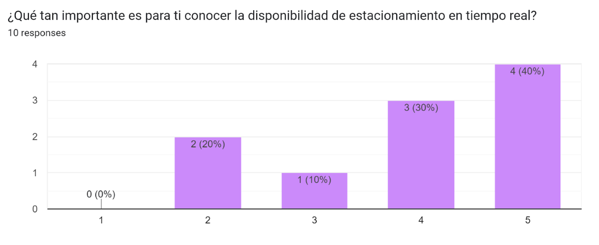
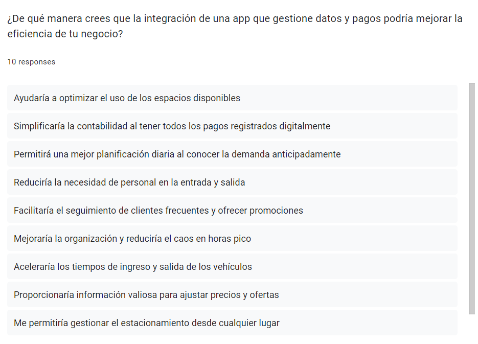

# **COURSE PROJECT** 

  

<strong>Universidad Peruana de Ciencias Aplicadas</strong>

<strong>Ingeniería de Software</strong> 
Desarrollo de Aplicaciones Móviles - NRC: 346  
Ciclo: 6to  
<strong>Profesor:</strong> Jorge Luis Mayta Guillermo

<h2 align="center">INFORME</h2>

<h3 align="center">Startup: Code Mondoguito</h3>

<strong>Producto: ParkingNow</strong>

<h3 align="center">Team Members:</h3>

| **Member**              | **Code** |
| ----------------------------- | -------------- |
| Diego Alonso Cacho Seminario  | U202223990     |
| Rodrigo Liberato Saldaña     | U202215623     |
| Samuel Elias Molina Asencios  | U20191A456     |
| Omar Harold Rivera Ticllacuri | U202214214     |
| Diego Ulises Soto Quispe      | U2022144778    |

<strong>Abril 2025</strong>

# Registro de Versiones del Informe
| Versión | Fecha      | Autor(es) | Descripción de la modificación |
| ------- | ---------- | --------- | ------------------------------ |
| TB1     |            |           |                                |
| TP1     |            |           |                                |
| TB2     |            |           |                                |
| TF1     |            |           |                                |

# Project Report Collaboration Insights

TB1: Las tareas asignadas para la entrega TB1 se han completado y están documentadas en el siguiente repositorio de GitHub perteneciente a la organización del equipo: [Repositorio GitHub](https://github.com/UPC-PRE-SI729-SW54-Code-Mondonguito/Report). (https://github.com/UPC-PRE-SI729-SW54-Code-Mondonguito/Report)

Durante la preparación del informe, se llevaron a cabo las siguientes actividades:

- Se escribieron y diagramaron los contenidos asignados a cada miembro en formato Markdown, seguido de commits para asegurar el progreso en el repositorio.
- Se crearon los artefactos necesarios utilizando las herramientas recomendadas y se obtuvieron enlaces de imagen a través de la carpeta `Assets` en la rama `develop` del repositorio del informe.
- Se organizaron reuniones para coordinar el progreso de los elementos del informe y para comunicar los avances del Sprint 1, que se enfoca en la Landing Page.

TP1: Durante la preparación del informe, se llevaron a cabo las siguientes actividades:

- Se escribieron y diagramaron los contenidos asignados a cada miembro en formato Markdown, seguido de commits para asegurar el progreso en el repositorio.
- Se crearon los artefactos necesarios utilizando las herramientas recomendadas y se obtuvieron enlaces de imagen a través de la carpeta `Assets` en la rama `develop` del repositorio del informe.
- Se organizaron reuniones para coordinar el progreso de los elementos del informe y para comunicar los avances del Sprint 2, que se enfoca en el front-end de la aplicación web.
  

 TB2: Avances del Sprint 3 en el proyecto ParkingNow

Las tareas asignadas para la entrega del Sprint 3 se han completado y están documentadas en el repositorio de GitHub perteneciente a la organización del equipo: https://github.com/UPC-PRE-SI729-SW54-Code-Mondonguito

Durante la preparación del informe, se llevaron a cabo las siguientes actividades:

- **Implementación de Endpoints en Bounded Contexts**: Cada miembro del equipo desarrolló los endpoints correspondientes a los bounded contexts designados previamente en el sprint backlog 3. Estos contexts incluyen módulos clave del backend como el manejo de reservas, transacciones, alertas, asesorías y la administración de usuarios y conductores.
- **Creación y Documentación de Artefactos**: Se generaron los artefactos necesarios utilizando las herramientas recomendadas, y se obtuvieron enlaces de imagen a través de la carpeta `assets` en la rama `develop` del repositorio del informe. Estos artefactos incluyen diagramas de clases, capturas de pantalla de la estructura del backend, y documentación de servicios web.
- **Reuniones de Coordinación**: Se organizaron reuniones regulares para coordinar el progreso de los elementos del informe y comunicar los avances del Sprint 3, que se enfocó en el backend de la aplicación web. Durante estas reuniones, se discutieron temas como la implementación de la arquitectura CLEAN, la integración de CQRS y la separación de servicios en el backend.

TF: Tareas y Actividades Realizadas para la Entrega TF

Las actividades asignadas para la entrega TF han sido completadas exitosamente y están registradas en el repositorio oficial de GitHub asociado al equipo: https://github.com/UPC-PRE-SI729-SW54-Code-Mondonguito

### Actividades Realizadas

- Cada integrante del equipo fue responsable de implementar los endpoints correspondientes a los módulos establecidos en el backlog del sprint 4. Asimismo, se añadieron endpoints adicionales necesarios para alinear las funcionalidades con las necesidades de la web application.
- Se generaron y documentaron los artefactos requeridos utilizando las herramientas recomendadas. Estos artefactos, incluyendo diagramas y recursos visuales, fueron organizados y almacenados en la carpeta `assets` de la rama `develop` del repositorio.
- Se llevaron a cabo reuniones periódicas para coordinar los avances del proyecto, revisar los elementos del informe y comunicar el progreso alcanzado durante el sprint 4, enfocado en el desarrollo del backend de la aplicación web.

# ABET – EAC - Student Outcome 3

Criterio: Capacidad de comunicarse efectivamente con un rango de audiencias. En el
siguiente cuadro se describen las acciones realizadas y enunciados de conclusiones
por parte del grupo, que permiten sustentar el haber alcanzado el logro del ABET –
EAC - Student Outcome 3.
### ABET – EAC - Resultado del Estudiante 3

| Criterio específico | Acciones realizadas | Conclusiones |
| ------------------- | ------------------- | ------------ |
| **Comunica oralmente con efectividad a diferentes rangos de audiencia** | **TB1:**  **TP:**  **TB2:**  **TF:** | **TB1:**  **TP:**  **TB2:**  **TF:** |
| **Comunica por escrito con efectividad a diferentes rangos de audiencia** | **TB1:**  **TP:**  **TB2:**  **TF:** | **TB1:**  **TP:**  **TB2:**  **TF:** |

# Contenido

- [Registro de Versiones del Informe](#registro-de-versiones-del-informe)
- [Project Report Collaboration Insights](#project-report-collaboration-insights)
- [Student Outcome](#student-outcome)

## Capítulo I: Introducción

- [1.1. Startup Profile](#11-startup-profile)  
  - [1.1.1. Descripción de la Startup](#111-descripción-de-la-startup)  
  - [1.1.2. Perfiles de integrantes del equipo](#112-perfiles-de-integrantes-del-equipo)  
- [1.2. Solution Profile](#12-solution-profile)  
  - [1.2.1. Antecedentes y problemática](#121-antecedentes-y-problemática)  
  - [1.2.2. Lean UX Process](#122-lean-ux-process)  
    - [1.2.2.1. Lean UX Problem Statements](#1221-lean-ux-problem-statements)  
    - [1.2.2.2. Lean UX Assumptions](#1222-lean-ux-assumptions)  
    - [1.2.2.3. Lean UX Hypothesis Statements](#1223-lean-ux-hypothesis-statements)  
    - [1.2.2.4. Lean UX Canvas](#1224-lean-ux-canvas)  
- [1.3. Segmentos objetivo](#13-segmentos-objetivo)

## Capítulo II: Requirements Elicitation & Analysis

- [2.1. Competidores](#21-competidores)  
  - [2.1.1. Análisis competitivo](#211-análisis-competitivo)  
  - [2.1.2. Estrategias y tácticas frente a competidores](#212-estrategias-y-tácticas-frente-a-competidores)  
- [2.2. Entrevistas](#22-entrevistas)  
  - [2.2.1. Diseño de entrevistas](#221-diseño-de-entrevistas)  
  - [2.2.2. Registro de entrevistas](#222-registro-de-entrevistas)  
  - [2.2.3. Análisis de entrevistas](#223-análisis-de-entrevistas)  
- [2.3. Needfinding](#23-needfinding)  
  - [2.3.1. User Personas](#231-user-personas)  
  - [2.3.2. User Task Matrix](#232-user-task-matrix)  
  - [2.3.3. User Journey Mapping](#233-user-journey-mapping)  
  - [2.3.4. Empathy Mapping](#234-empathy-mapping)  
  - [2.3.5. As-is Scenario Mapping](#235-as-is-scenario-mapping)  
- [2.4. Ubiquitous Language](#24-ubiquitous-language)

## Capítulo III: Requirements Specification

- [3.1. To-Be Scenario Mapping](#31-to-be-scenario-mapping)  
- [3.2. User Stories](#32-user-stories)  
- [3.3. Impact Mapping](#33-impact-mapping)  
- [3.4. Product Backlog](#34-product-backlog)

## Capítulo IV: Solution Software Design

- [4.1. Strategic-Level Domain-Driven Design](#41-strategic-level-domain-driven-design)  
  - [4.1.1. EventStorming](#411-eventstorming)  
    - [4.1.1.1. Candidate Context Discovery](#4111-candidate-context-discovery)  
    - [4.1.1.2. Domain Message Flows Modeling](#4112-domain-message-flows-modeling)  
    - [4.1.1.3. Bounded Context Canvases](#4113-bounded-context-canvases)  
  - [4.1.2. Context Mapping](#412-context-mapping)  
  - [4.1.3. Software Architecture](#413-software-architecture)  
    - [4.1.3.1. Software Architecture Context Level Diagrams](#4131-software-architecture-context-level-diagrams)  
    - [4.1.3.2. Software Architecture Container Level Diagrams](#4132-software-architecture-container-level-diagrams)  
    - [4.1.3.3. Software Architecture Deployment Diagrams](#4133-software-architecture-deployment-diagrams)  
- [4.2. Tactical-Level Domain-Driven Design](#42-tactical-level-domain-driven-design)  
  - [4.2.X. Bounded Context: <Bounded Context Name>](#42x-bounded-context-bounded-context-name)  
    - [4.2.X.1. Domain Layer](#42x1-domain-layer)  
    - [4.2.X.2. Interface Layer](#42x2-interface-layer)  
    - [4.2.X.3. Application Layer](#42x3-application-layer)  
    - [4.2.X.4. Infrastructure Layer](#42x4-infrastructure-layer)  
    - [4.2.X.5. Bounded Context Software Architecture Component Level Diagrams](#42x5-bounded-context-software-architecture-component-level-diagrams)  
    - [4.2.X.6. Bounded Context Software Architecture Code Level Diagrams](#42x6-bounded-context-software-architecture-code-level-diagrams)  
    - [4.2.X.6.1. Bounded Context Domain Layer Class Diagrams](#42x61-bounded-context-domain-layer-class-diagrams)  
    - [2.6.X.6.2. Bounded Context Database Design Diagram](#26x62-bounded-context-database-design-diagram)

## Capítulo V: Solution UI/UX Design

- [5.1. Product Design](#51-product-design)  
  - [5.1.1. Style Guidelines](#511-style-guidelines)  
    - [5.1.1.1. General Style Guidelines](#5111-general-style-guidelines)  
  - [5.1.2. Information Architecture](#512-information-architecture)  
    - [5.1.2.1. Organization Systems](#5121-organization-systems)  
    - [5.1.2.2. Labelling Systems](#5122-labelling-systems)  
    - [5.1.2.3. SEO Tags and Meta Tags](#5123-seo-tags-and-meta-tags)  
    - [5.1.2.4. Searching Systems](#5124-searching-systems)  
    - [5.1.2.5. Navigation Systems](#5125-navigation-systems)  
  - [5.1.3. Landing Page UI Design](#513-landing-page-ui-design)  
    - [5.1.3.1. Landing Page Wireframe](#5131-landing-page-wireframe)  
    - [5.1.3.2. Landing Page Mock-up](#5132-landing-page-mock-up)  
  - [5.1.4. Mobile Applications UX/UI Design](#514-mobile-applications-uxui-design)  
    - [5.1.4.1. Mobile Applications Wireframes](#5141-mobile-applications-wireframes)  
    - [5.1.4.2. Mobile Applications Wireflow Diagrams](#5142-mobile-applications-wireflow-diagrams)  
    - [5.1.4.3. Mobile Applications Mock-ups](#5143-mobile-applications-mock-ups)  
    - [5.1.4.4. Mobile Applications User Flow Diagrams](#5144-mobile-applications-user-flow-diagrams)  
    - [5.1.4.5. Mobile Applications Prototyping](#5145-mobile-applications-prototyping)

## Capítulo VI: Product Implementation, Validation & Deployment

- [6.1. Software Configuration Management](#61-software-configuration-management)  
  - [6.1.1. Software Development Environment Configuration](#611-software-development-environment-configuration)  
  - [6.1.2. Source Code Management](#612-source-code-management)  
  - [6.1.3. Source Code Style Guide & Conventions](#613-source-code-style-guide--conventions)  
  - [6.1.4. Software Deployment Configuration](#614-software-deployment-configuration)  
- [6.2. Landing Page & Mobile Application Implementation](#62-landing-page--mobile-application-implementation)  
  - [6.2.X. Sprint n](#62x-sprint-n)  
    - [6.2.X.1. Sprint Planning n](#62x1-sprint-planning-n)  
    - [6.2.X.2. Sprint Backlog n](#62x2-sprint-backlog-n)  
    - [6.2.X.3. Development Evidence for Sprint Review](#62x3-development-evidence-for-sprint-review)  
    - [6.2.X.4. Testing Suite Evidence for Sprint Review](#62x4-testing-suite-evidence-for-sprint-review)  
    - [6.2.X.5. Execution Evidence for Sprint Review](#62x5-execution-evidence-for-sprint-review)  
    - [6.2.X.6. Services Documentation Evidence for Sprint Review](#62x6-services-documentation-evidence-for-sprint-review)  
    - [6.2.X.7. Software Deployment Evidence for Sprint Review](#62x7-software-deployment-evidence-for-sprint-review)  
    - [6.2.X.8. Team Collaboration Insights during Sprint](#62x8-team-collaboration-insights-during-sprint)  
- [6.3. Validation Interviews](#63-validation-interviews)  
  - [6.3.1. Diseño de Entrevistas](#631-diseño-de-entrevistas)  
  - [6.3.2. Registro de Entrevistas](#632-registro-de-entrevistas)  
  - [6.3.3. Evaluaciones según heurísticas](#633-evaluaciones-según-heurísticas)  
- [6.4. Video About-the-Product](#64-video-about-the-product)

- [Conclusiones](#conclusiones)

  - [Conclusiones y recomendaciones](#conclusiones-y-recomendaciones)
  - [Video About-the-Team](#video-about-the-team)
- [Bibliografía](#bibliografía)
- [Anexos](#anexos)

## Capítulo I: Introducción

### 1.1. StartUp Profile

### 1.1.1. Descripción de la Startup

#### 1.1.2. Perfiles de integrantes del equipo
| **Integrantes**                                                      | **Descripción**                                                                                                                                                                                                                                                                                                                                                                                                                                                     | **Conocimientos**                                                                              |
| -------------------------------------------------------------------- | --------------------------------------------------------------------------------------------------------------------------------------------------------------------------------------------------------------------------------------------------------------------------------------------------------------------------------------------------------------------------------------------------------------------------------------------------------------------- | ---------------------------------------------------------------------------------------------------- |
|   Diego Ulises Soto Quispe  | Soy estudiante de 5to ciclo en la carrera de Ingeniería de Software. Soy responsable en las labores que se asignan y puntual con los trabajos por entregar, fuera del mundo de programación, me gusta jugar basquet, salir a pasear, jugar videojuegos y manejar en bicicleta.                                                                                                                                                 | HTML, Base de datos en SQL Server, C++, Python, NoSQL, JSON                                          |
|                                                                      |                                                                                                                                                                                                                                                                                                                                                                                                                                                                     |                                                                                                      |
|                                                                      |                                                                                                                                                                                                                                                                                                                                                                                                                                                                     |                                                                                                      |
|                                                                      |                                                                                                                                                                                                                                                                                                                                                                                                                                                                     |                                                                                                      |
|                                                                      |                                                                                                                                                                                                                                                                                                                                                                                                                                                                     |                                                                                                      |

### 1.2. Solution Profile

### 1.2.1. Antecedentes y problemática

### 1.2.2. Lean UX Process

#### 1.2.2.1. Lean UX Problem Statements

#### 1.2.2.2. Lean UX Assumptions

**Users:**

#### 1.2.2.3. Lean UX Hypothesis Statements

##### 1.2.2.4. Lean UX Canvas

### 1.3. Segmentos objetivo

## Capítulo II: Requirements Elicitation & Analysis

### 2.1. Competidores

**Parkimeter:**

Parkimeter es una plataforma en línea que ofrece servicios relacionados con el estacionamiento y la gestión de plazas de aparcamiento. La plataforma permite a los usuarios buscar, comparar y reservar plazas de estacionamiento en diferentes ubicaciones. Además de la reserva de plazas de estacionamiento, Parkimeter también proporciona información sobre tarifas de estacionamiento, disponibilidad en tiempo real y otras características útiles para ayudar a los conductores a encontrar y gestionar el estacionamiento de manera más conveniente.

**ElParking**

ElParking permite a los usuarios encontrar, reservar y pagar por estacionamiento a través de su plataforma. La aplicación brinda información en tiempo real acerca de sitios de estacionamiento cercanos quitando un peso de los hombros del consumidor, los conductores. Además, tiene la increíble funcionalidad de seguimiento de multas, pagos en parquímetros, etc.

**Aparcados**

Aparcados permite a los conductores encontrar estacionamientos dependiendo de lo que buscan, optimizando así el proceso de estacionamiento en áreas urbanas La app posee también posee una página web, pero la versión en móviles es la más usada hasta el momento, con una interfaz llamativa para todos los usuarios.

#### 2.1.1. Análisis competitivo

A continuacion, se presentara la tabla de competidores para analizar cada punto especifico de algunos competidores más resaltantes al rededor del mundo. Con esto lograremos adecuarnos a lo que nuestro segmento objetivo quiere.
| **Competitive Analysis Landscape**                              |                                                                                                                              |
|-----------------------------------------------------------------|------------------------------------------------------------------------------------------------------------------------------|
| **¿Por qué llevar a cabo este análisis?**                       | **Escriba en el recuadro la pregunta que busca responder o el objetivo de este análisis.**                                    |
|                                                                 | **Identificar cómo PARKINGNOW se posiciona frente a sus competidores en términos de servicios ofrecidos, ventajas competitivas y estrategias de mercado para mejorar nuestra propuesta de valor y captar más clientes.** |

| ***Competidor***          || ParkingNow| Parkimeter| ElParking| Aparcados|
| ------------------- | ----------------------------------------------------- | ------------------------------------------------------------------------------------------------------------------------------------------------------------------------------------------------------------------------------------------------------------------------------------------------------- |--------------------------------------------------------------------------------------------------------------------------------------------------------------------------------------------------------------------------------|-----------------------------------------------------------------------------------------------------------------------------------------------------------------------------------------------------------------------------------------------------------------------------------------------------------------------------|------------------------------------------------------------------------------------------------------------------------------------------------------------------------------------------------------------------------------------------|
| ***Logo***| | | ||
| ***Perfil***| Overview| Es una aplicacion web que brinda la posibilidad de reservar espacios de estacionamiento en múltiples ciudades ademas que brinda la conexion entre los consumidores y dueños de estacionamientos| Es una aplicacion web y movil que ofrece servicios de reserva de plazas de aparcamiento en  diversas ciudades de Europa y América Latina| Es una aplicacion web y movil que ofrece servicios de reserva de plazas de aparcamiento en  diversas ciudades de Europa y América Latina| Es una aplicacion web y movil que ofrece servicios de reserva de plazas de aparcamiento en diversas ciudades de España principalmente, pero expandiéndose alrededor del mundo|
|| ***Ventaja competitiva ¿Qué valor ofrece a los clientes?*** | Cancelación gratuita hasta con 24 horas de antelación de la reserva, inclusion de un sensor para el automovil y ser el puente entre los consumidores y dueños de playas de estacionamientos en zonas urbanas| Ofrece descuentos de hasta el 70% y no cobra gastos de gestión | Permite más que solo pagar estacionamientos, sino gestionar multas y pagar parquímetros| La app incluye geolocalización y ofrece notificaciones a tiempo real|
| ***Perfil de Marketing*** | ***Mercado objetivo***| Personas que buscaban soluciones de estacionamiento en áreas urbanas congestionadas y personas dueñas de estacionamientos de playas.| Personas que buscaban soluciones de estacionamiento en áreas urbanas congestionadas| Personas que buscaban soluciones de estacionamiento en áreas urbanas congestionadas| Personas que buscaban soluciones de estacionamiento en áreas urbanas congestionadas|
|| ***Estrategias de marketing***| Utiliza publicidad en línea a través de plataformas y redes sociales| Utiliza publicidad en línea a través de plataformas y redes sociales |Utiliza publicidad en línea, redes sociales y reciben promociones de influencers| Utiliza publicidad en línea a través de plataformas y redes sociales  |
| ***Perfil de Producto*** | ***Productos & Servicios***| Ofrece una serie de servicios relacionados con la reserva de plazas de aparcamiento en áreas urbanas y otros destinos. |Realizar servicios de parking en todo el territorio español y otras grandes ciudades del mundo | Ofrece una serie de servicios relacionados con la reserva de plazas de aparcamiento en ciudades concurridas, seguimiento de multas y pagos sencillos. | Ofrece una serie de servicios relacionados con la reserva de plazas de aparcamiento en áreas urbanas y otros destinos |
|| ***Precios & Costos***| La plataforma es gratuita, pero se debe pagar las tarifas de estacionamiento correspondientes |La plataforma es gratuita, pero se debe pagar las tarifas de estacionamiento correspondientes y las suscripciones VIP. | La plataforma es gratuita pero se debe pagar las tarifas de estacionamiento, además de la existencia de tarifas especiales o descuentos | La plataforma es gratuita, pero se debe pagar las tarifas de estacionamiento correspondientes. |
|| ***Canales de distribución (Web y/o Móvil)***| Web| Web/Móvil| Web/Móvil| Web/Movil|
| ***Análisis SWOT***       | ***Fortalezas***| Implementa sensores de estacionamiento en los estacionamientos asociados, un objetivo más amplio que otras aplicaciones y soporte en tiempo real para los consumidores| Parkimeter opera en múltiples ciudades de Europa y América Latina |ElParking implementa seguimiento de multas y pagos a parte de los estacionamientos | Aparcados opera en múltiples ciudades de Europa y Asia|
|| ***Debilidades***| La industria de reserva de estacionamientos en línea es muy competitiva . | Varias empresas que proporcionan servicios similares | La industria de reserva de estacionamientos en línea es muy competitiva. | Varias empresas que proporcionan servicios similares. |
|| ***Oportunidades***| A medida que las ciudades sigan creciendo, la demanda de servicios de reserva podría aumentar |La congestión del tráfico se vuelve más común, eso provocaría una alta demanda en la reserva de estacionamientos | En su país de origen, España, las personas en zonas urbanas van a tener que aprender más acerca de la app para poder vivir en comodidad. | Tiene grandes posibilidades de expandir su mercado aun enfocándose en la reserva de estacionamientos en América Latina |
|| ***Amenazas***| Cambios en las políticas de movilidad urbana.|Nuevas startups compitiendo por la misma base de usuarios.|Nuevas startups compitiendo por la misma base de usuarios. | Nuevas startups compitiendo por la misma base de usuarios. |

#### 2.1.1. Análisis competitivo

A continuacion, se presentara la tabla de competidores para analizar cada punto especifico de algunos competidores más resaltantes al rededor del mundo. Con esto lograremos adecuarnos a lo que nuestro segmento objetivo quiere.

| **Competitive Analysis Landscape**           |                                                                                                                                                                                                                                   |
| -------------------------------------------------- | --------------------------------------------------------------------------------------------------------------------------------------------------------------------------------------------------------------------------------- |
| **¿Por qué llevar a cabo este análisis?** | **Escriba en el recuadro la pregunta que busca responder o el objetivo de este análisis.**                                                                                                                                 |
|                                                    | **Identificar cómo PARKINGNOW se posiciona frente a sus competidores en términos de servicios ofrecidos, ventajas competitivas y estrategias de mercado para mejorar nuestra propuesta de valor y captar más clientes.** |

| ***Competidor***          |                                                                       | ParkingNow                                                                                                                                                                                                      | Parkimeter                                                                                                                                 | ElParking                                                                                                                                             | Aparcados                                                                                                                                                                       |
| --------------------------------- | --------------------------------------------------------------------- | --------------------------------------------------------------------------------------------------------------------------------------------------------------------------------------------------------------- | ------------------------------------------------------------------------------------------------------------------------------------------ | ----------------------------------------------------------------------------------------------------------------------------------------------------- | ------------------------------------------------------------------------------------------------------------------------------------------------------------------------------- |
| ***Logo***                |                                                                       |                                                                                                                                                                           |                                                                                                          |                                                                                                                       |                                                                                                                                                 |
| ***Perfil***              | Overview                                                              | Es una aplicacion web que brinda la posibilidad de reservar espacios de estacionamiento en múltiples ciudades ademas que brinda la conexion entre los consumidores y dueños de estacionamientos               | Es una aplicacion web y movil que ofrece servicios de reserva de plazas de aparcamiento en  diversas ciudades de Europa y América Latina | Es una aplicacion web y movil que ofrece servicios de reserva de plazas de aparcamiento en  diversas ciudades de Europa y América Latina            | Es una aplicacion web y movil que ofrece servicios de reserva de plazas de aparcamiento en diversas ciudades de España principalmente, pero expandiéndose alrededor del mundo |
|                                   | ***Ventaja competitiva ¿Qué valor ofrece a los clientes?*** | Cancelación gratuita hasta con 24 horas de antelación de la reserva, inclusion de un sensor para el automovil y ser el puente entre los consumidores y dueños de playas de estacionamientos en zonas urbanas | Ofrece descuentos de hasta el 70% y no cobra gastos de gestión                                                                            | Permite más que solo pagar estacionamientos, sino gestionar multas y pagar parquímetros                                                             | La app incluye geolocalización y ofrece notificaciones a tiempo real                                                                                                           |
| ***Perfil de Marketing*** | ***Mercado objetivo***                                        | Personas que buscaban soluciones de estacionamiento en áreas urbanas congestionadas y personas dueñas de estacionamientos de playas.                                                                          | Personas que buscaban soluciones de estacionamiento en áreas urbanas congestionadas                                                       | Personas que buscaban soluciones de estacionamiento en áreas urbanas congestionadas                                                                  | Personas que buscaban soluciones de estacionamiento en áreas urbanas congestionadas                                                                                            |
|                                   | ***Estrategias de marketing***                                | Utiliza publicidad en línea a través de plataformas y redes sociales                                                                                                                                          | Utiliza publicidad en línea a través de plataformas y redes sociales                                                                     | Utiliza publicidad en línea, redes sociales y reciben promociones de influencers                                                                     | Utiliza publicidad en línea a través de plataformas y redes sociales                                                                                                          |
| ***Perfil de Producto***  | ***Productos & Servicios***                                   | Ofrece una serie de servicios relacionados con la reserva de plazas de aparcamiento en áreas urbanas y otros destinos.                                                                                         | Realizar servicios de parking en todo el territorio español y otras grandes ciudades del mundo                                            | Ofrece una serie de servicios relacionados con la reserva de plazas de aparcamiento en ciudades concurridas, seguimiento de multas y pagos sencillos. | Ofrece una serie de servicios relacionados con la reserva de plazas de aparcamiento en áreas urbanas y otros destinos                                                          |
|                                   | ***Precios & Costos***                                        | La plataforma es gratuita, pero se debe pagar las tarifas de estacionamiento correspondientes                                                                                                                   | La plataforma es gratuita, pero se debe pagar las tarifas de estacionamiento correspondientes y las suscripciones VIP.                     | La plataforma es gratuita pero se debe pagar las tarifas de estacionamiento, además de la existencia de tarifas especiales o descuentos              | La plataforma es gratuita, pero se debe pagar las tarifas de estacionamiento correspondientes.                                                                                  |
|                                   | ***Canales de distribución (Web y/o Móvil)***               | Web                                                                                                                                                                                                             | Web/Móvil                                                                                                                                 | Web/Móvil                                                                                                                                            | Web/Movil                                                                                                                                                                       |
| ***Análisis SWOT***      | ***Fortalezas***                                              | Implementa sensores de estacionamiento en los estacionamientos asociados, un objetivo más amplio que otras aplicaciones y soporte en tiempo real para los consumidores                                         | Parkimeter opera en múltiples ciudades de Europa y América Latina                                                                        | ElParking implementa seguimiento de multas y pagos a parte de los estacionamientos                                                                    | Aparcados opera en múltiples ciudades de Europa y Asia                                                                                                                         |
|                                   | ***Debilidades***                                             | La industria de reserva de estacionamientos en línea es muy competitiva .                                                                                                                                      | Varias empresas que proporcionan servicios similares                                                                                       | La industria de reserva de estacionamientos en línea es muy competitiva.                                                                             | Varias empresas que proporcionan servicios similares.                                                                                                                           |
|                                   | ***Oportunidades***                                           | A medida que las ciudades sigan creciendo, la demanda de servicios de reserva podría aumentar                                                                                                                  | La congestión del tráfico se vuelve más común, eso provocaría una alta demanda en la reserva de estacionamientos                      | En su país de origen, España, las personas en zonas urbanas van a tener que aprender más acerca de la app para poder vivir en comodidad.           | Tiene grandes posibilidades de expandir su mercado aun enfocándose en la reserva de estacionamientos en América Latina                                                        |
|                                   | ***Amenazas***                                                | Cambios en las políticas de movilidad urbana.                                                                                                                                                                  | Nuevas startups compitiendo por la misma base de usuarios.                                                                                 | Nuevas startups compitiendo por la misma base de usuarios.                                                                                            | Nuevas startups compitiendo por la misma base de usuarios.                                                                                                                      |

#### 2.1.2. Estrategias y tácticas frente a competidores

A continuacion, encontraremos la tabla de Matriz de FODA y C.A.M.E para poder analisar nuestrar estrategias a futuro para competir contra los competidores anteriormente mencionados.

| ***MATRIZ FODA y C.A.M.E***|**Oportunidades:** La demanda de este servicio aumenta bastante con los años | **Amenazas:** Cambios en la politica de mobilidad urbana|
|---|---|---|
|**Fortalezas:** Innovacion, publico objetivo más amplio y soporte en tiempo real para los consumidores| La estrategia que podemos tomar en este caso seria la de dar el mejor soporte a los consumidores para que no vayan a otras aplicaciones, además que nuestra propuesta de sensores es algo poco visto que las personas encontraran llamativo y estaran dispuestos a aprender de ello. | Preveer todos estos posibles cambios en la politica gracias a un analisis más amplio de acuerdo al tema |
|**Debilidades:** Mercado competitivo y nuevo | Aumentar la promocion de nuestra app y promocionar nuestra innovacion para que los usuarios puedan validarnos como la mejor opcion del mercado.  | Si bien, las politicas pueden afectarnos, a los otros competidores tambien, podemos diseñas campañas de marketing enfocadas a que lo que hacemos no necesita un cambio en la politica de la mobilidad urbana, sino, que mejoramos la gestion de esta en distintos lugares del pais.  |

### 2.2. Entrevistas

Esta sección se centra en la recopilación de información mediante entrevistas a representantes de los segmentos objetivo, con el fin de entender sus necesidades y expectativas en relación al servicio.

#### 2.2.1. Diseño de entrevistas

Incluye la elaboración de preguntas principales y complementarias dirigidas a cada segmento, considerando aspectos demográficos, características de personalidad y preferencias tecnológicas para construir perfiles precisos de los usuarios.

**Segmento objetivo \#1: Conductores Urbanos Frecuentes**

**Preguntas demográficas:**

-  ¿Cuál es tu nombre?
- ¿Cuál es tu edad?
-  ¿Dónde vives?
-  ¿A qué te dedicas?
-  ¿Cuáles consideras que son tus principales habilidades?

**Preguntas principales:**

* ¿Con qué frecuencia necesitas estacionamiento en la ciudad?  
* ¿Cuánto tiempo dedicas normalmente a buscar estacionamiento?  
* ¿Utilizas actualmente alguna aplicación o servicio para encontrar estacionamiento?  
* ¿Qué tan importante es para ti conocer la disponibilidad de estacionamiento en tiempo real?  
* ¿Estarías dispuesto/a a pagar una tarifa adicional por garantizar un espacio de estacionamiento reservado?  
* ¿Qué consideras más importante al elegir un estacionamiento: costo, proximidad, o seguridad?  

- ¿Cuál es tu nombre?
- ¿Cuál es tu edad?
- ¿Dónde vives?
- ¿A qué te dedicas?
- ¿Cuáles consideras que son tus principales habilidades?

**Preguntas principales:**

* ¿Con qué frecuencia necesitas estacionamiento en la ciudad?
* ¿Cuánto tiempo dedicas normalmente a buscar estacionamiento?
* ¿Utilizas actualmente alguna aplicación o servicio para encontrar estacionamiento?
* ¿Qué tan importante es para ti conocer la disponibilidad de estacionamiento en tiempo real?
* ¿Estarías dispuesto/a a pagar una tarifa adicional por garantizar un espacio de estacionamiento reservado?
* ¿Qué consideras más importante al elegir un estacionamiento: costo, proximidad, o seguridad?

* ¿Te gustaría recibir recomendaciones de rutas hacia el estacionamiento más cercano basado en el tráfico en tiempo real?

**Preguntas complementarias:**

* ¿Has tenido experiencias frustrantes buscando estacionamiento en la ciudad?  

* ¿Has tenido experiencias frustrantes buscando estacionamiento en la ciudad?
main
* ¿Qué mejoras te gustaría ver en los servicios de estacionamiento que utilizas actualmente?

**Segmento objetivo \#2: Dueños de playas de estacionamientos**

**Preguntas demográficas:**

-  ¿Cuál es tu nombre?
- ¿Cuál es tu edad?
-  ¿Dónde vives?
-  ¿A qué te dedicas?
-  ¿Cuáles consideras que son tus principales habilidades?

**Preguntas principales:**

* ¿Consideras sencillo el proceso de gestionamiento de espacios en tu estacionamiento?  
* ¿Qué tan importante es para ti contar con información en tiempo real sobre los espacios disponibles?  
* ¿Utilizas algún sistema digital para administrar los pagos y reservas de los espacios de estacionamiento?  
* ¿Qué beneficios ves en la posibilidad de automatizar el proceso de reserva y pago de los espacios de estacionamiento?  
* ¿Qué tan relevante es para ti ofrecer opciones de pago seguras y rápidas a tus clientes?  

- ¿Cuál es tu nombre?
- ¿Cuál es tu edad?
- ¿Dónde vives?
- ¿A qué te dedicas?
- ¿Cuáles consideras que son tus principales habilidades?

**Preguntas principales:**

* ¿Consideras sencillo el proceso de gestionamiento de espacios en tu estacionamiento?
* ¿Qué tan importante es para ti contar con información en tiempo real sobre los espacios disponibles?
* ¿Utilizas algún sistema digital para administrar los pagos y reservas de los espacios de estacionamiento?
* ¿Qué beneficios ves en la posibilidad de automatizar el proceso de reserva y pago de los espacios de estacionamiento?
* ¿Qué tan relevante es para ti ofrecer opciones de pago seguras y rápidas a tus clientes?

* ¿De qué manera crees que la integración de una app que gestione datos y pagos podría mejorar la eficiencia de tu negocio?

**Preguntas complementarias:**

* ¿Cuáles son los principales desafíos que enfrentas al administrar tu estacionamiento?  
* ¿Qué funcionalidades adicionales te gustaría que una app ofreciera para facilitar la gestión de tu negocio?  
* ¿Te gustaría recibir reportes o análisis sobre la ocupación y rotación de vehículos en tu estacionamiento?

#### 2.2.2. Registro de entrevistas
**Segmento objetivo \#1: Conductores Urbanos Frecuentes**

**Segmento objetivo \#2: Dueños de playas de estacionamientos**

### Dueña de estacionamientos, Guillermina Asencios

A continuación, se presenta la entrevista realizada a Guillermina Asencios, dueña de estacionamientos, donde comparte sus experiencias y perspectivas sobre la gestión de espacios de estacionamiento.

<video controls width="640" height="360">
  <source src="Assets/entrevista_playa_estacionamiento.mp4" type="video/mp4">
  Tu navegador no soporta la reproducción de videos.
</video>

#### 2.2.3. Análisis de entrevistas

* ¿Cuáles son los principales desafíos que enfrentas al administrar tu estacionamiento?
* ¿Qué funcionalidades adicionales te gustaría que una app ofreciera para facilitar la gestión de tu negocio?
* ¿Te gustaría recibir reportes o análisis sobre la ocupación y rotación de vehículos en tu estacionamiento?

#### 2.2.2. Registro de entrevistas

**Segmento objetivo \#1: Conductores Urbanos Frecuentes**

**Segmento objetivo \#2: Dueños de playas de estacionamientos**

#### 2.2.3. Análisis de entrevistas

De acuerdo con la información recopilada de las entrevistas, realizamos el siguiente análisis de entrevistas:

Segmento objetivo \#1:

**Hallazgos:**

* La necesidad de estacionamiento varía: algunos lo requieren con frecuencia, mientras que otros solo ocasionalmente.  
* El tiempo dedicado a buscar estacionamiento depende de la zona.  
* No se utilizan aplicaciones para encontrar estacionamiento.  
* Es muy importante conocer la disponibilidad de estacionamiento antes de llegar.  
* Se está dispuesto a pagar tarifas adicionales para reservar un espacio, siempre y cuando estas no sean demasiado altas.  
* Factores como el costo, la proximidad y la seguridad son clave al elegir un lugar para estacionar.  
* Existen frustraciones comunes relacionadas con la búsqueda de estacionamiento, como perder un espacio o encontrar lugares inadecuados.  
* Se desea recibir recomendaciones de rutas para ahorrar tiempo y la opción de que alguien estacione el auto por uno.  
* Se valoran los avisos en tiempo real sobre la liberación de espacios cercanos y las notificaciones sobre movimientos sospechosos en el área de estacionamiento.

Segmento objetivo \#2: 

**Hallazgos:**

* La gestión de los estacionamientos es generalmente sencilla debido a la baja cantidad de espacios, pero la organización y el manejo del tiempo pueden ser complicados.  
* Es importante contar con información en tiempo real sobre la disponibilidad de los espacios para evitar revisiones constantes del estacionamiento.  
* Se utilizan aplicaciones de pago como Yape, pero no se emplean aplicaciones para la reserva de espacios.  
* La automatización del proceso se ve como una solución clave para ahorrar tiempo, evitar llamadas innecesarias y mejorar la organización de pagos.  
* La seguridad es crucial tanto para los clientes como para los dueños, especialmente cuando los espacios se encuentran en áreas residenciales.  
* Se valora la posibilidad de acceder a información importante de los clientes (como nombre y teléfono) para garantizar mayor seguridad.

**Conclusiones de ambos segmentos:**

Los resultados del **segmento 1** indican que, aunque las necesidades de estacionamiento varían en frecuencia, hay un consenso en la importancia de conocer la disponibilidad de espacios antes de llegar. La disposición a pagar tarifas adicionales es alta, siempre que estas sean razonables. Los factores de costo, proximidad y seguridad son cruciales al elegir un lugar para estacionar. Existen frustraciones comunes con la búsqueda de estacionamiento, y se valora la tecnología para mejorar la experiencia, como recibir avisos en tiempo real y recomendaciones de rutas. La opción de asistencia para estacionar también es deseada. Por otro lado, en el **segmento 2**, los dueños de playas de estacionamiento encuentran la gestión de pocos espacios generalmente sencilla, aunque la organización y el manejo del tiempo pueden ser desafiantes. Consideran clave contar con información en tiempo real para evitar revisiones constantes y valoran la automatización como una herramienta para ahorrar tiempo y mejorar la eficiencia en pagos. La seguridad, tanto para clientes como para ellos mismos, es esencial, especialmente en áreas residenciales, y ven útil acceder a datos relevantes de los usuarios para aumentar esa seguridad

**Entrevista completa:**

Link de las entrevistas completas: [ParkingNow \- Entrevistas Final.mp4](https://upcedupe-my.sharepoint.com/:v:/g/personal/u202223990_upc_edu_pe/EbIvmu-9HRFItJu_A2zbRx0BPfLCx2uRJnBarh-nlbO95A?nav=eyJyZWZlcnJhbEluZm8iOnsicmVmZXJyYWxBcHAiOiJTdHJlYW1XZWJBcHAiLCJyZWZlcnJhbFZpZXciOiJTaGFyZURpYWxvZy1MaW5rIiwicmVmZXJyYWxBcHBQbGF0Zm9ybSI6IldlYiIsInJlZmVycmFsTW9kZSI6InZpZXcifX0%3D&e=jlmpb3)

**Análisis por medio de herramientas estadísticas:**

Segmento objetivo 1: [https://forms.gle/Lo3Z69GnkyYDcaAYA](https://forms.gle/Lo3Z69GnkyYDcaAYA) 

**Análisis por medio de herramientas estadísticas:**

Segmento objetivo 1: [https://forms.gle/Lo3Z69GnkyYDcaAYA](https://forms.gle/Lo3Z69GnkyYDcaAYA)

Segmento objetivo 2: [https://forms.gle/pCNNRar5TBzSPoX38](https://forms.gle/pCNNRar5TBzSPoX38) 

Segmento objetivo 2: [https://forms.gle/pCNNRar5TBzSPoX38](https://forms.gle/pCNNRar5TBzSPoX38)

### 2.3. Needfinding

En esta sección se presentarán los artefactos generados a partir del proceso de recopilación llevado a cabo en los segmentos objetivos. Este proceso culmina con la creación de los User Personas, la User Task Matrix, los User Journey Maps, el Empathy Mapping y el As-Is Scenario Mapping.
#### 2.3.1. User Personas
En esta sección del documento, se presentan perfiles ficticios que representan a los grupos de interés identificados y que fueron objeto de entrevistas. La información proporcionada incluye datos demográficos, rasgos de personalidad, motivaciones, preferencias, metas, desafíos y comportamientos típicos. Estos detalles están basados en las entrevistas realizadas previamente. Se han utilizado herramientas de UXPressia para facilitar la elaboración de estos perfiles.

En esta sección se presentarán los artefactos generados a partir del proceso de recopilación llevado a cabo en los segmentos objetivos. Este proceso culmina con la creación de los User Personas, la User Task Matrix, los User Journey Maps, el Empathy Mapping y el As-Is Scenario Mapping.

### 2.3.1. User Personas

En esta sección del documento, se presentan perfiles ficticios que representan a los grupos de interés identificados y que fueron objeto de entrevistas. La información proporcionada incluye datos demográficos, rasgos de personalidad, motivaciones, preferencias, metas, desafíos y comportamientos típicos. Estos detalles están basados en las entrevistas realizadas previamente. Se han utilizado herramientas de UXPressia para facilitar la elaboración de estos perfiles.

###### User Person para Conductores Urbanos

La "User Persona" de Anna Pacheco representa a conductores urbanos que necesitan estacionamientos rápidos y eficientes cerca de sus destinos. Anna es una organizadora de eventos de 29 años, motivada por la comodidad y la rapidez en sus desplazamientos. Se frustra con la falta de disponibilidad de estacionamientos y busca soluciones prácticas y transparentes.

###### User Person para Dueños de playa de estacionamientos

La "User Persona" de Luis Cordova representa a propietarios de estacionamientos interesados en mejorar la gestión y aumentar ingresos. Luis, de 26 años y dueño de un estacionamiento, utiliza tecnología para optimizar la ocupación y reducir tiempos de espera. Sus objetivos incluyen la fidelización de clientes y la expansión del negocio, pero enfrenta frustraciones con problemas tecnológicos y altos costos operativos.

La "User Persona" de Luis Cordova representa a los dueños de playa de estacionamientos interesados en mejorar la gestión y aumentar ingresos. Luis, de 26 años y dueño de un estacionamiento, utiliza tecnología para optimizar la ocupación y reducir tiempos de espera. Sus objetivos incluyen la fidelización de clientes y la expansión del negocio, pero enfrenta frustraciones con problemas tecnológicos y altos costos operativos.

## 2.3.2. User Task Matrix

En el User Task Matrix hemos identificado las actividades que realizan nuestros dos segmentos y hemos evaluado la importancia de cada una de estas tareas para cada segmento.

### Indicadores de Importancia:

- ALTA
- MEDIA
- BAJA

### Indicadores de Frecuencia:

- ALTA
- MEDIA
- BAJA

### Segmento Objetivo: Conductores Urbanos Frecuentes
| **Tarea**                                           | **Frecuencia** | **Importancia**   |
|-----------------------------------------------------|----------------|--------------------|
| Buscar estacionamientos disponibles                | Media          | Alta               |
| Comparar precios de estacionamientos               | Alta           | Media              |
| Reservar estacionamientos con anticipación          | Media          | Alta               |
| Pagar por estacionamiento a través de la aplicación | Alta           | Alta               |
| Recibir direcciones al estacionamiento reservado   | Alta           | Alta               |
| Filtrar estacionamientos por criterios (precio, seguridad, etc.) | Alta           | Alta               |
| Recibir notificaciones sobre descuentos y ofertas  | Media          | Baja               |
| Verificar disponibilidad de estacionamiento en tiempo real | Alta           | Alta               |
| Consultar historial de estacionamientos utilizados | Media          | Baja               |

### Segmento Objetivo: Dueños de Estacionamientos
| **Tarea**                                           | **Frecuencia** | **Importancia**   |
|-----------------------------------------------------|----------------|--------------------|
| Administrar y actualizar la disponibilidad de espacios | Alta           | Alta               |
| Ajustar precios de los espacios de estacionamiento  | Media          | Alta               |
| Gestionar reservas de estacionamientos             | Alta           | Alta               |
| Procesar pagos de estacionamiento a través de la aplicación | Alta           | Media              |
| Revisar y ajustar las características del estacionamiento (precio, seguridad, etc.) | Media          | Alta               |
| Revisar reportes de uso y disponibilidad            | Media          | Media              |
| Recibir y gestionar comentarios y valoraciones de los usuarios | Baja           | Media              |
| Promocionar descuentos y ofertas especiales         | Media          | Media              |
| Consultar el historial de transacciones y reservas  | Baja           | Media              |

A través del User Task Matrix, podemos identificar las frecuencias e importancias entre los diferentes segmentos que presentamos y usar esta información como guía.

#### Usuarios:
Para los usuarios, las tareas que presentan mayor frecuencia son:

| **Segmento Objetivo**          | **Tarea**                                                                      | **Frecuencia** | **Importancia** |
| ------------------------------------ | ------------------------------------------------------------------------------------ | -------------------- | --------------------- |
| Conductores Urbanos Frecuentes       | Buscar estacionamientos disponibles                                                  | Media                | Alta                  |
| Conductores Urbanos Frecuentes       | Comparar precios de estacionamientos                                                 | Alta                 | Media                 |
| Conductores Urbanos Frecuentes       | Reservar estacionamientos con anticipación                                          | Media                | Alta                  |
| Conductores Urbanos Frecuentes       | Pagar por estacionamiento a través de la aplicación                                | Alta                 | Alta                  |
| Conductores Urbanos Frecuentes       | Recibir direcciones al estacionamiento reservado                                     | Alta                 | Alta                  |
| Conductores Urbanos Frecuentes       | Filtrar estacionamientos por criterios (precio, seguridad, etc.)                     | Alta                 | Alta                  |
| Conductores Urbanos Frecuentes       | Recibir notificaciones sobre descuentos y ofertas                                    | Media                | Baja                  |
| Conductores Urbanos Frecuentes       | Verificar disponibilidad de estacionamiento en tiempo real                           | Alta                 | Alta                  |
| Conductores Urbanos Frecuentes       | Consultar historial de estacionamientos utilizados                                   | Media                | Baja                  |
| Dueños de Playa de Estacionamientos | Administrar y actualizar la disponibilidad de espacios                               | Alta                 | Alta                  |
| Dueños de Playa de Estacionamientos | Ajustar precios de los espacios de estacionamiento                                   | Media                | Alta                  |
| Dueños de Playa de Estacionamientos | Gestionar reservas de estacionamientos                                               | Alta                 | Alta                  |
| Dueños de Playa de Estacionamientos | Procesar pagos de estacionamiento a través de la aplicación                        | Alta                 | Media                 |
| Dueños de Playa de Estacionamientos | Revisar y ajustar las características del estacionamiento (precio, seguridad, etc.) | Media                | Alta                  |
| Dueños de Playa de Estacionamientos | Revisar reportes de uso y disponibilidad                                             | Media                | Media                 |
| Dueños de Playa de Estacionamientos | Recibir y gestionar comentarios y valoraciones de los usuarios                       | Baja                 | Media                 |
| Dueños de Playa de Estacionamientos | Promocionar descuentos y ofertas especiales                                          | Media                | Media                 |
| Dueños de Playa de Estacionamientos | Consultar el historial de transacciones y reservas                                   | Baja                 | Media                 |

A través del User Task Matrix, podemos identificar las frecuencias e importancias entre los diferentes segmentos que presentamos y usar esta información como guía.

#### Conductores Urbanos:

Para los usuarios, las tareas que presentan mayor frecuencia son:

- Pagar por estacionamiento a través de la aplicación.
- Recibir direcciones al estacionamiento reservado.
- Filtrar estacionamientos por criterios (precio, seguridad, etc.).
- Verificar disponibilidad de estacionamiento en tiempo real.

Estas tareas son cruciales para mejorar la experiencia del usuario en la búsqueda y uso de estacionamientos.

Para los usuarios, las tareas que presentan mayor importancia son:

- Pagar por estacionamiento a través de la aplicación.
- Recibir direcciones al estacionamiento reservado.
- Filtrar estacionamientos por criterios (precio, seguridad, etc.).
- Verificar disponibilidad de estacionamiento en tiempo real.

Estas tareas son importantes porque aseguran una experiencia de estacionamiento eficiente y satisfactoria, desde la búsqueda hasta el pago y la dirección.

#### Dueños de Estacionamientos:
Para los dueños de estacionamientos, las tareas que presentan mayor frecuencia son:

#### Dueños de playa de Estacionamientos:

Para los dueños de estacionamientos, las tareas que presentan mayor frecuencia son:

- Administrar y actualizar la disponibilidad de espacios.
- Gestionar reservas de estacionamientos.
- Procesar pagos de estacionamiento a través de la aplicación.
- Revisar y ajustar las características del estacionamiento (precio, seguridad, etc.).

Estas tareas son esenciales para la gestión efectiva de sus espacios de estacionamiento y para asegurar que los usuarios tengan una experiencia positiva.

Para los dueños de estacionamientos, las tareas que presentan mayor importancia son:

- Administrar y actualizar la disponibilidad de espacios.
- Ajustar precios de los espacios de estacionamiento.
- Revisar reportes de uso y disponibilidad.
- Revisar y ajustar las características del estacionamiento (precio, seguridad, etc.).

Estas tareas son importantes porque permiten a los dueños optimizar la gestión de sus espacios y responder a las demandas del mercado de manera efectiva.

#### Diferencias:

Al analizar ambos segmentos objetivo, se observa que los usuarios están enfocados en la eficiencia y la comodidad en el proceso de estacionamiento, mientras que los dueños de estacionamientos se concentran en la gestión y optimización de sus espacios. Aunque cada segmento tiene objetivos distintos, ambos se benefician de un sistema que facilite la disponibilidad, la gestión y la experiencia de estacionamiento.

#### 2.3.3. User Journey Mapping
En esta sección, hemos creado los mapas de recorrido del usuario para cada tipo de usuario (cliente y propietario de estacionamiento). Para el cliente, el proceso comienza con la búsqueda de un espacio de estacionamiento, continúa con la selección y reserva de un espacio, el pago a través de la aplicación, y la obtención de direcciones hacia el lugar reservado. Finalmente, el cliente llega al espacio y lo utiliza. Este recorrido revela las metas, desafíos, oportunidades y pasos cruciales en su experiencia. Por otro lado, desde la perspectiva del propietario de estacionamiento, el enfoque está en gestionar la disponibilidad de espacios, ajustar los precios, procesar las reservas, y asegurarse de que el proceso de pago y uso se realice de manera fluida. El objetivo es ofrecer una experiencia satisfactoria que incentive a los clientes a recomendar el espacio y considerar al propietario como una opción confiable para futuros estacionamientos.
###### User Journey Mapping para Conductores Urbanos

Al analizar ambos segmentos objetivo, se observa que los usuarios están enfocados en la eficiencia y la comodidad en el proceso de estacionamiento, mientras que los dueños de estacionamientos se concentran en la gestión y optimización de sus espacios. Aunque cada segmento tiene objetivos distintos, ambos se benefician de un sistema que facilite la disponibilidad, la gestión y la experiencia de estacionamiento.

#### 2.3.3. User Journey Mapping

En esta sección, hemos creado los mapas de recorrido del usuario para cada tipo de usuario (Conductor Urbano y dueños de playa  de estacionamiento). Para el cliente, el proceso comienza con la búsqueda de un espacio de estacionamiento, continúa con la selección y reserva de un espacio, el pago a través de la aplicación, y la obtención de direcciones hacia el lugar reservado. Finalmente, el cliente llega al espacio y lo utiliza. Este recorrido revela las metas, desafíos, oportunidades y pasos cruciales en su experiencia. Por otro lado, desde la perspectiva del propietario de estacionamiento, el enfoque está en gestionar la disponibilidad de espacios, ajustar los precios, procesar las reservas, y asegurarse de que el proceso de pago y uso se realice de manera fluida. El objetivo es ofrecer una experiencia satisfactoria que incentive a los clientes a recomendar el espacio y considerar al propietario como una opción confiable para futuros estacionamientos.

###### User Journey Mapping para Conductores Urbanos

Este "User Journey Mapping" muestra las etapas que un conductor urbano atraviesa al usar una app de estacionamiento, desde descubrir la app hasta evaluar su experiencia. Identifica puntos de contacto (como apps y GPS), problemas (como opciones confusas) y oportunidades para mejorar la usabilidad y la información de la app.

###### User Journey Mapping para Dueños de playa de Estacionamientos

Este "User Journey Mapping" para dueños de estacionamientos describe las etapas de uso de una app de gestión, desde encontrar la herramienta adecuada y configurarla, hasta su instalación y seguimiento para optimización. Destaca desafíos en la selección de la app y la comprensión de sus funciones, con oportunidades para mejorar la personalización, la facilidad de uso y el soporte técnico.

#### 2.3.4. Empathy Mapping

A continuación se pueden apreciar los Empathy Mapping de los segmentos objetivos.

### Segmento objetivo: Conductores Urbanos Frecuentes

Este "Empathy Map" representa a conductores urbanos frecuentes que enfrentan problemas para encontrar estacionamiento. Expresa sus frustraciones por la falta de opciones disponibles y su deseo de contar con herramientas que les brinden información en tiempo real sobre espacios seguros y accesibles.

### Segmento objetivo: Dueños de playas de estacionamientos

El mapa de empatía para **Dueños de Playas de Estacionamientos** identifica sus necesidades y preocupaciones al gestionar espacios de estacionamiento, destacando oportunidades para optimizar operaciones y mejorar la experiencia del cliente con **PARKINGNOW**.

El mapa de empatía para **Dueños de Playas de Estacionamientos** identifica sus necesidades y preocupaciones al gestionar espacios de estacionamiento, destacando oportunidades para optimizar operaciones y mejorar la experiencia del cliente con PARKINGNOW.

#### 2.3.5. As-is Scenario Mapping

El As-Is nos proporciona un análisis visual de los escenarios actuales para identificar oportunidades de mejora en la experiencia del usuario.

### Segmento Conductores Urbanos Frecuentes

El "As-is Scenario Mapping" para **Conductores Urbanos Frecuentes** resalta los desafíos y mejoras necesarias en la experiencia de estacionamiento, permitiendo optimizar las soluciones de **PARKINGNOW**.

 

### Segmento Dueños de playas de estacionamientos

El "As-is Scenario Mapping" para **Dueños de Playas de Estacionamientos** identifica sus desafíos y necesidades, desde la preparación del espacio hasta la gestión post-servicio, ayudando a mejorar la eficiencia y satisfacción en la gestión de sus estacionamientos con **PARKINGNOW**.

El "As-is Scenario Mapping" para **Conductores Urbanos Frecuentes** resalta los desafíos y mejoras necesarias en la experiencia de estacionamiento, permitiendo optimizar las soluciones de PARKINGNOW.

### Segmento Dueños de playas de estacionamientos

El "As-is Scenario Mapping" para **Dueños de Playas de Estacionamientos** identifica sus desafíos y necesidades, desde la preparación del espacio hasta la gestión post-servicio, ayudando a mejorar la eficiencia y satisfacción en la gestión de sus estacionamientos con PARKINGNOW.

### 2.4. Ubiquitous Language

**Espacio de Estacionamiento:** Un lugar específico dentro de un estacionamiento donde un vehículo puede ser aparcado.

**Reserva:** La acción de reservar un espacio de estacionamiento específico por un periodo de tiempo determinado, garantizando su disponibilidad.

**Disponibilidad en Tiempo Real:** Información actualizada instantáneamente sobre los espacios de estacionamiento libres y ocupados.

**Geolocalización:** El uso de tecnologías de ubicación para determinar la posición geográfica del usuario y mostrar opciones de estacionamiento cercanas.

**Mapa Interactivo:** Un mapa digital dentro de la aplicación que muestra la ubicación de estacionamientos disponibles en tiempo real.

**Tarifas por Hora:** El costo asociado con la reserva de un espacio de estacionamiento, calculado por horas de uso.

**Pago en Línea:** El proceso de completar el pago para una reserva a través de métodos de pago digitales, como tarjetas de crédito, débito o billeteras electrónicas.

**Historial de Reservas:** Un registro de todas las reservas pasadas realizadas por el usuario, que incluye detalles como fecha, hora, ubicación y costo.

**Notificaciones en Tiempo Real:** Alertas enviadas al usuario para informarles sobre cambios en la disponibilidad, confirmaciones de reserva, o vencimientos de tiempo de estacionamiento.

**Usuario:** Persona que utiliza la aplicación para buscar, reservar y pagar por espacios de estacionamiento.

**Propietario de Estacionamiento:** Persona o entidad que posee y administra un estacionamiento y que ofrece espacios para la reserva a través de la aplicación.

**Administrador del Sistema:** Persona responsable de la gestión y mantenimiento de la aplicación, incluyendo la supervisión de la disponibilidad de los espacios y la gestión de usuarios y datos.

**Check-in:** El proceso de confirmar la llegada al espacio de estacionamiento reservado, activando el tiempo de uso.

**Check-out:** El proceso de marcar la salida del espacio de estacionamiento, finalizando el tiempo de uso y actualizando la disponibilidad.

**Zona de Estacionamiento:** Una área geográfica específica que contiene múltiples espacios de estacionamiento, gestionada dentro de la aplicación.

**Tiempo de Gracia:** Un periodo corto de tiempo permitido antes o después de la reserva, en el cual el usuario puede llegar sin incurrir en cargos adicionales.

**Multa por Exceso de Tiempo:** Un cargo adicional aplicado si un usuario excede el tiempo de estacionamiento reservado.

**Sistema de Validación:** Mecanismo para verificar que un vehículo tenga una reserva válida para un espacio de estacionamiento específico.

**Interfaz de Usuario (UI):** La parte visual de la aplicación con la que los usuarios interactúan para realizar reservas, hacer pagos y recibir notificaciones.

**Backend:** Infraestructura que aloja y gestiona los datos de la aplicación, incluyendo la disponibilidad de espacios y la información de los usuarios.

## Capítulo III: Requirements Specification

### 3.1. To-Be Scenario Mapping
### Segmento Conductores Frecuentes

El "To-Be Scenario Mapping" para **Conductores Urbanos Frecuentes** Muestra los resultados esperados para los conductores urbanos frecuentes que necesitan tener rapido acceso a estacionamientos

### Segmento Dueños de playas de estacionamientos

El "To-Be Scenario Mapping" para **Dueños de Playas de Estacionamientos** muestra los resultados esperados para la gestion de playas de estacionamientos brinadas por  **PARKINGNOW**.

### 3.2. User Stories

## EPICS

Las **epics** definidas para el proyecto PARKINGNOW están diseñadas para abordar las necesidades clave de los usuarios y el equipo de desarrollo. Estas epics cubren funcionalidades críticas para la plataforma de gestión de estacionamiento en tiempo real, asegurando que tanto los visitantes como los desarrolladores puedan interactuar eficazmente con el sistema. Desde la experiencia del visitante de la aplicacion mobile en la landing page hasta la gestión técnica del backend, frontend y mobile services, las epics proporcionan una guía estructurada para el desarrollo de características esenciales, garantizando una implementación exitosa y alineada con los objetivos del proyecto.

| **Epic / Story ID** | **Título**                        | **Descripción**                                                                                                                                                                        |
| ------------------------- | ---------------------------------------- | --------------------------------------------------------------------------------------------------------------------------------------------------------------------------------------------- |
| **EP01**            | Navegación en Landing Page              | **Como** visitante de PARKINGNOW, **deseo** poder navegar de forma intuitiva por la landing page **para** acceder rápidamente a información importante y funciones clave. |
| **EP02**            | Autenticación y Registro de Usuarios    | **Como** visitante, **deseo** registrarme e iniciar sesión utilizando correo electrónico o redes sociales **para** acceder de manera conveniente y segura.                |
| **EP03**            | Recuperación de Contraseña             | **Como** visitante, **deseo** recuperar mi contraseña fácilmente **para** poder acceder a mi cuenta en caso de olvido.                                                    |
| **EP04**            | Visualización de Servicios y Beneficios | **Como** visitante, **deseo** conocer los servicios y beneficios de PARKINGNOW desde la landing page **para** entender cómo la plataforma puede ayudarme.                  |
| **EP05**            | Soporte y FAQ                            | **Como** visitante, **deseo** acceder a una sección de soporte y preguntas frecuentes **para** resolver mis dudas de manera rápida y autónoma.                           |
| **EP06**            | Conexión con Redes Sociales             | **Como** visitante, **deseo** conectar mi cuenta de PARKINGNOW con mis redes sociales **para** compartir mi experiencia y obtener beneficios adicionales.                   |
| **EP07**            | Búsqueda de Estacionamientos            | **Como** visitante, **deseo** buscar estacionamientos y ver la disponibilidad en tiempo real **para** elegir el mejor lugar antes de dirigirme.                             |
| **EP08**            | Disponibilidad en Tiempo Real            | **Como** visitante, **deseo** visualizar la disponibilidad de los estacionamientos actualizada automáticamente **para** evitar reservas en espacios ocupados.              |
| **EP09**            | Gestión de Reservas                     | **Como** visitante, **deseo** poder realizar, modificar y cancelar mis reservas de estacionamiento **para** ajustar mis planes con flexibilidad.                            |
| **EP10**            | Gestión de Perfil de Usuario            | **Como** visitante, **deseo** actualizar y gestionar mi perfil de usuario **para** mantener mi información y preferencias personalizadas.                                  |
| **EP11**            | Notificaciones en Tiempo Real            | **Como** visitante, **deseo** recibir notificaciones sobre eventos importantes y mis reservas **para** estar informado de manera oportuna.                                  |
| **EP12**            | Integración con Mapas                   | **Como** visitante, **deseo** ver rutas y ubicaciones de estacionamientos mediante integración con mapas **para** optimizar mi tiempo y desplazamiento.                    |
| **EP13**            | Funcionalidad de Favoritos               | **Como** visitante, **deseo** marcar estacionamientos como favoritos **para** acceder rápidamente a los lugares que uso frecuentemente.                                    |
| **EP14**            | Opiniones y Calificaciones               | **Como** visitante, **deseo** dejar y leer opiniones de otros usuarios sobre los estacionamientos **para** tomar decisiones informadas.                                     |
| **EP15**            | Seguridad y Privacidad de Datos          | **Como** visitante, **deseo** que mis datos personales y de pago estén protegidos con altos estándares de seguridad **para** sentirme seguro usando la app.               |
| **EP16**            | Optimización de Backend                 | **Como** developer, **deseo** mejorar la eficiencia del backend para consultas y búsquedas **para** reducir los tiempos de espera y mejorar el rendimiento.                |
| **EP17**            | Gestión de Promociones y Beneficios     | **Como** visitante, **deseo** acceder a promociones y beneficios personalizados **para** maximizar mis ahorros y recompensas.                                               |
| **EP18**            | Administración de Reservas en Backend   | **Como** developer, **deseo** gestionar las reservas en el backend **para** asegurar que los datos de reserva sean consistentes y actualizados en la plataforma.            |
| **EP19**            | Gestión de Pagos y Transacciones        | **Como** visitante, **deseo** realizar pagos seguros y gestionar mis transacciones en la app **para** completar el proceso de reserva de manera confiable.                  |

---

### User Stories

Las **historias de usuario** para el proyecto PARKINGNOW están orientadas a mejorar la experiencia del usuario final y facilitar las tareas del equipo de desarrollo. Estas historias cubren múltiples aspectos de la plataforma, incluyendo la **landing page**, la integración y mejora del **backend**, el desarrollo de interfaces de usuario eficientes en el **frontend**, y la implementación de servicios robustos a través de **mobile aplication**. Cada historia está diseñada para ser fácilmente comprensible y directamente aplicable, con criterios de aceptación específicos que guían el desarrollo y aseguran que las funcionalidades implementadas satisfagan los requisitos del negocio y las expectativas del usuario final.

| **Epic / Story ID** | **Título**                                         | **Descripción**                                                                                                                                                                                                                            | **Criterios de Aceptación**                                                                                                                                                                                                                                                                                                                                                                                                                                                                                   | **Relacionado con (Epic ID)** |
| ------------------------- | --------------------------------------------------------- | ------------------------------------------------------------------------------------------------------------------------------------------------------------------------------------------------------------------------------------------------- | -------------------------------------------------------------------------------------------------------------------------------------------------------------------------------------------------------------------------------------------------------------------------------------------------------------------------------------------------------------------------------------------------------------------------------------------------------------------------------------------------------------------- | ----------------------------------- |
| **US01**            | Navegación Intuitiva en la Landing Page                  | **Como** visitante de PARKINGNOW, **deseo** que la landing page tenga una barra de navegación clara y accesible **para** encontrar fácilmente las secciones importantes.                                                      | **Escenario 01**: **Given** que estoy en la landing page, **When** hago clic en el menú de navegación, **Then** debería ver opciones claras como "Inicio", "Características", "Reservar Espacio" y "Contáctenos". ` ` **Escenario 02**: **Given** que navego por la página, **When** paso el mouse por los elementos del menú, **Then** deberían resaltarse para indicar que son interactivos.                                                          | **EP01**                      |
| **US02**            | Visualización de Ciudades con Servicio                   | **Como** visitante, **deseo** ver en la landing page las ciudades donde PARKINGNOW está disponible **para** saber si puedo utilizar el servicio en mi ubicación.                                                              | **Escenario 01**: **Given** que estoy en la landing page, **When** desplazo hacia la sección de ciudades, **Then** debería ver información sobre las ciudades como Lima, Arequipa y Cusco. ` ` **Escenario 02**: **Given** que selecciono una ciudad, **When** hago clic en la información de la ciudad, **Then** debería ver detalles adicionales de esa ubicación.                                                                                      | **EP04**                      |
| **US03**            | Promociones Destacadas                                    | **Como** visitante, **deseo** ver promociones destacadas en la landing page **para** aprovechar descuentos y beneficios en las ciudades disponibles.                                                                            | **Escenario 01**: **Given** que estoy en la landing page, **When** desplazo hacia la sección de promociones, **Then** debería ver promociones específicas como "Promoción en Lima" y "Promoción en Cusco". ` ` **Escenario 02**: **Given** que hago clic en una promoción, **When** selecciono una promoción específica, **Then** debería llevarme a una página de detalles de la promoción.                                                         | **EP05**                      |
| **US04**            | Beneficios para Conductores y Dueños de Playas           | **Como** visitante, **deseo** ver una sección en la landing page que me explique los beneficios de usar PARKINGNOW **para** entender las ventajas que ofrece.                                                                  | **Escenario 01**: **Given** que estoy en la landing page, **When** desplazo hacia la sección de beneficios, **Then** debería ver información sobre beneficios para conductores y dueños de playas de estacionamiento. ` ` **Escenario 02**: **Given** que quiero más detalles, **When** hago clic en un beneficio específico, **Then** debería expandirse con más información.                                                                         | **EP04**                      |
| **US05**            | Visualización de Misión de la Empresa                   | **Como** visitante, **deseo** ver la misión de PARKINGNOW en la landing page **para** entender los objetivos de la empresa.                                                                                                    | **Escenario 01**: **Given** que estoy en la landing page, **When** desplazo hacia la sección de "Misión", **Then** debería ver una breve descripción de la misión de la empresa. ` ` **Escenario 02**: **Given** que estoy en la sección de misión, **When** hago clic en "Leer más", **Then** debería abrirse una ventana con información detallada sobre la misión.                                                                                | **EP06**                      |
| **US06**            | Visualización de Visión de la Empresa                   | **Como** visitante, **deseo** ver la visión de PARKINGNOW en la landing page **para** conocer sus metas futuras y crecimiento.                                                                                                 | **Escenario 01**: **Given** que estoy en la landing page, **When** desplazo hacia la sección de "Visión", **Then** debería ver una breve descripción de la visión de la empresa. ` ` **Escenario 02**: **Given** que quiero conocer más detalles, **When** hago clic en "Leer más" en la sección de visión, **Then** debería ver una descripción completa de los objetivos futuros.                                                                  | **EP06**                      |
| **US07**            | Visualización del Equipo                                 | **Como** visitante, **deseo** ver una sección que muestre a los miembros del equipo de PARKINGNOW **para** conocer quiénes están detrás del proyecto.                                                                       | **Escenario 01**: **Given** que estoy en la landing page, **When** desplazo hacia la sección "Our Team", **Then** debería ver fotos y descripciones de cada miembro del equipo. ` ` **Escenario 02**: **Given** que estoy en la sección del equipo, **When** hago clic en la imagen de un miembro, **Then** debería ver información detallada sobre sus roles y experiencia.                                                                               | **EP04**                      |
| **US08**            | Información de Contacto                                  | **Como** visitante, **deseo** ver una sección de contacto en la landing page **para** saber cómo comunicarme con PARKINGNOW si tengo preguntas o comentarios.                                                                 | **Escenario 01**: **Given** que estoy en la landing page, **When** desplazo hacia la sección "Contact Us", **Then** debería ver un formulario para ingresar nombre, correo electrónico y mensaje. ` ` **Escenario 02**: **Given** que estoy en la sección de contacto, **When** hago clic en "Enviar Mensaje" sin llenar todos los campos, **Then** debería ver un mensaje de error indicando que todos los campos son obligatorios.                       | **EP07**                      |
| **US09**            | Envío de Mensaje de Contacto                             | **Como** visitante, **deseo** poder enviar un mensaje a PARKINGNOW desde la landing page **para** hacer preguntas o dar feedback.                                                                                               | **Escenario 01**: **Given** que estoy en la sección de contacto, **When** ingreso mi nombre, correo y mensaje y hago clic en "Enviar Mensaje", **Then** debería ver una confirmación de que el mensaje fue enviado exitosamente. ` ` **Escenario 02**: **Given** que he enviado un mensaje, **When** el envío es exitoso, **Then** debería recibir un correo de confirmación indicando que PARKINGNOW ha recibido mi mensaje.                             | **EP07**                      |
| **US10**            | Visualización de Información de Características        | **Como** visitante, **deseo** ver las características de PARKINGNOW en la landing page **para** entender qué ofrece el servicio.                                                                                              | **Escenario 01**: **Given** que estoy en la landing page, **When** desplazo hacia la sección de características, **Then** debería ver una descripción de las características principales de PARKINGNOW. ` ` **Escenario 02**: **Given** que quiero conocer más detalles, **When** hago clic en una característica específica, **Then** debería abrirse una ventana emergente con información adicional.                                               | **EP04**                      |
| **US11**            | Botón de Registro e Inicio de Sesión                    | **Como** visitante, **deseo** ver botones destacados de "Registrarse" e "Iniciar Sesión" en la landing page **para** acceder a la plataforma o crear una cuenta fácilmente.                                                   | **Escenario 01**: **Given** que estoy en la landing page, **When** veo la sección superior de la página, **Then** deberían estar visibles los botones de "Iniciar Sesión" y "Registrarse". ` ` **Escenario 02**: **Given** que hago clic en "Iniciar Sesión", **When** no tengo una cuenta creada, **Then** debería ver una opción para registrarme rápidamente.                                                                                        | **EP02**                      |
| **US12**            | Enlace a Redes Sociales                                   | **Como** visitante, **deseo** ver enlaces a las redes sociales de PARKINGNOW en la landing page **para** seguir sus novedades y actualizaciones.                                                                                | **Escenario 01**: **Given** que estoy en la landing page, **When** desplazo hacia el pie de página, **Then** debería ver íconos de redes sociales que me lleven a las cuentas oficiales de PARKINGNOW. ` ` **Escenario 02**: **Given** que hago clic en un ícono de redes sociales, **When** selecciono Facebook, **Then** debería redirigirme a la página oficial de PARKINGNOW en Facebook.                                                             | **EP06**                      |
| **US13**            | Visualización de Slogan                                  | **Como** visitante, **deseo** ver un slogan atractivo en la landing page de PARKINGNOW **para** entender de inmediato la propuesta del servicio.                                                                                | **Escenario 01**: **Given** que estoy en la landing page, **When** veo la sección principal, **Then** debería encontrar un slogan o mensaje atractivo que me introduzca al servicio. ` ` **Escenario 02**: **Given** que el slogan aparece en la sección principal, **When** paso a otra sección y vuelvo a la principal, **Then** el slogan debería mantenerse visible.                                                                                   | **EP04**                      |
| **US14**            | Acceso a Información Legal                               | **Como** visitante, **deseo** ver enlaces a la información legal y políticas de privacidad en la landing page **para** revisar los términos de uso y la protección de mis datos.                                            | **Escenario 01**: **Given** que estoy en la landing page, **When** desplazo hacia el pie de página, **Then** debería ver enlaces a las políticas de privacidad y términos de servicio. ` ` **Escenario 02**: **Given** que hago clic en el enlace de política de privacidad, **When** se abre el documento, **Then** debería ver la información completa de privacidad en una nueva página o ventana.                                                   | **EP13**                      |
| **US15**            | Inicio de Sesión para Conductores                        | **Como** developer de mobile Application de PARKINGNOW, **necesito** implementar la funcionalidad de inicio de sesión para conductores **para** que puedan acceder a sus cuentas de manera segura.                                | **Escenario 01**: **Given** que el conductor ingresa su correo y contraseña, **When** hace clic en "Iniciar sesión", **Then** debe acceder a su dashboard de conductor si las credenciales son correctas. ` ` **Escenario 02**: **Given** que el conductor ingresa credenciales incorrectas, **When** intenta iniciar sesión, **Then** debe mostrarse un mensaje de error indicando que las credenciales son inválidas.                                     | **EP11**                      |
| **US16**            | Registro de Conductores                                   | **Como** developer de mobile Application de PARKINGNOW, **necesito** implementar el registro de conductores **para** que puedan crear una cuenta en la plataforma.                                                                 | **Escenario 01**: **Given** que un nuevo usuario quiere registrarse, **When** ingresa los datos necesarios y hace clic en "Registrarse", **Then** debe recibir un mensaje de confirmación de cuenta creada. ` ` **Escenario 02**: **Given** que el usuario intenta registrarse sin llenar los campos requeridos, **When** intenta completar el registro, **Then** debe mostrarse un mensaje de error solicitando los datos faltantes.                          | **EP02**                      |
| **US17**            | Registro de Dueños de Playa                              | **Como** developer de mobile Application de PARKINGNOW, **necesito** implementar el registro de dueños de playa **para** que puedan crear una cuenta y gestionar su estacionamiento.                                              | **Escenario 01**: **Given** que un dueño de playa quiere registrarse, **When** llena el formulario de registro y hace clic en "Registrarse", **Then** debe recibir un mensaje de confirmación de cuenta creada. ` ` **Escenario 02**: **Given** que el formulario no está completo, **When** intenta registrarse, **Then** debe mostrarse un mensaje de error indicando los campos faltantes.                                                                | **EP02**                      |
| **US18**            | Búsqueda de Reservas para Conductores                    | **Como** developer de mobile Application de PARKINGNOW, **necesito** implementar la búsqueda de reservas **para** que los conductores puedan ver sus reservas activas y pasadas.                                                  | **Escenario 01**: **Given** que el conductor quiere ver sus reservas, **When** ingresa al menú de reservas, **Then** debe ver una lista de todas sus reservas activas y completadas. ` ` **Escenario 02**: **Given** que el conductor busca una reserva específica, **When** ingresa un criterio de búsqueda, **Then** debe mostrarse la reserva correspondiente si existe.                                                                                  | **EP04**                      |
| **US19**            | Pago de Reservas por Transacción                         | **Como** developer de mobile Application de PARKINGNOW, **necesito** implementar el pago por transacción **para** que los conductores puedan completar sus reservas.                                                              | **Escenario 01**: **Given** que el conductor realiza una reserva, **When** selecciona "Pagar", **Then** debe ser dirigido a la pasarela de pago para completar la transacción. ` ` **Escenario 02**: **Given** que el pago es exitoso, **When** se procesa el pago, **Then** debe recibir una confirmación de reserva y recibo de pago.                                                                                                                       | **EP12**                      |
| **US20**            | Confirmación de Reserva Registrada                       | **Como** developer de mobile Application de PARKINGNOW, **necesito** que se muestre una pantalla de confirmación **para** asegurar que el usuario sepa que su reserva fue registrada correctamente.                               | **Escenario 01**: **Given** que el usuario completa una reserva, **When** el sistema confirma la transacción, **Then** debe ver una pantalla indicando que su reserva fue registrada con éxito. ` ` **Escenario 02**: **Given** que el sistema no puede confirmar la reserva, **When** se produce un error en el pago, **Then** debe mostrarse un mensaje solicitando un nuevo intento de pago.                                                               | **EP12**                      |
| **US21**            | Registro de Opiniones                                     | **Como** developer de mobile Application de PARKINGNOW, **necesito** implementar una funcionalidad para registrar opiniones **para** que los usuarios puedan dar retroalimentación sobre sus experiencias.                        | **Escenario 01**: **Given** que el usuario quiere dejar una opinión, **When** completa el formulario de opinión y hace clic en "Enviar", **Then** debe ver un mensaje de confirmación de que su opinión fue enviada. ` ` **Escenario 02**: **Given** que el usuario intenta enviar una opinión sin completar los campos requeridos, **When** hace clic en "Enviar", **Then** debe recibir un mensaje indicando que los campos son obligatorios.            | **EP11**                      |
| **US22**            | Notificaciones en el Dashboard del Conductor              | **Como** developer de mobile Application de PARKINGNOW, **necesito** implementar notificaciones en el dashboard del conductor **para** que reciban alertas relevantes como ofertas o recordatorios de reservas.                    | **Escenario 01**: **Given** que el conductor ingresa a su dashboard, **When** hay notificaciones pendientes, **Then** debe ver un ícono indicando nuevas notificaciones. ` ` **Escenario 02**: **Given** que el conductor visualiza una notificación, **When** hace clic en ella, **Then** debe acceder a detalles adicionales o redirigirse a la página correspondiente.                                                                                    | **EP09**                      |
| **US23**            | Configuración de Preferencias de Usuario                 | **Como** developer de mobile Application de PARKINGNOW, **necesito** implementar la configuración de preferencias **para** que los usuarios puedan personalizar su experiencia en la plataforma.                                  | **Escenario 01**: **Given** que el usuario quiere modificar sus preferencias, **When** accede a "Configuración" y guarda los cambios, **Then** su perfil debe actualizarse con las nuevas preferencias. ` ` **Escenario 02**: **Given** que el usuario cambia sus preferencias de notificación, **When** guarda la configuración, **Then** debe recibir notificaciones de acuerdo con sus preferencias.                                                      | **EP08**                      |
| **US24**            | Historial de Reservas en el Dashboard del Conductor       | **Como** developer de mobile Application de PARKINGNOW, **necesito** implementar el historial de reservas **para** que los conductores puedan consultar sus reservas pasadas.                                                      | **Escenario 01**: **Given** que el conductor quiere revisar su historial, **When** accede a la sección de historial de reservas, **Then** debe ver una lista de todas sus reservas previas. ` ` **Escenario 02**: **Given** que el conductor busca una reserva específica en el historial, **When** ingresa una fecha o nombre de estacionamiento, **Then** debería encontrar la reserva correspondiente.                                                    | **EP04**                      |
| **US25**            | Alerta de Espacio Disponible                              | **Como** developer de mobile Application de PARKINGNOW, **necesito** implementar alertas de disponibilidad de espacios **para** notificar a los conductores cuando un espacio de interés esté disponible.                        | **Escenario 01**: **Given** que el conductor marca un estacionamiento como favorito, **When** un espacio en ese estacionamiento se desocupa, **Then** debería recibir una notificación en su dashboard. ` ` **Escenario 02**: **Given** que el conductor recibe una alerta de disponibilidad, **When** hace clic en la notificación, **Then** debería ser redirigido a la página de reserva para ese espacio.                                              | **EP09**                      |
| **US26**            | Soporte en Tiempo Real en el Dashboard del Conductor      | **Como** developer de mobile Application de PARKINGNOW, **necesito** implementar un sistema de soporte en tiempo real **para** que los conductores puedan resolver dudas o problemas rápidamente.                                 | **Escenario 01**: **Given** que el conductor necesita ayuda, **When** accede a la sección de soporte en el dashboard, **Then** debería ver opciones de contacto o un chat en tiempo real. ` ` **Escenario 02**: **Given** que el conductor inicia una consulta de soporte, **When** envía su mensaje, **Then** debería recibir una respuesta o ver un mensaje de confirmación de recibido.                                                                 | **EP07**                      |
| **US27**            | Favoritos para Conductores                                | **Como** developer de mobile Application de PARKINGNOW, **necesito** permitir que los conductores marquen estacionamientos como favoritos **para** facilitar futuras reservas.                                                     | **Escenario 01**: **Given** que el conductor quiere agregar un estacionamiento a sus favoritos, **When** hace clic en el botón "Favorito" en el detalle del estacionamiento, **Then** debería ver el estacionamiento en su lista de favoritos. ` ` **Escenario 02**: **Given** que el conductor quiere reservar un estacionamiento favorito, **When** accede a su lista de favoritos, **Then** debería ver una opción para hacer la reserva directamente.   | **EP04**                      |
| **US28**            | Verificación de Reserva en el Dashboard del Conductor    | **Como** developer de mobile Application de PARKINGNOW, **necesito** implementar una opción para verificar el estado de la reserva **para** que los conductores puedan confirmar si su espacio está listo.                       | **Escenario 01**: **Given** que el conductor quiere verificar el estado de su reserva, **When** accede a la sección de reservas activas, **Then** debe ver un estado que indique si la reserva está confirmada o en proceso. ` ` **Escenario 02**: **Given** que el estado de la reserva cambia, **When** el conductor accede a la reserva, **Then** debe ver la información actualizada de inmediato.                                                       | **EP05**                      |
| **US29**            | Cancelación de Reserva en el Dashboard                   | **Como** developer de mobile Application de PARKINGNOW, **necesito** implementar la opción de cancelación de reserva **para** que los conductores puedan cancelar en caso de cambios de planes.                                  | **Escenario 01**: **Given** que el conductor tiene una reserva activa, **When** selecciona la opción de cancelación, **Then** debería ver una confirmación de cancelación y una notificación de reembolso si aplica. ` ` **Escenario 02**: **Given** que el conductor cancela una reserva, **When** intenta reservar el mismo espacio de nuevo, **Then** el sistema debe permitir la nueva reserva si el espacio sigue disponible.                        | **EP05**                      |
| **US30**            | Gestión de Alertas para Conductores                      | **Como** developer de mobile Application de PARKINGNOW, **necesito** implementar la gestión de alertas **para** que los conductores puedan ver y gestionar alertas de seguridad o disponibilidad en el dashboard.                 | **Escenario 01**: **Given** que el conductor tiene alertas pendientes, **When** accede a la sección de alertas en su dashboard, **Then** debe ver una lista de alertas recientes. ` ` **Escenario 02**: **Given** que el conductor revisa una alerta específica, **When** hace clic en ella, **Then** debería ver detalles adicionales o sugerencias de acción.                                                                                             | **EP09**                      |
| **US31**            | Personalización de Notificaciones para Conductores       | **Como** developer de mobile Application de PARKINGNOW, **necesito** permitir que los conductores configuren sus preferencias de notificación **para** recibir solo las alertas que les interesan.                                | **Escenario 01**: **Given** que el conductor quiere personalizar sus notificaciones, **When** ajusta sus preferencias en la configuración, **Then** solo debería recibir las notificaciones seleccionadas. ` ` **Escenario 02**: **Given** que el conductor cambia sus preferencias, **When** guarda la configuración, **Then** las futuras notificaciones deberían respetar estas preferencias.                                                            | **EP08**                      |
| **US32**            | Visualización de Mapa en el Dashboard del Conductor      | **Como** developer de mobile Application de PARKINGNOW, **necesito** integrar un mapa interactivo en el dashboard **para** que los conductores vean ubicaciones de estacionamientos cercanos en tiempo real.                       | **Escenario 01**: **Given** que el conductor accede a su dashboard, **When** abre la sección de mapa, **Then** debería ver ubicaciones de estacionamientos cercanos con disponibilidad en tiempo real. ` ` **Escenario 02**: **Given** que el conductor selecciona una ubicación en el mapa, **When** hace clic en ella, **Then** debería ver opciones para realizar una reserva en esa ubicación.                                                         | **EP10**                      |
| **US33**            | Seguimiento de Reserva en Tiempo Real                     | **Como** developer de mobile Application de PARKINGNOW, **necesito** implementar una funcionalidad de seguimiento en tiempo real **para** que los conductores puedan ver el estado de su reserva activa en todo momento.           | **Escenario 01**: **Given** que el conductor tiene una reserva activa, **When** accede a la sección de seguimiento, **Then** debería ver el estado en tiempo real de su reserva. ` ` **Escenario 02**: **Given** que el estado de la reserva cambia, **When** el conductor revisa la reserva, **Then** debería ver el cambio reflejado de inmediato.                                                                                                         | **EP05**                      |
| **US34**            | Gestión de Clientes en Servicio al Cliente               | **Como** developer de mobile services, **necesito** crear un endpoint para gestionar consultas y solicitudes de servicio al cliente **para** permitir soporte eficaz a los usuarios.                                               | **Escenario 01**: **Given** que se recibe una consulta de un cliente, **When** el administrador accede al endpoint `/api/client-service`, **Then** debería ver todas las solicitudes pendientes con detalles. ` ` **Escenario 02**: **Given** que un cliente envía una nueva solicitud, **When** se crea una nueva consulta en el endpoint, **Then** debería notificarse al equipo de servicio al cliente.                                                 | **EP07**                      |
| **US35**            | Notificación de Cambios en la Disponibilidad de Espacios | **Como** developer de mobile services, **necesito** implementar un endpoint que envíe notificaciones automáticas cuando un espacio cambie de estado **para** mantener a los usuarios informados en tiempo real.                  | **Escenario 01**: **Given** que un espacio de estacionamiento se desocupa, **When** el sistema detecta el cambio en el endpoint `/api/space-notifications`, **Then** debería enviar una notificación a los usuarios interesados. ` ` **Escenario 02**: **Given** que un usuario tiene una reserva, **When** su espacio cambia de estado, **Then** debería recibir una notificación push y por correo electrónico.                                        | **EP09**                      |
| **US36**            | Historial de Transacciones para Usuarios                  | **Como** developer de mobile services, **necesito** desarrollar un endpoint para consultar el historial de transacciones de cada usuario **para** permitir la revisión de pagos y reservas anteriores.                            | **Escenario 01**: **Given** que un usuario desea ver su historial de transacciones, **When** accede al endpoint `/api/user-transactions`, **Then** debería ver una lista de todas sus transacciones ordenadas por fecha. ` ` **Escenario 02**: **Given** que el administrador necesita revisar las transacciones de un usuario específico, **When** ingresa el ID del usuario en el endpoint, **Then** debería obtener el historial detallado del usuario. | **EP13**                      |
| **US37**            | Gestión de Ocupación de Espacios en Tiempo Real         | **Como** developer de mobile services, **necesito** implementar un endpoint para actualizar automáticamente la disponibilidad de espacios **para** reflejar cambios en tiempo real según los sensores.                           | **Escenario 01**: **Given** que un espacio cambia de estado, **When** el sensor envía la actualización al endpoint `/api/space-occupancy`, **Then** el sistema debería reflejar el estado actualizado en tiempo real. ` ` **Escenario 02**: **Given** que se ocupa un espacio sin reserva, **When** el sensor detecta la ocupación, **Then** el sistema debería generar una alerta automática al administrador.                                         | **EP09**                      |
| **US38**            | Configuración de Alertas de Seguridad                    | **Como** developer de mobile services, **necesito** implementar un endpoint para que los administradores configuren alertas de seguridad **para** responder rápidamente a eventos sospechosos en los espacios de estacionamiento. | **Escenario 01**: **Given** que un administrador configura alertas, **When** ingresa criterios de alerta en el endpoint `/api/security-alerts`, **Then** debería poder definir parámetros específicos como hora, ubicación y tipo de alerta. ` ` **Escenario 02**: **Given** que se detecta un evento de seguridad, **When** se activa una alerta, **Then** el sistema debe enviar notificaciones automáticas a los responsables.                        | **EP13**                      |
| **US39**            | Administración de Tarifas por Ubicación                 | **Como** developer de mobile services, **necesito** implementar un endpoint para configurar tarifas de estacionamiento basadas en la ubicación **para** que los administradores ajusten precios según la demanda.                | **Escenario 01**: **Given** que un administrador necesita ajustar tarifas, **When** accede al endpoint `/api/parking-rates`, **Then** debería poder configurar tarifas por ciudad o zona. ` ` **Escenario 02**: **Given** que una tarifa es modificada, **When** se actualiza en el sistema, **Then** todos los precios de los espacios correspondientes deberían reflejar el cambio automáticamente.                                                      | **EP12**                      |
| **US40**            | Registro de Alertas de Seguridad                          | **Como** developer de mobile services, **necesito** un endpoint para registrar todas las alertas de seguridad detectadas en los estacionamientos **para** que los administradores revisen incidentes pasados.                      | **Escenario 01**: **Given** que ocurre un incidente de seguridad, **When** el sistema lo registra en el endpoint `/api/security-log`, **Then** debería almacenar la fecha, hora, ubicación y tipo de incidente. ` ` **Escenario 02**: **Given** que un administrador revisa el historial de alertas, **When** solicita los registros, **Then** debería ver una lista cronológica de los eventos de seguridad.                                             | **EP13**                      |
| **US41**            | Gestión de Datos de Vehículos                           | **Como** developer de mobile services, **necesito** un endpoint para almacenar y gestionar información de los vehículos registrados **para** poder hacer seguimiento y gestionar accesos.                                        | **Escenario 01**: **Given** que un usuario registra un vehículo, **When** ingresa los detalles en el endpoint `/api/vehicle-management`, **Then** debería guardarse en la base de datos. ` ` **Escenario 02**: **Given** que un administrador necesita actualizar datos de un vehículo, **When** accede a este endpoint, **Then** debería poder editar o eliminar la información del vehículo.                                                          | **EP10**                      |
| **US42**            | Reportes de Promociones Utilizadas                        | **Como** developer de mobile services, **necesito** un endpoint para generar reportes de promociones utilizadas **para** analizar la efectividad de las promociones y optimizar futuras campañas.                                 | **Escenario 01**: **Given** que un administrador solicita un reporte de promociones, **When** accede al endpoint `/api/promotion-reports`, **Then** debería ver un resumen con el uso de cada promoción. ` ` **Escenario 02**: **Given** que se requiere un reporte detallado, **When** el administrador filtra por fecha y ubicación, **Then** debería obtener un desglose por cada categoría seleccionada.                                             | **EP05**                      |
| **US43**            | Auditoría de Acciones en la Plataforma                   | **Como** developer de mobile services, **necesito** un endpoint para registrar y auditar todas las acciones críticas de los usuarios y administradores **para** garantizar la seguridad y trazabilidad de las operaciones.        | **Escenario 01**: **Given** que un usuario realiza una acción crítica, **When** el sistema registra la acción en el endpoint `/api/audit-log`, **Then** debería almacenarse con detalles de la fecha, hora, usuario y tipo de acción. ` ` **Escenario 02**: **Given** que un auditor revisa el historial, **When** filtra por tipo de acción o usuario, **Then** debería obtener un listado preciso de todas las acciones que cumplen con los filtros. | **EP13**                      |
| **US44**            | Historial de Opiniones de Usuarios                        | **Como** developer de mobile services, **necesito** implementar un endpoint para registrar y consultar el historial de opiniones de los usuarios **para** mejorar la experiencia de usuario a través del feedback.                | **Escenario 01**: **Given** que un usuario deja una opinión, **When** el sistema la guarda en el endpoint `/api/user-reviews`, **Then** debería incluir detalles del usuario, calificación y comentario. ` ` **Escenario 02**: **Given** que un administrador consulta el historial de opiniones, **When** accede al endpoint, **Then** debería ver una lista cronológica de todas las opiniones con detalles.                                           | **EP11**                      |
| **US45**            | Integración con el Sistema de Pago                       | **Como** developer de mobile services, **necesito** un endpoint para procesar pagos y verificar transacciones **para** asegurar que todos los pagos de reservas se realicen de forma segura.                                       | **Escenario 01**: **Given** que un usuario realiza un pago, **When** procesa la transacción en el endpoint `/api/payment-processing`, **Then** debería generar una respuesta de éxito o error según el resultado. ` ` **Escenario 02**: **Given** que ocurre un error en el pago, **When** el sistema detecta la falla, **Then** debería enviar un mensaje de error detallado y sugerencias de resolución.                                              | **EP13**                      |
| **US46**            | Generación de Reportes de Ocupación                     | **Como** developer de mobile services, **necesito** un endpoint para generar reportes de ocupación de los estacionamientos **para** analizar el uso y optimizar la disponibilidad de espacios.                                    | **Escenario 01**: **Given** que un administrador solicita un reporte, **When** accede al endpoint `/api/occupancy-reports`, **Then** debería ver el porcentaje de ocupación por ubicación y fecha. ` ` **Escenario 02**: **Given** que se necesita un análisis de tendencias, **When** el administrador filtra por período, **Then** debería obtener una representación gráfica de la ocupación.                                                     | **EP06**                      |
| **US47**            | Configuración de Opciones de Notificaciones              | **Como** developer de mobile services, **necesito** implementar un endpoint para que los usuarios configuren sus preferencias de notificaciones **para** personalizar los avisos que desean recibir.                               | **Escenario 01**: **Given** que un usuario ajusta sus preferencias de notificaciones, **When** accede al endpoint `/api/notification-preferences`, **Then** debería poder activar o desactivar tipos de notificación específicos. ` ` **Escenario 02**: **Given** que el sistema envía notificaciones, **When** las preferencias están activadas, **Then** el usuario debería recibir solo las notificaciones configuradas en su perfil.                | **EP09**                      |
| **US48**            | API de Feedback Automático                               | **Como** developer de mobile services, **necesito** implementar un endpoint para recopilar feedback de los usuarios al finalizar su reserva **para** obtener insights sobre su experiencia de usuario.                             | **Escenario 01**: **Given** que un usuario completa una reserva, **When** el sistema solicita feedback en el endpoint `/api/automatic-feedback`, **Then** debería almacenar los comentarios para análisis posterior. ` ` **Escenario 02**: **Given** que el administrador consulta el feedback, **When** revisa los comentarios en el endpoint, **Then** debería ver un resumen con estadísticas de satisfacción.                                        | **EP11**                      |
| **US49**            | Gestión de Reembolsos                                    | **Como** developer de mobile services, **necesito** implementar un endpoint para gestionar solicitudes de reembolso **para** asegurar que los usuarios puedan solicitar reembolsos fácilmente en caso de problemas.               | **Escenario 01**: **Given** que un usuario solicita un reembolso, **When** el sistema procesa la solicitud en el endpoint `/api/refunds`, **Then** debería generar una respuesta de éxito o error según el caso. ` ` **Escenario 02**: **Given** que se requiere seguimiento de reembolsos, **When** el administrador consulta el historial de reembolsos, **Then** debería ver un listado con detalles de cada solicitud.                                | **EP13**                      |
| **US50**            | Auditoría de Cambios de Tarifas                          | **Como** developer de mobile services, **necesito** un endpoint para auditar todas las modificaciones de tarifas en la plataforma **para** asegurar un control y seguimiento sobre los cambios de precios.                         | **Escenario 01**: **Given** que un administrador modifica una tarifa, **When** se registra el cambio en el endpoint `/api/rate-audit`, **Then** debería almacenar la fecha, hora y detalles de la tarifa modificada. ` ` **Escenario 02**: **Given** que un auditor revisa el historial de cambios de tarifas, **When** solicita un reporte, **Then** debería obtener un listado con todas las modificaciones realizadas.                                   | **EP12**                      |

## 3.3. Impact Mapping

**Descripción del Impact Map: Conductor Urbano Frecuente para PARKINGNOW**

Este Impact Map de PARKINGNOW se enfoca en aumentar el número de conductores urbanos frecuentes que siguen utilizando el servicio, mejorando la seguridad y accesibilidad en los estacionamientos de zonas urbanas. El objetivo es aumentar el uso del servicio en un 30%, proponiendo soluciones como sistemas de navegación más eficientes, sensores para monitoreo en tiempo real y notificaciones sobre espacios disponibles. Las historias de usuario se centran en mejorar las rutas, garantizar la seguridad y gestionar las alertas, ofreciendo una mejor experiencia a los conductores.

  

**Descripción del Impact Map: Dueño de Playa de Estacionamiento para PARKINGNOW**

El Impact Map para los dueños de playas de estacionamientos está diseñado para optimizar la gestión de sus espacios y aumentar la satisfacción de los clientes en un 30% durante los próximos seis meses. Las soluciones propuestas incluyen un sistema de reservas en tiempo real, sensores para ver la disponibilidad de espacios y herramientas para obtener opiniones de los usuarios. Estas funciones ayudan a los propietarios a maximizar el uso de los espacios, reducir tiempos de espera y mejorar la calidad del servicio basado en el feedback directo de los clientes.

  

### 3.4. Product Backlog

Utilizamos la escala de Fibonacci para la estimación de los Story Points.

| **# Orden** | **User Story ID** | **Título**                                         | **Descripción**                                                                                                                                                                                              | **Story Points (1/2/3/5/8)** |
| ----------------- | ----------------------- | --------------------------------------------------------- | ------------------------------------------------------------------------------------------------------------------------------------------------------------------------------------------------------------------- | ---------------------------------- |
| 1                 | US01                    | Navegación Intuitiva en la Landing Page                  | Como visitante de PARKINGNOW, deseo que la landing page tenga una barra de navegación clara y accesible para encontrar fácilmente las secciones importantes.                                                      | 5                                  |
| 2                 | US02                    | Visualización de Ciudades con Servicio                   | Como visitante, deseo ver en la landing page las ciudades donde PARKINGNOW está disponible para saber si puedo utilizar el servicio en mi ubicación.                                                              | 3                                  |
| 3                 | US03                    | Promociones Destacadas                                    | Como visitante, deseo ver promociones destacadas en la landing page para aprovechar descuentos y beneficios en las ciudades disponibles.                                                                            | 5                                  |
| 4                 | US04                    | Beneficios para Conductores y Dueños de Playas           | Como visitante, deseo ver una sección en la landing page que me explique los beneficios de usar PARKINGNOW para entender las ventajas que ofrece.                                                                  | 3                                  |
| 5                 | US05                    | Visualización de Misión de la Empresa                   | Como visitante, deseo ver la misión de PARKINGNOW en la landing page para entender los objetivos de la empresa.                                                                                                    | 2                                  |
| 6                 | US06                    | Visualización de Visión de la Empresa                   | Como visitante, deseo ver la visión de PARKINGNOW en la landing page para conocer sus metas futuras y crecimiento.                                                                                                 | 2                                  |
| 7                 | US07                    | Visualización del Equipo                                 | Como visitante, deseo ver una sección que muestre a los miembros del equipo de PARKINGNOW para conocer quiénes están detrás del proyecto.                                                                       | 3                                  |
| 8                 | US08                    | Información de Contacto                                  | Como visitante, deseo ver una sección de contacto en la landing page para saber cómo comunicarme con PARKINGNOW si tengo preguntas o comentarios.                                                                 | 3                                  |
| 9                 | US09                    | Envío de Mensaje de Contacto                             | Como visitante, deseo poder enviar un mensaje a PARKINGNOW desde la landing page para hacer preguntas o dar feedback.                                                                                               | 5                                  |
| 10                | US10                    | Visualización de Información de Características        | Como visitante, deseo ver las características de PARKINGNOW en la landing page para entender qué ofrece el servicio.                                                                                              | 3                                  |
| 11                | US11                    | Botón de Registro e Inicio de Sesión                    | Como visitante, deseo ver botones destacados de "Registrarse" e "Iniciar Sesión" en la landing page para acceder a la plataforma o crear una cuenta fácilmente.                                                   | 5                                  |
| 12                | US12                    | Enlace a Redes Sociales                                   | Como visitante, deseo ver enlaces a las redes sociales de PARKINGNOW en la landing page para seguir sus novedades y actualizaciones.                                                                                | 2                                  |
| 13                | US13                    | Visualización de Slogan                                  | Como visitante, deseo ver un slogan atractivo en la landing page de PARKINGNOW para entender de inmediato la propuesta del servicio.                                                                                | 2                                  |
| 14                | US14                    | Acceso a Información Legal                               | Como visitante, deseo ver enlaces a la información legal y políticas de privacidad en la landing page para revisar los términos de uso y la protección de mis datos.                                            | 3                                  |
| 15                | US15                    | Inicio de Sesión para Conductores                        | Como developer de mobile Application de PARKINGNOW, necesito implementar la funcionalidad de inicio de sesión para conductores para que puedan acceder a sus cuentas de manera segura.                                | 5                                  |
| 16                | US16                    | Registro de Conductores                                   | Como developer de mobile Application de PARKINGNOW, necesito implementar el registro de conductores para que puedan crear una cuenta en la plataforma.                                                                 | 5                                  |
| 17                | US17                    | Registro de Dueños de Playa                              | Como developer de mobile Application de PARKINGNOW, necesito implementar el registro de dueños de playa para que puedan crear una cuenta y gestionar su estacionamiento.                                              | 5                                  |
| 18                | US18                    | Búsqueda de Reservas para Conductores                    | Como developer de mobile Application de PARKINGNOW, necesito implementar la búsqueda de reservas para que los conductores puedan ver sus reservas activas y pasadas.                                                  | 3                                  |
| 19                | US19                    | Pago de Reservas por Transacción                         | Como developer de mobile Application de PARKINGNOW, necesito implementar el pago por transacción para que los conductores puedan completar sus reservas.                                                              | 5                                  |
| 20                | US20                    | Confirmación de Reserva Registrada                       | Como developer de mobile Application de PARKINGNOW, necesito que se muestre una pantalla de confirmación para asegurar que el usuario sepa que su reserva fue registrada correctamente.                               | 3                                  |
| 21                | US21                    | Registro de Opiniones                                     | Como developer de mobile Application de PARKINGNOW, necesito implementar una funcionalidad para registrar opiniones para que los usuarios puedan dar retroalimentación sobre sus experiencias.                        | 3                                  |
| 22                | US22                    | Notificaciones en el Dashboard del Conductor              | Como developer de mobile Application de PARKINGNOW, necesito implementar notificaciones en el dashboard del conductor para que reciban alertas relevantes como ofertas o recordatorios de reservas.                    | 5                                  |
| 23                | US23                    | Configuración de Preferencias de Usuario                 | Como developer de mobile Application de PARKINGNOW, necesito implementar la configuración de preferencias para que los usuarios puedan personalizar su experiencia en la plataforma.                                  | 3                                  |
| 24                | US24                    | Historial de Reservas en el Dashboard del Conductor       | Como developer de mobile Application de PARKINGNOW, necesito implementar el historial de reservas para que los conductores puedan consultar sus reservas pasadas.                                                      | 3                                  |
| 25                | US25                    | Alerta de Espacio Disponible                              | Como developer de mobile Application de PARKINGNOW, necesito implementar alertas de disponibilidad de espacios para notificar a los conductores cuando un espacio de interés esté disponible.                        | 5                                  |
| 26                | US26                    | Soporte en Tiempo Real en el Dashboard del Conductor      | Como developer de mobile Application de PARKINGNOW, necesito implementar un sistema de soporte en tiempo real para que los conductores puedan resolver dudas o problemas rápidamente.                                 | 5                                  |
| 27                | US27                    | Favoritos para Conductores                                | Como developer de mobile Application de PARKINGNOW, necesito permitir que los conductores marquen estacionamientos como favoritos para facilitar futuras reservas.                                                     | 3                                  |
| 28                | US28                    | Verificación de Reserva en el Dashboard del Conductor    | Como developer de mobile Application de PARKINGNOW, necesito implementar una opción para verificar el estado de la reserva para que los conductores puedan confirmar si su espacio está listo.                       | 3                                  |
| 29                | US29                    | Cancelación de Reserva en el Dashboard                   | Como developer de mobile Application de PARKINGNOW, necesito implementar la opción de cancelación de reserva para que los conductores puedan cancelar en caso de cambios de planes.                                  | 5                                  |
| 30                | US30                    | Gestión de Alertas para Conductores                      | Como developer de mobile Application de PARKINGNOW, necesito implementar la gestión de alertas para que los conductores puedan ver y gestionar alertas de seguridad o disponibilidad en el dashboard.                 | 5                                  |
| 31                | US31                    | Personalización de Notificaciones para Conductores       | Como developer de mobile Application de PARKINGNOW, necesito permitir que los conductores configuren sus preferencias de notificación para recibir solo las alertas que les interesan.                                | 3                                  |
| 32                | US32                    | Visualización de Mapa en el Dashboard del Conductor      | Como developer de mobile Application de PARKINGNOW, necesito integrar un mapa interactivo en el dashboard para que los conductores vean ubicaciones de estacionamientos cercanos en tiempo real.                       | 5                                  |
| 33                | US33                    | Seguimiento de Reserva en Tiempo Real                     | Como developer de mobile Application de PARKINGNOW, necesito implementar una funcionalidad de seguimiento en tiempo real para que los conductores puedan ver el estado de su reserva activa en todo momento.           | 5                                  |
| 34                | US34                    | Gestión de Clientes en Servicio al Cliente               | Como developer de mobile services, necesito crear un endpoint para gestionar consultas y solicitudes de servicio al cliente para permitir soporte eficaz a los usuarios.                                               | 3                                  |
| 35                | US35                    | Notificación de Cambios en la Disponibilidad de Espacios | Como developer de mobile services, necesito implementar un endpoint que envíe notificaciones automáticas cuando un espacio cambie de estado para mantener a los usuarios informados en tiempo real.                  | 5                                  |
| 36                | US36                    | Historial de Transacciones para Usuarios                  | Como developer de mobile services, necesito desarrollar un endpoint para consultar el historial de transacciones de cada usuario para permitir la revisión de pagos y reservas anteriores.                            | 3                                  |
| 37                | US37                    | Gestión de Ocupación de Espacios en Tiempo Real         | Como developer de mobile services, necesito implementar un endpoint para actualizar automáticamente la disponibilidad de espacios para reflejar cambios en tiempo real según los sensores.                           | 5                                  |
| 38                | US38                    | Configuración de Alertas de Seguridad                    | Como developer de mobile services, necesito implementar un endpoint para que los administradores configuren alertas de seguridad para responder rápidamente a eventos sospechosos en los espacios de estacionamiento. | 5                                  |
| 39                | US39                    | Administración de Tarifas por Ubicación                 | Como developer de mobile services, necesito implementar un endpoint para configurar tarifas de estacionamiento basadas en la ubicación para que los administradores ajusten precios según la demanda.                | 5                                  |
| 40                | US40                    | Registro de Alertas de Seguridad                          | Como developer de mobile services, necesito un endpoint para registrar todas las alertas de seguridad detectadas en los estacionamientos para que los administradores revisen incidentes pasados.                      | 3                                  |
| 41                | US41                    | Gestión de Datos de Vehículos                           | Como developer de mobile services, necesito un endpoint para almacenar y gestionar información de los vehículos registrados para poder hacer seguimiento y gestionar accesos.                                        | 3                                  |
| 42                | US42                    | Reportes de Promociones Utilizadas                        | Como developer de mobile services, necesito un endpoint para generar reportes de promociones utilizadas para analizar la efectividad de las promociones y optimizar futuras campañas.                                 | 3                                  |
| 43                | US43                    | Auditoría de Acciones en la Plataforma                   | Como developer de mobile services, necesito un endpoint para registrar y auditar todas las acciones críticas de los usuarios y administradores para garantizar la seguridad y trazabilidad de las operaciones.        | 5                                  |
| 44                | US44                    | Historial de Opiniones de Usuarios                        | Como developer de mobile services, necesito implementar un endpoint para registrar y consultar el historial de opiniones de los usuarios para mejorar la experiencia de usuario a través del feedback.                | 3                                  |
| 45                | US45                    | Integración con el Sistema de Pago                       | Como developer de mobile services, necesito un endpoint para procesar pagos y verificar transacciones para asegurar que todos los pagos de reservas se realicen de forma segura.                                       | 5                                  |
| 46                | US46                    | Generación de Reportes de Ocupación                     | Como developer de mobile services, necesito un endpoint para generar reportes de ocupación de los estacionamientos para analizar el uso y optimizar la disponibilidad de espacios.                                    | 3                                  |
| 47                | US47                    | Configuración de Opciones de Notificaciones              | Como developer de mobile services, necesito implementar un endpoint para que los usuarios configuren sus preferencias de notificaciones para personalizar los avisos que desean recibir.                               | 3                                  |
| 48                | US48                    | API de Feedback Automático                               | Como developer de mobile services, necesito implementar un endpoint para recopilar feedback de los usuarios al finalizar su reserva para obtener insights sobre su experiencia de usuario.                             | 3                                  |
| 49                | US49                    | Gestión de Reembolsos                                    | Como developer de mobile services, necesito implementar un endpoint para gestionar solicitudes de reembolso para asegurar que los usuarios puedan solicitar reembolsos fácilmente en caso de problemas.               | 3                                  |
| 50                | US50                    | Auditoría de Cambios de Tarifas                          | Como developer de mobile services, necesito un endpoint para auditar todas las modificaciones de tarifas en la plataforma para asegurar un control y seguimiento sobre los cambios de precios.                         | 8                                  |

## Capítulo IV: Solution Software Design

### 4.1. Strategic-Level Domain-Driven Design

#### 4.1.1. EventStorming

#### 4.1.2. Context Mappin

#### 4.1.3. Software Architecture

### 4.2. Information Architecture

#### 4.2.1. Organization Systems

#### 4.2.2. Labeling Systems

#### 4.2.3. SEO Tags and Meta Tags

#### 4.2.4. Searching Systems

#### 4.2.5. Navigation Systems

### 4.3. Landing Page UI Design

#### 4.3.1. Landing Page Wireframe

#### 4.3.2. Landing Page Mock-up

### 4.4. Web Applications UX/UI Design

#### 4.4.1. Web Applications Wireframes

#### 4.4.2. Web Applications Wireflow Diagrams

#### 4.4.3. Web Applications Mock-ups

#### 4.4.4. Web Applications User Flow Diagrams

### 4.5. Web Applications Prototyping

### 4.6. Domain-Driven Software Architecture

#### 4.6.1. Software Architecture Context Diagram

#### 4.6.2. Software Architecture Container Diagrams

#### 4.6.3. Software Architecture Components Diagrams

### 4.7. Software Object-Oriented Design

#### 4.7.1. Class Diagrams

### 4.8. Database Design

#### 4.8.1. Database Diagram

### Conclusiones y recomendaciones

El proyecto PARKINGNOW ha alcanzado avances significativos en la creación de una solución tecnológica integral para resolver los problemas de estacionamiento en las ciudades. Al combinar sensores infrarrojos de detección en tiempo real con una plataforma intuitiva para los usuarios, PARKINGNOW no solo optimiza la ocupación de los espacios de estacionamiento, sino que también facilita el día a día de los conductores urbanos. Esta solución ha demostrado ser eficaz tanto en la reducción de tiempos de búsqueda como en la mejora de la rentabilidad para los dueños de playas de estacionamiento, mostrando un balance ideal entre tecnología y experiencia del usuario.

A lo largo del desarrollo, se ha priorizado un enfoque en la automatización, lo que ha permitido la integración fluida con los sistemas de gestión de estacionamientos ya existentes. Las entrevistas de validación con usuarios y pruebas de campo han confirmado que la solución no solo cumple con las expectativas iniciales, sino que supera las necesidades de los principales actores involucrados. La aplicación no solo resuelve el problema de encontrar estacionamiento, sino que contribuye al alivio del tráfico urbano y a una gestión más eficiente de los recursos, alineándose con los objetivos de sostenibilidad a largo plazo.

PARKINGNOW tiene el potencial de consolidarse como un referente en la gestión de estacionamientos urbanos, especialmente en grandes ciudades donde los problemas de tráfico y la falta de espacios de estacionamiento representan un desafío diario. La plataforma ha mostrado una capacidad destacada para escalar y adaptarse a diferentes contextos, tanto en términos geográficos como en la evolución tecnológica.

**Recomendaciones:**

1. **Expansión de funcionalidades:** Se recomienda que PARKINGNOW continúe invirtiendo en el desarrollo de nuevas características que agreguen valor para los usuarios y propietarios de estacionamientos. Esto podría incluir la integración de sistemas de pago automatizados, alertas en tiempo real sobre disponibilidad de espacios y la mejora en la personalización de la experiencia del usuario a través de análisis predictivos de patrones de uso. Además, el uso de tecnología avanzada, como inteligencia artificial para pronósticos de ocupación, podría posicionar aún más a PARKINGNOW como un líder en la industria.
2. **Expansión geográfica y sectorial:** Con el éxito demostrado en los primeros mercados, PARKINGNOW debería buscar expandirse a otras ciudades con alta demanda de estacionamiento y problemas recurrentes de tráfico. Además, explorar nuevas oportunidades en sectores específicos, como aeropuertos, centros comerciales y eventos masivos, podría ampliar aún más el mercado objetivo de la plataforma.
3. **Estrategia de marketing y educación:** Para aumentar la adopción de la plataforma, es clave diseñar una campaña de marketing digital dirigida tanto a conductores como a dueños de estacionamientos. El uso de testimonios de usuarios satisfechos y estudios de caso concretos que demuestren la reducción de tiempo y costos puede ser una herramienta eficaz para atraer nuevos usuarios. También es importante educar al público objetivo sobre el impacto positivo que tiene el uso de PARKINGNOW en la mejora del tráfico y la sostenibilidad urbana.
4. **Monitoreo y análisis continuo:** A medida que la plataforma crece, es esencial implementar sistemas de análisis continuo de los datos generados por los usuarios y los espacios de estacionamiento. El análisis de grandes volúmenes de datos permitirá la identificación temprana de problemas y la adaptación rápida a las necesidades cambiantes del mercado. Además, este enfoque de mejora continua garantizará que la experiencia del usuario siga siendo óptima y que el servicio mantenga su competitividad en el tiempo.
5. **Sostenibilidad y responsabilidad social:** A medida que el impacto de PARKINGNOW crece, es recomendable enfocarse aún más en su papel dentro del ecosistema de movilidad sostenible. Iniciativas como reducir la huella de carbono de los conductores mediante la disminución de tiempo en busca de estacionamiento y la colaboración con proyectos de ciudades inteligentes posicionarán a PARKINGNOW no solo como una empresa rentable, sino también como un agente clave en la sostenibilidad urbana.

# Bibliografía

1. **ICCSI**. (2023, 12 de marzo). *Estacionamiento inteligente con sensores: Revolución en estacionamientos*. ICCSI. Recuperado el 6 de septiembre de 2024, de [https://iccsi.com.ar/estacionamiento-inteligente-con-sensores](https://iccsi.com.ar/estacionamiento-inteligente-con-sensores)
2. **Conducimos contigo**. (s.f.). *Elparking.com*. Recuperado el 1 de septiembre de 2024, de [https://elparking.com/](https://elparking.com/)
3. **InnovaTech**. (2023, 15 de junio). *Smart Parking IoT: Descubre cómo funciona*. InnovaTech. Recuperado el 6 de septiembre de 2024, de [https://www.innova-tech.mx/smart-parking-iot](https://www.innova-tech.mx/smart-parking-iot)
4. **People, S.**. (s.f.). *App Aparcados*. Apk2gestion.com. Recuperado el 2 de septiembre de 2024, de [https://apk2gestion.com/es/servicios/conoce-nuestra-app](https://apk2gestion.com/es/servicios/conoce-nuestra-app)
5. **Reserva de parking - Parkimeter**. (s.f.). *Parkimeter.com*. Recuperado el 3 de septiembre de 2024, de [https://parkimeter.com/es?srsltid=AfmBOoqJCDlJN_hdtP3dMuF6fXWF8B1PytqQ2hWnVsgR7rEAH4a00y3P](https://parkimeter.com/es?srsltid=AfmBOoqJCDlJN_hdtP3dMuF6fXWF8B1PytqQ2hWnVsgR7rEAH4a00y3P)
6. **Sernauto**. (s.f.). *Tipos de sensores de los vehículos: Qué función cumplen*. Sernauto. Recuperado el 6 de septiembre de 2024, de [https://www.sernauto.es/blog/tipos-de-sensores-de-losvehiculos-que-funcion-cumplen/](https://www.sernauto.es/blog/tipos-de-sensores-de-losvehiculos-que-funcion-cumplen/)
7. **Propuesta País**. (2023, 22 de julio). *La necesidad de una política de estacionamiento vehicular en Lima Metropolitana*. Propuesta País. Recuperado el 6 de septiembre de 2024, de [https://propuestapais.pe/noticia/la-necesidad-de-una-politica-de-estacionamiento-vehicular-en-lima-metropolitana/](https://propuestapais.pe/noticia/la-necesidad-de-una-politica-de-estacionamiento-vehicular-en-lima-metropolitana/)
8. **Intertraffic**. (2023, 28 de junio). *Revolucionando las experiencias de estacionamiento: Las últimas soluciones inteligentes para un estacionamiento eficiente*. Intertraffic. Recuperado el 6 de septiembre de 2024, de [https://www.intertraffic.com/news/espanol/revolucionando-las-experiencias-de-estacionamiento](https://www.intertraffic.com/news/espanol/revolucionando-las-experiencias-de-estacionamiento)

### Video About-the-Team

Esta sección incluye un video que resume el proceso de trabajo de nuestro equipo, destacando la retrospectiva del grupo y los testimonios de cada miembro. El video será subido a Microsoft Stream y YouTube, y se incrustará en una sección del Landing Page, según las especificaciones proporcionadas.

Link de Streams: https://upcedupe-my.sharepoint.com/:v:/g/personal/u202214477_upc_edu_pe/ERG_A1Mf0t5EoGRzU_XUo8QBZJT99rE8sX_XHatsv_G1mQ?e=9MiQih&nav=eyJyZWZlcnJhbEluZm8iOnsicmVmZXJyYWxBcHAiOiJTdHJlYW1XZWJBcHAiLCJyZWZlcnJhbFZpZXciOiJTaGFyZURpYWxvZy1MaW5rIiwicmVmZXJyYWxBcHBQbGF0Zm9ybSI6IldlYiIsInJlZmVycmFsTW9kZSI6InZpZXcifX0%3D

Link de Youtube: https://youtu.be/qoJ8mDAEmEM

## Anexos

| Sección                                                     | Enlace                                                                                                                                                                                                                                                                                                                                                                                                                                                 |
| ------------------------------------------------------------ | ------------------------------------------------------------------------------------------------------------------------------------------------------------------------------------------------------------------------------------------------------------------------------------------------------------------------------------------------------------------------------------------------------------------------------------------------------ |
| Lean UX Canvas                                               | https://www.canva.com/design/DAGOyaW6z7E/ub8lVBXsKH3Em5YVQb223g/edit?utm_content=DAGOyaW6z7E&utm_campaign=designshare&utm_medium=link2&utm_source=sharebutton                                                                                                                                                                                                                                                                                          |
| To be Scenario Mapping - Dueños de playa de estacionamiento | https://miro.com/app/board/uXjVKmNkzqc=/?share_link_id=307784420338                                                                                                                                                                                                                                                                                                                                                                                    |
| To be Scenario Mapping - Conductores Urbanos Frecuentes      | https://miro.com/app/board/uXjVKmOWBhk=/?share_link_id=425124811159                                                                                                                                                                                                                                                                                                                                                                                    |
| Dueños de playas de estacionamientos                        | https://miro.com/app/board/uXjVKwEdZl=/?share_link_id=724391040067                                                                                                                                                                                                                                                                                                                                                                                     |
| Conductores Urbanos Frecuentes                               | https://miro.com/app/board/uXjVKIATTNc=/?share_link_id=958948485500                                                                                                                                                                                                                                                                                                                                                                                    |
| Figma                                                        | https://www.figma.com/design/qb02D1snVoDtoLfT0qdkRV/Parking-now?node-id=0-1&t=32cD1vUOTgXzKlv9-1                                                                                                                                                                                                                                                                                                                                                       |
| Vertabelo                                                    | https://my.vertabelo.com/doc/pYDPCowUTtVaVuDmakCr4QlOKjdT1o1o                                                                                                                                                                                                                                                                                                                                                                                          |
| Entrevistas en general - Segmento 1 y 2                      | https://upcedupe-my.sharepoint.com/:v:/g/personal/u202223990_upc_edu_pe/EbIvmu-9HRFItJu_A2zbRx0BPfLCx2uRJnBarh-nlbO95A?nav=eyJyZWZlcnJhbEluZm8iOnsicmVmZXJyYWxBcHAiOiJTdHJlYW1XZWJBcHAiLCJyZWZlcnJhbFZpZXciOiJTaGFyZURpYWxvZy1MaW5rIiwicmVmZXJyYWxBcHBQbGF0Zm9ybSI6IldlYiIsInJlZmVycmFsTW9kZSI6InZpZXcifX0%3D&e=jlmpb3                                                                                                                                 |
| Link de video de exposición                                 | https://upcedupe-my.sharepoint.com/:v:/g/personal/u202215623_upc_edu_pe/EWKHzhsfxolEvJLdJNUX07sBGrxabKWvXX_kvqdSpUFZTA?e=MpiEeE                                                                                                                                                                                                                                                                                                                        |
| Link del Trello - Sprint 2                                   | https://trello.com/invite/b/66e9b5b8f40799cfcf6b00d3/ATTIa96971e39f8a6c5827fd4d56f290181a384AD640/sprint-backlog-2                                                                                                                                                                                                                                                                                                                                     |
| Link del Trello - Sprint 3                                   | https://trello.com/invite/b/6724d8fb0429d3b504591841/ATTIa159b1edae603492dcfd8a0b4b6e79fa96226B0D/sprint-backlog-3                                                                                                                                                                                                                                                                                                                                     |
| Link del Trello - Sprint 1                                   | https://trello.com/invite/b/66e8592fa7463897e6009305/ATTI40cdd58c92843377c1bb36efe058ba4f83EFDA35/open-source-parkingnow                                                                                                                                                                                                                                                                                                                               |
| Link de video de exposición - TB2                           | [https://upcedupe-my.sharepoint.com/:v:/g/personal/u202215623_upc_edu_pe/EWKHzhsfxolEvJLdJNUX07sBGrxabKWvXX_kvqdSpUFZTA?e=MpiEeE](https://upcedupe-my.sharepoint.com/:v:/g/personal/u202214477_upc_edu_pe/ETI9k7e8ZGFIn6wXMz3eS2EBFgRlxKhWHuoe3WQMqMHqZg?e=E2kvBP&nav=eyJyZWZlcnJhbEluZm8iOnsicmVmZXJyYWxBcHAiOiJTdHJlYW1XZWJBcHAiLCJyZWZlcnJhbFZpZXciOiJTaGFyZURpYWxvZy1MaW5rIiwicmVmZXJyYWxBcHBQbGF0Zm9ybSI6IldlYiIsInJlZmVycmFsTW9kZSI6InZpZXcifX0%3D) |
