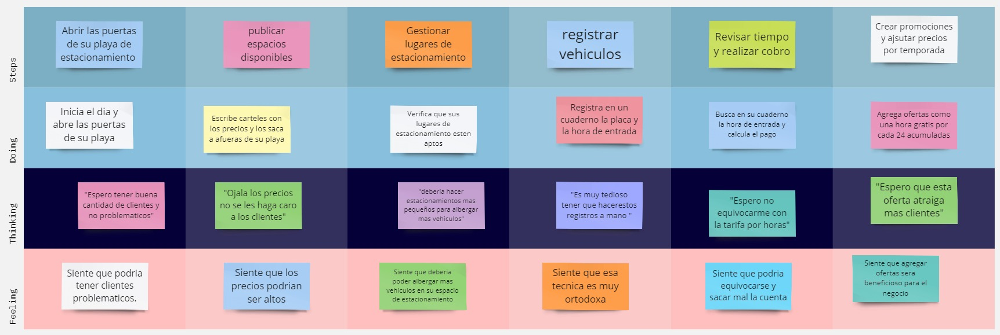

# **COURSE PROJECT** 

  

<strong>Universidad Peruana de Ciencias Aplicadas</strong>

<strong>Ingeniería de Software</strong> 
Desarrollo de Aplicaciones Móviles - NRC: 346  
Ciclo: 6to  
<strong>Profesor:</strong> Jorge Luis Mayta Guillermo

<h2 align="center">INFORME</h2>

<h3 align="center">Startup: Code Mondoguito</h3>

<strong>Producto: ParkingNow</strong>

<h3 align="center">Team Members:</h3>

| **Member**              | **Code** |
| ----------------------------- | -------------- |
| Calisaya Sánchez Juan Jesús  | u202121935    |
| Hidalgo Lopez, Mathias Adriano     | U202213222    |
| Samuel Elias Molina Asencios  | U20191A456     |
| Frezzia Eldaa Isabel Espinoza Paredes | u200815121     |
| Diego Ulises Soto Quispe      | U2022144778    |

<strong>Abril 2025</strong>

# Registro de Versiones del Informe
| Versión | Fecha      | Autor(es)                                                                                                                                                                                                                   | Descripción de la modificación                                                                                                                                                                                                                                                                                                                                                                                                                               |
|---------|------------|------------------------------------------------------------------------------------------------------------------------------------------------------------------------------------------------------------------------------|--------------------------------------------------------------------------------------------------------------------------------------------------------------------------------------------------------------------------------------------------------------------------------------------------------------------------------------------------------------------------------------------------------------------------------------------------------------|
| TB1     | 07/09/2024 | Calisaya Sánchez Juan Jesús    Hidalgo Lopez Mathias Adriano    Samuel Elias Molina Asencios    Frezzia Eldaa Isabel Espinoza Paredes    Diego Ulises Soto Quispe                                   | Se agregó el contenido del capítulo 1 (apartados 1.1, 1.1.1, 1.1.2, 1.2, 1.2.1, 1.2.2, 1.2.2.1, 1.2.2.2, 1.2.2.3, 1.2.2.4, 1.3); el contenido del capítulo 2 (apartados 2.1, 2.1.1, 2.1.2, 2.2, 2.2.1, 2.2.2, 2.2.3, 2.3, 2.3.1, 2.3.2, 2.3.3, 2.3.4, 2.3.5, 2.4); el contenido del capítulo 3 (apartados 3.1, 3.2, 3.3 y 3.4); y el contenido del capítulo 4 (apartados 4.1, 4.1.1, 4.1.1.1, 4.1.1.2, 4.1.1.3, 4.1.2, 4.1.3, 4.1.3.1, 4.1.3.2, 4.1.3.3, 4.2, 4.2.X, 4.2.X.1, 4.2.X.2, 4.2.X.3, 4.2.X.4, 4.2.X.5, 4.2.X.6, 4.2.X.6.1, 4.2.X.6.2). |
| TP1     | --         | --                                                                                                                                                                                                                           | --                                                                                                                                                                                                                                                                                                                                                                                                                                                           |
| TB2     | --         | --                                                                                                                                                                                                                           | --                                                                                                                                                                                                                                                                                                                                                                                                                                                           |
| TF1     | --         | --                                                                                                                                                                                                                           | --                                                                                                                                                                                                                                                                                                                                                                                                                                                           |

## Project Report Collaboration Insights

TB1: Las tareas asignadas para la entrega TB1 han sido completadas y están documentadas en el siguiente repositorio de GitHub perteneciente a la organización del equipo:

**Repositorio:** G3-UPC-CC238-346-ParkingNow/Report:  
 [https://github.com/G3-UPC-CC238-346-ParkingNow/Report](https://github.com/G3-UPC-CC238-346-ParkingNow/Report)

Durante la preparación del informe, se llevaron a cabo las siguientes actividades:

- Se escribieron y diagramaron los contenidos asignados a cada miembro en formato Markdown, seguidos de commits para asegurar el progreso en el repositorio.
- Se desarrollaron los capítulos I, II, III y IV del informe, abarcando desde la presentación del proyecto hasta el diseño de software, aplicando las técnicas revisadas en clase como Lean UX, entrevistas, análisis de usuarios y Domain-Driven Design.
- Los artefactos necesarios (diagramas, mapas, matrices) fueron elaborados con herramientas recomendadas y almacenados en la carpeta `Assets` dentro de la rama `develop`, permitiendo su referencia desde el informe.
- Se organizaron reuniones virtuales para coordinar los avances y distribuir las secciones, priorizando el desarrollo del contenido teórico-práctico del informe técnico.

 Esta entrega representa una evidencia del trabajo colaborativo del equipo, permitiendo cumplir con el Student Outcome 7 (ABET – EAC), demostrando la capacidad para adquirir conocimientos, aplicar metodologías y documentar procesos en un entorno ágil.

 TP1: Project Report Collaboration Insights

_(Contenido en preparación)_

---

TB2: Project Report Collaboration Insights

_(Contenido en preparación)_

---

TF: Project Report Collaboration Insights

_(Contenido en preparación)_

# Contenido

- [Registro de Versiones del Informe](#registro-de-versiones-del-informe)  
- [Project Report Collaboration Insights](#project-report-collaboration-insights)  
- [Student Outcome](#student-outcome)  

## Capítulo I: Presentación

- [1.1. Startup Profile](#11-startup-profile)  
  - [1.1.1. Descripción de la Startup](#111-descripción-de-la-startup)  
  - [1.1.2. Perfiles de integrantes del equipo](#112-perfiles-de-integrantes-del-equipo)  
- [1.2. Solution Profile](#12-solution-profile)  
  - [1.2.1. Antecedentes y problemática](#121-antecedentes-y-problemática)  
  - [1.2.2. Lean UX Process](#122-lean-ux-process)  
    - [1.2.2.1. Lean UX Problem Statements](#1221-lean-ux-problem-statements)  
    - [1.2.2.2. Lean UX Assumptions](#1222-lean-ux-assumptions)  
    - [1.2.2.3. Lean UX Hypothesis Statements](#1223-lean-ux-hypothesis-statements)  
    - [1.2.2.4. Lean UX Canvas](#1224-lean-ux-canvas)  
- [1.3. Segmentos objetivo](#13-segmentos-objetivo)  

## Capítulo II: Requirements Elicitation & Analysis

- [2.1. Competidores](#21-competidores)  
  - [2.1.1. Análisis competitivo](#211-análisis-competitivo)  
  - [2.1.2. Estrategias y tácticas frente a competidores](#212-estrategias-y-tácticas-frente-a-competidores)  
- [2.2. Entrevistas](#22-entrevistas)  
  - [2.2.1. Diseño de entrevistas](#221-diseño-de-entrevistas)  
  - [2.2.2. Registro de entrevistas](#222-registro-de-entrevistas)  
  - [2.2.3. Análisis de entrevistas](#223-análisis-de-entrevistas)  
- [2.3. Needfinding](#23-needfinding)  
  - [2.3.1. User Personas](#231-user-personas)  
  - [2.3.2. User Task Matrix](#232-user-task-matrix)  
  - [2.3.3. User Journey Mapping](#233-user-journey-mapping)  
  - [2.3.4. Empathy Mapping](#234-empathy-mapping)  
  - [2.3.5. As-is Scenario Mapping](#235-as-is-scenario-mapping)  
- [2.4. Ubiquitous Language](#24-ubiquitous-language)  

## Capítulo III: Requirements Specification

- [3.1. To-Be Scenario Mapping](#31-to-be-scenario-mapping)  
- [3.2. User Stories](#32-user-stories)  
- [3.3. Impact Mapping](#33-impact-mapping)  
- [3.4. Product Backlog](#34-product-backlog)  

## Capítulo IV: Solution Software Design

- [4.1. Strategic-Level Domain-Driven Design](#41-strategic-level-domain-driven-design)  
  - [4.1.1. EventStorming](#411-eventstorming)  
    - [4.1.1.1. Candidate Context Discovery](#4111-candidate-context-discovery)  
    - [4.1.1.2. Domain Message Flows Modeling](#4112-domain-message-flows-modeling)  
    - [4.1.1.3. Bounded Context Canvases](#4113-bounded-context-canvases)  
  - [4.1.2. Context Mapping](#412-context-mapping)  
  - [4.1.3. Software Architecture](#413-software-architecture)  
    - [4.1.3.1. Software Architecture Context Level Diagrams](#4131-software-architecture-context-level-diagrams)  
    - [4.1.3.2. Software Architecture Container Level Diagrams](#4132-software-architecture-container-level-diagrams)  
    - [4.1.3.3. Software Architecture Deployment Diagrams](#4133-software-architecture-deployment-diagrams)  
- [4.2. Tactical-Level Domain-Driven Design](#42-tactical-level-domain-driven-design)  
  - [4.2.X. Bounded Context: <Bounded Context Name>](#42x-bounded-context-bounded-context-name)  
    - [4.2.X.1. Domain Layer](#42x1-domain-layer)  
    - [4.2.X.2. Interface Layer](#42x2-interface-layer)  
    - [4.2.X.3. Application Layer](#42x3-application-layer)  
    - [4.2.X.4. Infrastructure Layer](#42x4-infrastructure-layer)  
    - [4.2.X.5. Bounded Context Software Architecture Component Level Diagrams](#42x5-bounded-context-software-architecture-component-level-diagrams)  
    - [4.2.X.6. Bounded Context Software Architecture Code Level Diagrams](#42x6-bounded-context-software-architecture-code-level-diagrams)  
    - [4.2.X.6.1. Bounded Context Domain Layer Class Diagrams](#42x61-bounded-context-domain-layer-class-diagrams)  
    - [4.2.X.6.2. Bounded Context Database Design Diagram](#42x62-bounded-context-database-design-diagram)  

## Capítulo V: Solution UI/UX Design

- [5.1. Product Design](#51-product-design)  
  - [5.1.1. Style Guidelines](#511-style-guidelines)  
    - [5.1.1.1. General Style Guidelines](#5111-general-style-guidelines)  
  - [5.1.2. Information Architecture](#512-information-architecture)  
    - [5.1.2.1. Organization Systems](#5121-organization-systems)  
    - [5.1.2.2. Labelling Systems](#5122-labelling-systems)  
    - [5.1.2.3. SEO Tags and Meta Tags](#5123-seo-tags-and-meta-tags)  
    - [5.1.2.4. Searching Systems](#5124-searching-systems)  
    - [5.1.2.5. Navigation Systems](#5125-navigation-systems)  
  - [5.1.3. Landing Page UI Design](#513-landing-page-ui-design)  
    - [5.1.3.1. Landing Page Wireframe](#5131-landing-page-wireframe)  
    - [5.1.3.2. Landing Page Mock-up](#5132-landing-page-mock-up)  
  - [5.1.4. Mobile Applications UX/UI Design](#514-mobile-applications-uxui-design)  
    - [5.1.4.1. Mobile Applications Wireframes](#5141-mobile-applications-wireframes)  
    - [5.1.4.2. Mobile Applications Wireflow Diagrams](#5142-mobile-applications-wireflow-diagrams)  
    - [5.1.4.3. Mobile Applications Mock-ups](#5143-mobile-applications-mock-ups)  
    - [5.1.4.4. Mobile Applications User Flow Diagrams](#5144-mobile-applications-user-flow-diagrams)  
    - [5.1.4.5. Mobile Applications Prototyping](#5145-mobile-applications-prototyping)  

## Capítulo VI: Product Implementation, Validation & Deployment

- [6.1. Software Configuration Management](#61-software-configuration-management)  
  - [6.1.1. Software Development Environment Configuration](#611-software-development-environment-configuration)  
  - [6.1.2. Source Code Management](#612-source-code-management)  
  - [6.1.3. Source Code Style Guide & Conventions](#613-source-code-style-guide--conventions)  
  - [6.1.4. Software Deployment Configuration](#614-software-deployment-configuration)  
- [6.2. Landing Page & Mobile Application Implementation](#62-landing-page--mobile-application-implementation)  
  - [6.2.X. Sprint n](#62x-sprint-n)  
    - [6.2.X.1. Sprint Planning n](#62x1-sprint-planning-n)  
    - [6.2.X.2. Sprint Backlog n](#62x2-sprint-backlog-n)  
    - [6.2.X.3. Development Evidence for Sprint Review](#62x3-development-evidence-for-sprint-review)  
    - [6.2.X.4. Testing Suite Evidence for Sprint Review](#62x4-testing-suite-evidence-for-sprint-review)  
    - [6.2.X.5. Execution Evidence for Sprint Review](#62x5-execution-evidence-for-sprint-review)  
    - [6.2.X.6. Services Documentation Evidence for Sprint Review](#62x6-services-documentation-evidence-for-sprint-review)  
    - [6.2.X.7. Software Deployment Evidence for Sprint Review](#62x7-software-deployment-evidence-for-sprint-review)  
    - [6.2.X.8. Team Collaboration Insights during Sprint](#62x8-team-collaboration-insights-during-sprint)  
- [6.3. Validation Interviews](#63-validation-interviews)  
  - [6.3.1. Diseño de Entrevistas](#631-diseño-de-entrevistas)  
  - [6.3.2. Registro de Entrevistas](#632-registro-de-entrevistas)  
  - [6.3.3. Evaluaciones según heurísticas](#633-evaluaciones-según-heurísticas)  
- [6.4. Video About-the-Product](#64-video-about-the-product)  

## Secciones Finales

- [Conclusiones](#conclusiones)  
  - [Conclusiones y recomendaciones](#conclusiones-y-recomendaciones)  
  - [Video About-the-Team](#video-about-the-team)  
- [Bibliografía](#bibliografía)  
- [Anexos](#anexos)

# ABET – EAC - Student Outcome 7

**Criterio:** *La capacidad de adquirir y aplicar nuevos conocimientos según sea necesario, utilizando estrategias de aprendizaje apropiadas.*

En el siguiente cuadro se describen las acciones realizadas y enunciados de conclusiones por parte del grupo, que permiten sustentar el haber alcanzado el logro del ABET – EAC - Student Outcome 7.

### ABET – EAC - Resultado del Estudiante 7

| Criterio específico | Acciones realizadas | Conclusiones |
| ------------------- | ------------------- | ------------ |
| **Actualiza conceptos y conocimientos necesarios para su desarrollo profesional y en especial para su proyecto en soluciones de software.** | **TB1:**  - *Calisaya Sánchez Juan Jesús:* Redactó el capítulo 1 del informe aplicando conceptos de presentación de startups y problemática.  - *Hidalgo Lopez Mathias Adriano:* Aplicó Lean UX Problem Statements y desarrolló el Canvas a partir de investigaciones propias.  - *Samuel Elias Molina Asencios:* Implementó el Empathy Mapping y el User Journey Mapping tras investigar su aplicación en UX.  - *Frezzia Eldaa Isabel Espinoza Paredes:* Aportó en entrevistas y definición de requerimientos investigando metodologías efectivas.  - *Diego Ulises Soto Quispe:* Lideró la estructura del informe y aplicó documentación técnica basada en buenas prácticas.  **TP:**  **TB2:**  **TF:** | **TB1:**  El equipo demostró una apropiada adquisición y aplicación de nuevos conocimientos tanto vistos en clase como aprendidos de forma autónoma. Se evidenció la capacidad de trasladar herramientas teóricas (Lean UX, entrevistas, mapeos, documentación técnica) a productos concretos dentro del proyecto *ParkingNow*.  **TP:**  **TB2:**  **TF:** |
| **Reconoce la necesidad del aprendizaje permanente para el desempeño profesional y el desarrollo de proyectos en soluciones de software.** | **TB1:**  - *Calisaya Sánchez Juan Jesús:* Estudió técnicas de presentación y redacción para aplicarlas al informe.  - *Hidalgo Lopez Mathias Adriano:* Investigó metodologías centradas en el usuario y cómo estructurar entrevistas.  - *Samuel Elias Molina Asencios:* Aprendió por cuenta propia sobre diseño de experiencias y tareas del usuario.  - *Frezzia Eldaa Isabel Espinoza Paredes:* Reforzó su comprensión del levantamiento de información a través de entrevistas.  - *Diego Ulises Soto Quispe:* Investigó estructuras y patrones de informes técnicos para liderar la coherencia documental.  **TP:**  **TB2:**  **TF:** | **TB1:**  Se reflejó un compromiso claro con el aprendizaje autónomo al profundizar de forma individual en metodologías y herramientas útiles para el proyecto. El equipo se adaptó activamente al reto, demostrando crecimiento profesional y técnico en cada etapa de TB1.  **TP:**  **TB2:**  **TF:** |

# Objetivos SMART

A continuación, cada miembro del equipo formula dos objetivos SMART que reflejan su plan de desarrollo profesional continuo una vez finalizada su carrera. Estos objetivos son **específicos, medibles, alcanzables, relevantes y con un tiempo definido**, lo que permite guiar su crecimiento profesional tras la graduación.

| **Integrante**                         | **Objetivo SMART 1**                                                                                                         | **Objetivo SMART 2**                                                                                         |
|---------------------------------------|------------------------------------------------------------------------------------------------------------------------------|--------------------------------------------------------------------------------------------------------------|
| **Calisaya Sánchez Juan Jesús**       | Obtener una certificación profesional en desarrollo frontend (Google, Microsoft, etc.) en los primeros 6 meses tras egresar. | Ingresar como frontend developer en una startup de salud digital antes de cumplir 1 año de egresado.         |
| **Hidalgo Lopez Mathias Adriano**     | Publicar una aplicación móvil funcional en Google Play en los primeros 12 meses tras egresar.                                | Participar en al menos dos eventos tecnológicos (hackathons o ferias) antes de los 12 meses de egresado.     |
| **Samuel Elias Molina Asencios**      | Finalizar un diplomado en UX/UI o diseño centrado en el usuario dentro de los 8 meses posteriores a la carrera.              | Diseñar un portafolio profesional digital con al menos 5 casos reales antes de cumplir 1 año.                |
| **Frezzia Eldaa Isabel Espinoza Paredes** | Iniciar una maestría.                                                                                                        | Finalizar la maestría.                                                                                       |
| **Diego Ulises Soto Quispe**          | Iniciar una maestría en ciberseguridad o arquitectura de software dentro de los primeros 18 meses de egresado.               | Liderar un proyecto tecnológico completo en una empresa o startup dentro de los primeros 2 años post-egreso. |

## Capítulo I: Introducción

### 1.1. StartUp Profile

En esta sección describiremos la descripción de nuestra Startup.

### 1.1.1. Descripción de la Startup

**PARKINGNOW** constituye una empresa emergente del sector tecnológico orientada al desarrollo de soluciones integrales para la **gestión de estacionamientos en tiempo real**. Nuestra organización ha implementado una plataforma digital que posibilita a los usuarios la **reserva y el pago de espacios de estacionamiento**, haciendo uso de tecnologías de geolocalización y **cámaras de monitoreo**, lo que permite una administración eficiente y automatizada de los espacios.

El modelo de negocio adoptado por **PARKINGNOW** se caracteriza por su **independencia y sostenibilidad**, permitiendo atender tanto a usuarios habituales como esporádicos mediante un **sistema transaccional flexible**.

La propuesta innovadora de **PARKINGNOW** reside en la integración de **información en tiempo real**, captada a través de **cámaras instaladas en los locales**, con el objetivo de asegurar la **disponibilidad actualizada de espacios** y **optimizar las rutas** hacia los estacionamientos más cercanos. Las cámaras permiten verificar visualmente el estado de ocupación y actualizar la plataforma de manera inmediata, lo cual contribuye a **incrementar la eficiencia operativa** y **mejorar la experiencia del usuario**.

**Misión:** Nuestra misión es **fungir como nexo entre conductores y administradores de estacionamientos**, optimizando la experiencia de aparcamiento en tiempo real. **PARKINGNOW** facilita el acceso a espacios mediante una **gestión automatizada y eficiente** basada en el uso de **cámaras de monitoreo**, que incrementan la rentabilidad para los gestores y satisfacen las necesidades de ambos segmentos del mercado.

**Visión:** Aspiramos a consolidarnos, en un horizonte de cinco años, como la **plataforma líder en la administración de estacionamientos urbanos**, contribuyendo a la mejora de la **movilidad en las ciudades** a través de soluciones tecnológicas innovadoras y sostenibles, como el uso de **cámaras inteligentes**, en beneficio tanto de los conductores como de los titulares de los espacios de estacionamiento.
#### 1.1.2. Perfiles de integrantes del equipo

| **Integrantes**                                            | **Descripción**                                                                                                                                                                                                                                                                | **Conocimientos**                                           |
|------------------------------------------------------------|--------------------------------------------------------------------------------------------------------------------------------------------------------------------------------------------------------------------------------------------------------------------------------|-------------------------------------------------------------|
|   Diego Ulises Soto Quispe  | Soy estudiante de 7.º ciclo en la carrera de Ingeniería de Software. Me considero una persona responsable, puntual y comprometida con los trabajos asignados. Fuera del ámbito académico, disfruto jugar básquet, salir a pasear, jugar videojuegos y manejar bicicleta. | HTML, CSS, JavaScript, Angular, Vue.js, Python, C++, SQL, MongoDB, MySQL, NoSQL |
|  Frezzia Espinoza Paredes | Estudio Ingeniería de Software como segunda carrera en la Universidad Peruana de Ciencias Aplicadas.                                                                                                                                                                           | C++, HTML, CSS, JavaScript, Python y redes.                 |
|      Mathias Adriano Hidalgo Lopez | Curso el 7mo ciclo de la carrera de ingenieria de software. Poseo varias habilidades blandas que me ayudan a progresar en equipo para que todo vaya en orden y organizado.|  HTML, CSS, JavaScript, Angular, Vue.js, Python, C++, SQL, MongoDB, MySQL |
|                                                            |                                                                                                                                                                                                                                                                                |                                                             |
|                                                            |                                                                                                                                                                                                                                                                                |                                                             |

### 1.2. Solution Profile

**PARKINGNOW** representa una propuesta tecnológica de vanguardia orientada a revolucionar la experiencia de estacionamiento en entornos urbanos. La solución consiste en una **plataforma digital** que permite a los usuarios **localizar, reservar y efectuar pagos** por espacios de estacionamiento en tiempo real, integrando funcionalidades de **geolocalización** y **monitoreo visual mediante cámaras**.

Esta tecnología permite la **detección automática de la presencia de vehículos** a través del análisis visual de las cámaras instaladas, lo que habilita la **actualización instantánea de la disponibilidad de espacios** y guía a los conductores hacia los estacionamientos más cercanos, optimizando sus trayectos y reduciendo significativamente el tiempo de búsqueda.

De este modo, **PARKINGNOW** proporciona **información precisa y en tiempo real**, mejorando sustancialmente la experiencia de los usuarios y ofreciendo una **solución integral** a los desafíos del estacionamiento urbano, en beneficio tanto de los conductores como de los administradores de estos espacios.

### 1.2.1. Antecedentes y problemática
En las ciudades con un elevado flujo vehicular, la ocupación indebida de espacios, la invasión de áreas peatonales y la obstrucción del tránsito son fenómenos recurrentes. Los conductores enfrentan serias dificultades para encontrar espacios de estacionamiento, especialmente en zonas urbanas congestionadas, donde la demanda supera ampliamente a la oferta y la información disponible suele ser insuficiente o desactualizada. La falta de herramientas que permitan la reserva anticipada de espacios incrementa la frustración y prolonga el tiempo invertido en la búsqueda, afectando negativamente la movilidad y la seguridad urbana.

Con el objetivo de comprender en profundidad las necesidades reales de los usuarios y en consonancia con los principios de **Lean UX**, se realizó un análisis de antecedentes y problemática empleando la metodología **“5W’s & 2H’s”**, la cual permite identificar oportunidades de mejora a través de un enfoque centrado en el usuario. A continuación, se presentan los hallazgos:

- **What (¿Qué?)**  
  El principal desafío que aborda **PARKINGNOW** es la escasez de espacios de estacionamiento adecuados. Esta situación induce a muchos conductores a estacionarse en lugares no permitidos, lo cual genera congestión, sanciones y riesgos en la seguridad vial. La falta de tecnologías avanzadas, como **sistemas de monitoreo por cámaras**, limita la gestión eficiente y en tiempo real de la disponibilidad de espacios.

- **When (¿Cuándo?)**  
  El problema se intensifica durante las horas pico o en momentos de alta demanda, cuando los conductores requieren espacios disponibles que se ajusten a sus expectativas. En estos contextos, los usuarios recurren a **PARKINGNOW** para consultar disponibilidad, reservar espacios, comparar tarifas y asegurarse de elegir un estacionamiento adecuado, gracias a la información proporcionada en tiempo real.

- **Where (¿Dónde?)**  
  La problemática se presenta principalmente en **zonas urbanas densamente pobladas**, donde la oferta limitada de estacionamientos y la ausencia de sistemas automatizados dificultan el acceso a información precisa, lo que empeora la experiencia del conductor.

- **Who (¿Quiénes?)**  
  Los actores involucrados son, por un lado, los conductores que buscan estacionamientos seguros, accesibles y eficientes; y por otro lado, los administradores de locales de estacionamiento interesados en **maximizar la ocupación** de sus espacios mediante el uso de **tecnología basada en cámaras de monitoreo**. El problema afecta a todo tipo de conductores, independientemente de su perfil.

- **Why (¿Por qué?)**  
  La raíz del problema se encuentra en la ausencia de soluciones tecnológicas en los estacionamientos tradicionales, lo que impide una **comunicación en tiempo real sobre la disponibilidad** de espacios. Esto genera descoordinación entre la oferta y la demanda, elevando los niveles de congestión y estrés en los conductores.

- **How (¿Cómo?)**  
  Los usuarios pueden utilizar **PARKINGNOW** en diversos contextos: al planificar un trayecto, buscar un estacionamiento que se adapte a sus necesidades o durante eventos masivos. La plataforma proporciona información en tiempo real gracias a su integración con **cámaras inteligentes**, optimizando la experiencia del usuario. La solución se promociona a través de campañas en redes sociales, destacando los beneficios de una **gestión moderna, automatizada y eficiente**.

- **How much (¿Cuánto?)**  
  La magnitud del problema es considerable. Se refleja en el alto número de infracciones, incidentes y robos asociados al estacionamiento informal o indebido. La falta de sistemas de detección visual, como **cámaras**, agrava la situación y afecta a una amplia variedad de usuarios.

En síntesis, **PARKINGNOW** se posiciona como una **solución integral y tecnológica** frente a los desafíos del estacionamiento urbano. Su implementación contribuye a **facilitar la movilidad**, **reducir la congestión** y **mejorar la seguridad**, mediante un sistema de gestión de espacios que responde a las necesidades tanto de los conductores como de los administradores.

### 1.2.2. Lean UX Process

En esta sección se aplica la metodología **Lean UX**, cuyo alcance incluye la **conceptualización del modelo de negocio** que sustentará el desarrollo del producto digital propuesto. Este enfoque ágil permite centrar los esfuerzos del equipo en el **diseño de una solución enfocada en el usuario**, alineada con las problemáticas detectadas mediante técnicas de **Design Thinking** y validación temprana.

#### 1.2.2.1. Lean UX Problem Statements

A continuación, se utiliza el marco de **Business Opportunity Statements** (Gothelf, 2022) con el propósito de guiar al equipo hacia la creación de un servicio **flexible, innovador y adaptable**. Esta herramienta permite identificar claramente las oportunidades de mejora, priorizar las necesidades del cliente y estructurar la implementación de manera estratégica, maximizando el valor entregado.

**Plantilla de Business Opportunity Statement:**

El estado actual de [domain] se ha enfocado principalmente en [segments, pain points, etc.]  
Lo que los productos/servicios actuales no logran abordar es [this gap].  
Nuestro producto/servicio resolverá esta brecha mediante [vision/strategy].  
Nuestro enfoque inicial será [this segment].  
Sabremos que hemos tenido éxito cuando observemos [these behaviors in our target audience].

### Declaración de Problemas Lean UX para PARKINGNOW

- **El estado actual del dominio de estacionamientos urbanos** se ha enfocado principalmente en soluciones convencionales, sin mecanismos inteligentes que brinden información precisa y oportuna a los conductores, lo cual genera demoras, frustración y congestión vial.

- **Lo que los servicios actuales no logran abordar** es la falta de herramientas tecnológicas que permitan visualizar en tiempo real la disponibilidad de espacios y guiar eficientemente a los usuarios hacia los mismos.

- **Nuestra solución resolverá esta brecha** mediante una **plataforma digital avanzada** que utiliza **cámaras instaladas en los locales** para monitorear continuamente la ocupación de espacios y proporcionar datos confiables, integrados con un sistema inteligente de navegación.

- **Nuestro enfoque inicial** será dirigido a **conductores que transitan por zonas metropolitanas con alta densidad vehicular**, donde la demanda de soluciones automatizadas para estacionamiento es crítica.

- **Sabremos que hemos tenido éxito** cuando observemos un **aumento sostenido en el número de reservas efectuadas**, una **disminución del tiempo de búsqueda de estacionamientos** y una mejora general en la **experiencia del usuario**, medida mediante retroalimentación directa y métricas de uso.

### 1.2.2.2. Lean UX Assumptions

#### Users

- Conductores que se desplazan en zonas urbanas con alta congestión y requieren soluciones inmediatas para encontrar estacionamiento disponible.
- Propietarios o administradores de estacionamientos que buscan maximizar el uso de sus espacios y mejorar la comunicación con los usuarios mediante el uso de cámaras inteligentes.
- Empresas logísticas y de transporte que necesitan herramientas eficientes para gestionar el aparcamiento de sus unidades en recorridos urbanos.

#### User Outcomes

**Segmento de Conductores**

- Acceder a una plataforma digital que permita buscar, visualizar y reservar espacios de estacionamiento en tiempo real gracias al monitoreo por cámaras.
- Optimizar sus trayectos mediante rutas más directas hacia espacios disponibles, disminuyendo el tiempo de búsqueda.
- Consultar tarifas y disponibilidad desde la aplicación antes de llegar al punto de destino, facilitando la planificación.

**Segmento de Propietarios de Estacionamientos**

- Aumentar la visibilidad de sus espacios y atraer a una mayor cantidad de conductores mediante una herramienta digital moderna.
- Administrar de forma eficiente las reservas y mantener una comunicación centralizada con los usuarios desde un solo sistema.
- Mejorar la ocupación de los espacios disponibles usando herramientas de análisis que permiten tomar decisiones basadas en datos.

#### Suposiciones de Negocios

- Existe una demanda creciente por plataformas tecnológicas que faciliten la localización, reserva y pago de estacionamientos en áreas urbanas con alta densidad vehicular.
- Si bien hay soluciones disponibles en el mercado, **PARKINGNOW** se diferencia por ofrecer una experiencia integral basada en información en tiempo real, respaldada por cámaras inteligentes.
- Se prevé que los usuarios valoren la comodidad, transparencia y eficiencia que ofrece la plataforma al permitir una gestión automatizada de todo el proceso de estacionamiento.

#### Suposiciones de Usuarios

- **¿Quién usa nuestra plataforma?**  
  Está dirigida a conductores que buscan estacionar de forma rápida y segura, y a propietarios de estacionamientos que desean maximizar el rendimiento de sus espacios a través de tecnología moderna.

- **¿Cómo se integra nuestro producto en la rutina diaria?**  
  **PARKINGNOW** se adapta de manera natural al día a día de los conductores, permitiendo encontrar y reservar estacionamientos con agilidad, especialmente en horarios y zonas de alta demanda.

- **¿Qué problemas resuelve nuestro producto?**  
  Elimina la incertidumbre al ofrecer información confiable y actualizada sobre la disponibilidad de estacionamientos, reduciendo el tiempo perdido y mejorando la experiencia del usuario.

- **¿Qué imagen queremos proyectar con nuestro producto?**  
  Una solución innovadora, eficiente y confiable, que destaque como referente tecnológico en la gestión urbana de estacionamientos.

- **¿Cuál es el objetivo principal de nuestra aplicación?**  
  Simplificar el proceso de búsqueda, reserva y gestión de estacionamientos tanto para usuarios como para operadores, todo desde una única plataforma.

- **¿Qué funcionalidades son clave en nuestra aplicación?**  
  Búsqueda avanzada con geolocalización, visualización en tiempo real con cámaras, comparación de precios, reservas en línea y herramientas analíticas para mejorar la toma de decisiones.
#### 1.2.2.3. Lean UX Hypothesis Statements

Para formular las Hypothesis Statements, hemos seguido el formato de Lean UX: [We believe that], [This will achieve], y [We will have demonstrated this when].

**Hipótesis 1**  
Creemos que la mejora del proceso de búsqueda y reserva de espacios mediante el uso de cámaras inteligentes motivará a los usuarios a utilizar la plataforma de forma continua.  
Esto permitirá alcanzar un incremento del 30 % en la cantidad de usuarios recurrentes durante los primeros seis meses posteriores a la implementación.  
Lo validaremos cuando se registre un aumento del 30 % en el número de reservas efectuadas por usuarios que ya han usado previamente la aplicación.

**Hipótesis 2**  
Creemos que el uso de notificaciones en tiempo real, basadas en la información proporcionada por cámaras, reducirá el tiempo promedio que los conductores dedican a encontrar estacionamiento.  
Esto permitirá disminuir en un 20 % el tiempo invertido en la búsqueda de espacios disponibles.  
Lo validaremos cuando los reportes y registros del sistema evidencien una reducción medible cercana al 20 % en los tiempos de búsqueda.

**Hipótesis 3**  
Creemos que la incorporación de descuentos y beneficios exclusivos para usuarios frecuentes aumentará la fidelización y promoverá la conversión de usuarios ocasionales en regulares.  
Esto facilitará que al menos un 25 % de los usuarios esporádicos comiencen a utilizar la plataforma de forma mensual.  
Lo validaremos cuando se observe un crecimiento del 25 % en la proporción de usuarios que acceden recurrentemente a la plataforma cada mes.

**Hipótesis 4**  
Creemos que el uso de algoritmos de optimización de rutas, alimentados por datos recogidos a través de cámaras, mejorará la experiencia general de los usuarios.  
Esto se reflejará en mayores niveles de satisfacción y una reducción en la frustración asociada con el proceso de búsqueda.  
Lo validaremos cuando las encuestas muestren un aumento en las puntuaciones de satisfacción y una disminución en los reclamos relacionados con tiempos de espera o falta de información.

**Hipótesis 5**  
Creemos que un sistema de fidelización que ofrezca recompensas por el uso continuo de la plataforma mejorará la retención de clientes y fomentará las recomendaciones.  
Esto generará un aumento del 30 % en la retención de usuarios activos, además de un crecimiento sostenido a través del canal de referidos.  
Lo validaremos cuando las métricas indiquen un incremento del 30 % en la retención y una subida significativa en los registros provenientes de recomendaciones de otros usuarios.

##### 1.2.2.4. Lean UX Canvas

El Lean UX Canvas desarrollado para **PARKINGNOW** permite identificar los principales desafíos y oportunidades del servicio, centrado en las necesidades tanto de los conductores como de los propietarios de estacionamientos.

**Problemáticas identificadas:**

• Para conductores: Dificultades constantes para localizar espacios de estacionamiento disponibles, especialmente en zonas urbanas con alta congestión.

• Para propietarios de estacionamientos: Baja ocupación de los espacios disponibles y procesos de gestión poco eficientes debido a la falta de digitalización.

**Soluciones planteadas:**

• Implementación de cámaras inteligentes para el monitoreo visual en tiempo real del estado de ocupación de los espacios.

• Sistema de reservas anticipadas integrado con geolocalización, permitiendo a los usuarios encontrar y asegurar un espacio cercano desde sus dispositivos.

**Métricas de validación:**

• Indicadores cuantitativos: Nivel de ocupación de espacios, tiempo promedio de búsqueda de estacionamiento, número de reservas generadas.

• Indicadores cualitativos: Nivel de satisfacción del usuario, percepción de mejora en la experiencia de estacionamiento, reducción de reclamos.

<em>Figura 1. Lean UX Canvas aplicado al proyecto PARKINGNOW</em>

  

### 1.3. Segmentos objetivo

####  Conductores Urbanos Frecuentes

**Demografía:**

- **Género:** Masculino y femenino  
- **Rango etario:** Jóvenes adultos (18-34 años), adultos medios (35-54 años) y adultos mayores (55 años a más)  
- **Nivel socioeconómico:** Clases B, C y D (media-alta, media y media-baja)

**Beneficios clave:**

- Reducción del tiempo de búsqueda y del nivel de estrés gracias a la posibilidad de realizar reservas en tiempo real.  
- Mayor seguridad para el vehículo mediante el monitoreo continuo a través de cámaras instaladas en los espacios de estacionamiento.  
- Facilidad para comparar precios, localizar espacios y acceder a información desde una sola aplicación.

#### Propietarios de Estacionamientos

**Demografía:**

- **Género:** Masculino y femenino  
- **Rango etario:** Jóvenes adultos (18-34 años), adultos medios (35-54 años) y adultos mayores (55 años a más)  
- **Nivel socioeconómico:** Clases B y C (media-alta y media)

**Beneficios clave:**

- **Gestión de datos:** Acceso a herramientas analíticas que permiten optimizar la ocupación, ajustar precios dinámicamente y tomar decisiones basadas en evidencia.  
- **Automatización:** Simplificación de procesos como la asignación de espacios y los cobros digitales, reduciendo la carga operativa.  
- **Formalización:** Digitalización de las operaciones para incrementar el control administrativo y reducir la informalidad en la gestión de estacionamientos.

## Capítulo II: Requirements Elicitation & Analysis

### 2.1. Competidores

**Parkimeter**

Parkimeter es una solución digital enfocada en la gestión y reserva de espacios de estacionamiento. Su plataforma facilita a los usuarios la búsqueda, comparación y reserva de plazas en distintas ubicaciones. También ofrece funcionalidades como visualización de tarifas, disponibilidad en tiempo real y otros servicios útiles que simplifican el proceso de estacionamiento para los conductores.

**ElParking**

ElParking brinda a los usuarios la posibilidad de localizar, reservar y pagar por estacionamientos desde una misma plataforma. Su sistema incorpora datos actualizados sobre espacios disponibles, además de permitir el pago de parquímetros, seguimiento de sanciones de tránsito y otros servicios complementarios que optimizan la experiencia del conductor.

**Aparcados**

Aparcados es una aplicación enfocada en simplificar la búsqueda de estacionamientos urbanos según las necesidades del usuario. Aunque cuenta con versión web, su versión móvil es la más utilizada debido a su interfaz amigable y diseño visual atractivo, lo que la convierte en una herramienta práctica para conductores en movimiento.

#### 2.1.1. Análisis competitivo

A continuación, se presenta una tabla comparativa de los principales competidores a nivel internacional. Este análisis nos permitirá identificar patrones clave de funcionalidad y experiencia de usuario, con el objetivo de alinear nuestra propuesta a las preferencias reales del público objetivo.
| **Competitive Analysis Landscape**                              |                                                                                                                              |
|-----------------------------------------------------------------|------------------------------------------------------------------------------------------------------------------------------|
| **¿Por qué llevar a cabo este análisis?**                       | **Escriba en el recuadro la pregunta que busca responder o el objetivo de este análisis.**                                    |
|                                                                 | **Identificar cómo PARKINGNOW se posiciona frente a sus competidores en términos de servicios ofrecidos, ventajas competitivas y estrategias de mercado para mejorar nuestra propuesta de valor y captar más clientes.** |

| ***Competidor***          || ParkingNow| Parkimeter| ElParking| Aparcados|
| ------------------- | ----------------------------------------------------- | ------------------------------------------------------------------------------------------------------------------------------------------------------------------------------------------------------------------------------------------------------------------------------------------------------- |--------------------------------------------------------------------------------------------------------------------------------------------------------------------------------------------------------------------------------|-----------------------------------------------------------------------------------------------------------------------------------------------------------------------------------------------------------------------------------------------------------------------------------------------------------------------------|------------------------------------------------------------------------------------------------------------------------------------------------------------------------------------------------------------------------------------------|
| ***Logo***| | | |||
| ***Perfil***| Overview| Es una aplicación web que brinda la posibilidad de reservar espacios de estacionamiento en múltiples ciudades, además de conectar a consumidores con propietarios de estacionamientos urbanos. | Es una aplicación web y móvil que ofrece servicios de reserva de plazas de aparcamiento en diversas ciudades de Europa y América Latina. | Es una aplicación web y móvil que ofrece servicios de reserva de plazas de aparcamiento en diversas ciudades de Europa y América Latina. | Es una aplicación web y móvil que ofrece servicios de reserva de plazas de aparcamiento en diversas ciudades de España principalmente, pero expandiéndose alrededor del mundo. |
|| ***Ventaja competitiva ¿Qué valor ofrece a los clientes?*** | Cancelación gratuita hasta con 24 horas de antelación de la reserva, inclusión de monitoreo por cámaras para los vehículos y conexión directa entre consumidores y propietarios de estacionamientos urbanos. | Ofrece descuentos de hasta el 70% y no cobra gastos de gestión. | Permite más que solo pagar estacionamientos, sino gestionar multas y pagar parquímetros. | La app incluye geolocalización y ofrece notificaciones en tiempo real. |
| ***Perfil de Marketing*** | ***Mercado objetivo***| Personas que buscan soluciones de estacionamiento en áreas urbanas congestionadas y propietarios de estacionamientos urbanos. | Personas que buscan soluciones de estacionamiento en áreas urbanas congestionadas. | Personas que buscan soluciones de estacionamiento en áreas urbanas congestionadas. | Personas que buscan soluciones de estacionamiento en áreas urbanas congestionadas. |
|| ***Estrategias de marketing***| Utiliza publicidad en línea a través de plataformas y redes sociales. | Utiliza publicidad en línea a través de plataformas y redes sociales. | Utiliza publicidad en línea, redes sociales y reciben promociones de influencers. | Utiliza publicidad en línea a través de plataformas y redes sociales. |
| ***Perfil de Producto*** | ***Productos & Servicios***| Ofrece una serie de servicios relacionados con la reserva de plazas de aparcamiento en áreas urbanas y otros destinos. | Realizar servicios de parking en todo el territorio español y otras grandes ciudades del mundo. | Ofrece una serie de servicios relacionados con la reserva de plazas de aparcamiento en ciudades concurridas, seguimiento de multas y pagos sencillos. | Ofrece una serie de servicios relacionados con la reserva de plazas de aparcamiento en áreas urbanas y otros destinos. |
|| ***Precios & Costos***| La plataforma es gratuita, pero se debe pagar las tarifas de estacionamiento correspondientes. | La plataforma es gratuita, pero se deben pagar las tarifas de estacionamiento correspondientes y las suscripciones VIP. | La plataforma es gratuita, pero se deben pagar las tarifas de estacionamiento, además de la existencia de tarifas especiales o descuentos. | La plataforma es gratuita, pero se debe pagar las tarifas de estacionamiento correspondientes. |
|| ***Canales de distribución (Web y/o Móvil)***| Web | Web/Móvil | Web/Móvil | Web/Móvil |
| ***Análisis SWOT***       | ***Fortalezas***| Implementa monitoreo visual mediante cámaras en los estacionamientos asociados, ofreciendo un objetivo más amplio que otras aplicaciones y soporte en tiempo real para los consumidores. | Parkimeter opera en múltiples ciudades de Europa y América Latina. | ElParking implementa seguimiento de multas y pagos aparte de los estacionamientos. | Aparcados opera en múltiples ciudades de Europa y Asia. |
|| ***Debilidades***| La industria de reserva de estacionamientos en línea es muy competitiva. | Varias empresas que proporcionan servicios similares. | La industria de reserva de estacionamientos en línea es muy competitiva. | Varias empresas que proporcionan servicios similares. |
|| ***Oportunidades***| A medida que las ciudades sigan creciendo, la demanda de servicios de reserva podría aumentar. | La congestión del tráfico se vuelve más común, provocando una alta demanda en la reserva de estacionamientos. | En su país de origen, España, las personas en zonas urbanas deberán aprender más acerca de la app para vivir en comodidad. | Tiene grandes posibilidades de expandir su mercado, enfocándose en la reserva de estacionamientos en América Latina. |
|| ***Amenazas***| Cambios en las políticas de movilidad urbana. | Nuevas startups compitiendo por la misma base de usuarios. | Nuevas startups compitiendo por la misma base de usuarios. | Nuevas startups compitiendo por la misma base de usuarios. |

#### 2.1.2. Estrategias y tácticas frente a competidores

A continuación, encontraremos la tabla de Matriz de FODA y C.A.M.E para poder analizar nuestras estrategias a futuro para competir contra los competidores anteriormente mencionados.

| ***MATRIZ FODA y C.A.M.E*** | **Oportunidades: La demanda de este servicio aumenta bastante con los años** | **Amenazas: Cambios en la política de movilidad urbana** |
|-----------------------------|------------------------------------------------------------------------------|-------------------------------------------------------------|
| **Fortalezas: Innovación, público objetivo más amplio y soporte en tiempo real para los consumidores** | Ofrecer soporte eficiente a través de la app para fidelizar usuarios, destacando el valor diferenciador de los sensores inteligentes como una funcionalidad poco común y atractiva para el mercado. | Realizar un monitoreo constante de las políticas de movilidad urbana para adaptar nuestra propuesta a los cambios y mantenernos siempre alineados con la normativa. |
| **Debilidades: Mercado competitivo y nuevo** | Fortalecer las campañas de difusión y visibilidad digital, resaltando las características innovadoras de la app como su enfoque en tiempo real y personalización para lograr una mejor recepción en el mercado. | Desarrollar mensajes de marketing enfocados en cómo nuestra solución contribuye a una mejor gestión urbana, mostrando que no se opone a las políticas sino que las complementa. |

### 2.2. Entrevistas

Esta sección se centra en la recopilación de información mediante entrevistas a representantes de los segmentos objetivo, con el fin de entender sus necesidades y expectativas en relación al servicio.
#### 2.2.1. Diseño de entrevistas

Incluye la elaboración de preguntas principales y complementarias dirigidas a cada segmento, considerando aspectos demográficos, características de personalidad y preferencias tecnológicas para construir perfiles precisos de los usuarios.

**Segmento objetivo #1: Conductores Urbanos Frecuentes**

**Preguntas demográficas:**

- ¿Cuál es tu nombre?  
- ¿Cuál es tu edad?  
- ¿Dónde vives?  
- ¿A qué te dedicas?  
- ¿Cuáles consideras que son tus principales habilidades?  

**Preguntas principales:**

- ¿Con qué frecuencia necesitas estacionamiento en la ciudad?  
- ¿Cuánto tiempo dedicas normalmente a buscar estacionamiento?  
- ¿Utilizas actualmente alguna aplicación o servicio para encontrar estacionamiento?  
- ¿Qué tan importante es para ti conocer la disponibilidad de estacionamiento en tiempo real?  
- ¿Estarías dispuesto/a a pagar una tarifa adicional por garantizar un espacio de estacionamiento reservado?  
- ¿Qué consideras más importante al elegir un estacionamiento: costo, proximidad, o seguridad?  
- ¿Te gustaría recibir recomendaciones de rutas hacia el estacionamiento más cercano basado en el tráfico en tiempo real?  

**Preguntas complementarias:**

- ¿Has tenido experiencias frustrantes buscando estacionamiento en la ciudad?  
- ¿Qué mejoras te gustaría ver en los servicios de estacionamiento que utilizas actualmente?  

**Segmento objetivo #2: Dueños de estacionamientos**

**Preguntas demográficas:**

- ¿Cuál es tu nombre?  
- ¿Cuál es tu edad?  
- ¿Dónde vives?  
- ¿A qué te dedicas?  
- ¿Cuáles consideras que son tus principales habilidades?  

**Preguntas principales:**

- ¿Consideras sencillo el proceso de gestionamiento de espacios en tu estacionamiento?  
- ¿Qué tan importante es para ti contar con información en tiempo real sobre los espacios disponibles?  
- ¿Utilizas algún sistema digital para administrar los pagos y reservas de los espacios de estacionamiento?  
- ¿Qué beneficios ves en la posibilidad de automatizar el proceso de reserva y pago de los espacios de estacionamiento?  
- ¿Qué tan relevante es para ti ofrecer opciones de pago seguras y rápidas a tus clientes?  
- ¿De qué manera crees que la integración de una app que gestione datos y pagos podría mejorar la eficiencia de tu negocio?  

**Preguntas complementarias:**

- ¿Cuáles son los principales desafíos que enfrentas al administrar tu estacionamiento?  
- ¿Qué funcionalidades adicionales te gustaría que una app ofreciera para facilitar la gestión de tu negocio?  
- ¿Te gustaría recibir reportes o análisis sobre la ocupación y rotación de vehículos en tu estacionamiento?  

#### 2.2.2. Registro de entrevistas
**Segmento objetivo \#1: Conductores Urbanos Frecuentes**

**Entrevistado N°1: Joan Talizo Balbin**  
**Sexo:** Masculino  
**Edad:** 23  
**Ubicación en la que vive:** Surco, Lima, Perú  

Link de la entrevista: https://youtu.be/8MtQq3fYY3s

Resumen: Balbín utiliza su auto todos los días para ir a la universidad y a su trabajo como desarrollador web en una ONG. Esto lo obliga a buscar estacionamiento constantemente, lo cual puede tomarle entre 10 a 20 minutos, dependiendo del tráfico y la zona. Actualmente no usa ninguna aplicación para encontrar estacionamiento, pero considera que una app con información en tiempo real sería muy útil, ya que le ahorraría tiempo y evitaría dar vueltas innecesarias. También le gustaría que la app recomiende rutas según el tráfico, lo cual considera clave para optimizar sus desplazamientos. Está dispuesto a pagar una tarifa adicional por reservar un espacio, siempre que esto le garantice seguridad y cercanía. Aunque valora la seguridad, prioriza el costo y la proximidad al momento de elegir un estacionamiento. Ha vivido situaciones frustrantes, como perder tiempo en el tráfico, no encontrar espacios libres o que otro conductor le gane el lugar. Por ello, valora la posibilidad de saber en tiempo real si hay espacios disponibles e incluso recibir alertas si ocurre algo sospechoso con su vehículo.

**Entrevistado N°2: Luis Ángel Anampa Lavado**  
**Sexo:** Masculino  
**Edad:** 20  
**Ubicación en la que vive:** San Borja, Lima, Perú  

Link de la entrevista: https://youtu.be/rVE1PmHttmg

Resumen: Ángel utiliza su vehículo todos los días, por lo que necesita estacionamiento de forma constante. El tiempo que le toma encontrar un espacio varía según la zona y el tráfico, pudiendo tardar entre 10 a 20 minutos o más en horas punta. Actualmente no usa ninguna aplicación para encontrar estacionamiento, pero considera que sería una herramienta muy útil. Destaca que conocer la disponibilidad de espacios en tiempo real es clave, ya que le permitiría ahorrar tiempo y evitar vueltas innecesarias. Está dispuesto a pagar una tarifa adicional por reservar un espacio, siempre y cuando no sea excesiva. Al elegir un estacionamiento, valora principalmente el costo y la proximidad, dejando la seguridad en un segundo plano aunque también le parece importante. Ángel estaría muy interesado en una aplicación que le recomiende rutas hacia estacionamientos disponibles evitando el tráfico. Ha tenido experiencias frustrantes buscando estacionamiento, como perder espacios a último momento o tener que maniobrar en lugares muy estrechos. Finalmente, sugiere como mejoras la posibilidad de recibir notificaciones en tiempo real cuando se libera un espacio cercano, y también alertas de seguridad en caso de movimientos sospechosos cerca del vehículo.

**Entrevistado N°3: Rodrigo Ismael Viton**  
**Sexo:** Masculino  
**Edad:** 20  
**Ubicación en la que vive:** Chorrillos, Lima, Perú  

Link de la entrevista: https://youtu.be/8k2rWLyjIsQ

Resumen: Rodrigo enfrenta a diario la dificultad de encontrar estacionamiento, lo que afecta su trabajo como repartidor. No usa apps especializadas, pero muestra alta disposición a utilizar una que le garantice disponibilidad en tiempo real, reserva segura y rutas optimizadas. Valora la proximidad y la rapidez. Su experiencia indica una gran oportunidad para crear una app práctica, con pagos digitales y geolocalización inteligente.

**Segmento objetivo \#2: Dueños de estacionamientos**

**Entrevistado N°1: Carlos Ponce**  
**Sexo:** Masculino  
**Edad:** 20  
**Ubicación en la que vive:** La Molina, Lima, Perú  

Link de la entrevista: https://youtu.be/pI_iSFNsPYE

Resumen: Carlos tiene 20 años y vive en La Molina, donde administra un estacionamiento. Se considera una persona organizada, resolutiva y orientada a mantener el orden, aunque reconoce que durante momentos de alta afluencia la gestión puede volverse complicada. Respecto al control de los espacios, menciona que usualmente es sencillo, pero se dificulta cuando hay gran movimiento o los conductores no respetan los espacios asignados. Por esta razón, valora la posibilidad de contar con información en tiempo real sobre la disponibilidad, lo cual evitaría revisiones físicas continuas y mejoraría la eficiencia operativa. Actualmente no utiliza sistemas digitales de reservas, pero acepta pagos mediante Yape y Plin, métodos que considera ágiles y populares entre sus clientes. 

Carlos considera que la automatización de reservas y pagos sería altamente beneficiosa, ya que permitiría organizar mejor los tiempos de permanencia, agilizar los ingresos y salidas, y llevar un control más preciso de los cobros. Resalta la importancia de ofrecer métodos de pago seguros y rápidos para mejorar la experiencia del cliente. Además, está convencido de que una aplicación que integre la gestión de espacios, reservas y pagos facilitaría el control detallado de la ocupación, ingresos diarios y aumentaría la transparencia en su administración. Entre los principales desafíos que enfrenta señala la organización en horarios de alta demanda y el seguimiento manual de los pagos. Finalmente, le gustaría que una app permita a los clientes registrar su tiempo de permanencia, calcule automáticamente el costo, notifique la disponibilidad en tiempo real y genere reportes de ocupación y rotación para tomar decisiones más estratégicas.

**Entrevistado N°2: Guillermina Asencio Sarrazar**  
**Sexo:** Femenino  
**Edad:** 57  
**Ubicación en la que vive:** Villa El Salvador, Lima, Perú  

Link de la entrevista: https://youtu.be/cuG7FsIUnAQ

**Resumen:**  
Guillermina es ama de casa y también administra un estacionamiento. Considera que la gestión, en general, es sencilla, aunque se complica cuando los clientes incumplen con los pagos o solicitan descuentos injustificados. Actualmente no utiliza ningún sistema digital de gestión, pero le gustaría contar con una plataforma que permita realizar reservas y pagos virtuales anticipados, lo cual considera seguro y eficiente.

Resalta la importancia de ofrecer métodos de pago rápidos y confiables para evitar tiempos de espera innecesarios y garantizar la atención a los usuarios incluso en su ausencia. Entre los principales desafíos que enfrenta se encuentran los retrasos de los clientes al recoger sus vehículos, lo que genera inconvenientes en el flujo de otros usuarios. Guillermina manifiesta su interés en contar con una aplicación que le permita controlar mejor los tiempos de permanencia, recibir pagos anticipados y automatizar todo el proceso de administración de su estacionamiento.

**Entrevistada N°3: Alexandra Yamile Teves Salas**  
**Sexo:** Femenino  
**Edad:** 21  
**Ubicación en la que vive:** Breña, Lima, Perú  

Link de la entrevista: https://youtu.be/Cut8KMDgN6A

Resumen: Alexandra actualmente se encarga del estacionamiento que antes gestionaba su madre. Aunque no cuenta con experiencia previa en administración, ha demostrado habilidades organizativas y está abierta a implementar soluciones tecnológicas. Considera que gestionar el espacio manualmente puede ser complicado, especialmente en horas pico. Le interesa contar con información en tiempo real y automatizar procesos como reservas y pagos, ya que eso facilitaría su trabajo y mejoraría la experiencia del cliente. No utiliza un sistema digital actualmente, pero está dispuesta a adoptar uno que permita recibir pagos electrónicos y genere reportes sobre ocupación y rotación. Reconoce la importancia de opciones de pago seguras y funcionalidades que le ayuden a mejorar el control y eficiencia del negocio.

#### 2.2.3. Análisis de entrevistas

De acuerdo con la información recopilada de las entrevistas, realizamos el siguiente análisis segmentado:

### Segmento objetivo #1: Conductores Urbanos Frecuentes

**Hallazgos:**

- Todos los entrevistados utilizan su vehículo a diario, ya sea por motivos laborales, académicos o de reparto, lo que incrementa su necesidad constante de encontrar estacionamiento.
- El tiempo de búsqueda de un lugar para estacionar varía entre 10 a 20 minutos, especialmente en zonas de alta demanda o en horas pico.
- Ninguno de los entrevistados utiliza actualmente una aplicación para encontrar estacionamiento, pero todos consideran que una app con disponibilidad en tiempo real sería de gran utilidad.
- Existe una alta disposición a pagar una tarifa adicional si esta garantiza la reserva del espacio, especialmente si incluye elementos como seguridad y proximidad.
- Los criterios más valorados al momento de elegir un estacionamiento son el costo, la cercanía y, en menor medida, la seguridad.
- Las frustraciones comunes incluyen perder espacios disponibles, dar vueltas sin éxito y lidiar con zonas congestionadas.
- Se valoran funcionalidades como la sugerencia de rutas optimizadas según el tráfico y notificaciones en tiempo real sobre espacios liberados o posibles riesgos cerca del vehículo.

### Segmento objetivo #2: Dueños de estacionamientos

**Hallazgos:**

- La gestión de espacios no es compleja cuando hay baja demanda, pero en horarios de alta rotación se vuelve difícil mantener el orden y controlar tiempos de permanencia.
- Se considera fundamental contar con información en tiempo real sobre disponibilidad para evitar supervisiones físicas y mejorar la eficiencia.
- Aunque se aceptan pagos digitales (como Yape o Plin), no se utilizan aplicaciones que permitan la reserva previa de espacios.
- La automatización es vista como una solución clave para agilizar cobros, organizar la permanencia de los clientes y reducir errores manuales.
- Ofrecer opciones de pago rápidas y seguras es una prioridad, ya que mejora la experiencia del cliente.
- Se valora el acceso a información básica del cliente (nombre, número de contacto) para reforzar la seguridad en el servicio.
- El interés en reportes de ocupación y análisis de rotación es alto, ya que ayudarían a tomar mejores decisiones operativas.

### Conclusiones generales

Los hallazgos del **segmento 1** reflejan una necesidad clara de modernizar la experiencia de estacionamiento mediante tecnología. Aunque los usuarios no usan apps actualmente, muestran apertura total a una solución que les ofrezca disponibilidad en tiempo real, reserva anticipada, rutas optimizadas y alertas inteligentes. Además, están dispuestos a pagar si el servicio resuelve sus principales frustraciones: pérdida de tiempo y falta de seguridad.

En el **segmento 2**, los dueños de estacionamientos coinciden en la utilidad de digitalizar la gestión. Aunque algunos procesos se manejan de forma sencilla, hay oportunidades de mejora al automatizar cobros, reservas y notificaciones. La app ideal, para ellos, debería ofrecer herramientas que faciliten la organización diaria, aumenten la seguridad y ofrezcan estadísticas útiles sobre la ocupación.

Ambos segmentos coinciden en que una aplicación móvil que integre información en tiempo real, pagos digitales y comunicación directa generaría una experiencia más eficiente, confiable y satisfactoria.

**Entrevista completa:**

Link de las entrevistas completas: https://upcedupe-my.sharepoint.com/:v:/g/personal/u202214477_upc_edu_pe/EQfuOaavJTVCi5jKvTLzMU0Bixb6cO1iHY4X7yZitnQhUw?e=UaqlvS&nav=eyJyZWZlcnJhbEluZm8iOnsicmVmZXJyYWxBcHAiOiJTdHJlYW1XZWJBcHAiLCJyZWZlcnJhbFZpZXciOiJTaGFyZURpYWxvZy1MaW5rIiwicmVmZXJyYWxBcHBQbGF0Zm9ybSI6IldlYiIsInJlZmVycmFsTW9kZSI6InZpZXcifX0%3D

**Análisis por medio de herramientas estadísticas:**

Segmento objetivo 1: [https://forms.gle/Lo3Z69GnkyYDcaAYA](https://forms.gle/Lo3Z69GnkyYDcaAYA) 

Segmento objetivo 2: [https://forms.gle/pCNNRar5TBzSPoX38](https://forms.gle/pCNNRar5TBzSPoX38) 

### 2.3. Needfinding

En esta sección se presentarán los artefactos generados a partir del proceso de recopilación llevado a cabo en los segmentos objetivos. Este proceso culmina con la creación de los User Personas, la User Task Matrix, los User Journey Maps, el Empathy Mapping y el As-Is Scenario Mapping. Los hallazgos obtenidos a través de entrevistas permiten construir representaciones precisas de los usuarios reales, facilitando un enfoque centrado en el usuario para el desarrollo de nuestra aplicación móvil.

#### 2.3.1. User Personas

En esta sección del documento, se presentan perfiles ficticios que representan a los grupos de interés identificados y que fueron objeto de entrevistas. La información proporcionada incluye datos demográficos, rasgos de personalidad, motivaciones, preferencias, metas, desafíos y comportamientos típicos. Estos detalles están basados en las entrevistas realizadas previamente. Se han utilizado herramientas de UXPressia para facilitar la elaboración de estos perfiles y asegurar una visualización estructurada y coherente con el enfoque UX del proyecto.

###### User Persona para Conductores Urbanos

La "User Persona" de Anna Pacheco representa a los conductores urbanos que requieren soluciones rápidas, eficientes y seguras para estacionar cerca de sus destinos. Anna es una organizadora de eventos de 29 años, cuya rutina diaria implica múltiples desplazamientos por la ciudad. Está motivada por la comodidad y la optimización del tiempo, pero suele frustrarse por la falta de espacios disponibles y la pérdida de tiempo al buscar estacionamiento. Busca una solución móvil práctica, con información en tiempo real, reserva anticipada y funciones que mejoren su experiencia general al conducir en zonas urbanas.

<em>User Persona: Conductora Urbana</em>

###### User Person para Dueños de estacionamientos

La "User Persona" de Luis Cordova representa a propietarios de estacionamientos interesados en mejorar la gestión y aumentar ingresos. Luis, de 26 años y dueño de un estacionamiento, utiliza tecnología para optimizar la ocupación y reducir tiempos de espera. Sus objetivos incluyen la fidelización de clientes y la expansión del negocio, pero enfrenta frustraciones con problemas tecnológicos y altos costos operativos.

<em>User Persona: Dueño de Estacionamiento</em>

## 2.3.2. User Task Matrix

En el User Task Matrix hemos identificado las actividades que realizan nuestros dos segmentos y hemos evaluado la importancia de cada una de estas tareas para cada segmento.

### Indicadores de Importancia:

- ALTA
- MEDIA
- BAJA

### Indicadores de Frecuencia:

- ALTA
- MEDIA
- BAJA

A través del User Task Matrix, podemos identificar las frecuencias e importancias entre los diferentes segmentos que presentamos y usar esta información como guía.

#### Usuarios:
Para los usuarios, las tareas que presentan mayor frecuencia son:

| **Segmento Objetivo**             | **Tarea**                                                                       | **Frecuencia** | **Importancia** |
|----------------------------------|----------------------------------------------------------------------------------|----------------|------------------|
| Conductores Urbanos Frecuentes   | Buscar estacionamientos disponibles                                              | Media          | Alta             |
| Conductores Urbanos Frecuentes   | Comparar precios de estacionamientos                                             | Alta           | Media            |
| Conductores Urbanos Frecuentes   | Reservar estacionamientos con anticipación                                      | Media          | Alta             |
| Conductores Urbanos Frecuentes   | Pagar por estacionamiento a través de la aplicación                              | Alta           | Alta             |
| Conductores Urbanos Frecuentes   | Recibir direcciones al estacionamiento reservado                                | Alta           | Alta             |
| Conductores Urbanos Frecuentes   | Filtrar estacionamientos por criterios (precio, seguridad, etc.)                | Alta           | Alta             |
| Conductores Urbanos Frecuentes   | Recibir notificaciones sobre descuentos y ofertas                               | Media          | Baja             |
| Conductores Urbanos Frecuentes   | Verificar disponibilidad de estacionamiento en tiempo real                      | Alta           | Alta             |
| Conductores Urbanos Frecuentes   | Consultar historial de estacionamientos utilizados                              | Media          | Baja             |
| Dueños de Estacionamientos       | Administrar y actualizar la disponibilidad de espacios                           | Alta           | Alta             |
| Dueños de Estacionamientos       | Ajustar precios de los espacios de estacionamiento                               | Media          | Alta             |
| Dueños de Estacionamientos       | Gestionar reservas de estacionamientos                                           | Alta           | Alta             |
| Dueños de Estacionamientos       | Procesar pagos de estacionamiento a través de la aplicación                      | Alta           | Media            |
| Dueños de Estacionamientos       | Revisar y ajustar las características del estacionamiento (precio, seguridad, etc.) | Media       | Alta             |
| Dueños de Estacionamientos       | Revisar reportes de uso y disponibilidad                                         | Media          | Media            |
| Dueños de Estacionamientos       | Recibir y gestionar comentarios y valoraciones de los usuarios                   | Baja           | Media            |
| Dueños de Estacionamientos       | Promocionar descuentos y ofertas especiales                                      | Media          | Media            |
| Dueños de Estacionamientos       | Consultar el historial de transacciones y reservas                               | Baja           | Media            |

A través del User Task Matrix, podemos identificar las frecuencias e importancias entre los diferentes segmentos que presentamos y usar esta información como guía.

#### Conductores Urbanos:

Para los usuarios, las tareas que presentan mayor frecuencia son:

- Pagar por estacionamiento a través de la aplicación.
- Recibir direcciones al estacionamiento reservado.
- Filtrar estacionamientos por criterios (precio, seguridad, etc.).
- Verificar disponibilidad de estacionamiento en tiempo real.

Estas tareas son cruciales para mejorar la experiencia del usuario en la búsqueda y uso de estacionamientos.

Para los usuarios, las tareas que presentan mayor importancia son:

- Pagar por estacionamiento a través de la aplicación.
- Recibir direcciones al estacionamiento reservado.
- Filtrar estacionamientos por criterios (precio, seguridad, etc.).
- Verificar disponibilidad de estacionamiento en tiempo real.

Estas tareas son importantes porque aseguran una experiencia de estacionamiento eficiente y satisfactoria, desde la búsqueda hasta el pago y la dirección.

#### Dueños de Estacionamientos:

Para los dueños de estacionamientos, las tareas que presentan mayor frecuencia son:

- Administrar y actualizar la disponibilidad de espacios.
- Gestionar reservas de estacionamientos.
- Procesar pagos de estacionamiento a través de la aplicación.
- Revisar y ajustar las características del estacionamiento (precio, seguridad, etc.).

Estas tareas son esenciales para la gestión efectiva de sus espacios de estacionamiento y para asegurar que los usuarios tengan una experiencia positiva.

Para los dueños de estacionamientos, las tareas que presentan mayor importancia son:

- Administrar y actualizar la disponibilidad de espacios.
- Ajustar precios de los espacios de estacionamiento.
- Revisar reportes de uso y disponibilidad.
- Revisar y ajustar las características del estacionamiento (precio, seguridad, etc.).

Estas tareas son importantes porque permiten a los dueños optimizar la gestión de sus espacios y responder a las demandas del mercado de manera efectiva.

#### Diferencias:

Al analizar ambos segmentos objetivo, se observa que los usuarios están enfocados en la eficiencia y la comodidad en el proceso de estacionamiento, mientras que los dueños de estacionamientos se concentran en la gestión y optimización de sus espacios. Aunque cada segmento tiene objetivos distintos, ambos se benefician de un sistema que facilite la disponibilidad, la gestión y la experiencia de estacionamiento.

#### 2.3.3. User Journey Mapping

En esta sección, hemos creado los mapas de recorrido del usuario para cada tipo de usuario (cliente y propietario de estacionamiento). Para el cliente, el proceso comienza con la búsqueda de un espacio de estacionamiento, continúa con la selección y reserva del espacio, el pago a través de la aplicación y la obtención de direcciones hacia el lugar reservado. Finalmente, el cliente llega al espacio y lo utiliza. Este recorrido permite identificar metas, desafíos, oportunidades y pasos clave dentro de su experiencia de uso, lo cual es fundamental para optimizar la funcionalidad de la aplicación y la satisfacción del usuario.

Desde la perspectiva del propietario de estacionamiento, el recorrido implica gestionar la disponibilidad de espacios, ajustar precios de manera estratégica, procesar reservas en tiempo real y asegurar que el proceso de pago y uso se realice de forma eficiente. El propósito es brindar una experiencia fluida y confiable que motive a los clientes a recomendar el servicio y considerar al propietario como una opción constante para futuros estacionamientos.

###### User Journey Mapping para Conductores Urbanos

Este User Journey Mapping describe las etapas que un conductor urbano atraviesa al utilizar una aplicación de estacionamiento. El recorrido inicia con el descubrimiento de la app, ya sea por recomendaciones, búsqueda directa o publicidad. Luego, el usuario explora las opciones disponibles y aplica filtros según criterios como precio, ubicación y seguridad. Una vez identificado el espacio adecuado, realiza la reserva a través de la app y efectúa el pago mediante medios digitales. Posteriormente, recibe indicaciones vía GPS hacia el espacio reservado, llega al lugar y lo ocupa. Finalmente, evalúa su experiencia y puede dejar una valoración del servicio recibido.

Durante todo el recorrido, se identifican puntos de contacto clave como la interfaz de usuario, el sistema de navegación, las notificaciones automáticas y el soporte integrado. También se reconocen problemas comunes como una navegación poco intuitiva, confirmaciones confusas o lentitud en la carga de información. Como oportunidades de mejora se proponen: simplificar la experiencia de reserva, incluir mensajes de confirmación visuales y sonoros, activar alertas de disponibilidad en tiempo real, y permitir guardar espacios frecuentes o favoritos. Estos aspectos son fundamentales para reforzar la usabilidad, confianza y fidelidad del usuario hacia la aplicación.

<em>User Journey: Conductor Urbano</em>

###### User Journey Mapping para Dueños de Estacionamientos

Este "User Journey Mapping" para dueños de estacionamientos describe las etapas de uso de una app de gestión, desde encontrar la herramienta adecuada y configurarla, hasta su instalación y seguimiento para optimización. Destaca desafíos en la selección de la app y la comprensión de sus funciones, con oportunidades para mejorar la personalización, la facilidad de uso y el soporte técnico.

<em>User Journey Mapping: Conductor Urbano</em>

#### 2.3.4. Empathy Mapping

A continuación se pueden apreciar los Empathy Mapping de los segmentos objetivos.

### Segmento objetivo: Conductores Urbanos Frecuentes

Este "Empathy Map" representa a conductores urbanos frecuentes que enfrentan problemas para encontrar estacionamiento. Expresa sus frustraciones por la falta de opciones disponibles y su deseo de contar con herramientas que les brinden información en tiempo real sobre espacios seguros y accesibles.

<em>Empathy Map: Conductor Urbano Frecuente</em>

### Segmento objetivo: Dueños de estacionamientos

El mapa de empatía para **Dueños de Estacionamientos** identifica sus necesidades y preocupaciones al gestionar espacios de estacionamiento, destacando oportunidades para optimizar operaciones y mejorar la experiencia del cliente con **PARKINGNOW**.

<em>Empathy Map: Dueños de Estacionamientos</em>

#### 2.3.5. As-is Scenario Mapping

El As-Is nos proporciona un análisis visual de los escenarios actuales para identificar oportunidades de mejora en la experiencia del usuario.

### Segmento Conductores Urbanos Frecuentes

El "As-is Scenario Mapping" para **Conductores Urbanos Frecuentes** resalta los desafíos y mejoras necesarias en la experiencia de estacionamiento, permitiendo optimizar las soluciones de **PARKINGNOW**.

<em>As-is Scenario Mapping: Conductor Urbano Frecuente</em>

 

### Segmento Dueños  de estacionamientos

El "As-is Scenario Mapping" para **Dueños  de Estacionamientos** identifica sus desafíos y necesidades, desde la preparación del espacio hasta la gestión post-servicio, ayudando a mejorar la eficiencia y satisfacción en la gestión de sus estacionamientos con PARKINGNOW.

<em>As-is Scenario Mapping: Dueños de Estacionamientos</em>

### 2.4. Ubiquitous Language

**Espacio de Estacionamiento:** Un lugar específico dentro de un estacionamiento donde un vehículo puede ser aparcado.

**Reserva:** La acción de reservar un espacio de estacionamiento específico por un periodo de tiempo determinado, garantizando su disponibilidad.

**Disponibilidad en Tiempo Real:** Información actualizada instantáneamente sobre los espacios de estacionamiento libres y ocupados.

**Geolocalización:** El uso de tecnologías de ubicación para determinar la posición geográfica del usuario y mostrar opciones de estacionamiento cercanas.

**Mapa Interactivo:** Un mapa digital dentro de la aplicación que muestra la ubicación de estacionamientos disponibles en tiempo real.

**Tarifas por Hora:** El costo asociado con la reserva de un espacio de estacionamiento, calculado por horas de uso.

**Pago en Línea:** El proceso de completar el pago para una reserva a través de métodos de pago digitales, como tarjetas de crédito, débito o billeteras electrónicas.

**Historial de Reservas:** Un registro de todas las reservas pasadas realizadas por el usuario, que incluye detalles como fecha, hora, ubicación y costo.

**Notificaciones en Tiempo Real:** Alertas enviadas al usuario para informarles sobre cambios en la disponibilidad, confirmaciones de reserva, o vencimientos de tiempo de estacionamiento.

**Usuario:** Persona que utiliza la aplicación para buscar, reservar y pagar por espacios de estacionamiento.

**Propietario de Estacionamiento:** Persona o entidad que posee y administra un estacionamiento y que ofrece espacios para la reserva a través de la aplicación.

**Administrador del Sistema:** Persona responsable de la gestión y mantenimiento de la aplicación, incluyendo la supervisión de la disponibilidad de los espacios y la gestión de usuarios y datos.

**Check-in:** El proceso de confirmar la llegada al espacio de estacionamiento reservado, activando el tiempo de uso.

**Check-out:** El proceso de marcar la salida del espacio de estacionamiento, finalizando el tiempo de uso y actualizando la disponibilidad.

**Zona de Estacionamiento:** Una área geográfica específica que contiene múltiples espacios de estacionamiento, gestionada dentro de la aplicación.

**Tiempo de Gracia:** Un periodo corto de tiempo permitido antes o después de la reserva, en el cual el usuario puede llegar sin incurrir en cargos adicionales.

**Multa por Exceso de Tiempo:** Un cargo adicional aplicado si un usuario excede el tiempo de estacionamiento reservado.

**Sistema de Validación:** Mecanismo para verificar que un vehículo tenga una reserva válida para un espacio de estacionamiento específico.

**Interfaz de Usuario (UI):** La parte visual de la aplicación con la que los usuarios interactúan para realizar reservas, hacer pagos y recibir notificaciones.

**Backend:** Infraestructura que aloja y gestiona los datos de la aplicación, incluyendo la disponibilidad de espacios y la información de los usuarios.

## Capítulo III: Requirements Specification

### 3.1. To-Be Scenario Mapping
### Segmento Conductores Frecuentes

El "To-Be Scenario Mapping" para **Conductores Urbanos Frecuentes** Muestra los resultados esperados para los conductores urbanos frecuentes que necesitan tener rapido acceso a estacionamientos

<em>Escenario ideal para usuarios frecuentes que buscan estacionar sin complicaciones.</em>

### Segmento Dueños de playas de estacionamientos

El "To-Be Scenario Mapping" para **Dueños de Estacionamientos** muestra los resultados esperados para la gestion de playas de estacionamientos brinadas por  **PARKINGNOW**.

<em>Escenario ideal para usuarios frecuentes que buscan estacionar sin complicaciones.</em>

### Segmento: Conductores Urbanos Frecuentes

## EPICS

Las **epics** definidas para el proyecto PARKINGNOW están diseñadas para abordar las necesidades clave de los usuarios y el equipo de desarrollo. Estas epics cubren funcionalidades críticas para la plataforma de gestión de estacionamiento en tiempo real, asegurando que tanto los visitantes como los desarrolladores puedan interactuar eficazmente con el sistema. Desde la experiencia del visitante de la aplicacion mobile en la landing page hasta la gestión técnica del backend, frontend y mobile services, las epics proporcionan una guía estructurada para el desarrollo de características esenciales, garantizando una implementación exitosa y alineada con los objetivos del proyecto.

| **Epic / Story ID** | **Título**                        | **Descripción**                                                                                                                                                                        |
| ------------------------- | ---------------------------------------- | --------------------------------------------------------------------------------------------------------------------------------------------------------------------------------------------- |
| **EP01**            | Navegación en Landing Page              | **Como** visitante de PARKINGNOW, **deseo** poder navegar de forma intuitiva por la landing page **para** acceder rápidamente a información importante y funciones clave. |
| **EP02**            | Autenticación y Registro de Usuarios    | **Como** visitante, **deseo** registrarme e iniciar sesión utilizando correo electrónico o redes sociales **para** acceder de manera conveniente y segura.                |
| **EP03**            | Recuperación de Contraseña             | **Como** visitante, **deseo** recuperar mi contraseña fácilmente **para** poder acceder a mi cuenta en caso de olvido.                                                    |
| **EP04**            | Visualización de Servicios y Beneficios | **Como** visitante, **deseo** conocer los servicios y beneficios de PARKINGNOW desde la landing page **para** entender cómo la plataforma puede ayudarme.                  |
| **EP05**            | Soporte y FAQ                            | **Como** visitante, **deseo** acceder a una sección de soporte y preguntas frecuentes **para** resolver mis dudas de manera rápida y autónoma.                           |
| **EP06**            | Conexión con Redes Sociales             | **Como** visitante, **deseo** conectar mi cuenta de PARKINGNOW con mis redes sociales **para** compartir mi experiencia y obtener beneficios adicionales.                   |
| **EP07**            | Búsqueda de Estacionamientos            | **Como** visitante, **deseo** buscar estacionamientos y ver la disponibilidad en tiempo real **para** elegir el mejor lugar antes de dirigirme.                             |
| **EP08**            | Disponibilidad en Tiempo Real            | **Como** visitante, **deseo** visualizar la disponibilidad de los estacionamientos actualizada automáticamente **para** evitar reservas en espacios ocupados.              |
| **EP09**            | Gestión de Reservas                     | **Como** visitante, **deseo** poder realizar, modificar y cancelar mis reservas de estacionamiento **para** ajustar mis planes con flexibilidad.                            |
| **EP10**            | Gestión de Perfil de Usuario            | **Como** visitante, **deseo** actualizar y gestionar mi perfil de usuario **para** mantener mi información y preferencias personalizadas.                                  |
| **EP11**            | Notificaciones en Tiempo Real            | **Como** visitante, **deseo** recibir notificaciones sobre eventos importantes y mis reservas **para** estar informado de manera oportuna.                                  |
| **EP12**            | Integración con Mapas                   | **Como** visitante, **deseo** ver rutas y ubicaciones de estacionamientos mediante integración con mapas **para** optimizar mi tiempo y desplazamiento.                    |
| **EP13**            | Funcionalidad de Favoritos               | **Como** visitante, **deseo** marcar estacionamientos como favoritos **para** acceder rápidamente a los lugares que uso frecuentemente.                                    |
| **EP14**            | Opiniones y Calificaciones               | **Como** visitante, **deseo** dejar y leer opiniones de otros usuarios sobre los estacionamientos **para** tomar decisiones informadas.                                     |
| **EP15**            | Seguridad y Privacidad de Datos          | **Como** visitante, **deseo** que mis datos personales y de pago estén protegidos con altos estándares de seguridad **para** sentirme seguro usando la app.               |
| **EP16**            | Optimización de Backend                 | **Como** developer, **deseo** mejorar la eficiencia del backend para consultas y búsquedas **para** reducir los tiempos de espera y mejorar el rendimiento.                |
| **EP17**            | Gestión de Promociones y Beneficios     | **Como** visitante, **deseo** acceder a promociones y beneficios personalizados **para** maximizar mis ahorros y recompensas.                                               |
| **EP18**            | Administración de Reservas en Backend   | **Como** developer, **deseo** gestionar las reservas en el backend **para** asegurar que los datos de reserva sean consistentes y actualizados en la plataforma.            |
| **EP19**            | Gestión de Pagos y Transacciones        | **Como** visitante, **deseo** realizar pagos seguros y gestionar mis transacciones en la app **para** completar el proceso de reserva de manera confiable.                  |

### User Stories

Las **historias de usuario** para el proyecto PARKINGNOW están orientadas a mejorar la experiencia del usuario final y facilitar las tareas del equipo de desarrollo. Estas historias cubren múltiples aspectos de la plataforma, incluyendo la **landing page**, la integración y mejora del **backend**, el desarrollo de interfaces de usuario eficientes en el **frontend**, y la implementación de servicios robustos a través de **mobile aplication**. Cada historia está diseñada para ser fácilmente comprensible y directamente aplicable, con criterios de aceptación específicos que guían el desarrollo y aseguran que las funcionalidades implementadas satisfagan los requisitos del negocio y las expectativas del usuario final.

| **Epic / Story ID** | **Título**                                         | **Descripción**                                                                                                                                                                                                                            | **Criterios de Aceptación**                                                                                                                                                                                                                                                                                                                                                                                                                                                                                   | **Relacionado con (Epic ID)** |
| ------------------------- | --------------------------------------------------------- | ------------------------------------------------------------------------------------------------------------------------------------------------------------------------------------------------------------------------------------------------- | -------------------------------------------------------------------------------------------------------------------------------------------------------------------------------------------------------------------------------------------------------------------------------------------------------------------------------------------------------------------------------------------------------------------------------------------------------------------------------------------------------------------- | ----------------------------------- |
| **US01**            | Navegación Intuitiva en la Landing Page                  | **Como** visitante de PARKINGNOW, **deseo** que la landing page tenga una barra de navegación clara y accesible **para** encontrar fácilmente las secciones importantes.                                                      | **Escenario 01**: **Given** que estoy en la landing page, **When** hago clic en el menú de navegación, **Then** debería ver opciones claras como "Inicio", "Características", "Reservar Espacio" y "Contáctenos". ` ` **Escenario 02**: **Given** que navego por la página, **When** paso el mouse por los elementos del menú, **Then** deberían resaltarse para indicar que son interactivos.                                                          | **EP01**                      |
| **US02**            | Visualización de Ciudades con Servicio                   | **Como** visitante, **deseo** ver en la landing page las ciudades donde PARKINGNOW está disponible **para** saber si puedo utilizar el servicio en mi ubicación.                                                              | **Escenario 01**: **Given** que estoy en la landing page, **When** desplazo hacia la sección de ciudades, **Then** debería ver información sobre las ciudades como Lima, Arequipa y Cusco. ` ` **Escenario 02**: **Given** que selecciono una ciudad, **When** hago clic en la información de la ciudad, **Then** debería ver detalles adicionales de esa ubicación.                                                                                      | **EP04**                      |
| **US03**            | Promociones Destacadas                                    | **Como** visitante, **deseo** ver promociones destacadas en la landing page **para** aprovechar descuentos y beneficios en las ciudades disponibles.                                                                            | **Escenario 01**: **Given** que estoy en la landing page, **When** desplazo hacia la sección de promociones, **Then** debería ver promociones específicas como "Promoción en Lima" y "Promoción en Cusco". ` ` **Escenario 02**: **Given** que hago clic en una promoción, **When** selecciono una promoción específica, **Then** debería llevarme a una página de detalles de la promoción.                                                         | **EP05**                      |
| **US04**            | Beneficios para Conductores y Dueños de estacionamiento           | **Como** visitante, **deseo** ver una sección en la landing page que me explique los beneficios de usar PARKINGNOW **para** entender las ventajas que ofrece.                                                                  | **Escenario 01**: **Given** que estoy en la landing page, **When** desplazo hacia la sección de beneficios, **Then** debería ver información sobre beneficios para conductores y dueños de estacionamiento. ` ` **Escenario 02**: **Given** que quiero más detalles, **When** hago clic en un beneficio específico, **Then** debería expandirse con más información.                                                                         | **EP04**                      |
| **US05**            | Visualización de Misión de la Empresa                   | **Como** visitante, **deseo** ver la misión de PARKINGNOW en la landing page **para** entender los objetivos de la empresa.                                                                                                    | **Escenario 01**: **Given** que estoy en la landing page, **When** desplazo hacia la sección de "Misión", **Then** debería ver una breve descripción de la misión de la empresa. ` ` **Escenario 02**: **Given** que estoy en la sección de misión, **When** hago clic en "Leer más", **Then** debería abrirse una ventana con información detallada sobre la misión.                                                                                | **EP06**                      |
| **US06**            | Visualización de Visión de la Empresa                   | **Como** visitante, **deseo** ver la visión de PARKINGNOW en la landing page **para** conocer sus metas futuras y crecimiento.                                                                                                 | **Escenario 01**: **Given** que estoy en la landing page, **When** desplazo hacia la sección de "Visión", **Then** debería ver una breve descripción de la visión de la empresa. ` ` **Escenario 02**: **Given** que quiero conocer más detalles, **When** hago clic en "Leer más" en la sección de visión, **Then** debería ver una descripción completa de los objetivos futuros.                                                                  | **EP06**                      |
| **US07**            | Visualización del Equipo                                 | **Como** visitante, **deseo** ver una sección que muestre a los miembros del equipo de PARKINGNOW **para** conocer quiénes están detrás del proyecto.                                                                       | **Escenario 01**: **Given** que estoy en la landing page, **When** desplazo hacia la sección "Our Team", **Then** debería ver fotos y descripciones de cada miembro del equipo. ` ` **Escenario 02**: **Given** que estoy en la sección del equipo, **When** hago clic en la imagen de un miembro, **Then** debería ver información detallada sobre sus roles y experiencia.                                                                               | **EP04**                      |
| **US08**            | Información de Contacto                                  | **Como** visitante, **deseo** ver una sección de contacto en la landing page **para** saber cómo comunicarme con PARKINGNOW si tengo preguntas o comentarios.                                                                 | **Escenario 01**: **Given** que estoy en la landing page, **When** desplazo hacia la sección "Contact Us", **Then** debería ver un formulario para ingresar nombre, correo electrónico y mensaje. ` ` **Escenario 02**: **Given** que estoy en la sección de contacto, **When** hago clic en "Enviar Mensaje" sin llenar todos los campos, **Then** debería ver un mensaje de error indicando que todos los campos son obligatorios.                       | **EP07**                      |
| **US09**            | Envío de Mensaje de Contacto                             | **Como** visitante, **deseo** poder enviar un mensaje a PARKINGNOW desde la landing page **para** hacer preguntas o dar feedback.                                                                                               | **Escenario 01**: **Given** que estoy en la sección de contacto, **When** ingreso mi nombre, correo y mensaje y hago clic en "Enviar Mensaje", **Then** debería ver una confirmación de que el mensaje fue enviado exitosamente. ` ` **Escenario 02**: **Given** que he enviado un mensaje, **When** el envío es exitoso, **Then** debería recibir un correo de confirmación indicando que PARKINGNOW ha recibido mi mensaje.                             | **EP07**                      |
| **US10**            | Visualización de Información de Características        | **Como** visitante, **deseo** ver las características de PARKINGNOW en la landing page **para** entender qué ofrece el servicio.                                                                                              | **Escenario 01**: **Given** que estoy en la landing page, **When** desplazo hacia la sección de características, **Then** debería ver una descripción de las características principales de PARKINGNOW. ` ` **Escenario 02**: **Given** que quiero conocer más detalles, **When** hago clic en una característica específica, **Then** debería abrirse una ventana emergente con información adicional.                                               | **EP04**                      |
| **US11**            | Botón de Registro e Inicio de Sesión                    | **Como** visitante, **deseo** ver botones destacados de "Registrarse" e "Iniciar Sesión" en la landing page **para** acceder a la plataforma o crear una cuenta fácilmente.                                                   | **Escenario 01**: **Given** que estoy en la landing page, **When** veo la sección superior de la página, **Then** deberían estar visibles los botones de "Iniciar Sesión" y "Registrarse". ` ` **Escenario 02**: **Given** que hago clic en "Iniciar Sesión", **When** no tengo una cuenta creada, **Then** debería ver una opción para registrarme rápidamente.                                                                                        | **EP02**                      |
| **US12**            | Enlace a Redes Sociales                                   | **Como** visitante, **deseo** ver enlaces a las redes sociales de PARKINGNOW en la landing page **para** seguir sus novedades y actualizaciones.                                                                                | **Escenario 01**: **Given** que estoy en la landing page, **When** desplazo hacia el pie de página, **Then** debería ver íconos de redes sociales que me lleven a las cuentas oficiales de PARKINGNOW. ` ` **Escenario 02**: **Given** que hago clic en un ícono de redes sociales, **When** selecciono Facebook, **Then** debería redirigirme a la página oficial de PARKINGNOW en Facebook.                                                             | **EP06**                      |
| **US13**            | Visualización de Slogan                                  | **Como** visitante, **deseo** ver un slogan atractivo en la landing page de PARKINGNOW **para** entender de inmediato la propuesta del servicio.                                                                                | **Escenario 01**: **Given** que estoy en la landing page, **When** veo la sección principal, **Then** debería encontrar un slogan o mensaje atractivo que me introduzca al servicio. ` ` **Escenario 02**: **Given** que el slogan aparece en la sección principal, **When** paso a otra sección y vuelvo a la principal, **Then** el slogan debería mantenerse visible.                                                                                   | **EP04**                      |
| **US14**            | Acceso a Información Legal                               | **Como** visitante, **deseo** ver enlaces a la información legal y políticas de privacidad en la landing page **para** revisar los términos de uso y la protección de mis datos.                                            | **Escenario 01**: **Given** que estoy en la landing page, **When** desplazo hacia el pie de página, **Then** debería ver enlaces a las políticas de privacidad y términos de servicio. ` ` **Escenario 02**: **Given** que hago clic en el enlace de política de privacidad, **When** se abre el documento, **Then** debería ver la información completa de privacidad en una nueva página o ventana.                                                   | **EP13**                      |
| **US15**            | Inicio de Sesión para Conductores                        | **Como** developer de mobile Application de PARKINGNOW, **necesito** implementar la funcionalidad de inicio de sesión para conductores **para** que puedan acceder a sus cuentas de manera segura.                                | **Escenario 01**: **Given** que el conductor ingresa su correo y contraseña, **When** hace clic en "Iniciar sesión", **Then** debe acceder a su dashboard de conductor si las credenciales son correctas. ` ` **Escenario 02**: **Given** que el conductor ingresa credenciales incorrectas, **When** intenta iniciar sesión, **Then** debe mostrarse un mensaje de error indicando que las credenciales son inválidas.                                     | **EP11**                      |
| **US16**            | Registro de Conductores                                   | **Como** developer de mobile Application de PARKINGNOW, **necesito** implementar el registro de conductores **para** que puedan crear una cuenta en la plataforma.                                                                 | **Escenario 01**: **Given** que un nuevo usuario quiere registrarse, **When** ingresa los datos necesarios y hace clic en "Registrarse", **Then** debe recibir un mensaje de confirmación de cuenta creada. ` ` **Escenario 02**: **Given** que el usuario intenta registrarse sin llenar los campos requeridos, **When** intenta completar el registro, **Then** debe mostrarse un mensaje de error solicitando los datos faltantes.                          | **EP02**                      |
| **US17**            | Registro de Dueños de estacionamiento                             | **Como** developer de mobile Application de PARKINGNOW, **necesito** implementar el registro de dueños de playa **para** que puedan crear una cuenta y gestionar su estacionamiento.                                              | **Escenario 01**: **Given** que un dueño de estacionamiento quiere registrarse, **When** llena el formulario de registro y hace clic en "Registrarse", **Then** debe recibir un mensaje de confirmación de cuenta creada. ` ` **Escenario 02**: **Given** que el formulario no está completo, **When** intenta registrarse, **Then** debe mostrarse un mensaje de error indicando los campos faltantes.                                                                | **EP02**                      |
| **US18**            | Búsqueda de Reservas para Conductores                    | **Como** developer de mobile Application de PARKINGNOW, **necesito** implementar la búsqueda de reservas **para** que los conductores puedan ver sus reservas activas y pasadas.                                                  | **Escenario 01**: **Given** que el conductor quiere ver sus reservas, **When** ingresa al menú de reservas, **Then** debe ver una lista de todas sus reservas activas y completadas. ` ` **Escenario 02**: **Given** que el conductor busca una reserva específica, **When** ingresa un criterio de búsqueda, **Then** debe mostrarse la reserva correspondiente si existe.                                                                                  | **EP04**                      |
| **US19**            | Pago de Reservas por Transacción                         | **Como** developer de mobile Application de PARKINGNOW, **necesito** implementar el pago por transacción **para** que los conductores puedan completar sus reservas.                                                              | **Escenario 01**: **Given** que el conductor realiza una reserva, **When** selecciona "Pagar", **Then** debe ser dirigido a la pasarela de pago para completar la transacción. ` ` **Escenario 02**: **Given** que el pago es exitoso, **When** se procesa el pago, **Then** debe recibir una confirmación de reserva y recibo de pago.                                                                                                                       | **EP12**                      |
| **US20**            | Confirmación de Reserva Registrada                       | **Como** developer de mobile Application de PARKINGNOW, **necesito** que se muestre una pantalla de confirmación **para** asegurar que el usuario sepa que su reserva fue registrada correctamente.                               | **Escenario 01**: **Given** que el usuario completa una reserva, **When** el sistema confirma la transacción, **Then** debe ver una pantalla indicando que su reserva fue registrada con éxito. ` ` **Escenario 02**: **Given** que el sistema no puede confirmar la reserva, **When** se produce un error en el pago, **Then** debe mostrarse un mensaje solicitando un nuevo intento de pago.                                                               | **EP12**                      |
| **US21**            | Registro de Opiniones                                     | **Como** developer de mobile Application de PARKINGNOW, **necesito** implementar una funcionalidad para registrar opiniones **para** que los usuarios puedan dar retroalimentación sobre sus experiencias.                        | **Escenario 01**: **Given** que el usuario quiere dejar una opinión, **When** completa el formulario de opinión y hace clic en "Enviar", **Then** debe ver un mensaje de confirmación de que su opinión fue enviada. ` ` **Escenario 02**: **Given** que el usuario intenta enviar una opinión sin completar los campos requeridos, **When** hace clic en "Enviar", **Then** debe recibir un mensaje indicando que los campos son obligatorios.            | **EP11**                      |
| **US22**            | Notificaciones en el Dashboard del Conductor              | **Como** developer de mobile Application de PARKINGNOW, **necesito** implementar notificaciones en el dashboard del conductor **para** que reciban alertas relevantes como ofertas o recordatorios de reservas.                    | **Escenario 01**: **Given** que el conductor ingresa a su dashboard, **When** hay notificaciones pendientes, **Then** debe ver un ícono indicando nuevas notificaciones. ` ` **Escenario 02**: **Given** que el conductor visualiza una notificación, **When** hace clic en ella, **Then** debe acceder a detalles adicionales o redirigirse a la página correspondiente.                                                                                    | **EP09**                      |
| **US23**            | Configuración de Preferencias de Usuario                 | **Como** developer de mobile Application de PARKINGNOW, **necesito** implementar la configuración de preferencias **para** que los usuarios puedan personalizar su experiencia en la plataforma.                                  | **Escenario 01**: **Given** que el usuario quiere modificar sus preferencias, **When** accede a "Configuración" y guarda los cambios, **Then** su perfil debe actualizarse con las nuevas preferencias. ` ` **Escenario 02**: **Given** que el usuario cambia sus preferencias de notificación, **When** guarda la configuración, **Then** debe recibir notificaciones de acuerdo con sus preferencias.                                                      | **EP08**                      |
| **US24**            | Historial de Reservas en el Dashboard del Conductor       | **Como** developer de mobile Application de PARKINGNOW, **necesito** implementar el historial de reservas **para** que los conductores puedan consultar sus reservas pasadas.                                                      | **Escenario 01**: **Given** que el conductor quiere revisar su historial, **When** accede a la sección de historial de reservas, **Then** debe ver una lista de todas sus reservas previas. ` ` **Escenario 02**: **Given** que el conductor busca una reserva específica en el historial, **When** ingresa una fecha o nombre de estacionamiento, **Then** debería encontrar la reserva correspondiente.                                                    | **EP04**                      |
| **US25**            | Alerta de Espacio Disponible                              | **Como** developer de mobile Application de PARKINGNOW, **necesito** implementar alertas de disponibilidad de espacios **para** notificar a los conductores cuando un espacio de interés esté disponible.                        | **Escenario 01**: **Given** que el conductor marca un estacionamiento como favorito, **When** un espacio en ese estacionamiento se desocupa, **Then** debería recibir una notificación en su dashboard. ` ` **Escenario 02**: **Given** que el conductor recibe una alerta de disponibilidad, **When** hace clic en la notificación, **Then** debería ser redirigido a la página de reserva para ese espacio.                                              | **EP09**                      |
| **US26**            | Soporte en Tiempo Real en el Dashboard del Conductor      | **Como** developer de mobile Application de PARKINGNOW, **necesito** implementar un sistema de soporte en tiempo real **para** que los conductores puedan resolver dudas o problemas rápidamente.                                 | **Escenario 01**: **Given** que el conductor necesita ayuda, **When** accede a la sección de soporte en el dashboard, **Then** debería ver opciones de contacto o un chat en tiempo real. ` ` **Escenario 02**: **Given** que el conductor inicia una consulta de soporte, **When** envía su mensaje, **Then** debería recibir una respuesta o ver un mensaje de confirmación de recibido.                                                                 | **EP07**                      |
| **US27**            | Favoritos para Conductores                                | **Como** developer de mobile Application de PARKINGNOW, **necesito** permitir que los conductores marquen estacionamientos como favoritos **para** facilitar futuras reservas.                                                     | **Escenario 01**: **Given** que el conductor quiere agregar un estacionamiento a sus favoritos, **When** hace clic en el botón "Favorito" en el detalle del estacionamiento, **Then** debería ver el estacionamiento en su lista de favoritos. ` ` **Escenario 02**: **Given** que el conductor quiere reservar un estacionamiento favorito, **When** accede a su lista de favoritos, **Then** debería ver una opción para hacer la reserva directamente.   | **EP04**                      |
| **US28**            | Verificación de Reserva en el Dashboard del Conductor    | **Como** developer de mobile Application de PARKINGNOW, **necesito** implementar una opción para verificar el estado de la reserva **para** que los conductores puedan confirmar si su espacio está listo.                       | **Escenario 01**: **Given** que el conductor quiere verificar el estado de su reserva, **When** accede a la sección de reservas activas, **Then** debe ver un estado que indique si la reserva está confirmada o en proceso. ` ` **Escenario 02**: **Given** que el estado de la reserva cambia, **When** el conductor accede a la reserva, **Then** debe ver la información actualizada de inmediato.                                                       | **EP05**                      |
| **US29**            | Cancelación de Reserva en el Dashboard                   | **Como** developer de mobile Application de PARKINGNOW, **necesito** implementar la opción de cancelación de reserva **para** que los conductores puedan cancelar en caso de cambios de planes.                                  | **Escenario 01**: **Given** que el conductor tiene una reserva activa, **When** selecciona la opción de cancelación, **Then** debería ver una confirmación de cancelación y una notificación de reembolso si aplica. ` ` **Escenario 02**: **Given** que el conductor cancela una reserva, **When** intenta reservar el mismo espacio de nuevo, **Then** el sistema debe permitir la nueva reserva si el espacio sigue disponible.                        | **EP05**                      |
| **US30**            | Gestión de Alertas para Conductores                      | **Como** developer de mobile Application de PARKINGNOW, **necesito** implementar la gestión de alertas **para** que los conductores puedan ver y gestionar alertas de seguridad o disponibilidad en el dashboard.                 | **Escenario 01**: **Given** que el conductor tiene alertas pendientes, **When** accede a la sección de alertas en su dashboard, **Then** debe ver una lista de alertas recientes. ` ` **Escenario 02**: **Given** que el conductor revisa una alerta específica, **When** hace clic en ella, **Then** debería ver detalles adicionales o sugerencias de acción.                                                                                             | **EP09**                      |
| **US31**            | Personalización de Notificaciones para Conductores       | **Como** developer de mobile Application de PARKINGNOW, **necesito** permitir que los conductores configuren sus preferencias de notificación **para** recibir solo las alertas que les interesan.                                | **Escenario 01**: **Given** que el conductor quiere personalizar sus notificaciones, **When** ajusta sus preferencias en la configuración, **Then** solo debería recibir las notificaciones seleccionadas. ` ` **Escenario 02**: **Given** que el conductor cambia sus preferencias, **When** guarda la configuración, **Then** las futuras notificaciones deberían respetar estas preferencias.                                                            | **EP08**                      |
| **US32**            | Visualización de Mapa en el Dashboard del Conductor      | **Como** developer de mobile Application de PARKINGNOW, **necesito** integrar un mapa interactivo en el dashboard **para** que los conductores vean ubicaciones de estacionamientos cercanos en tiempo real.                       | **Escenario 01**: **Given** que el conductor accede a su dashboard, **When** abre la sección de mapa, **Then** debería ver ubicaciones de estacionamientos cercanos con disponibilidad en tiempo real. ` ` **Escenario 02**: **Given** que el conductor selecciona una ubicación en el mapa, **When** hace clic en ella, **Then** debería ver opciones para realizar una reserva en esa ubicación.                                                         | **EP10**                      |
| **US33**            | Seguimiento de Reserva en Tiempo Real                     | **Como** developer de mobile Application de PARKINGNOW, **necesito** implementar una funcionalidad de seguimiento en tiempo real **para** que los conductores puedan ver el estado de su reserva activa en todo momento.           | **Escenario 01**: **Given** que el conductor tiene una reserva activa, **When** accede a la sección de seguimiento, **Then** debería ver el estado en tiempo real de su reserva. ` ` **Escenario 02**: **Given** que el estado de la reserva cambia, **When** el conductor revisa la reserva, **Then** debería ver el cambio reflejado de inmediato.                                                                                                         | **EP05**                      |
| **US34**            | Gestión de Clientes en Servicio al Cliente               | **Como** developer de mobile services, **necesito** crear un endpoint para gestionar consultas y solicitudes de servicio al cliente **para** permitir soporte eficaz a los usuarios.                                               | **Escenario 01**: **Given** que se recibe una consulta de un cliente, **When** el administrador accede al endpoint `/api/client-service`, **Then** debería ver todas las solicitudes pendientes con detalles. ` ` **Escenario 02**: **Given** que un cliente envía una nueva solicitud, **When** se crea una nueva consulta en el endpoint, **Then** debería notificarse al equipo de servicio al cliente.                                                 | **EP07**                      |
| **US35**            | Notificación de Cambios en la Disponibilidad de Espacios | **Como** developer de mobile services, **necesito** implementar un endpoint que envíe notificaciones automáticas cuando un espacio cambie de estado **para** mantener a los usuarios informados en tiempo real.                  | **Escenario 01**: **Given** que un espacio de estacionamiento se desocupa, **When** el sistema detecta el cambio en el endpoint `/api/space-notifications`, **Then** debería enviar una notificación a los usuarios interesados. ` ` **Escenario 02**: **Given** que un usuario tiene una reserva, **When** su espacio cambia de estado, **Then** debería recibir una notificación push y por correo electrónico.                                        | **EP09**                      |
| **US36**            | Historial de Transacciones para Usuarios                  | **Como** developer de mobile services, **necesito** desarrollar un endpoint para consultar el historial de transacciones de cada usuario **para** permitir la revisión de pagos y reservas anteriores.                            | **Escenario 01**: **Given** que un usuario desea ver su historial de transacciones, **When** accede al endpoint `/api/user-transactions`, **Then** debería ver una lista de todas sus transacciones ordenadas por fecha. ` ` **Escenario 02**: **Given** que el administrador necesita revisar las transacciones de un usuario específico, **When** ingresa el ID del usuario en el endpoint, **Then** debería obtener el historial detallado del usuario. | **EP13**                      |
| **US37** | Gestión de Ocupación de Espacios en Tiempo Real | **Como** developer de mobile services, **necesito** implementar un endpoint para actualizar automáticamente la disponibilidad de espacios **para** reflejar cambios en tiempo real según las cámaras de monitoreo visual. | **Escenario 01**: **Given** que un espacio cambia de estado, **When** el sistema detecta el cambio mediante las cámaras de monitoreo visual en el endpoint `/api/space-occupancy`, **Then** el sistema debería reflejar el estado actualizado en tiempo real. ` ` **Escenario 02**: **Given** que se ocupa un espacio sin reserva, **When** las cámaras detectan la ocupación, **Then** el sistema debería generar una alerta automática al administrador. | **EP09** |
| **US38**            | Configuración de Alertas de Seguridad                    | **Como** developer de mobile services, **necesito** implementar un endpoint para que los administradores configuren alertas de seguridad **para** responder rápidamente a eventos sospechosos en los espacios de estacionamiento. | **Escenario 01**: **Given** que un administrador configura alertas, **When** ingresa criterios de alerta en el endpoint `/api/security-alerts`, **Then** debería poder definir parámetros específicos como hora, ubicación y tipo de alerta. ` ` **Escenario 02**: **Given** que se detecta un evento de seguridad, **When** se activa una alerta, **Then** el sistema debe enviar notificaciones automáticas a los responsables.                        | **EP13**                      |
| **US39**            | Administración de Tarifas por Ubicación                 | **Como** developer de mobile services, **necesito** implementar un endpoint para configurar tarifas de estacionamiento basadas en la ubicación **para** que los administradores ajusten precios según la demanda.                | **Escenario 01**: **Given** que un administrador necesita ajustar tarifas, **When** accede al endpoint `/api/parking-rates`, **Then** debería poder configurar tarifas por ciudad o zona. ` ` **Escenario 02**: **Given** que una tarifa es modificada, **When** se actualiza en el sistema, **Then** todos los precios de los espacios correspondientes deberían reflejar el cambio automáticamente.                                                      | **EP12**                      |
| **US40**            | Registro de Alertas de Seguridad                          | **Como** developer de mobile services, **necesito** un endpoint para registrar todas las alertas de seguridad detectadas en los estacionamientos **para** que los administradores revisen incidentes pasados.                      | **Escenario 01**: **Given** que ocurre un incidente de seguridad, **When** el sistema lo registra en el endpoint `/api/security-log`, **Then** debería almacenar la fecha, hora, ubicación y tipo de incidente. ` ` **Escenario 02**: **Given** que un administrador revisa el historial de alertas, **When** solicita los registros, **Then** debería ver una lista cronológica de los eventos de seguridad.                                             | **EP13**                      |
| **US41**            | Gestión de Datos de Vehículos                           | **Como** developer de mobile services, **necesito** un endpoint para almacenar y gestionar información de los vehículos registrados **para** poder hacer seguimiento y gestionar accesos.                                        | **Escenario 01**: **Given** que un usuario registra un vehículo, **When** ingresa los detalles en el endpoint `/api/vehicle-management`, **Then** debería guardarse en la base de datos. ` ` **Escenario 02**: **Given** que un administrador necesita actualizar datos de un vehículo, **When** accede a este endpoint, **Then** debería poder editar o eliminar la información del vehículo.                                                          | **EP10**                      |
| **US42**            | Reportes de Promociones Utilizadas                        | **Como** developer de mobile services, **necesito** un endpoint para generar reportes de promociones utilizadas **para** analizar la efectividad de las promociones y optimizar futuras campañas.                                 | **Escenario 01**: **Given** que un administrador solicita un reporte de promociones, **When** accede al endpoint `/api/promotion-reports`, **Then** debería ver un resumen con el uso de cada promoción. ` ` **Escenario 02**: **Given** que se requiere un reporte detallado, **When** el administrador filtra por fecha y ubicación, **Then** debería obtener un desglose por cada categoría seleccionada.                                             | **EP05**                      |
| **US43**            | Auditoría de Acciones en la Plataforma                   | **Como** developer de mobile services, **necesito** un endpoint para registrar y auditar todas las acciones críticas de los usuarios y administradores **para** garantizar la seguridad y trazabilidad de las operaciones.        | **Escenario 01**: **Given** que un usuario realiza una acción crítica, **When** el sistema registra la acción en el endpoint `/api/audit-log`, **Then** debería almacenarse con detalles de la fecha, hora, usuario y tipo de acción. ` ` **Escenario 02**: **Given** que un auditor revisa el historial, **When** filtra por tipo de acción o usuario, **Then** debería obtener un listado preciso de todas las acciones que cumplen con los filtros. | **EP13**                      |
| **US44**            | Historial de Opiniones de Usuarios                        | **Como** developer de mobile services, **necesito** implementar un endpoint para registrar y consultar el historial de opiniones de los usuarios **para** mejorar la experiencia de usuario a través del feedback.                | **Escenario 01**: **Given** que un usuario deja una opinión, **When** el sistema la guarda en el endpoint `/api/user-reviews`, **Then** debería incluir detalles del usuario, calificación y comentario. ` ` **Escenario 02**: **Given** que un administrador consulta el historial de opiniones, **When** accede al endpoint, **Then** debería ver una lista cronológica de todas las opiniones con detalles.                                           | **EP11**                      |
| **US45**            | Integración con el Sistema de Pago                       | **Como** developer de mobile services, **necesito** un endpoint para procesar pagos y verificar transacciones **para** asegurar que todos los pagos de reservas se realicen de forma segura.                                       | **Escenario 01**: **Given** que un usuario realiza un pago, **When** procesa la transacción en el endpoint `/api/payment-processing`, **Then** debería generar una respuesta de éxito o error según el resultado. ` ` **Escenario 02**: **Given** que ocurre un error en el pago, **When** el sistema detecta la falla, **Then** debería enviar un mensaje de error detallado y sugerencias de resolución.                                              | **EP13**                      |
| **US46**            | Generación de Reportes de Ocupación                     | **Como** developer de mobile services, **necesito** un endpoint para generar reportes de ocupación de los estacionamientos **para** analizar el uso y optimizar la disponibilidad de espacios.                                    | **Escenario 01**: **Given** que un administrador solicita un reporte, **When** accede al endpoint `/api/occupancy-reports`, **Then** debería ver el porcentaje de ocupación por ubicación y fecha. ` ` **Escenario 02**: **Given** que se necesita un análisis de tendencias, **When** el administrador filtra por período, **Then** debería obtener una representación gráfica de la ocupación.                                                     | **EP06**                      |
| **US47**            | Configuración de Opciones de Notificaciones              | **Como** developer de mobile services, **necesito** implementar un endpoint para que los usuarios configuren sus preferencias de notificaciones **para** personalizar los avisos que desean recibir.                               | **Escenario 01**: **Given** que un usuario ajusta sus preferencias de notificaciones, **When** accede al endpoint `/api/notification-preferences`, **Then** debería poder activar o desactivar tipos de notificación específicos. ` ` **Escenario 02**: **Given** que el sistema envía notificaciones, **When** las preferencias están activadas, **Then** el usuario debería recibir solo las notificaciones configuradas en su perfil.                | **EP09**                      |
| **US48**            | API de Feedback Automático                               | **Como** developer de mobile services, **necesito** implementar un endpoint para recopilar feedback de los usuarios al finalizar su reserva **para** obtener insights sobre su experiencia de usuario.                             | **Escenario 01**: **Given** que un usuario completa una reserva, **When** el sistema solicita feedback en el endpoint `/api/automatic-feedback`, **Then** debería almacenar los comentarios para análisis posterior. ` ` **Escenario 02**: **Given** que el administrador consulta el feedback, **When** revisa los comentarios en el endpoint, **Then** debería ver un resumen con estadísticas de satisfacción.                                        | **EP11**                      |
| **US49**            | Gestión de Reembolsos                                    | **Como** developer de mobile services, **necesito** implementar un endpoint para gestionar solicitudes de reembolso **para** asegurar que los usuarios puedan solicitar reembolsos fácilmente en caso de problemas.               | **Escenario 01**: **Given** que un usuario solicita un reembolso, **When** el sistema procesa la solicitud en el endpoint `/api/refunds`, **Then** debería generar una respuesta de éxito o error según el caso. ` ` **Escenario 02**: **Given** que se requiere seguimiento de reembolsos, **When** el administrador consulta el historial de reembolsos, **Then** debería ver un listado con detalles de cada solicitud.                                | **EP13**                      |
| **US50**            | Auditoría de Cambios de Tarifas                          | **Como** developer de mobile services, **necesito** un endpoint para auditar todas las modificaciones de tarifas en la plataforma **para** asegurar un control y seguimiento sobre los cambios de precios.                         | **Escenario 01**: **Given** que un administrador modifica una tarifa, **When** se registra el cambio en el endpoint `/api/rate-audit`, **Then** debería almacenar la fecha, hora y detalles de la tarifa modificada. ` ` **Escenario 02**: **Given** que un auditor revisa el historial de cambios de tarifas, **When** solicita un reporte, **Then** debería obtener un listado con todas las modificaciones realizadas.                                   | **EP12**                      |

## 3.3. Impact Mapping

**Descripción del Impact Map: Conductor Urbano Frecuente para PARKINGNOW**

Este Impact Map de PARKINGNOW se enfoca en aumentar el número de conductores urbanos frecuentes que siguen utilizando el servicio, mejorando la seguridad y accesibilidad en los estacionamientos de zonas urbanas. El objetivo es aumentar el uso del servicio en un 30%, proponiendo soluciones como sistemas de navegación más eficientes, cámaras de monitoreo visual para actualización en tiempo real y notificaciones sobre espacios disponibles. Las historias de usuario se centran en mejorar las rutas, garantizar la seguridad y gestionar las alertas, ofreciendo una mejor experiencia a los conductores.

<em>Mejorando rutas y seguridad para el conductor urbano.</em>

  

**Descripción del Impact Map: Dueño de Estacionamiento para PARKINGNOW**

El Impact Map para los dueños de estacionamientos está diseñado para optimizar la gestión de sus espacios y aumentar la satisfacción de los clientes en un 30% durante los próximos seis meses. Las soluciones propuestas incluyen un sistema de reservas en tiempo real, herramientas visuales para monitorear la disponibilidad de espacios en tiempo real mediante cámaras, y funcionalidades para obtener opiniones de los usuarios. Estas funciones ayudan a los propietarios a maximizar el uso de los espacios, reducir tiempos de espera y mejorar la calidad del servicio basado en el feedback directo de los clientes.

<em>Gestión optimizada para administradores de espacios.</em>

### 3.4. Product Backlog

Utilizamos la escala de Fibonacci para la estimación de los Story Points.

| **# Orden** | **User Story ID** | **Título**                                         | **Descripción**                                                                                                                                                                                              | **Story Points (1/2/3/5/8)** |
| ----------------- | ----------------------- | --------------------------------------------------------- | ------------------------------------------------------------------------------------------------------------------------------------------------------------------------------------------------------------------- | ---------------------------------- |
| 1                 | US01                    | Navegación Intuitiva en la Landing Page                  | Como visitante de PARKINGNOW, deseo que la landing page tenga una barra de navegación clara y accesible para encontrar fácilmente las secciones importantes.                                                      | 5                                  |
| 2                 | US02                    | Visualización de Ciudades con Servicio                   | Como visitante, deseo ver en la landing page las ciudades donde PARKINGNOW está disponible para saber si puedo utilizar el servicio en mi ubicación.                                                              | 3                                  |
| 3                 | US03                    | Promociones Destacadas                                    | Como visitante, deseo ver promociones destacadas en la landing page para aprovechar descuentos y beneficios en las ciudades disponibles.                                                                            | 5                                  |
| 4                 | US04                    | Beneficios para Conductores y Dueños de Estacionamiento           | Como visitante, deseo ver una sección en la landing page que me explique los beneficios de usar PARKINGNOW para entender las ventajas que ofrece.                                                                  | 3                                  |
| 5                 | US05                    | Visualización de Misión de la Empresa                   | Como visitante, deseo ver la misión de PARKINGNOW en la landing page para entender los objetivos de la empresa.                                                                                                    | 2                                  |
| 6                 | US06                    | Visualización de Visión de la Empresa                   | Como visitante, deseo ver la visión de PARKINGNOW en la landing page para conocer sus metas futuras y crecimiento.                                                                                                 | 2                                  |
| 7                 | US07                    | Visualización del Equipo                                 | Como visitante, deseo ver una sección que muestre a los miembros del equipo de PARKINGNOW para conocer quiénes están detrás del proyecto.                                                                       | 3                                  |
| 8                 | US08                    | Información de Contacto                                  | Como visitante, deseo ver una sección de contacto en la landing page para saber cómo comunicarme con PARKINGNOW si tengo preguntas o comentarios.                                                                 | 3                                  |
| 9                 | US09                    | Envío de Mensaje de Contacto                             | Como visitante, deseo poder enviar un mensaje a PARKINGNOW desde la landing page para hacer preguntas o dar feedback.                                                                                               | 5                                  |
| 10                | US10                    | Visualización de Información de Características        | Como visitante, deseo ver las características de PARKINGNOW en la landing page para entender qué ofrece el servicio.                                                                                              | 3                                  |
| 11                | US11                    | Botón de Registro e Inicio de Sesión                    | Como visitante, deseo ver botones destacados de "Registrarse" e "Iniciar Sesión" en la landing page para acceder a la plataforma o crear una cuenta fácilmente.                                                   | 5                                  |
| 12                | US12                    | Enlace a Redes Sociales                                   | Como visitante, deseo ver enlaces a las redes sociales de PARKINGNOW en la landing page para seguir sus novedades y actualizaciones.                                                                                | 2                                  |
| 13                | US13                    | Visualización de Slogan                                  | Como visitante, deseo ver un slogan atractivo en la landing page de PARKINGNOW para entender de inmediato la propuesta del servicio.                                                                                | 2                                  |
| 14                | US14                    | Acceso a Información Legal                               | Como visitante, deseo ver enlaces a la información legal y políticas de privacidad en la landing page para revisar los términos de uso y la protección de mis datos.                                            | 3                                  |
| 15                | US15                    | Inicio de Sesión para Conductores                        | Como developer de mobile Application de PARKINGNOW, necesito implementar la funcionalidad de inicio de sesión para conductores para que puedan acceder a sus cuentas de manera segura.                                | 5                                  |
| 16                | US16                    | Registro de Conductores                                   | Como developer de mobile Application de PARKINGNOW, necesito implementar el registro de conductores para que puedan crear una cuenta en la plataforma.                                                                 | 5                                  |
| 17                | US17                    | Registro de Dueños de Estacionamiento                              | Como developer de mobile Application de PARKINGNOW, necesito implementar el registro de dueños de estacionamiento para que puedan crear una cuenta y gestionar su estacionamiento.                                              | 5                                  |
| 18                | US18                    | Búsqueda de Reservas para Conductores                    | Como developer de mobile Application de PARKINGNOW, necesito implementar la búsqueda de reservas para que los conductores puedan ver sus reservas activas y pasadas.                                                  | 3                                  |
| 19                | US19                    | Pago de Reservas por Transacción                         | Como developer de mobile Application de PARKINGNOW, necesito implementar el pago por transacción para que los conductores puedan completar sus reservas.                                                              | 5                                  |
| 20                | US20                    | Confirmación de Reserva Registrada                       | Como developer de mobile Application de PARKINGNOW, necesito que se muestre una pantalla de confirmación para asegurar que el usuario sepa que su reserva fue registrada correctamente.                               | 3                                  |
| 21                | US21                    | Registro de Opiniones                                     | Como developer de mobile Application de PARKINGNOW, necesito implementar una funcionalidad para registrar opiniones para que los usuarios puedan dar retroalimentación sobre sus experiencias.                        | 3                                  |
| 22                | US22                    | Notificaciones en el Dashboard del Conductor              | Como developer de mobile Application de PARKINGNOW, necesito implementar notificaciones en el dashboard del conductor para que reciban alertas relevantes como ofertas o recordatorios de reservas.                    | 5                                  |
| 23                | US23                    | Configuración de Preferencias de Usuario                 | Como developer de mobile Application de PARKINGNOW, necesito implementar la configuración de preferencias para que los usuarios puedan personalizar su experiencia en la plataforma.                                  | 3                                  |
| 24                | US24                    | Historial de Reservas en el Dashboard del Conductor       | Como developer de mobile Application de PARKINGNOW, necesito implementar el historial de reservas para que los conductores puedan consultar sus reservas pasadas.                                                      | 3                                  |
| 25                | US25                    | Alerta de Espacio Disponible                              | Como developer de mobile Application de PARKINGNOW, necesito implementar alertas de disponibilidad de espacios para notificar a los conductores cuando un espacio de interés esté disponible.                        | 5                                  |
| 26                | US26                    | Soporte en Tiempo Real en el Dashboard del Conductor      | Como developer de mobile Application de PARKINGNOW, necesito implementar un sistema de soporte en tiempo real para que los conductores puedan resolver dudas o problemas rápidamente.                                 | 5                                  |
| 27                | US27                    | Favoritos para Conductores                                | Como developer de mobile Application de PARKINGNOW, necesito permitir que los conductores marquen estacionamientos como favoritos para facilitar futuras reservas.                                                     | 3                                  |
| 28                | US28                    | Verificación de Reserva en el Dashboard del Conductor    | Como developer de mobile Application de PARKINGNOW, necesito implementar una opción para verificar el estado de la reserva para que los conductores puedan confirmar si su espacio está listo.                       | 3                                  |
| 29                | US29                    | Cancelación de Reserva en el Dashboard                   | Como developer de mobile Application de PARKINGNOW, necesito implementar la opción de cancelación de reserva para que los conductores puedan cancelar en caso de cambios de planes.                                  | 5                                  |
| 30                | US30                    | Gestión de Alertas para Conductores                      | Como developer de mobile Application de PARKINGNOW, necesito implementar la gestión de alertas para que los conductores puedan ver y gestionar alertas de seguridad o disponibilidad en el dashboard.                 | 5                                  |
| 31                | US31                    | Personalización de Notificaciones para Conductores       | Como developer de mobile Application de PARKINGNOW, necesito permitir que los conductores configuren sus preferencias de notificación para recibir solo las alertas que les interesan.                                | 3                                  |
| 32                | US32                    | Visualización de Mapa en el Dashboard del Conductor      | Como developer de mobile Application de PARKINGNOW, necesito integrar un mapa interactivo en el dashboard para que los conductores vean ubicaciones de estacionamientos cercanos en tiempo real.                       | 5                                  |
| 33                | US33                    | Seguimiento de Reserva en Tiempo Real                     | Como developer de mobile Application de PARKINGNOW, necesito implementar una funcionalidad de seguimiento en tiempo real para que los conductores puedan ver el estado de su reserva activa en todo momento.           | 5                                  |
| 34                | US34                    | Gestión de Clientes en Servicio al Cliente               | Como developer de mobile services, necesito crear un endpoint para gestionar consultas y solicitudes de servicio al cliente para permitir soporte eficaz a los usuarios.                                               | 3                                  |
| 35                | US35                    | Notificación de Cambios en la Disponibilidad de Espacios | Como developer de mobile services, necesito implementar un endpoint que envíe notificaciones automáticas cuando un espacio cambie de estado para mantener a los usuarios informados en tiempo real.                  | 5                                  |
| 36                | US36                    | Historial de Transacciones para Usuarios                  | Como developer de mobile services, necesito desarrollar un endpoint para consultar el historial de transacciones de cada usuario para permitir la revisión de pagos y reservas anteriores.                            | 3                                  |
| 37                | US37                    | Gestión de Ocupación de Espacios en Tiempo Real         | Como developer de mobile services, necesito implementar un endpoint para reflejar cambios en tiempo real según las cámaras de monitoreo visual                           | 5                                  |
| 38                | US38                    | Configuración de Alertas de Seguridad                    | Como developer de mobile services, necesito implementar un endpoint para que los administradores configuren alertas de seguridad para responder rápidamente a eventos sospechosos en los espacios de estacionamiento. | 5                                  |
| 39                | US39                    | Administración de Tarifas por Ubicación                 | Como developer de mobile services, necesito implementar un endpoint para configurar tarifas de estacionamiento basadas en la ubicación para que los administradores ajusten precios según la demanda.                | 5                                  |
| 40                | US40                    | Registro de Alertas de Seguridad                          | Como developer de mobile services, necesito un endpoint para registrar todas las alertas de seguridad detectadas en los estacionamientos para que los administradores revisen incidentes pasados.                      | 3                                  |
| 41                | US41                    | Gestión de Datos de Vehículos                           | Como developer de mobile services, necesito un endpoint para almacenar y gestionar información de los vehículos registrados para poder hacer seguimiento y gestionar accesos.                                        | 3                                  |
| 42                | US42                    | Reportes de Promociones Utilizadas                        | Como developer de mobile services, necesito un endpoint para generar reportes de promociones utilizadas para analizar la efectividad de las promociones y optimizar futuras campañas.                                 | 3                                  |
| 43                | US43                    | Auditoría de Acciones en la Plataforma                   | Como developer de mobile services, necesito un endpoint para registrar y auditar todas las acciones críticas de los usuarios y administradores para garantizar la seguridad y trazabilidad de las operaciones.        | 5                                  |
| 44                | US44                    | Historial de Opiniones de Usuarios                        | Como developer de mobile services, necesito implementar un endpoint para registrar y consultar el historial de opiniones de los usuarios para mejorar la experiencia de usuario a través del feedback.                | 3                                  |
| 45                | US45                    | Integración con el Sistema de Pago                       | Como developer de mobile services, necesito un endpoint para procesar pagos y verificar transacciones para asegurar que todos los pagos de reservas se realicen de forma segura.                                       | 5                                  |
| 46                | US46                    | Generación de Reportes de Ocupación                     | Como developer de mobile services, necesito un endpoint para generar reportes de ocupación de los estacionamientos para analizar el uso y optimizar la disponibilidad de espacios.                                    | 3                                  |
| 47                | US47                    | Configuración de Opciones de Notificaciones              | Como developer de mobile services, necesito implementar un endpoint para que los usuarios configuren sus preferencias de notificaciones para personalizar los avisos que desean recibir.                               | 3                                  |
| 48                | US48                    | API de Feedback Automático                               | Como developer de mobile services, necesito implementar un endpoint para recopilar feedback de los usuarios al finalizar su reserva para obtener insights sobre su experiencia de usuario.                             | 3                                  |
| 49                | US49                    | Gestión de Reembolsos                                    | Como developer de mobile services, necesito implementar un endpoint para gestionar solicitudes de reembolso para asegurar que los usuarios puedan solicitar reembolsos fácilmente en caso de problemas.               | 3                                  |
| 50                | US50                    | Auditoría de Cambios de Tarifas                          | Como developer de mobile services, necesito un endpoint para auditar todas las modificaciones de tarifas en la plataforma para asegurar un control y seguimiento sobre los cambios de precios.                         | 8                                  |

## Capítulo IV: Solution Software Design

### 4.1. Strategic-Level Domain-Driven Design

Esta sección describe el proceso de diseño estratégico aplicado al dominio del sistema, con el fin de identificar los límites naturales de los subsistemas que forman parte de la solución. A través de herramientas como EventStorming, Bounded Context Canvas y Context Mapping, se busca descomponer el sistema en áreas coherentes y bien delimitadas, facilitando una arquitectura modular y orientada al negocio.

#### 4.1.1. EventStorming

EventStorming es una técnica colaborativa utilizada para explorar y comprender el dominio del problema mediante la identificación de eventos clave, acciones del sistema (comandos), actores externos y entidades centrales (aggregates). En esta sección se presentan los resultados de la sesión de EventStorming, la cual permitió mapear los flujos de interacción entre usuarios y sistemas, y sentar las bases para el diseño de los Bounded Contexts en etapas posteriores del proyecto.

<em>EventStorming - Paso 1: Domain Events</em>

<em>EventStorming - Paso 2: Commands</em>

<em>EventStorming - Paso 3: Aggregates</em>

<em>EventStorming - Paso 0: External Systems</em>

##### 4.1.1.1. Candidate Context Discovery

En esta sección se describe cómo se identificaron los principales bounded contexts del sistema ParkingNow.  
Se utilizó la técnica de Event Storming para descubrir separaciones naturales basadas en las capacidades de negocio como el Monitoreo de Espacios, Gestión de Reservas y Administración de Usuarios, asegurando una estructura modular.

##### 4.1.1.2. Domain Message Flows Modeling

Aquí se modelaron los flujos de mensajes entre los bounded contexts detectados.  
Se aplicó Domain Storytelling para visualizar los eventos críticos como la actualización del estado de espacios, la confirmación de reservas y la notificación de disponibilidad a los usuarios.

<em>Gestión de reservas</em>

<em>Cancelación y penalidades</em>

<em>Registro de estacionamiento</em>

##### 4.1.1.3. Bounded Context Canvases

En esta sección se presentan los Bounded Context Canvases desarrollados para ParkingNow.  
Cada canvas detalla el propósito del contexto, sus comunicaciones inbound y outbound, lenguaje ubicuo y decisiones clave de negocio.

<em>Reservation Management Context</em>

<em>Parking Space Monitoring Context</em>

<em>Account Management Context</em>

<em>Billing & Payment Context</em>

<em>Notifications Context</em>

<em>Location Services Context</em>

#### 4.1.2. Context Mapping

Esta sección muestra cómo los bounded contexts de ParkingNow se relacionan entre sí.  
Se elaboraron context maps aplicando patrones como Customer/Supplier y Anti-Corruption Layer, para definir las dependencias y responsabilidades entre contextos.

<em>Relación entre módulos funcionales de ParkingNow.</em>

#### 4.1.3. Software Architecture

Aquí se describe la arquitectura general de software de ParkingNow siguiendo el modelo C4.  
Se explican los niveles Contexto, Contenedor y Despliegue, asegurando una visión clara de la solución.

##### 4.1.3.1. Software Architecture Context Level Diagrams

Se presenta el diagrama de nivel de contexto, mostrando ParkingNow en el centro y sus interacciones principales con usuarios, otros sistemas internos y servicios externos.

<em>Interacción de ParkingNow con usuarios y servicios externos.</em>

##### 4.1.3.2. Software Architecture Container Level Diagrams

Esta sección incluye el diagrama de nivel de contenedor, detallando los principales componentes de software como la aplicación móvil, el backend API y la base de datos.

<em>Componentes principales de la arquitectura de ParkingNow.</em>

##### 4.1.3.3. Software Architecture Deployment Diagrams

Se presenta el diagrama de despliegue, visualizando la infraestructura necesaria para soportar ParkingNow, incluyendo servidores, servicios cloud y dispositivos móviles.

<em>Despliegue del sistema de gestión de estacionamientos.</em>

<em>Despliegue del sistema de reservas.</em>

<em>Despliegue del sistema de ubicación en tiempo real.</em>

### 4.2. Tactical-Level Domain-Driven Design

En esta sección se aborda el diseño táctico de ParkingNow, desglosando las capas internas de los bounded contexts principales según los principios de Domain-Driven Design.

#### 4.2.1. Bounded Context: Parking Space Management Context

En esta sección, el equipo presenta las clases identificadas y las detalla a manera de diccionario, explicando para cada una su nombre, propósito y la documentación de atributos y métodos considerados, junto con las relaciones entre ellas.
#### 4.2.1.1. Domain Layer
El núcleo de este Bounded Context (BC) gira en torno al Aggregate **Espacio**.

- **Aggregates:** 
  - `espacioId` (identidad)      
  - `camaraId`, `localId` (referencias)
  - `descripcion`, `ubicacion` (detalles)
  - `estadoEspacio` (estado actual)

- **Métodos:**  
  `ocupar()`, `liberar()`, `marcarReservado()`, `marcarDisponible()`, `ponerEnMantenimiento()`, `actualizarEstadoPorCamara()`

- **Value Objects:**  
  - `EspacioId`, `CamaraId`, `LocalId`
  - `EstadoEspacio`: Disponible, Ocupado, Reservado, EnMantenimiento
  - `UbicacionEspacio`: Detalles de ubicación

- **Domain Services:**  
  `VerificacionEstadoActualService` contiene la lógica para consultar el estado consolidado de uno o más espacios, útil para capas superiores o read models.

- **Repositories:**  
  `IEspacioRepository` (interfaz) define cómo se guardan y recuperan los Aggregates `Espacio`.

#### 4.2.1.2. Interface Layer
Esta capa permite la interacción externa con el Bounded Context.

- **Controller:**  
  `EspacioController` expone endpoints REST (ej. `GET /espacios/{id}`, `PUT /espacios/{id}/ocupar`)

- **Event Consumers:**  
  Escuchan eventos externos como actualizaciones desde **cámaras de monitoreo visual** o cancelaciones de reserva.

- **Event Producers:**  
  Publican eventos cuando el estado de un espacio cambia (ej. `EspacioOcupadoEvent`).

#### 4.2.1.3. Application Layer

- Esta capa coordina las operaciones de negocio definidas.

- **Command Handlers:**
    
    - `OcuparEspacioCommandHandler`, `MarcarReservadoCommandHandler`, etc.
        
    - Ejecutan reglas del dominio y publican eventos.
        
- **Event Handlers:**  
    Reaccionan a eventos del dominio y de otros BCs, actualizando el estado de los espacios.
    
- **Query Services:**
    
    - `ConsultaEspaciosQueryService`
        
    - Proveen lecturas eficientes (DTOs), generalmente sin cargar el Aggregate completo.

#### 4.2.1.4. Infrastructure Layer

- **Repositories:**  
    Implementaciones concretas como `EspacioJpaRepository`, que traduce entre entidades de dominio y la base de datos.
    
- **Messaging:**  
    Adaptadores a message brokers (ej. RabbitMQ, Kafka) para envío/recepción de eventos.
    
- **External Adapters:**
    
    - `SensorIntegrationService`: Comunicación con sensores.
        
    - Adaptadores para otros contextos como notificaciones.

#### 4.2.1.5. Bounded Context Software Architecture Component Level Diagrams

Este diagrama representa cómo está compuesto internamente un container, en este caso el container del contexto **Parking Space Monitoring**.

Incluye:

- **Componentes principales:** Interface Layer, Application Layer, Domain Layer, Infrastructure Layer.
- **Interacciones internas** entre capas, donde cada una cumple una función especializada dentro del flujo de ejecución.
- **Responsabilidades de cada capa:**
  - **Interface Layer:** expone endpoints REST y consume/produce eventos externos.
  - **Application Layer:** coordina la ejecución de casos de uso mediante comandos, eventos y consultas.
  - **Domain Layer:** contiene las reglas de negocio, entidades, agregados, servicios de dominio y value objects.
  - **Infrastructure Layer:** conecta con sistemas externos como bases de datos, message brokers y servicios visuales de monitoreo por cámaras.

<em>Diagrama de componentes del módulo de gestión de espacios</em>

#### 4.2.1.6. Bounded Context Software Architecture Code Level Diagrams

Esta seccion se presenta las implementaciones de componentes y explica las secciones internas del Bounded Context `Parking Space Management`

#### 4.2.1.6.1. Bounded Context Domain Layer Class Diagrams

Aquí se muestra el diseño de clases del Domain Layer, centrado en el agregado Espacio, sus Value Objects, servicios de dominio y repositorio.

<em>Diagrama de clases del Domain Layer - Gestión de espacios</em>

#### 4.2.1.6.2. Bounded Context Database Design Diagram

Representación del modelo relacional para la persistencia del agregado Espacio.

<em>Modelo de base de datos relacional del agregado Espacio</em>

#### 4.2.2. Bounded Context: Reservation Management Context

En esta sección se describen las clases clave que conforman la lógica del contexto de Reservas, su propósito, atributos, métodos y relaciones.

#### 4.2.2.1. Domain Layer

Esta capa contiene los elementos principales del dominio:

- **Aggregate Root:** `Reserva`, gestiona las reglas del negocio en torno al flujo de estados de la reserva y coordina entidades hijas.
    
- **Entities:** `RegistroTiempo`, se utiliza para registrar los hitos temporales relevantes.
    
- **Value Objects:** `ReservaId`, `PeriodoReserva`, `EstadoReserva`, `EspacioId`, `VehiculoId`, `UsuarioId`, `MultaExceso`.
    
- **Domain Services:** `ValidacionDisponibilidadPeriodoService` (verifica disponibilidad de espacios); `CalculoTiempoUsoService` y `DeterminacionMultaService` (manejan lógica temporal y penalidades).
    
- **Repository Interfaces:** `IReservaRepository`, contrato para persistencia y recuperación de `Reserva`.

#### 4.2.2.2. Interface Layer

- **REST Controller:** `ReservaController`, expone endpoints para manejar reservas (crear, consultar, cancelar, check-in/out).
    
- **Event Listeners:** Responden a eventos como `EspacioDisponibleEvent`, `PagoCompletadoEvent`, etc.
    
- **Event Publishers:** Publican eventos del dominio como `ReservaConfirmadaEvent`, `CheckOutRegistradoEvent`.

#### 4.2.2.3. Application Layer

- **Command Services:** `GestionReservaCommandService`, orquesta flujos a partir de comandos como `CrearReservaCommand`.
    
- **Query Services:** `ConsultaReservasQueryService`, consultas optimizadas sobre historial o estado actual.

#### 4.2.2.4. Infrastructure Layer

- **Repository Implementations:** `ReservaJpaRepository`, implementación concreta para `IReservaRepository`, mapeando tablas como `Reservas` y `RegistroTiempo`.
    
- **Messaging:** Brokers para emitir y consumir eventos.
    
- **Adapters (ACL):** Capas de adaptación hacia otros BCs como `ParkingSpaceServiceAdapter`, `PaymentServiceAdapter`, etc., garantizando acoplamiento bajo y comunicación limpia.

#### 4.2.2.5. Bounded Context Software Architecture Component Level Diagrams

El presente diagrama representa la descomposición a nivel de componentes del Reservation Management Context, respetando los principios de Domain-Driven Design. Cada container ha sido dividido en componentes con responsabilidades claras y cohesionadas, permitiendo identificar cómo interactúan entre sí dentro de la arquitectura hexagonal. Este enfoque permite separar los flujos de comando, consulta y eventos, facilitando el mantenimiento, evolución e integración del sistema con otros bounded contexts como ParkingSpace y Payment.

<em>Diagrama de componentes - Gestión de reservas</em>

#### 4.2.2.6. Bounded Context Software Architecture Code Level Diagrams

En esta sección se presentan los diagramas detallados a nivel de implementación del contexto de gestión de reservas. Se incluye tanto el diagrama de clases del Domain Layer como el diagrama de base de datos que soporta la persistencia del modelo.

#### 4.2.2.6.1. Bounded Context Domain Layer Class Diagrams

A continuación, se describe el diagrama de clases UML para el Domain Layer del contexto de gestión de reservas:

<em>Diagrama de clases - Domain Layer del contexto de reservas</em>

#### 4.2.2.6.2. Bounded Context Database Design Diagram

El siguiente diagrama representa el modelo relacional utilizado para la persistencia de información del contexto de reservas.

<em>Modelo relacional - Base de datos del contexto de reservas</em>

### 4.2.3. Bounded Context: User Management Context

En esta sección se describe la estructura del User Management Context del sistema ParkingNow, centrado en la gestión de los usuarios: Conductores y Dueños del Estacionamiento. Se detallan las clases principales, servicios, eventos y capas de arquitectura involucradas.

### 4.2.3.1. Domain Layer

Esta capa contiene los conceptos esenciales del dominio de usuarios:

- **Aggregate Root:**
    
    - `Usuario`: Representa a un usuario del sistema, ya sea conductor o dueño del estacionamiento. Gestiona su identidad, credenciales, rol, perfil y relaciones con recursos como vehículos o estacionamientos.
        
- **Entities:**
    
    - `Perfil`: Contiene los datos personales del usuario como nombre, correo, teléfono y dirección.
        
    - `Credenciales`: Agrupa la información de inicio de sesión (email y contraseña), incluyendo mecanismos de autenticación.
        
    - `Vehiculo`: Asociado exclusivamente a los conductores. Incluye información como marca, modelo, tipo y placa.
        
    - `Estacionamiento`: Asociado exclusivamente a los dueños del estacionamiento. Contiene ubicación, capacidad y disponibilidad.
        
    - `Rol`: Define el tipo de usuario (Conductor o Dueño del Estacionamiento).
        
- **Value Objects:**
    
    - `UsuarioId`: Identificador único del usuario.
        
    - `Email`, `Password`, `NombreCompleto`, `Telefono`, `Direccion`: Objetos de valor con validaciones específicas.
        
    - `RolUsuario`: Enum o clase de valor que representa si el usuario es **Conductor** o **Dueño del Estacionamiento**.
        
- **Domain Services:**
    
    - `AutenticacionDomainService`: Encapsula la lógica de autenticación, incluyendo validación de credenciales y generación de tokens.
        
    - `AutorizacionDomainService`: Determina si un usuario tiene permiso para realizar ciertas acciones según su rol.
        
- **Repository Interfaces:**
    
    - `IUsuarioRepository`: Contrato que define las operaciones para la persistencia del aggregate `Usuario`.
        

### 4.2.3.2. Interface Layer

- **REST Controller:**
    
    - `UsuarioController`: Expone los endpoints para registro, inicio de sesión, modificación de perfil, gestión de roles y asociación de vehículos o estacionamientos.
        
- **Event Listeners:**
    
    - `EstacionamientoRegistradoEventListener`: Escucha eventos generados cuando se registra un nuevo estacionamiento, para asociarlo con el dueño correspondiente.
        
    - `VehiculoRegistradoEventListener`: Reacciona a eventos cuando se registra un nuevo vehículo, para asociarlo con el conductor.
        
- **Event Publishers:**
    
    - `UsuarioRegistradoEvent`: Emitido cuando un nuevo usuario se crea exitosamente.
        
    - `VehiculoAsociadoEvent`: Indica que un vehículo ha sido vinculado a un conductor.
        
    - `EstacionamientoAsociadoEvent`: Indica que un estacionamiento ha sido vinculado a un dueño del estacionamiento.
        
### 4.2.3.3. Application Layer

- **Command Services:**
    
    - `GestionUsuarioCommandService`: Orquesta casos de uso de modificación de estado como:
        
        - `RegistrarUsuarioCommand`
            
        - `AsociarVehiculoCommand`
            
        - `AsociarEstacionamientoCommand`
            
        - `CambiarRolCommand`
            
- **Query Services:**
    
    - `ConsultaUsuarioQueryService`: Provee operaciones de lectura optimizada para obtener información del perfil, vehículos o estacionamientos asociados.
        
- **Event Handlers:**
    
    - `UsuarioEventHandler`: Gestiona eventos como `UsuarioRegistradoEvent` para la coordinación con otros contextos y persistencia de datos.
        
### 4.2.3.4. Infrastructure Layer

- **Repository Implementations:**
    
    - `UsuarioJpaRepository`: Implementación de `IUsuarioRepository` usando tecnologías ORM como JPA o Entity Framework. Mapea entidades como `Usuario`, `Perfil`, `Credenciales`, `Vehiculo`, `Estacionamiento`, y `Rol`.
        
- **Messaging:**
    
    - Uso de sistemas de mensajería como Kafka o RabbitMQ para la emisión y recepción de eventos entre bounded contexts.
        
        - Ejemplos: Publicar `UsuarioBloqueadoEvent` o escuchar `ReservaConfirmadaEvent`.
            
- **Adapters (ACL):**
    
    - `TokenService`: Responsable de generar y validar tokens JWT.
        
    - `HashingService`: Aplica algoritmos seguros para cifrado de contraseñas.
        
    - `ParkingServiceAdapter`: Adaptador que comunica con el contexto de estacionamientos.
        
    - `VehicleServiceAdapter`: Adaptador que comunica con el contexto de vehículos.

#### 4.2.3.5. Bounded Context Software Architecture Component Level Diagrams

En esta sección se presentan los Component Diagrams del Modelo C4 para el Container User Management API, el cual forma parte del Bounded Context User Management Context. Este Container es responsable de manejar las operaciones relacionadas con la autenticación, registro, gestión de roles, perfiles de usuario y asociación de vehículos o estacionamientos.

<em>Component Diagram – User Management Context</em>

#### 4.2.3.6. Bounded Context Software Architecture Code Level Diagrams

Esta sección detalla la implementación de los componentes principales del User Management Context, incluyendo el Domain Layer Class Diagram (UML) y el Database Diagram con sus entidades y relaciones de persistencia.

#### 4.2.3.6.1. Bounded Context Domain Layer Class Diagrams

Este diagrama representa la estructura del Domain Layer, mostrando las entidades, objetos de valor, agregados, servicios de dominio, interfaces de repositorio, y otras clases relevantes con sus atributos, métodos, visibilidades y relaciones.

<em>Domain Layer – User Management Context</em>

#### 4.2.3.6.2. Bounded Context Database Design Diagram

Este diagrama representa la estructura de la base de datos relacional para este contexto. Se definen las tablas, columnas, tipos de datos, 
claves primarias/foráneas y relaciones.

<em>Database Design – User Management Context</em>

#### 4.2.4. Bounded Context: Local Context

En esta sección se describen las clases clave que conforman la lógica del contexto de Locales, su propósito, atributos, métodos y relaciones.

#### 4.2.4.1. Domain Layer

- **Aggregate Root:** `Local`, gestiona la información y reglas de negocio del estacionamiento y sus asociados (tarifas, promociones, opiniones).
    
- **Entities:** `Tarifa`, `Promocion`, `Opinion`, asociadas al `Local`.
    
- **Value Objects:** `LocalId`, `UbicacionFisica`, objetos de valor para encapsular detalles de tarifas, promociones y opiniones.
    
- **Domain Services:** `CalculoTarifaAplicableService`, `CalculoCalificacionPromedioService`.
    
- **Repository Interfaces:** `ILocalRepository`, contrato para persistencia y recuperación de `Local`.
    

#### 4.2.4.2. Interface Layer

- **REST Controller:** `LocalController`, gestiona endpoints para crear y consultar locales, tarifas, promociones y opiniones.
    
- **Event Listeners:** Escuchan eventos como `UsuarioRegistradoEvent`.
    
- **Event Publishers:** Emite eventos del dominio como `LocalRegistradoEvent`, `PromocionActivaEvent`.
    

#### 4.2.4.3. Application Layer

- **Command Services:** `GestionLocalCommandService`, orquesta flujos de gestión de locales.
    
- **Query Services:** `ConsultaLocalQueryService`, realiza consultas de locales y sus detalles.
    

#### 4.2.4.4. Infrastructure Layer

- **Repository Implementations:** `LocalJpaRepository`, implementa `ILocalRepository`, mapea las tablas relacionadas con locales, tarifas, promociones y opiniones.
    
- **Messaging:** Brokers para emisión y consumo de eventos.
    
- **Adapters (ACL):** Servicios como `GeoServiceAdapter`, `UserServiceAdapter` para interacción técnica con otros BCs o sistemas externos.

#### 4.2.4.5. Bounded Context Software Architecture Component Level Diagrams

En esta sección se presenta el Component Diagram para el Bounded Context: Local Context, utilizando el C4 Model. Este diagrama muestra la descomposición del Container de gestión de locales en componentes clave, sus responsabilidades y las interacciones entre ellos. El diagrama refleja cómo los diferentes componentes trabajan juntos dentro del contexto de locales, incluyendo el manejo de tarifas, promociones, opiniones y más.

<em>Component Diagram – Local Context</em>

#### 4.2.4.6. Bounded Context Software Architecture Code Level Diagrams

En esta sección, se presentan y explican los diagramas que muestran un mayor nivel de detalle sobre la implementación de los componentes dentro del Bounded Context: Local Context. Estos diagramas proporcionan una visión más técnica y detallada de cómo se implementan los componentes en el código, con énfasis en las clases del Domain Layer y la estructura de la base de datos.

#### 4.2.4.6.1. Bounded Context Domain Layer Class Diagrams

En esta sección se presenta el Class Diagram en UML para las clases del Domain Layer dentro del Bounded Context: Local Context. El diagrama incluirá las clases clave, interfaces, enumeraciones, atributos, métodos y sus relaciones, detallando también el scope de cada miembro (public, private, protected) y la multiplicidad de las relaciones. Este diagrama describe con precisión la estructura de las entidades y objetos de valor que componen el modelo de dominio, así como los servicios de dominio involucrados.

<em>Class Diagram – Local Context Domain Layer</em>

#### 4.2.4.6.2. Bounded Context Database Design Diagram

En esta sección, se presenta el Database Diagram que detalla los objetos de base de datos para la persistencia de la información en el contexto de locales. El diagrama incluirá las tablas y columnas relevantes, así como las constraints (como claves primarias y foráneas), y mostrará las relaciones entre las tablas que permiten almacenar los datos de los Local, Tarifa, Promocion, Opinion, entre otros.

<em>Database Design Diagram – Local Context</em>

#### 4.2.5. Bounded Context: Security Context

En esta sección se describen las clases clave que conforman la lógica del contexto de seguridad, su propósito, atributos, métodos y relaciones.

#### 4.2.5.1. Domain Layer

- **Aggregate Root:** `Seguridad`, gestiona la información y reglas de negocio relacionadas con los tipos y niveles de seguridad.
    
- **Entities:** `RegistroSeguridad`, registra eventos de seguridad relevantes.
    
- **Value Objects:** `SecurityType`, `SecurityLevel`, `DatosAuditoria`, encapsulan detalles de seguridad, niveles y auditoría.
    
- **Domain Services:** `AuthorizationService`, verifica permisos de acceso; `AuditingService`, registra eventos de seguridad.
    
- **Repository Interfaces:** `ISecurityPolicyRepository`, `ISecurityLogRepository`, contratos para persistencia y recuperación de políticas de seguridad y registros de auditoría.

#### 4.2.5.2. Interface Layer

- **REST Controller:** APIs para configurar políticas de seguridad o consultar registros de seguridad y auditoría.
    
- **Event Listeners:** Escuchan eventos como `AccessDeniedEvent` o `SecurityEventLoggedEvent` para aplicar auditoría.
    
- **Event Publishers:** Emite eventos del dominio como `SecurityEventLoggedEvent` o `AccessDeniedEvent`.

#### 4.2.5.3. Application Layer

- **Command Services:** `SecurityPolicyCommandService`, procesa comandos de configuración de políticas de seguridad.
    
- **Query Services:** `SecurityLogQueryService`, realiza consultas sobre registros de seguridad y auditoría.

#### 4.2.5.4. Infrastructure Layer

- **Repository Implementations:** Implementaciones JPA para `Seguridad`, registros de seguridad y políticas de acceso.
    
- **Messaging:** Implementación de brokers para emisión y consumo de eventos relacionados con seguridad y auditoría.
    
- **Adapters (ACL):** Servicios de integración con sistemas externos, como servicios de logging y monitoreo.

#### 4.2.5.5. Bounded Context Software Architecture Component Level Diagrams

Este diagrama muestra los principales componentes del contexto de seguridad en PARKINGNOW, encargados de la autorización, auditoría y validación de políticas. Destacan servicios como `AuthorizationService`, `AuditLogService` y repositorios de políticas, integrados mediante adaptadores de mensajería y eventos.

<em>Componentes del contexto de seguridad en ParkingNow</em>

#### 4.2.5.6. Bounded Context Software Architecture Code Level Diagrams

En esta sección, se presentan y explican los diagramas que muestran un mayor nivel de detalle sobre la implementación de los componentes dentro del Bounded Context: Security Context. Estos diagramas proporcionan una visión más técnica y detallada de cómo se implementan los componentes en el código, con énfasis en las clases del Domain Layer y la estructura de la base de datos.

#### 4.2.5.6.1. Bounded Context Domain Layer Class Diagrams

Este diagrama representa las principales clases del Domain Layer del Security Context. Incluye entidades, objetos de valor, servicios de dominio e interfaces de repositorio, y muestra sus relaciones, métodos y atributos clave. Este nivel de modelado facilita entender cómo se organiza la lógica del negocio centrada en la gestión de políticas de seguridad, eventos de auditoría y control de acceso.

<em>Estructura de clases del contexto de seguridad</em>

#### 4.2.5.6.2. Bounded Context Database Design Diagram

El siguiente diagrama describe el esquema de base de datos relacional para el Security Context. Se enfoca en las tablas que almacenan políticas de seguridad y registros de eventos de auditoría, con detalles como claves primarias, tipos de datos, y relaciones entre las entidades. Este modelo garantiza una estructura persistente coherente con las necesidades del dominio.

<em>Modelo relacional del contexto de seguridad</em>

#### 4.2.6. Bounded Context: Support Context

En esta sección se describen las clases clave relacionadas con el servicio de soporte al cliente y asesorías.

#### 4.2.6.1. Domain Layer

- **Aggregate Root:** `Asesoria`, gestiona el ciclo de vida de una solicitud de soporte y sus reglas de negocio.
    
- **Entities:** `Asesor`, si se gestiona aquí, representa un agente de soporte.
    
- **Value Objects:** `AsesoriaId`, `RazonAsesoria`, `PeriodoAsesoria`, `EstadoAsesoria`, `AsesorId`, `UsuarioId`, encapsulan información relevante para las asesorías.
    
- **Domain Services:** `AsignacionAsesorService`, contiene la lógica para asignar asesores.
    
- **Repository Interfaces:** `IAsesoriaRepository`, `IAsesorRepository`, contratos para persistencia de `Asesoria` y `Asesor`.

#### 4.2.6.2. Interface Layer

- **REST Controller:** `AsesoriaController`, gestiona APIs para solicitud, consulta y gestión de asesorías.
    
- **Event Listeners:** Escuchan eventos que pueden generar nuevas solicitudes de soporte.
    
- **Event Publishers:** Emite eventos de soporte como `AsesoriaSolicitadaEvent`.

#### 4.2.6.3. Application Layer

- **Command Services:** `GestionAsesoriaCommandService`, procesa comandos relacionados con la gestión de asesorías.
    
- **Query Services:** `ConsultaAsesoriaQueryService`, maneja consultas sobre el estado de los casos de soporte.

#### 4.2.6.4. Infrastructure Layer

- **Repository Implementations:** `AsesoriaJpaRepository`, `AsesorJpaRepository`, implementan las interfaces de repositorio para persistir asesorías y asesores.
    
- **Messaging:** Brokers para emisión y consumo de eventos de soporte.
    
- **Adapters (ACL):** Servicios de integración con otros BCs como `UserServiceAdapter` o `NotificationServiceAdapter`.

#### 4.2.6.5. Bounded Context Software Architecture Component Level Diagrams

El diagrama de componentes del Support Context muestra cómo está estructurado internamente el contenedor encargado de gestionar las asesorías y solicitudes de soporte. Se identifican componentes de entrada (como controladores REST), servicios de aplicación para gestión y consulta de asesorías, lógica de dominio como la asignación de asesores, e integración con infraestructura (repositorios, adaptadores y eventos). Este desglose facilita la comprensión de responsabilidades, dependencias y puntos de integración con otros bounded contexts o sistemas externos.

<em>Componentes del contexto de soporte y asesorías</em>

#### 4.2.6.6. Bounded Context Software Architecture Code Level Diagrams

Esta sección presenta una descripción detallada de la implementación interna del Support Context a nivel de código. Se estructura en dos partes: el Domain Layer Class Diagram, que representa las clases, interfaces, objetos de valor y sus relaciones dentro del dominio, y el Database Diagram, que refleja cómo se modela la persistencia de los datos en una base de datos relacional. Estos diagramas permiten comprender cómo se implementan los conceptos del dominio y cómo se mantienen consistentes con la arquitectura general del sistema.

#### 4.2.6.6.1. Bounded Context Domain Layer Class Diagrams

El siguiente diagrama de clases representa la estructura del Domain Layer del Support Context. Aquí se modelan las clases, interfaces y objetos de valor que encapsulan la lógica de negocio, así como sus relaciones, atributos y métodos. Esta capa es fundamental para mantener la lógica independiente de frameworks o tecnologías externas.

<em>Diagrama de clases del dominio de asesorías y asignación</em>

#### 4.2.6.6.2. Bounded Context Database Design Diagram

Este diagrama muestra la representación de las entidades persistidas en base de datos para el Support Context. Define las tablas, columnas, claves primarias, claves foráneas y relaciones, modelando la estructura relacional necesaria para almacenar asesorías y datos de asesores.

<em>Modelo relacional de asesorías y asesores</em>

#### 4.2.7. Bounded Context: Notification Context

En esta sección se describen las clases clave relacionadas con la gestión de notificaciones y alertas en tiempo real.

#### 4.2.7.1. Domain Layer

- **Aggregates:** `Notificacion` (Aggregate Root) y `Alerta` (Aggregate Root), gestionan las reglas y estados de las notificaciones y alertas.
    
- **Entities:** `DestinatarioNotificacion`, una entidad hija dentro del `Notificacion` Aggregate.
    
- **Value Objects:** `NotificacionId`, `ContenidoNotificacion`, `FechaHoraNotificacion`, `PrioridadNotificacion`, `AlertaId`, `EstadoAlerta`, encapsulan detalles de la notificación y la alerta.
    
- **Domain Services:** `DistribucionNotificacionesService`, gestiona la lógica de envío de notificaciones; `GestorAlertasService`, gestiona la lógica de alertas.
    
- **Repository Interfaces:** `INotificacionRepository`, `IAlertaRepository`, contratos para la persistencia de `Notificacion` y `Alerta`.

#### 4.2.7.2. Interface Layer

- **REST Controller:** `NotificacionController`, gestiona APIs para la solicitud y consulta de notificaciones y alertas.
    
- **Event Listeners (Consumers):** Suscriben a eventos de otros BCs para generar notificaciones o alertas.
    
- **Event Publishers:** Emite eventos de dominio como `NotificacionEnviadaEvent`, `AlertaActivadaEvent`.

#### 4.2.7.3. Application Layer

- **Command Services:** `GestionNotificacionCommandService`, `GestionAlertaCommandService`, procesan comandos relacionados con la gestión de notificaciones y alertas.
    
- **Query Services:** `ConsultaNotificacionQueryService`, `ConsultaAlertaQueryService`, manejan consultas sobre notificaciones y alertas.

#### 4.2.7.4. Infrastructure Layer

- **Repository Implementations:** Implementaciones JPA para `Notificacion`, `Alertas`, y sus relaciones con otros elementos.
    
- **Messaging:** Implementación de mensajería para escuchar múltiples eventos entrantes y emitir notificaciones.
    
- **Adapters (ACL):** Integración con servicios externos como `EmailGateway`, `PushNotificationGateway`, y `UserServiceAdapter` para los destinatarios.

#### 4.2.7.5. Bounded Context Software Architecture Component Level Diagrams

El siguiente diagrama muestra la descomposición del container Notification Context, que es responsable de gestionar el envío de notificaciones y alertas en el sistema. Este contexto incluye componentes de control, servicios de aplicación, servicios de dominio y adaptadores de infraestructura. El diagrama refleja cómo interactúan estos componentes para procesar solicitudes, generar eventos y distribuir notificaciones en tiempo real a través de diferentes canales como email o notificaciones push.

<em>Diagrama de componentes del sistema de notificaciones</em>

#### 4.2.7.6. Bounded Context Software Architecture Code Level Diagrams

El siguiente apartado presenta los diagramas de nivel de código del Notification Context, los cuales permiten visualizar con mayor detalle la estructura interna del dominio. Se muestran las clases, interfaces, objetos de valor y servicios utilizados para organizar la lógica del negocio centrada en la gestión de notificaciones y alertas. Esta representación facilita el entendimiento técnico del diseño del sistema, promoviendo su mantenibilidad y escalabilidad.

#### 4.2.7.6.1. Bounded Context Domain Layer Class Diagrams

Este diagrama representa las clases, interfaces, value objects y servicios del Domain Layer del Notification Context. El objetivo es mostrar cómo se organiza el modelo de dominio alrededor de los aggregate roots Notificacion y Alerta, los servicios de dominio asociados, y cómo se estructuran las entidades e interfaces de repositorio. Se incluyen atributos, métodos, relaciones, visibilidad, y multiplicidades conforme al estándar de UML.

<em>Modelo de clases del dominio de notificaciones y alertas</em>

#### 4.2.7.6.2. Bounded Context Database Design Diagram

El siguiente diagrama de base de datos representa las tablas que sustentan la persistencia del Notification Context. Cada entidad del modelo de dominio tiene una tabla asociada, con claves primarias y foráneas que mantienen la integridad referencial entre notificaciones, alertas y destinatarios. Se describe la estructura de columnas y constraints principales de la base de datos relacional utilizada.

<em>Diagrama de base de datos relacional del Notification Context</em>

### Conclusiones y recomendaciones

El proyecto PARKINGNOW ha logrado avances significativos en el desarrollo de una solución tecnológica integral para resolver los problemas de estacionamiento en entornos urbanos. Al integrar cámaras de monitoreo visual en tiempo real con una plataforma intuitiva, PARKINGNOW optimiza la ocupación de los espacios disponibles y facilita el acceso a estacionamiento para los conductores urbanos. Esta solución ha demostrado ser eficaz en la reducción de tiempos de búsqueda y en la mejora de la rentabilidad para los administradores de espacios de estacionamiento, mostrando un balance adecuado entre tecnología y experiencia del usuario.

Durante su desarrollo, se priorizó un enfoque de automatización e integración fluida con sistemas existentes de gestión de estacionamientos. Las entrevistas de validación con usuarios y las pruebas de campo confirmaron que la solución no solo cumple con las expectativas iniciales, sino que también supera las necesidades de los principales actores involucrados. La aplicación no solo resuelve la dificultad de encontrar estacionamiento, sino que también contribuye a la reducción del tráfico urbano y a una gestión más eficiente de los recursos, alineándose con los objetivos de sostenibilidad a largo plazo.

PARKINGNOW tiene el potencial de consolidarse como un referente en la gestión de estacionamientos urbanos, especialmente en ciudades donde el tráfico y la falta de espacios representan un desafío diario. La plataforma ha demostrado capacidad de escalabilidad y adaptación tanto en diferentes contextos geográficos como tecnológicos.

**Recomendaciones:**

- **Expansión de funcionalidades:**  
Se recomienda continuar con el desarrollo de nuevas funcionalidades que agreguen valor a los usuarios y administradores, como la integración de sistemas de pago automatizados, alertas de disponibilidad en tiempo real y mejoras en la personalización mediante análisis predictivo. La incorporación de inteligencia artificial para pronosticar ocupación sería una ventaja competitiva.

- **Expansión geográfica y sectorial:**  
Tras el éxito inicial, PARKINGNOW debería expandirse a nuevas ciudades con alta demanda de estacionamiento y explorar oportunidades en sectores como aeropuertos, centros comerciales y eventos masivos.

- **Estrategia de marketing y educación:**  
Es esencial diseñar una campaña de marketing digital enfocada en conductores y administradores de estacionamientos. El uso de testimonios reales y estudios de caso sobre mejoras en tiempos de búsqueda puede aumentar significativamente la adopción. Además, se debe educar al público sobre los beneficios en sostenibilidad urbana.

- **Monitoreo y análisis continuo:**  
Se debe implementar el análisis constante de datos de uso y ocupación de espacios para anticipar necesidades del mercado y corregir posibles deficiencias, asegurando una mejora continua de la experiencia del usuario.

- **Sostenibilidad y responsabilidad social:**  
PARKINGNOW debe fortalecer su compromiso con la movilidad sostenible, promoviendo iniciativas que reduzcan la huella de carbono y colaborando con proyectos de ciudades inteligentes, para posicionarse no solo como una plataforma tecnológica, sino también como un actor clave en la sostenibilidad urbana.

# Bibliografía

1. **ICCSI**. (2023, 12 de marzo). *Estacionamiento inteligente con sensores: Revolución en estacionamientos*. ICCSI. Recuperado el 6 de septiembre de 2024, de [https://iccsi.com.ar/estacionamiento-inteligente-con-sensores](https://iccsi.com.ar/estacionamiento-inteligente-con-sensores)
2. **Conducimos contigo**. (s.f.). *Elparking.com*. Recuperado el 1 de septiembre de 2024, de [https://elparking.com/](https://elparking.com/)
3. **InnovaTech**. (2023, 15 de junio). *Smart Parking IoT: Descubre cómo funciona*. InnovaTech. Recuperado el 6 de septiembre de 2024, de [https://www.innova-tech.mx/smart-parking-iot](https://www.innova-tech.mx/smart-parking-iot)
4. **People, S.**. (s.f.). *App Aparcados*. Apk2gestion.com. Recuperado el 2 de septiembre de 2024, de [https://apk2gestion.com/es/servicios/conoce-nuestra-app](https://apk2gestion.com/es/servicios/conoce-nuestra-app)
5. **Reserva de parking - Parkimeter**. (s.f.). *Parkimeter.com*. Recuperado el 3 de septiembre de 2024, de [https://parkimeter.com/es?srsltid=AfmBOoqJCDlJN_hdtP3dMuF6fXWF8B1PytqQ2hWnVsgR7rEAH4a00y3P](https://parkimeter.com/es?srsltid=AfmBOoqJCDlJN_hdtP3dMuF6fXWF8B1PytqQ2hWnVsgR7rEAH4a00y3P)
6. **Sernauto**. (s.f.). *Tipos de sensores de los vehículos: Qué función cumplen*. Sernauto. Recuperado el 6 de septiembre de 2024, de [https://www.sernauto.es/blog/tipos-de-sensores-de-losvehiculos-que-funcion-cumplen/](https://www.sernauto.es/blog/tipos-de-sensores-de-losvehiculos-que-funcion-cumplen/)
7. **Propuesta País**. (2023, 22 de julio). *La necesidad de una política de estacionamiento vehicular en Lima Metropolitana*. Propuesta País. Recuperado el 6 de septiembre de 2024, de [https://propuestapais.pe/noticia/la-necesidad-de-una-politica-de-estacionamiento-vehicular-en-lima-metropolitana/](https://propuestapais.pe/noticia/la-necesidad-de-una-politica-de-estacionamiento-vehicular-en-lima-metropolitana/)
8. **Intertraffic**. (2023, 28 de junio). *Revolucionando las experiencias de estacionamiento: Las últimas soluciones inteligentes para un estacionamiento eficiente*. Intertraffic. Recuperado el 6 de septiembre de 2024, de [https://www.intertraffic.com/news/espanol/revolucionando-las-experiencias-de-estacionamiento](https://www.intertraffic.com/news/espanol/revolucionando-las-experiencias-de-estacionamiento)

## Anexos
| Sección                                                     | Enlace                                                                                                                                                                                                                                                                                                                                                                                                                                                 |
| ------------------------------------------------------------ | ------------------------------------------------------------------------------------------------------------------------------------------------------------------------------------------------------------------------------------------------------------------------------------------------------------------------------------------------------------------------------------------------------------------------------------------------------ |
| Lean UX Canvas                                               | [https://www.canva.com/design/DAGOyaW6z7E/ub8lVBXsKH3Em5YVQb223g/edit](https://www.canva.com/design/DAGOyaW6z7E/ub8lVBXsKH3Em5YVQb223g/edit) |
| To be Scenario Mapping - Dueños de Estacionamiento           | [https://miro.com/app/board/uXjVKmNkzqc=/?share_link_id=307784420338](https://miro.com/app/board/uXjVKmNkzqc=/?share_link_id=307784420338) |
| To be Scenario Mapping - Conductores Urbanos Frecuentes      | [https://miro.com/app/board/uXjVKmOWBhk=/?share_link_id=425124811159](https://miro.com/app/board/uXjVKmOWBhk=/?share_link_id=425124811159) |
| Entrevistas en general - Segmento 1 y 2                      | [https://upcedupe-my.sharepoint.com/:v:/g/personal/u202214477_upc_edu_pe/EQfuOaavJTVCi5jKvTLzMU0Bixb6cO1iHY4X7yZitnQhUw?e=B1S994](https://upcedupe-my.sharepoint.com/:v:/g/personal/u202214477_upc_edu_pe/EQfuOaavJTVCi5jKvTLzMU0Bixb6cO1iHY4X7yZitnQhUw?e=B1S994) |
| Event Storming                                               | [https://miro.com/welcomeonboard/VTBYK0pNaFZXMHdaZkJJVklrQTJlbkVVK1hua3I3SGxZS0tJWDlrdkdSKzBCMStzODVJdnRCYUVhNUlXWnZuVkROSlFUSThIRUpqYnhGTXFwVEhSNDhHaE55VE00RUtjTGZpdVdXVHZSZlJURGVVcHp1Nm9xYSsraFMrWS9QaUN0R2lncW1vRmFBVnlLcVJzTmdFdlNRPT0hdjE=?share_link_id=139548661674](https://miro.com/welcomeonboard/VTBYK0pNaFZXMHdaZkJJVklrQTJlbkVVK1hua3I3SGxZS0tJWDlrdkdSKzBCMStzODVJdnRCYUVhNUlXWnZuVkROSlFUSThIRUpqYnhGTXFwVEhSNDhHaE55VE00RUtjTGZpdVdXVHZSZlJURGVVcHp1Nm9xYSsraFMrWS9QaUN0R2lncW1vRmFBVnlLcVJzTmdFdlNRPT0hdjE=) |
| Bounded Context Canvas                                       | [https://miro.com/welcomeonboard/cGZuTUVpS2dKQmNEMyttdnVVNmRwMHJjSHNZWnFXYW0wanRFSzJwbXJPZCtJZXVudE9mNUdwMUNIeG1IWWhiV241SDVhdFhGcjJQM1VPQW5LbGtXY3NHaE55VE00RUtjTGZpdVdXVHZSZlJRK1Y5YlUxeDhOV2RGTnpZNnBsWGNnbHpza3F6REdEcmNpNEFOMmJXWXBBPT0hdjE=?share_link_id=702863708662](https://miro.com/welcomeonboard/cGZuTUVpS2dKQmNEMyttdnVVNmRwMHJjSHNZWnFXYW0wanRFSzJwbXJPZCtJZXVudE9mNUdwMUNIeG1IWWhiV241SDVhdFhGcjJQM1VPQW5LbGtXY3NHaE55VE00RUtjTGZpdVdXVHZSZlJRK1Y5YlUxeDhOV2RGTnpZNnBsWGNnbHpza3F6REdEcmNpNEFOMmJXWXBBPT0hdjE=) |
| Link de video de exposición                                 | [https://upcedupe-my.sharepoint.com/:v:/g/personal/u202215623_upc_edu_pe/EWKHzhsfxolEvJLdJNUX07sBGrxabKWvXX_kvqdSpUFZTA?e=MpiEeE](https://upcedupe-my.sharepoint.com/:v:/g/personal/u202215623_upc_edu_pe/EWKHzhsfxolEvJLdJNUX07sBGrxabKWvXX_kvqdSpUFZTA?e=MpiEeE) |
| GitHub del reporte                                           | [https://github.com/G3-UPC-CC238-346-ParkingNow/Report](https://github.com/G3-UPC-CC238-346-ParkingNow/Report) |
